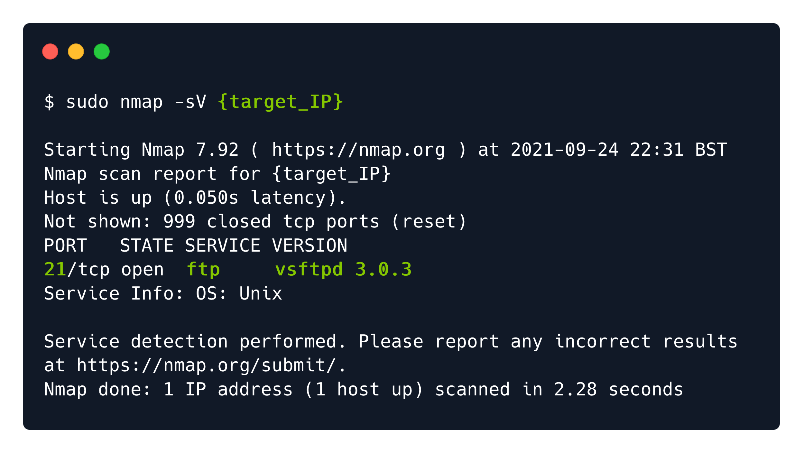
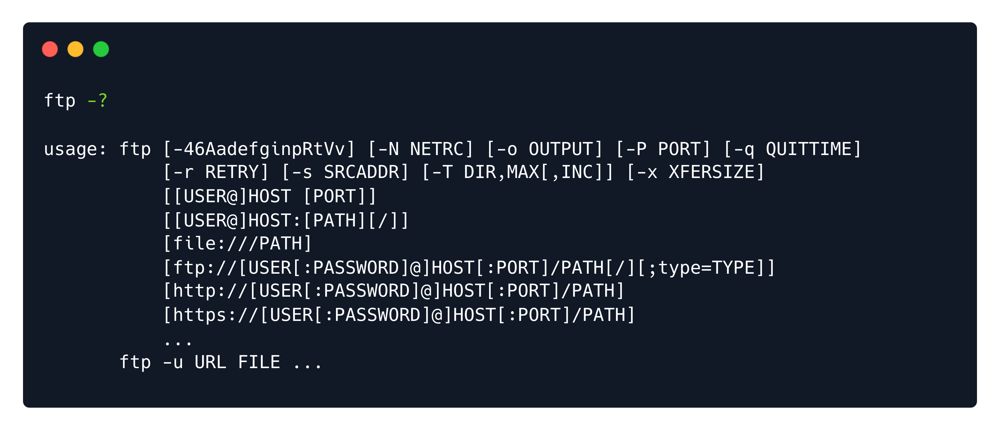
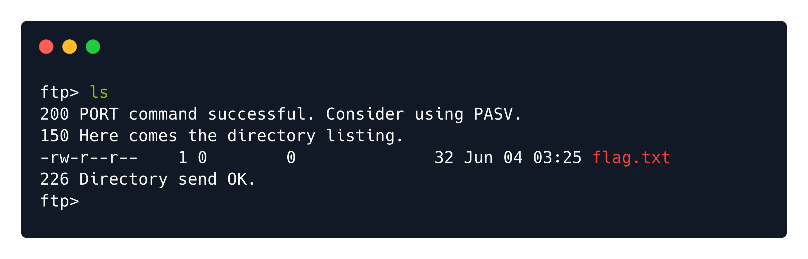

# Writeups

**Source PDF:** `raw-logs/document.pdf`

## TL;DR

Fawn Write-up Prepared by: 0ne-nine9 Introduction

## Extracted walkthrough

### Page 1

```
Fawn Write-up

Prepared by: 0ne-nine9
Introduction

Sometimes, when we are asked to enumerate the services of specific hosts on the client network, we will be 
met with file transfer services that may have high chances to be poorly configured. The purpose of this 
exercise is to familiarize yourself with the File Transfer Protocol (FTP), a native protocol to all host operating 
systems and used for a long time for simple file transfer tasks, be they automated or manual. FTP can be 
easily misconfigured if not correctly understood. There are cases where an employee of the client company 
we are assessing might want to bypass file checks or firewall rules for transferring a file from themselves to 
their peers. Considering the many different mechanisms for controlling and monitoring data flow within an 
enterprise network today, this scenario becomes a substantial and viable case we might meet in the wild.
At the same time, FTP can be used to transfer log files from one network device to another or a log 
collection server. Suppose the network engineer in charge of handling the configuration forgets to secure 
the receiving FTP server properly or does not put enough importance on the information contained within 
the logs and decides to leave the FTP service unsecured intentionally. In that case, an attacker could gain 
leverage of the logs and extract all kinds of information from them, which can later be used to map out the 
network, enumerate usernames, detect active services, and more.
Let's take a look at what FTP is, according to definition on Wikipedia:
 
 
From the first lines of the excerpt above, we can see mention of the client-server model architecture. This 
refers to the roles hosts in the network have during the act of transferring data between them. Users can 
download and upload files from the client (their own host) to the server (a centralized data storage device) 
or vice versa. Conceptually speaking, the client is always the host that downloads and uploads files to the 
server, and the server always is the host that safely stores the data being transferred.
 
The File Transfer Protocol (FTP) is a standard communication protocol used to transfer 
computer files from a server to a client on a computer network. FTP is built on a client–
server model architecture using separate control and data connections between the client 
and the server. FTP users may authenticate themselves with a clear-text sign-in protocol, 
generally in the form of a username and password. However, they can connect anonymously if 
the server is configured to allow it. For secure transmission that protects the username 
and password and encrypts the content, FTP is often secured with SSL/TLS (FTPS) or 
replaced with SSH File Transfer Protocol (SFTP).
```


### Page 2

```
Clients can also browse the available files on the server when using the FTP protocol. From a user's terminal 
perspective, this action will seem like browsing their own operating system's directories for files that they 
need. FTP services also come with a GUI (Graphical User Interface), akin to Windows OS Programs, enabling 
easier navigation for beginners. An example of a well-known GUI-oriented FTP Service is FileZilla. However, 
let's first understand what it means for a port to be running a service openly.
A port running an active service is a reserved space for the IP address of the target to receive requests and 
send results from. If we only had IP addresses or hostnames, then the hosts could only do 1 task at a time. 
This means that if you wanted to browse the web and play music from an application on your computer 
simultaneously, you could not, because the IP address would be used for handling either the first or the 
latter, but not both at the same time. By having ports, you can have one IP address handling multiple 
services, as it adds another layer of distinction.
In the case shown below, we can see FTP being active on port 21. However, let's add some extra services like 
SSH (Secure Shell Protocol) and HTTPD (Web Server) in order to explore a more typical example. With this 
type of configuration, a network administrator has set up a rudimentary core web server configuration, 
allowing them to achieve the following, all at the same time if need be:
Receive and send files that can be used to configure the webserver or serve logs to an external source
Be able to be logged into for remote management from a distant host, in case any configuration 
changes are needed
Serve web content that can be accessed remotely through another host's web browser
From the graph below, you can see where FTP sits in the logical structure of the host, together with other 
services that could potentially be running on it at the same time.
```


### Page 3

```
The Wiki article shows that it is considered non-standard for FTP to be used without the encryption layer 
provided by protocols such as SSL/TLS (FTPS) or SSH-tunneling (SFTP). FTP by itself does have the ability to 
require credentials before allowing access to the stored files. However, the deficiency here is that traffic 
containing said files can be intercepted with what is known as a Man-in-the-Middle Attack (MitM). The 
contents of the files can be read in plaintext (meaning unencrypted, human-readable form).
```


### Page 4

```
However, if the network administrators choose to wrap the connection with the SSL/TLS protocol or tunnel 
the FTP connection through SSH (as shown below) to add a layer of encryption that only the source and 
destination hosts can decrypt, this would successfully foil most Man-in-the-Middle attacks. Notice how port 
21 has disappeared, as the FTP protocol gets moved under the SSH protocol on port 22, thus being 
tunneled through it and secured against any interception.
```


### Page 5

```
However, the situation we are dealing with in this case is much simpler. We are only going to interact with 
the target running a simple, misconfigured FTP service. Let us proceed and analyze how such a service 
running on an internal host would look like.
 
Enumeration

Firstly, let us check if our VPN connection is established. Using the ping protocol can help with this since it is 
a low-overhead method of reaching the target to get a response, thus confirming our connection is 
established, and the target is reachable. Low-overhead means that very little data is sent to the target by 
default, allowing us to quickly check the status of the connection without having to wait for a whole scan to 
complete beforehand. The ping protocol can be invoked from the terminal using the ping {target_IP}  
command, where {target_IP} is the IP address of your instance of the Fawn machine, as displayed on the 
Hack The Box webpage.
Note that this might not always work in a large-scale corporate environment, as firewalls usually have rules 
to prevent pinging between hosts, even in the same subnet (LAN), to avoid insider threats and discover 
other hosts and services.
```


### Page 6

```
We can cancel the ping  command by pressing CTRL+C  on our keyboard, otherwise it will run infinitely. 
Following the output from the command, we can see that responses are being received from the target 
host. This means that the host is reachable through the VPN tunnel we formed. We can now start scanning 
the open services on the host.
 
 
Scanning using our previously used command, we can see the FTP service open and running on port 21. 
However, what if we would like to know the actual version of the service running on this port? Could 
scanning it with different switches present us with the needed information?
```


### Page 7

```
In our case, the -sV  switch stands for version detection. Using this switch will consequently make our scan 
take longer but will offer us more insight into the version of the service running on the previously detected 
port. This means that at a glance, we would be able to tell if the target is vulnerable due to running outdated 
software or if we need to dig deeper to find our attack vector.
We will not be looking at exploiting the service per sé. We will take small steps towards our goals, and the 
next one will involve simply interacting with the service as-is to learn more about how we should approach 
targets. However, having the service version always helps us gain more insight into what is running on the 
scanned port.
 
Foothold

It is time we interacted with the target.
In order to access the FTP service, we will use the ftp  command on our own host. It's good practice to have 
a quick check that your ftp  is up to date and installed properly. Running the command below will display 
the same output as pictured if your ftp  service is installed. Otherwise, it will continue with the installation. 
The -y  switch at the end of the command is used to accept the installation without interrupting the process 
to ask you if you'd like to proceed.
```




### Page 8

```
After it has done installing, you can run the ftp -?  command to see what the service is capable of.
 
 
From the excerpt above, we can see that we can connect to the target host using the command below. This 
will initiate a request to authenticate on the FTP service running on the target, which will return a prompt 
back to our host:
```





### Page 9

```
The prompt will ask us for the username we want to log in with. Here is where the magic happens.
A typical misconfiguration for running FTP services allows an anonymous  account to access the service like 
any other authenticated user. The anonymous  username can be input when the prompt appears, followed 
by any password whatsoever since the service will disregard the password for this specific account.
 
 
Hitting Enter  after filling in the password, we can see that we are logged in successfully. Our terminal 
changes in order to show us that we can now issue ftp  commands. 
 
 
Typing in the help  command allows us to view which commands are available. You will be able to see this 
pattern with every script and service that you have access to. Typing either the -h , --help , or help  
commands will always issue a list of all the commands available to you as a user, with descriptions 
occasionally included. If you would like to learn about a specific command in more depth, you can use a 
different command: man {commandName} . However, for now, let us get back to our target.
```


### Page 10

```
Some of the commands listed here seem familiar to us. We already know how to use ls  and cd . Let us 
issue the first command and view the contents of the folder.
 
 
As you can notice from the output, the operation of FTP services also issue the status for the commands 
you are sending to the remote host. The meaning of status updates are as follows:
```





### Page 11

```
Now, we can proceed to download the flag.txt  to our host (Virtual Machine). In order to do so, we can 
use the get  command, followed by the name of the file we want to download. In our case, it would look like 
this:
 
 
This will trigger the download of the file to the same directory you were in when you issued the ftp 
{machineIP}  command. If we exit the FTP service, we will see the same file on our host now.
 
 
We can now take the flag and submit it on the platform in order to own the box!
Nice work!
200 : PORT command successful. Consider using PASV.
150 : Here comes the directory listing.
226 : Directory send OK.
```


---

Generated by tools/convert_pdf_to_md.py — review & redact sensitive info before publishing.
