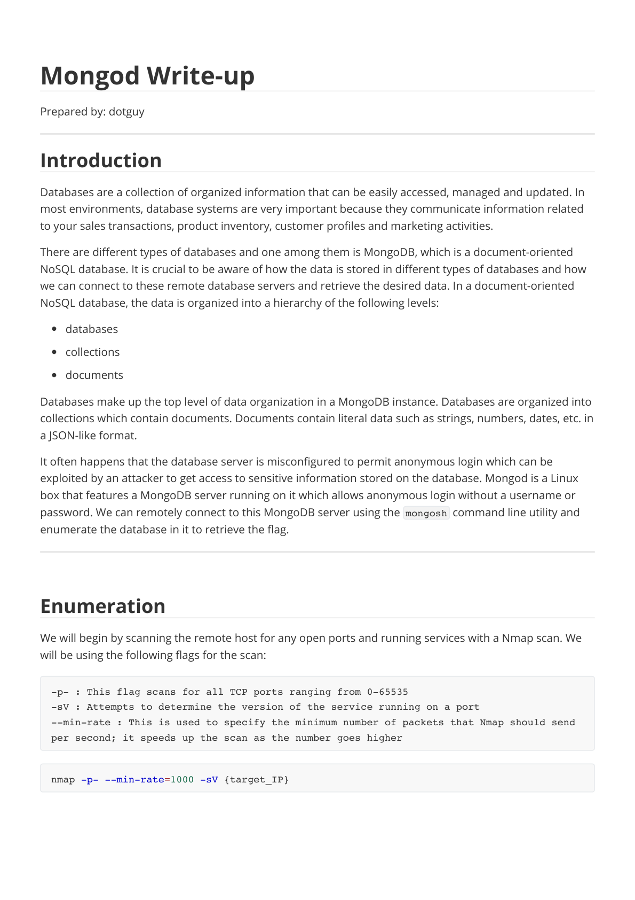
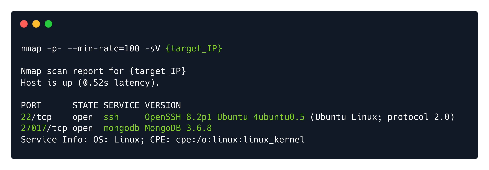
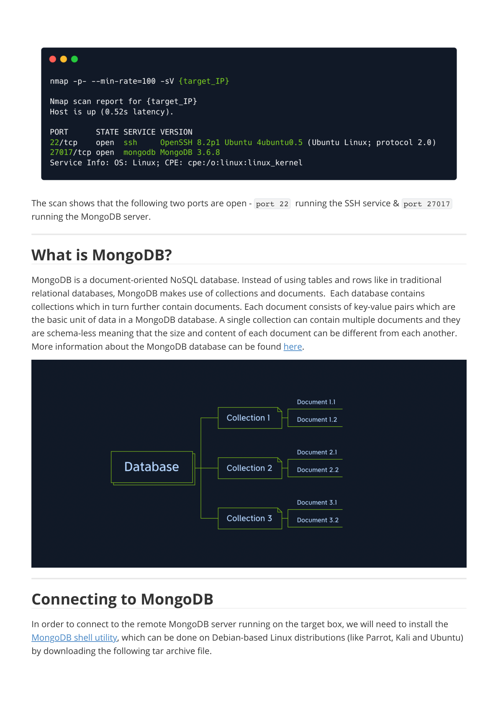
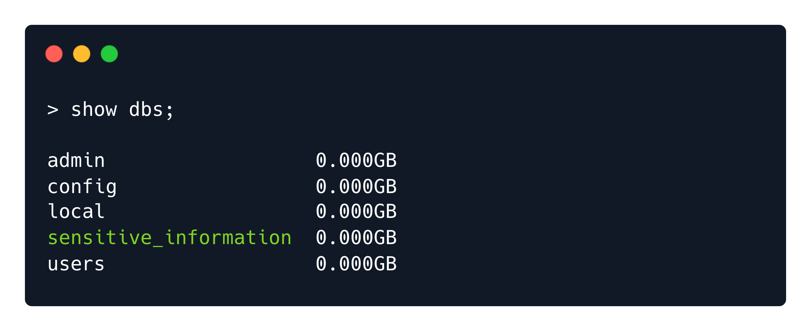
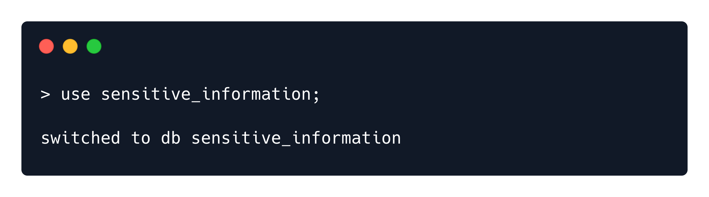
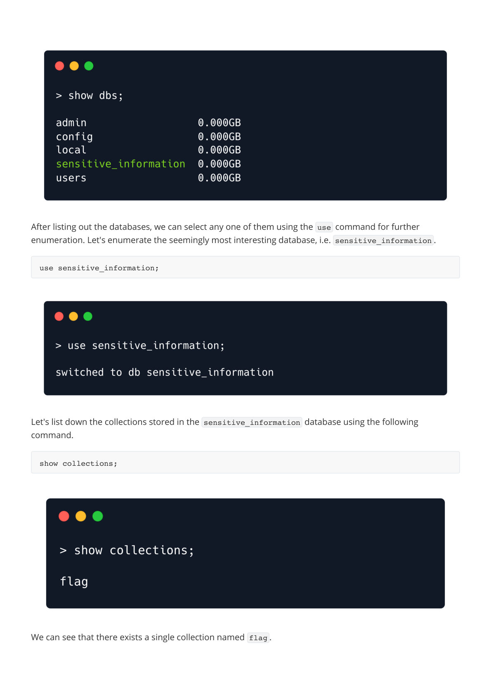

# Writeups

**Source PDF:** `raw-logs/document.pdf`

## TL;DR

Mongod Write-up Prepared by: dotguy Introduction

## Extracted walkthrough

### Page 1

```
Mongod Write-up

Prepared by: dotguy
Introduction

Databases are a collection of organized information that can be easily accessed, managed and updated. In 
most environments, database systems are very important because they communicate information related 
to your sales transactions, product inventory, customer profiles and marketing activities.
There are different types of databases and one among them is MongoDB, which is a document-oriented 
NoSQL database. It is crucial to be aware of how the data is stored in different types of databases and how 
we can connect to these remote database servers and retrieve the desired data. In a document-oriented 
NoSQL database, the data is organized into a hierarchy of the following levels:
databases
collections
documents
Databases make up the top level of data organization in a MongoDB instance. Databases are organized into 
collections which contain documents. Documents contain literal data such as strings, numbers, dates, etc. in 
a JSON-like format.
It often happens that the database server is misconfigured to permit anonymous login which can be 
exploited by an attacker to get access to sensitive information stored on the database. Mongod is a Linux 
box that features a MongoDB server running on it which allows anonymous login without a username or 
password. We can remotely connect to this MongoDB server using the mongosh  command line utility and 
enumerate the database in it to retrieve the flag.
 
Enumeration

We will begin by scanning the remote host for any open ports and running services with a Nmap scan. We 
will be using the following flags for the scan:
-p- : This flag scans for all TCP ports ranging from 0-65535
-sV : Attempts to determine the version of the service running on a port
--min-rate : This is used to specify the minimum number of packets that Nmap should send 
per second; it speeds up the scan as the number goes higher
nmap -p- --min-rate=1000 -sV {target_IP}
```



### Page 2

```
The scan shows that the following two ports are open - port 22   running the SSH service & port 27017  
running the MongoDB server.
What is MongoDB?

MongoDB is a document-oriented NoSQL database. Instead of using tables and rows like in traditional 
relational databases, MongoDB makes use of collections and documents.  Each database contains 
collections which in turn further contain documents. Each document consists of key-value pairs which are 
the basic unit of data in a MongoDB database. A single collection can contain multiple documents and they 
are schema-less meaning that the size and content of each document can be different from each another. 
More information about the MongoDB database can be found here.
Connecting to MongoDB

In order to connect to the remote MongoDB server running on the target box, we will need to install the 
MongoDB shell utility, which can be done on Debian-based Linux distributions (like Parrot, Kali and Ubuntu) 
by downloading the following tar archive file.
```






### Page 3

```
Please note that the MongoDB server running on Mongod is only compatible with Mongo Shell version 
<= 2.3.2.
We must then extract the contents of the tar archive file using the tar  utility.
Navigate to the location where the mongosh  binary is present.
Let's now try to connect to the MongoDB server running on the remote host as an anonymous user.
We have successfully connected to the remote MongoDB instance as an anonymous user. Using the 
following command, we can list the databases present on the MongoDB server.
curl -O https://downloads.mongodb.com/compass/mongosh-2.3.2-linux-x64.tgz
tar xvf mongosh-2.3.2-linux-x64.tgz
cd mongosh-2.3.2-linux-x64/bin
./mongosh mongodb://{target_IP}:27017
show dbs;
```


### Page 4

```
After listing out the databases, we can select any one of them using the use  command for further 
enumeration. Let's enumerate the seemingly most interesting database, i.e. sensitive_information .
Let's list down the collections stored in the sensitive_information  database using the following 
command.
We can see that there exists a single collection named flag .
use sensitive_information;
show collections;
```








### Page 5

```
We can dump the contents of the documents present in the flag  collection by using the 
db.collection.find()  command. Let's replace the collection name flag  in the command.
Congratulations! We have successfully retrieved the flag value from the MongoDB database.
 
db.flag.find();
```


---

Generated by tools/convert_pdf_to_md.py — review & redact sensitive info before publishing.
