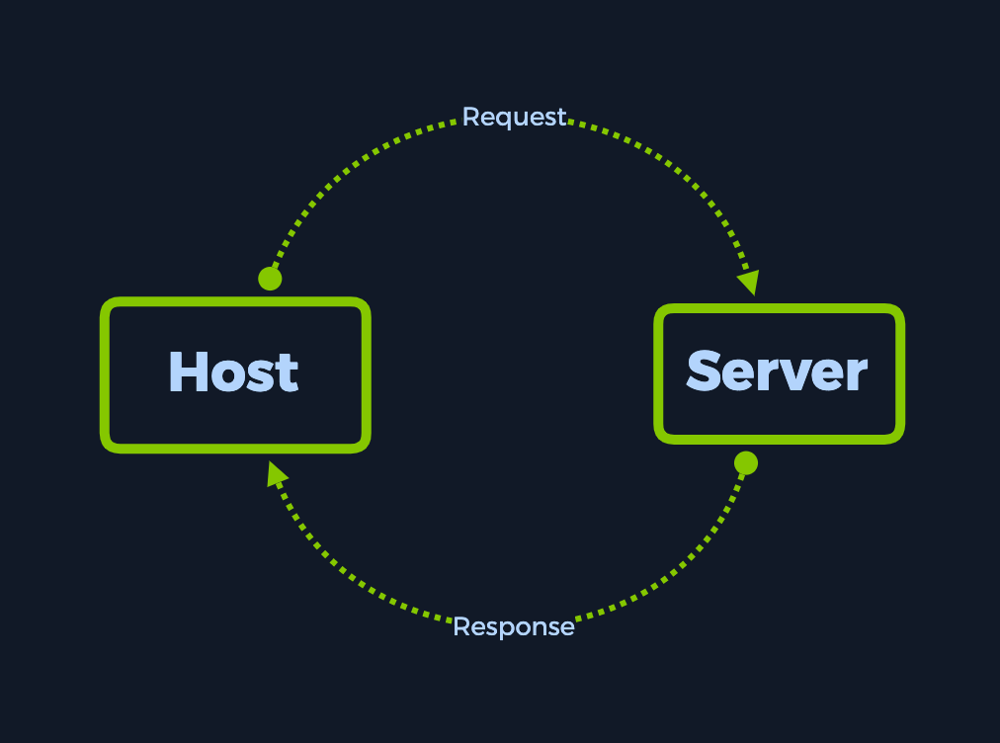
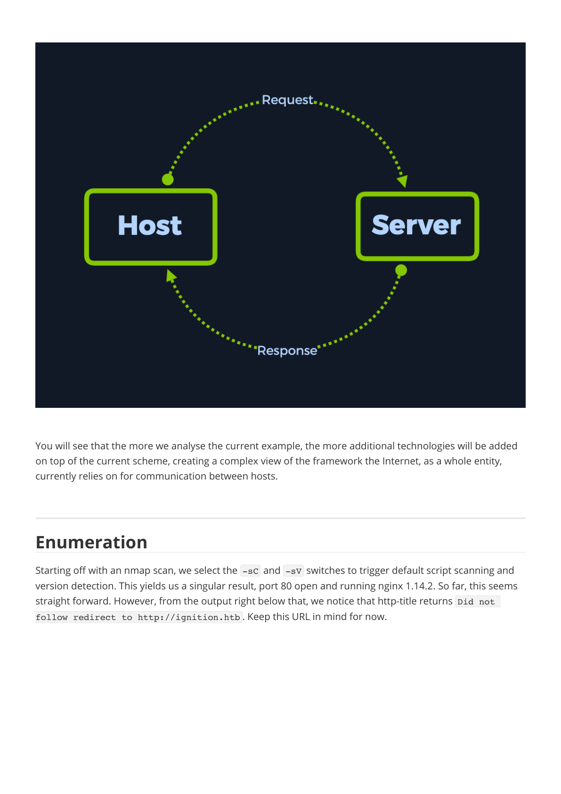
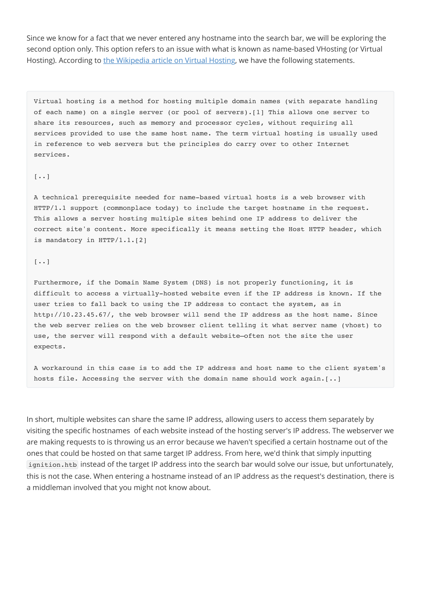
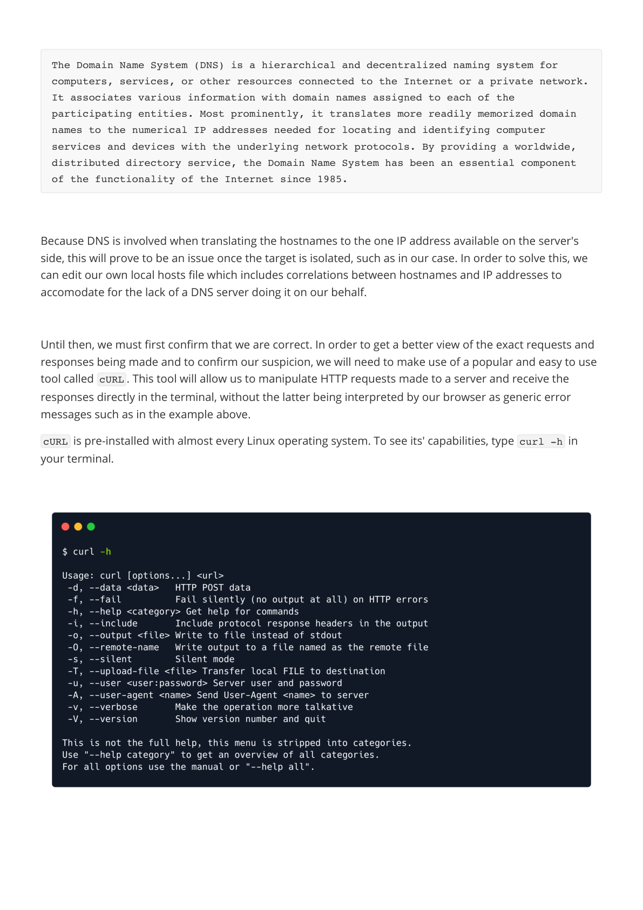
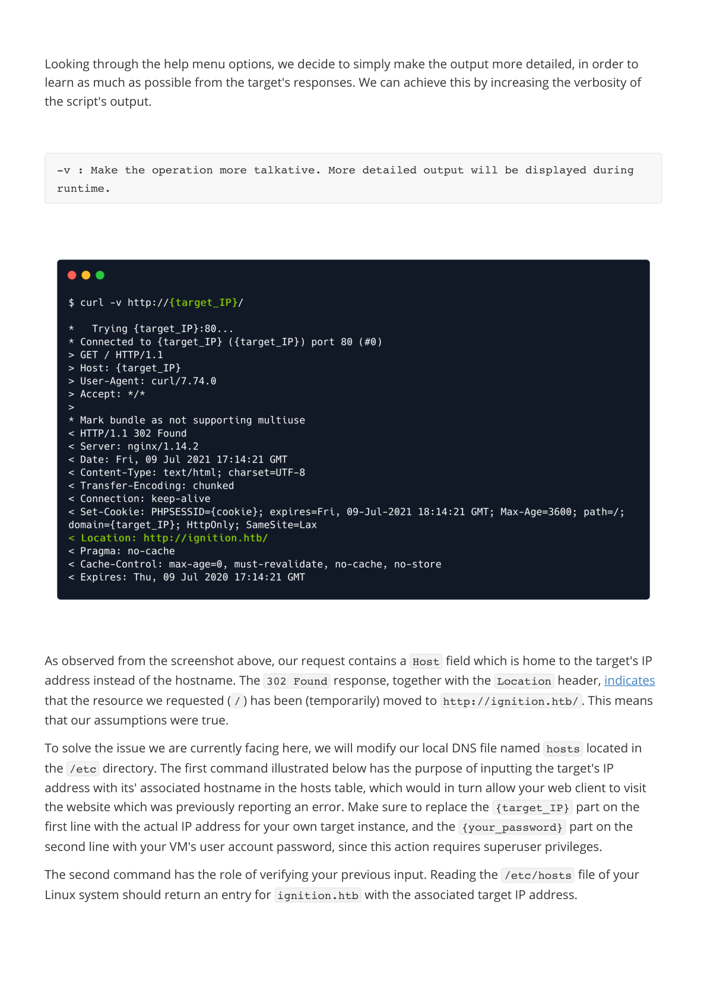
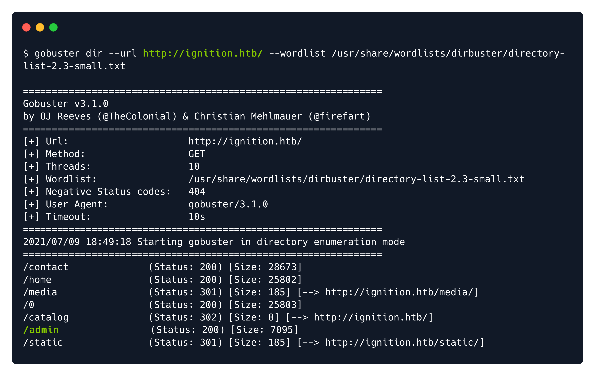

# Writeups

**Source PDF:** `raw-logs/document.pdf`

## TL;DR

Ignition Writeup Prepared by: 0ne-nine9, ilinor Introduction

## Extracted walkthrough

### Page 1

```
Ignition Writeup

Prepared by: 0ne-nine9, ilinor
Introduction

Networking knowledge plays a tremendous part for your overall readiness as an upcoming cybersecurity 
engineer. Features such as Active Directory, Kerberos Authentication, Server Message Block, Hypertext 
Transfer Protocol, Secure Shell can all be dissected into their (almost) simplest form if enough networking 
knowledge is applied. However broad, we will be exploring only a part of the whole networking subject, 
specifically HTTP, VHosts and DNS, with this target. 
Before you get started with this target, we strongly recommend you brush up on your Networking 
knowledge by reading our Introduction to Networking on HTB Academy!


At the beginning of your journey through networking, you might find yourself understanding connections 
between your host and a server at a very general, macro level. The packet simply travels from your end to 
the server and then back with a response, right? For the purpose of better grasping the networking 
concepts explained by this machine, the write-up will contain a series of diagrams which will evolve 
alongside your understanding of references to networking technologies in use today. Let's start with a web 
request example: the simple action of accessing a website through your web browser.
```


### Page 2

```
You will see that the more we analyse the current example, the more additional technologies will be added 
on top of the current scheme, creating a complex view of the framework the Internet, as a whole entity, 
currently relies on for communication between hosts.

Enumeration

Starting off with an nmap scan, we select the -sC  and -sV  switches to trigger default script scanning and 
version detection. This yields us a singular result, port 80 open and running nginx 1.14.2. So far, this seems 
straight forward. However, from the output right below that, we notice that http-title returns Did not 
follow redirect to http://ignition.htb . Keep this URL in mind for now.
```





### Page 3

```
Upon attempting to access the webpage through a browser window, we are presented with the following 
error. The Check if there is a typo in ignition.htb  references the same URL we found during our 
nmap scan, but without further details as to what might cause this error to pop up when simply attempting 
to access the website. Below, a more detailed error code is displayed: DNS_PROBE_FINISHED_NXDOMAIN .


After a quick Google search of the error, we learn that there might be two underlying reasons to this error 
appearing.
We've mistyped the ignition.htb  address in our URL search bar, and the DNS servers can't find the 
associated IP address for the mistyped name.
We never entered any hostname such as ignition.htb  into the search bar, but the website expects 
us to.
```


### Page 4

```
Since we know for a fact that we never entered any hostname into the search bar, we will be exploring the 
second option only. This option refers to an issue with what is known as name-based VHosting (or Virtual 
Hosting). According to the Wikipedia article on Virtual Hosting, we have the following statements.


In short, multiple websites can share the same IP address, allowing users to access them separately by 
visiting the specific hostnames  of each website instead of the hosting server's IP address. The webserver we 
are making requests to is throwing us an error because we haven't specified a certain hostname out of the 
ones that could be hosted on that same target IP address. From here, we'd think that simply inputting 
ignition.htb  instead of the target IP address into the search bar would solve our issue, but unfortunately, 
this is not the case. When entering a hostname instead of an IP address as the request's destination, there is 
a middleman involved that you might not know about.

Virtual hosting is a method for hosting multiple domain names (with separate handling 
of each name) on a single server (or pool of servers).[1] This allows one server to 
share its resources, such as memory and processor cycles, without requiring all 
services provided to use the same host name. The term virtual hosting is usually used 
in reference to web servers but the principles do carry over to other Internet 
services.
[..]
A technical prerequisite needed for name-based virtual hosts is a web browser with 
HTTP/1.1 support (commonplace today) to include the target hostname in the request. 
This allows a server hosting multiple sites behind one IP address to deliver the 
correct site's content. More specifically it means setting the Host HTTP header, which 
is mandatory in HTTP/1.1.[2]
[..]
Furthermore, if the Domain Name System (DNS) is not properly functioning, it is 
difficult to access a virtually-hosted website even if the IP address is known. If the 
user tries to fall back to using the IP address to contact the system, as in 
http://10.23.45.67/, the web browser will send the IP address as the host name. Since 
the web server relies on the web browser client telling it what server name (vhost) to 
use, the server will respond with a default website—often not the site the user 
expects. 
A workaround in this case is to add the IP address and host name to the client system's 
hosts file. Accessing the server with the domain name should work again.[..]
```



### Page 5

```
Because DNS is involved when translating the hostnames to the one IP address available on the server's 
side, this will prove to be an issue once the target is isolated, such as in our case. In order to solve this, we 
can edit our own local hosts file which includes correlations between hostnames and IP addresses to 
accomodate for the lack of a DNS server doing it on our behalf.

Until then, we must first confirm that we are correct. In order to get a better view of the exact requests and 
responses being made and to confirm our suspicion, we will need to make use of a popular and easy to use 
tool called cURL . This tool will allow us to manipulate HTTP requests made to a server and receive the 
responses directly in the terminal, without the latter being interpreted by our browser as generic error 
messages such as in the example above.
cURL  is pre-installed with almost every Linux operating system. To see its' capabilities, type curl -h  in 
your terminal.


The Domain Name System (DNS) is a hierarchical and decentralized naming system for 
computers, services, or other resources connected to the Internet or a private network. 
It associates various information with domain names assigned to each of the 
participating entities. Most prominently, it translates more readily memorized domain 
names to the numerical IP addresses needed for locating and identifying computer 
services and devices with the underlying network protocols. By providing a worldwide, 
distributed directory service, the Domain Name System has been an essential component 
of the functionality of the Internet since 1985.
```




### Page 6

```
Looking through the help menu options, we decide to simply make the output more detailed, in order to 
learn as much as possible from the target's responses. We can achieve this by increasing the verbosity of 
the script's output.


As observed from the screenshot above, our request contains a Host  field which is home to the target's IP 
address instead of the hostname. The 302 Found  response, together with the Location  header, indicates 
that the resource we requested ( / ) has been (temporarily) moved to http://ignition.htb/ . This means 
that our assumptions were true. 
To solve the issue we are currently facing here, we will modify our local DNS file named hosts  located in 
the /etc  directory. The first command illustrated below has the purpose of inputting the target's IP 
address with its' associated hostname in the hosts table, which would in turn allow your web client to visit 
the website which was previously reporting an error. Make sure to replace the {target_IP}  part on the 
first line with the actual IP address for your own target instance, and the {your_password}  part on the 
second line with your VM's user account password, since this action requires superuser privileges.
The second command has the role of verifying your previous input. Reading the /etc/hosts  file of your 
Linux system should return an entry for ignition.htb  with the associated target IP address.

-v : Make the operation more talkative. More detailed output will be displayed during 
runtime.
```




### Page 7

```
Once this configuration is complete, we can proceed to reload the target's webpage and verify if it loads 
successfully. Since the requested hostname now has an association in your hosts file, the website can load 
without issue. From here, we can start working towards gaining a foothold.


Foothold

After exploring the landing page for a short period of time, we can deduce that nothing helpful can be 
leveraged here. The only option of exploring the website further is using gobuster.
```


### Page 8

```
From the output of our gobuster script, we find our target. The /admin  page returns a 200 response code, 
signalling its' availability. We can navigate to it by appending it to the end of the URL: 
http://ignition.htb/admin .
```




### Page 9

```
A login screen is presented to us, with a logo for Magento  boasting in the middle of the page. A username 
and password are being requested. Normally, we would go off credentials we extracted through other 
means, such as an FTP server left unsecured, as seen before. This time, however, we will attempt some 
default credentials for the Magento service, since there is no other basis upon which we can rely.
```


### Page 10

```
According to the documentation, we should not attempt to brute force this login form because it has anti-
bruteforce measures implemented, we will need to guess the password.  Since the password must be seven 
or more characters long & to include both letters and numbers, we can attempt to use the most common 
passwords of the year 2021 as well as a common username, such as admin . From the list, only the following 
password fulfils the requirements.


After manually attempting a number of these credentials, we land on a successful login. The correct 
combination is: admin:qwerty123 . We are presented with the Magento administrative panel, where the 
flag can be found under the Advanced Reporting  section of the Dashboard.

The Magento Admin is protected by multiple layers of security measures to prevent 
unauthorized access to your store, order, and customer data. The first time you sign in 
to the Admin, you are required to enter your username and password and to set up two-
factor authentication (2FA).
Depending on the configuration of your store, you might also be required to resolve a 
CAPTCHA challenge such as entering a series of keyboard characters, solving a puzzle, 
or clicking a series of images with a common theme. These tests are designed to 
identify you has human, rather than an automated bot.
For additional security, you can determine which parts of the Admin each user has 
permission to access, and also limit the number of login attempts. By default, after 
six attempts the account is locked, and the user must wait a few minutes before trying 
again. Locked accounts can also be reset from the Admin.
An Admin password must be seven or more characters long and include both letters and 
numbers.
admin admin123
admin root123
admin password1
admin administrator1
admin changeme1
admin password123
admin qwerty123
admin administrator123
admin changeme123
```


### Page 11

```
This concludes the current example.
Congratulations!
```


---

Generated by tools/convert_pdf_to_md.py — review & redact sensitive info before publishing.
