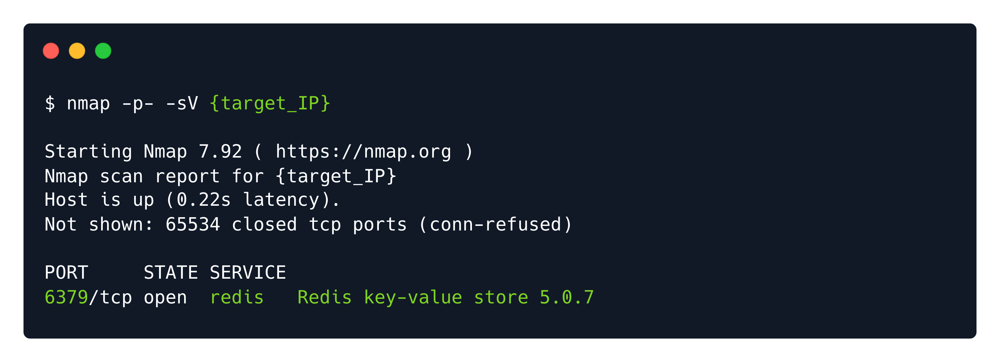

# Writeups

**Source PDF:** `raw-logs/document.pdf`

## TL;DR

Redeemer Write-up Prepared by: dotguy Introduction

## Extracted walkthrough

### Page 1

```
Redeemer Write-up

Prepared by: dotguy
Introduction

Databases are a collection of organized information that can be easily accessed, managed and updated. In 
most environments, database systems are very important because they communicate information related 
to your sales transactions, product inventory, customer profiles and marketing activities.
There are different types of databases and one among them is Redis, which is an 'in-memory' database. In-
memory databases are the ones that rely essentially on the primary memory for data storage (meaning that 
the database is managed in the RAM of the system); in contrast to databases that store data on the disk or 
SSDs. As the primary memory is significantly faster than the secondary memory, the data retrieval time in 
the case of 'in-memory' databases is very small, thus offering very efficient & minimal response times. 
In-memory databases like Redis are typically used to cache data that is frequently requested for quick 
retrieval. For example, if there is a website that returns some prices on the front page of the site. The 
website may be written to first check if the needed prices are in Redis, and if not, then check the traditional 
database (like MySQL or MongoDB). When the value is loaded from the database, it is then stored in Redis 
for some shorter period of time (seconds or minutes or hours), to handle any similar requests that arrive 
during that timeframe. For a site with lots of traffic, this configuration allows for much faster retrieval for the 
majority of requests, while still having stable long term storage in the main database.
This lab focuses on enumerating a Redis server remotely and then dumping its database in order to retrieve 
the flag. In this process, we learn about the usage of the redis-cli  command line utility which helps 
interact with the Redis service. We also learn about some basic redis-cli commands, which are used to 
interact with the Redis server and the key-value database.
Let us now dive straight into the lab.
Enumeration

In order to verify the connectivity & availability of the target, we can run the ping  command with the IP 
address of the target machine. After two successful replies, we can interrupt the ping command, as we are 
satisfied with the connection quality. We do not always need to run commands for a long time. Sometimes, 
getting a snippet of the result or an overview instead of a detailed report is more time-efficient than the 
alternative.
```


### Page 2

```
Immediately after, we can follow up with a preliminary scan of the target. Using nmap  with the appropriate 
service version detection switch, we scan the IP address for any open ports and services.
We can infer from the scan result that only one port is open on the target machine, i.e. port 6379  which is 
running a Redis server.

What is Redis?

Redis (REmote DIctionary Server) is an open-source advanced NoSQL key-value data store used as a 
database, cache, and message broker. The data is stored in a dictionary format having key-value pairs. It is 
typically used for short term storage of data that needs fast retrieval. Redis does backup data to hard drives 
to provide consistency. 
The server
Redis runs as server-side software so its core functionality is in its server component. The server listens for 
connections from clients, programmatically or through the command-line interface.
-sV : Probe open ports to determine service/version info
```





### Page 3

```
The CLI
The command-line interface (CLI) is a powerful tool that gives you complete access to Redis’s data and its 
functionalities if you are developing a software or tool that needs to interact with it.
Database
The database is stored in the server's RAM to enable fast data access. Redis also writes the contents of the 
database to disk at varying intervals to persist it as a backup, in case of failure.

Installing redis-cli

Now, to be able to interact remotely with the Redis server, we need to download the redis-cli  utility. It 
can be downloaded using the following command :
Alternatively, we can also connect to the Redis server using the netcat utility, but we will be using redis-
cli  in this write-up as it is more convenient to use.
Enumerating Redis Server

After successfully installing the redis-cli  utility, let us view its help page by typing in the redis-cli --
help  command in our terminal to receive a list of all possible switches for the tool and their description.
sudo apt install redis-tools
redis-cli --help
Usage: redis-cli [OPTIONS] [cmd [arg [arg ...]]]
  -h <hostname>      Server hostname (default: 127.0.0.1).
  -p <port>          Server port (default: 6379).
  -s <socket>        Server socket (overrides hostname and port).
  -a <password>      Password to use when connecting to the server.
  -r <repeat>        Execute specified command N times.
  -i <interval>      When -r is used, waits <interval> seconds per command.
                     It is possible to specify sub-second times like -i 0.1.
  -n <db>            Database number.
  -x                 Read last argument from STDIN.
  -d <delimiter>     Multi-bulk delimiter in for raw formatting (default: \n).
  -c                 Enable cluster mode (follow -ASK and -MOVED redirections).
  --raw              Use raw formatting for replies (default when STDOUT is
                     not a tty).
  --no-raw           Force formatted output even when STDOUT is not a tty.
  --csv              Output in CSV format.
  --stat             Print rolling stats about server: mem, clients, ...
```


### Page 4

```
In our case, we will only need to use the following switch for specifying the host that we need to connect to :
Let us connect to the redis server using the following command :
Upon a successful connection with the Redis server, we should be able to see a prompt in the terminal as 
shown in the image above. 
One of the basic Redis enumeration commands is info  which returns information and statistics about the 
Redis server. Since the output of this command is pretty long, I have snipped out the less-relevant 
information :
  --latency          Enter a special mode continuously sampling latency.
  --latency-history  Like --latency but tracking latency changes over time.
                     Default time interval is 15 sec. Change it using -i.
  --latency-dist     Shows latency as a spectrum, requires xterm 256 colors.
                     Default time interval is 1 sec. Change it using -i.
  --lru-test <keys>  Simulate a cache workload with an 80-20 distribution.
  --slave            Simulate a slave showing commands received from the master.
  --rdb <filename>   Transfer an RDB dump from remote server to local file.
  --pipe             Transfer raw Redis protocol from stdin to server.
  --pipe-timeout <n> In --pipe mode, abort with error if after sending all data.
                     no reply is received within <n> seconds.
                     Default timeout: 30. Use 0 to wait forever.
  --bigkeys          Sample Redis keys looking for big keys.
  --scan             List all keys using the SCAN command.
  --pattern <pat>    Useful with --scan to specify a SCAN pattern.
  --intrinsic-latency <sec> Run a test to measure intrinsic system latency.
                     The test will run for the specified amount of seconds.
  --eval <file>      Send an EVAL command using the Lua script at <file>.
  --help             Output this help and exit.
  --version          Output version and exit.
-h <hostname>  :  specify the hostname of the target to connect to
redis-cli -h {target_IP}
```


### Page 5

```
The keyspace section provides statistics on the main dictionary of each database. The statistics include the 
number of keys, and the number of keys with an expiration.
In our case, under the Keyspace  section, we can see that only one database exists with index 0 . 
Let us select this Redis logical database by using the  select  command followed by the index number of 
the database that needs to be selected :
Furthermore, we can list all the keys present in the database using the command :
select 0
keys *
```


### Page 6

```
Finally, we can view the values stored for a corresponding key using the get  command followed by the 
keynote :
Congratulations! We have successfully retrieved the flag value from the Redis database.

get <key>
```


---

Generated by tools/convert_pdf_to_md.py — review & redact sensitive info before publishing.
