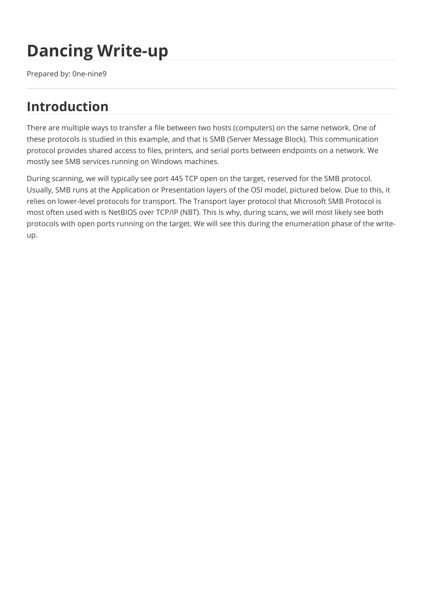
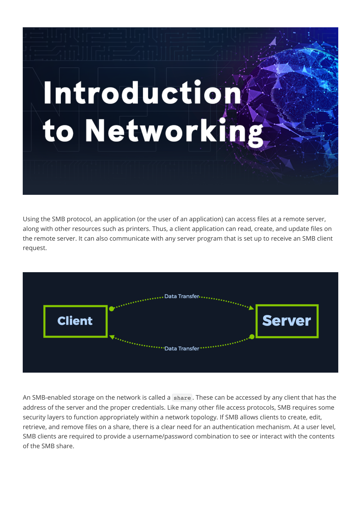
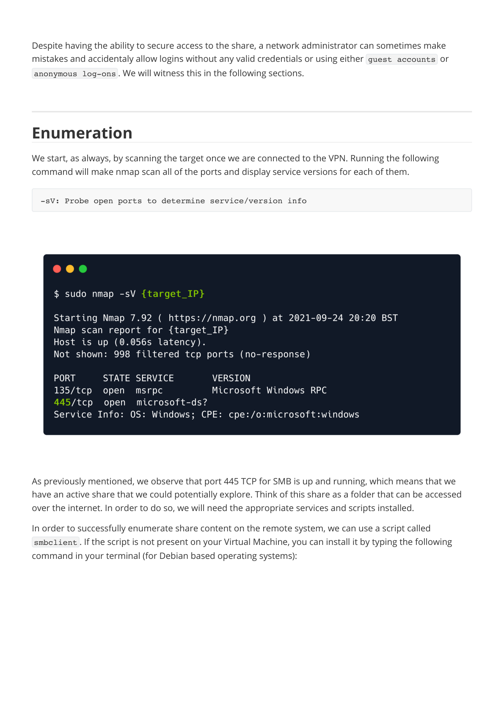
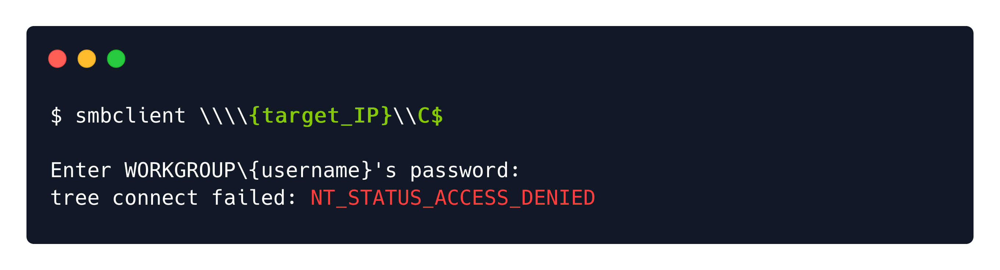
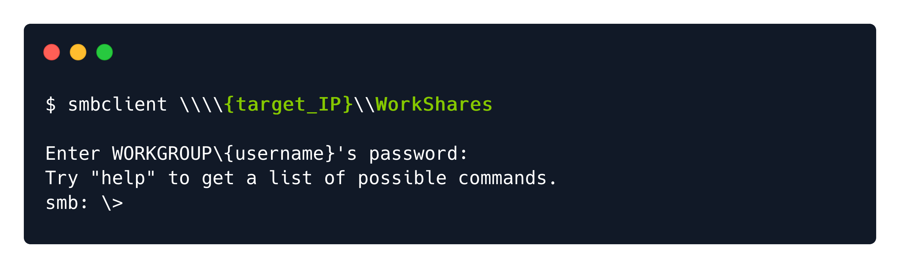
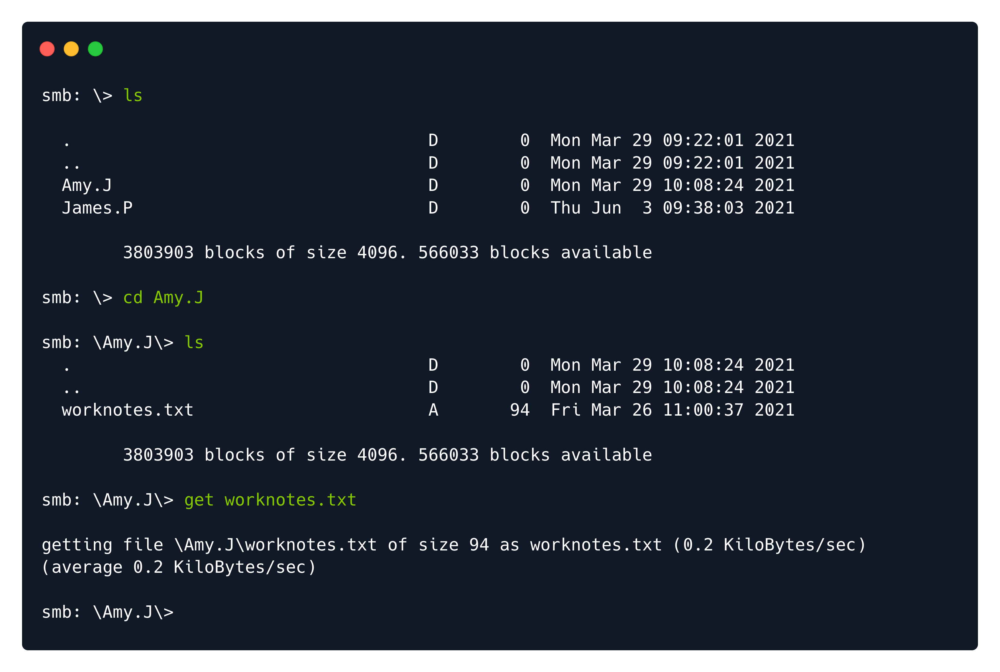
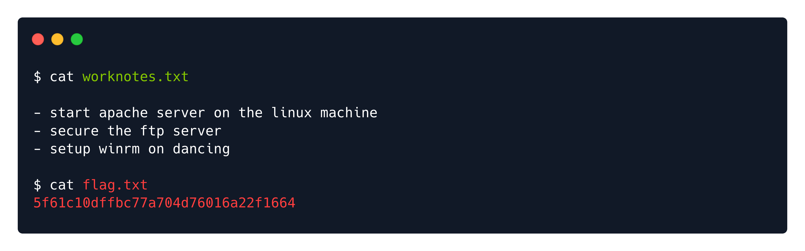

# Writeups

**Source PDF:** `raw-logs/document.pdf`

## TL;DR

Dancing Write-up Prepared by: 0ne-nine9 Introduction

## Extracted walkthrough

### Page 1

```
Dancing Write-up

Prepared by: 0ne-nine9
Introduction

There are multiple ways to transfer a file between two hosts (computers) on the same network. One of 
these protocols is studied in this example, and that is SMB (Server Message Block). This communication 
protocol provides shared access to files, printers, and serial ports between endpoints on a network. We 
mostly see SMB services running on Windows machines.
During scanning, we will typically see port 445 TCP open on the target, reserved for the SMB protocol. 
Usually, SMB runs at the Application or Presentation layers of the OSI model, pictured below. Due to this, it 
relies on lower-level protocols for transport. The Transport layer protocol that Microsoft SMB Protocol is 
most often used with is NetBIOS over TCP/IP (NBT). This is why, during scans, we will most likely see both 
protocols with open ports running on the target. We will see this during the enumeration phase of the write-
up.
```



### Page 2

```
If you would like to learn more about the OSI model and other basic networking concepts, check out the 
Introduction to Networking module on HTB Academy. It will also be one of the suggested modules at the top 
of the lab page.
```


### Page 3

```
Using the SMB protocol, an application (or the user of an application) can access files at a remote server, 
along with other resources such as printers. Thus, a client application can read, create, and update files on 
the remote server. It can also communicate with any server program that is set up to receive an SMB client 
request.


An SMB-enabled storage on the network is called a share . These can be accessed by any client that has the 
address of the server and the proper credentials. Like many other file access protocols, SMB requires some 
security layers to function appropriately within a network topology. If SMB allows clients to create, edit, 
retrieve, and remove files on a share, there is a clear need for an authentication mechanism. At a user level, 
SMB clients are required to provide a username/password combination to see or interact with the contents 
of the SMB share.
```




### Page 4

```
Despite having the ability to secure access to the share, a network administrator can sometimes make 
mistakes and accidentaly allow logins without any valid credentials or using either guest accounts  or 
anonymous log-ons . We will witness this in the following sections.

Enumeration

We start, as always, by scanning the target once we are connected to the VPN. Running the following 
command will make nmap scan all of the ports and display service versions for each of them.


As previously mentioned, we observe that port 445 TCP for SMB is up and running, which means that we 
have an active share that we could potentially explore. Think of this share as a folder that can be accessed 
over the internet. In order to do so, we will need the appropriate services and scripts installed.
In order to successfully enumerate share content on the remote system, we can use a script called 
smbclient . If the script is not present on your Virtual Machine, you can install it by typing the following 
command in your terminal (for Debian based operating systems):

-sV: Probe open ports to determine service/version info
```




### Page 5

```
If the terminal output is the same as the above, it means you already have the latest version of smbclient 
installed. If not, you can proceed with the installation. Our next step is to start enumerating the contents of 
the share found on our target in both cases. 
Smbclient will attempt to connect to the remote host and check if there is any authentication required. If 
there is, it will ask you for a password for your local username. We should take note of this. If we do not 
specify a specific username to smbclient when attempting to connect to the remote host, it will just use your 
local machine's username. That is the one you are currently logged into your Virtual Machine with. This is 
because SMB authentication always requires a username, so by not giving it one explicitly to try to login 
with, it will just have to pass your current local username to avoid throwing an error with the protocol.
```


### Page 6

```
Nevertheless, let us use our local username since we do not know about any remote usernames present on 
the target host that we could potentially log in with. Next up, after that, we will be prompted for a password. 
This password is related to the username you input before. Hypothetically, if we were a legitimate remote 
user trying to log in to their resource, we would know our username and password and log in normally to 
access our share. In this case, we do not have such credentials, so what we will be trying to perform is any of 
the following:
Guest authentication
Anonymous authentication
Any of these will result in us logging in without knowing a proper username/password combination and 
seeing the files stored on the share. Let us proceed to try that. We leave the password field blank, simply 
hitting Enter  to tell the script to move along.

As always, we can type the name of our script in the terminal followed by the switch -h  or --help  to find 
out more about the capabilities of this script alongside its usage.
Running the command above, we see that four separate shares are displayed. Let us go through each of 
them and see what they mean.
ADMIN$  - Administrative shares are hidden network shares created by the Windows NT family of 
operating systems that allow system administrators to have remote access to every disk volume on a 
network-connected system. These shares may not be permanently deleted but may be disabled.
C$  - Administrative share for the C:\ disk volume. This is where the operating system is hosted.
IPC$  - The inter-process communication share. Used for inter-process communication via named 
pipes and is not part of the file system.
WorkShares  - Custom share.

[-L|--list=HOST] : Selecting the targeted host for the connection request.
```


### Page 7

```
Foothold

We will try to connect to each of the shares except for the IPC$  one, which is not valuable for us since it is 
not browsable as any regular directory would be and does not contain any files that we could use at this 
stage of our learning experience. We will use the same tactic as before, attempting to log in without the 
proper credentials to find improperly configured permissions on any of these shares. We'll just give a blank 
password for each username to see if it works. First, let us try the ADMIN$  one.


The NT_STATUS_ACCESS_DENIED  is output, letting us know that we do not have the proper credentials to 
connect to this share. We will follow up with the C$  administrative share.


Same idea here. Last chance. We proceed with attempting to log in to the custom WorkShares  SMB share. 
This seems to be human-made, thus prone to misconfiguration.
```





### Page 8

```
Success! The WorkShares  SMB share was poorly configured, allowing us to log in without the appropriate 
credentials. We can see our terminal prompt changed to smb: \> , letting us know that our shell is now 
interacting with the service. We can use the help  command to see what we can do within this shell.

From the output, we can notice that most of the commands we are used to in Linux are present. We will be 
using the following to navigate the share:
ls : listing contents of the directories within the share
cd : changing current directories within the share
get : downloading the contents of the directories within the share
exit : exiting the smb shell
```




### Page 9

```
Typing in the ls  command will show us two directories, one for Amy.J  and one for James.P . We visit the 
first one and are met with a file called worknotes.txt , which we can download using the get  command.


This file is now saved inside the location where we ran our smbclient  command from. Let us continue 
looking for other valuable files in James.P 's directory. Navigating to it, we can find the sought flag.txt  
file as well. After retrieving this file, we can use the exit  command to quit the shell and check the files we 
just retrieved.
```




### Page 10

```
Once the SMB shell is killed, we can read the two documents we exfiltrated. The worknotes.txt  seems to 
be hinting at further services that could be exploited. Typically, these kinds of files you can find laying 
around in machines within a Hack The Box Pro Lab, hinting towards your next target or being able to be 
used as a resource for further exploitation or lateral movement within the lab. In our case, it is just a proof 
of concept. We will not need this file.
```





### Page 11

```
The flag.txt  file, however, is what we are after. We read it and input the flag into the platform, owning 
the Dancing machine. 
Congratulations!
```


---

Generated by tools/convert_pdf_to_md.py — review & redact sensitive info before publishing.
