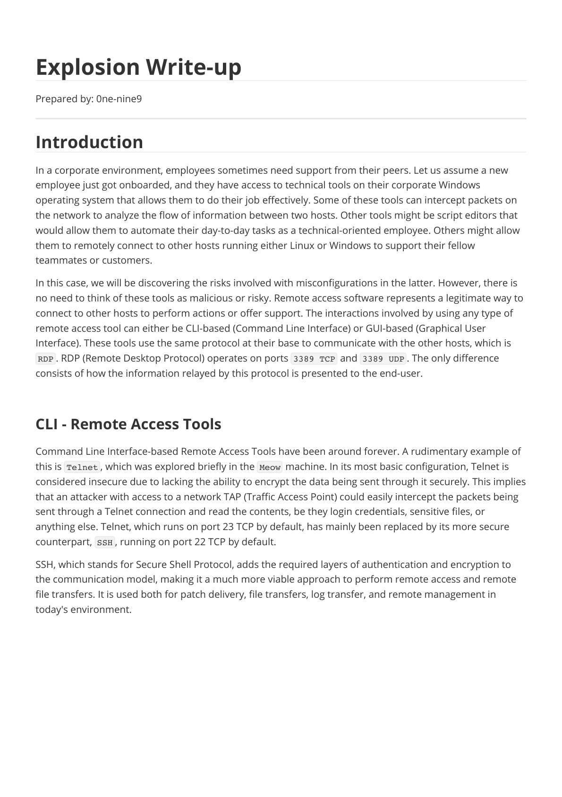
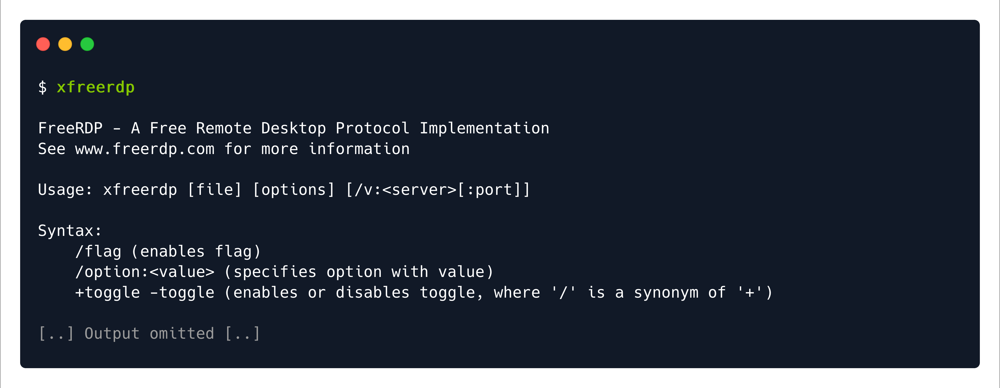
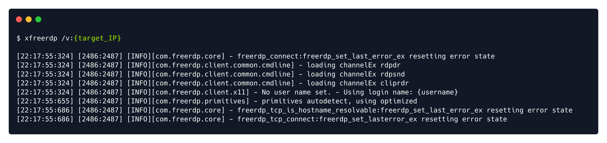
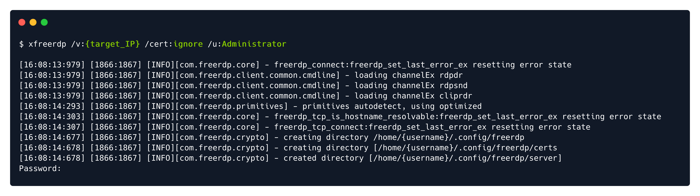
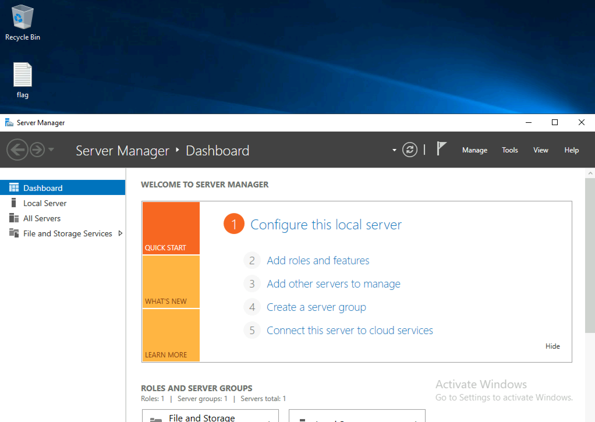

# Writeups

**Source PDF:** `raw-logs/document.pdf`

## TL;DR

Explosion Write-up Prepared by: 0ne-nine9 Introduction

## Extracted walkthrough

### Page 1

```
Explosion Write-up

Prepared by: 0ne-nine9
Introduction 

In a corporate environment, employees sometimes need support from their peers. Let us assume a new 
employee just got onboarded, and they have access to technical tools on their corporate Windows 
operating system that allows them to do their job effectively. Some of these tools can intercept packets on 
the network to analyze the flow of information between two hosts. Other tools might be script editors that 
would allow them to automate their day-to-day tasks as a technical-oriented employee. Others might allow 
them to remotely connect to other hosts running either Linux or Windows to support their fellow 
teammates or customers.
In this case, we will be discovering the risks involved with misconfigurations in the latter. However, there is 
no need to think of these tools as malicious or risky. Remote access software represents a legitimate way to 
connect to other hosts to perform actions or offer support. The interactions involved by using any type of 
remote access tool can either be CLI-based (Command Line Interface) or GUI-based (Graphical User 
Interface). These tools use the same protocol at their base to communicate with the other hosts, which is 
RDP . RDP (Remote Desktop Protocol) operates on ports 3389 TCP  and 3389 UDP . The only difference 
consists of how the information relayed by this protocol is presented to the end-user.
 
CLI - Remote Access Tools

Command Line Interface-based Remote Access Tools have been around forever. A rudimentary example of 
this is Telnet , which was explored briefly in the Meow  machine. In its most basic configuration, Telnet is 
considered insecure due to lacking the ability to encrypt the data being sent through it securely. This implies 
that an attacker with access to a network TAP (Traffic Access Point) could easily intercept the packets being 
sent through a Telnet connection and read the contents, be they login credentials, sensitive files, or 
anything else. Telnet, which runs on port 23 TCP by default, has mainly been replaced by its more secure 
counterpart, SSH , running on port 22 TCP by default.
SSH, which stands for Secure Shell Protocol, adds the required layers of authentication and encryption to 
the communication model, making it a much more viable approach to perform remote access and remote 
file transfers. It is used both for patch delivery, file transfers, log transfer, and remote management in 
today's environment.
```



### Page 2

```
SSH uses public-key cryptography to verify the remote host's identity, and the communication model is 
based on the Client-Server architecture , as seen previously with FTP, SMB, and other services. The 
local host uses the server's public key to verify its identity before establishing the encrypted tunnel 
connection. Once the tunnel is established, symmetric encryption methods and hashing algorithms are 
used to ensure the confidentiality and integrity of the data being sent over the tunnel.
```


### Page 3

```
However, both Telnet and SSH only offer the end-user access to the remote terminal part of the host being 
reached. This means that no display projection comes with these tools. In order to be able to see the 
remote host's display, one can resort to CLI-based tools such as xfreerdp . Tools such as this one are called 
Remote Desktop Tools , despite being part of the Remote Access  family. The reasoning behind this is 
because the whole desktop can be remotely controlled by the user initiating the connection, like one would 
if they were physically in the room with the remote host, using its keyboard, mouse, and display to interact 
with it, including the ability to view graphical content, controlling the mouse pointer and keyboard input, 
easily interacting with the web browser, and more.
In this scenario, we will be using xfreerdp to connect to the target to get a remote desktop projection on our 
screen. We will analyze the intrinsics of this tool in more detail later in the write-up.
 
GUI - Remote Access Tools

Graphical User Interface-based Remote Access Tools are newer to the family than the CLI-based ones. Albeit 
old themselves, the technology kept evolving, making user interaction with both the software and the 
remote host easier and more intuitive for the average user. This type of tool only allows for Remote 
Desktop connections, there being no need for a GUI-based tool that offers terminal connection only, as 
seen with Telnet and SSH. Two of the most prevalent Remote Desktop tools are Teamviewer and Windows' 
Remote Desktop Connection, formerly known as Terminal Services Client.
The screenshot below pictures the TeamViewer interface. It has a host ID entitled "Your ID" and a randomly 
generated password right underneath it. In order for a remote host to connect to your machine, they will 
need both codes. Since the password is required by default for any type of remote connection, and since it 
is randomly generated, an up-to-date version of TeamViewer can be more secure than other, more 
straightforward software. TeamViewer does not come pre-installed on any operating system. It requires 
manual download and installation from a repository or the TeamViewer official website.
```


### Page 4

```
Simpler software that runs natively can sometimes be misconfigured because user experience for the 
inexperienced user is not always a key factor when developing technical tools integrated with some 
operating systems. Take Windows' Remote Desktop Connection, for example. Microsoft Remote Desktop 
Connection runs natively on Windows, which means that it comes pre-installed with every Windows OS as a 
service, without the need from the end-user to perform any other actions other than activating the service 
and setting its parameters up. This is where some configuration errors come in, presenting us with cases 
such as the one below.
 
Enumeration

We start, as always, with an nmap scan, resulting in open ports running RDP. We have run the scan with the 
version scanning switch enabled to determine the exact versions of all the services running on open ports 
on the target, thus assessing the actual operating system of the machine and any additional potential 
vulnerabilities due to outdated software.
 
 
It is always a good idea to research the ports found in order to understand the big picture. SpeedGuide is a 
good resource for those just starting out with their networking basics and interested in understanding more 
common ports at a glance. Below are some examples:
-sV : Probe open ports to determine service/version info
Port 135 TCP : https://www.speedguide.net/port.php?port=135
Port 139 TCP : https://www.speedguide.net/port.php?port=139
Port 445 TCP : https://www.speedguide.net/port.php?port=445
Port 3389 TCP : https://www.speedguide.net/port.php?port=3389
Port 5357 TCP : https://www.speedguide.net/port.php?port=5357
```


### Page 5

```
Looking at the SpeedGuide entry for port 3389 TCP, we deem it of interest. It is typically used for Windows 
Remote Desktop and Remote Assistance connections (over RDP - Remote Desktop Protocol). We can quickly 
check for any misconfigurations in access control by attempting to connect to this readily available port 
without any valid credentials, thus confirming whether the service allows guest or anonymous connections 
or not.
 
Foothold

As mentioned before, we will be using xfreerdp to connect from our Parrot Security virtual machine. You 
can check if you have xfreerdp installed by typing the command name in the terminal. If the script's help 
menu is output to the terminal, then you are ready to go. In the following screenshot, we have omitted a 
large part of the output for space considerations. The help menu for this script is vast, and you can find out 
much information about the functionality of each switch if you read through it.
 
 
If you need to install xfreerdp , you can proceed with one of the following commands:
We can first try to form an RDP session with the target by not providing any additional information for any 
switches other than the target IP address. This will make the script use your own username as the login 
username for the RDP session, thus testing guest login capabilities.
 
 
sudo apt-get install freerdp2-x11
sudo apt-get install freerdp3-x11
/v:{target_IP} : Specifies the target IP of the host we would like to connect to.
```




### Page 6

```
As we can see from the output below, our own username is not accepted for the RDP session login 
mechanism. We can try a myriad of other default accounts, such as user , admin , Administrator , and so 
on. In reality, this would be a time-consuming process. However, for the sake of RDP exploration, let us 
attempt logging in with the Administrator  user, as seen from the commands below.  We will also be 
specifying to the script that we would like to bypass all requirements for a security certificate so that our 
own script does not request them. The target, in this case, already does not expect any. Let us take a look at 
the switches we will need to use with xfreerdp in order to connect to our target in this scenario successfully:
 
 
 
The output is different this time, and during the initialization of the RDP session, we are asked for a 
Password . In our case, the Administrator  account has not been configured with a password for logging in 
for the sake of accessibility for the end-user. This is a severe mishap in configuration and will result in us, 
the attacker, gaining access to the machine without much effort. When prompted to enter the Password  
like in the output above, we can hit Enter  to let the process continue without one.
Following this, a large output will be displayed on our terminal before a remote desktop window is loaded. 
The flag we are looking for is located on the Desktop .
 
/cert:ignore : Specifies to the scrips that all security certificate usage should be 
ignored.
/u:Administrator : Specifies the login username to be "Administrator".
/v:{target_IP} : Specifies the target IP of the host we would like to connect to.
```






### Page 7

```
Once the file is opened, the flag is retrieved, and the machine is complete.
Congratulations!
```




---

Generated by tools/convert_pdf_to_md.py — review & redact sensitive info before publishing.
