# Writeups

**Source PDF:** `raw-logs/document.pdf`

## TL;DR

Funnel Write-up Prepared by: amra, C4rm3l0 Introduction

## Extracted walkthrough

### Page 1

```
Funnel Write-up

Prepared by: amra, C4rm3l0
Introduction

It is a fairly common practice for developers to release the first version of their products on internal 
networks for testing and debugging. By doing so, they make sure that any potential security risks are 
confined and can only be accessed by "trusted" internal machines. Moreover, some well known 
applications, like Redis or databases are designed to operate securely only on internal/trusted networks and 
never get exposed over the Internet. 
This is indeed a secure practice, but it is based on the hypothesis that the internal network is 
uncompromised. If a machine that has access to the internal network gets compromised it is possible to 
access these instances using tunneling. 
The definition of tunneling  according to the Wikipedia page is:
According to the definition of tunneling, one can use it to access resources that are available only to internal 
networks. To create/facilitate such tunnels, an appropriate application should be used. The most known one 
is SSH . According to Wikipedia:
The SSH  protocol is vastly used for maintaining and accessing remote systems in a secure and encrypted 
way. But, it also offers the possibility to create tunnels that operate over the SSH protocol. More specifically, 
SSH  offers various types of tunnels. Before we start exploring these types we have to clarify some basics on 
how the SSH protocol works. 
First of all, the machine that initiates the connection is called the client  and the machine that receives the 
connections is called the server . The client, has to authenticate to the server in order for the connection to 
succeed. After the connection is initiated, we have a valid SSH session and the client is able to interact with 
the server via a shell. The main thing to point out here, is that the data that gets transported through this 
In computer networks, a tunneling protocol is a communication protocol which allows for 
the movement of data from one network to another, by exploiting encapsulation. It involves 
allowing private network communications to be sent across a public network (such as the 
Internet) through a process called encapsulation.
[...]
The tunneling protocol works by using the data portion of a packet (the payload) to carry 
the packets that actually provide the service. Tunneling uses a layered protocol model 
such as those of the OSI or TCP/IP protocol suite, but usually violates the layering when 
using the payload to carry a service not normally provided by the network. Typically, the 
delivery protocol operates at an equal or higher level in the layered model than the 
payload protocol.
The Secure Shell Protocol (SSH) is a cryptographic network protocol for operating network 
services securely over an unsecured network. Its most notable applications are remote 
login and command-line execution.
```


### Page 2

```
session can be of any type. Th exactly what allows us to create SSH tunnels within an existing valid SSH 
session. 
The first type of tunneling we are going to take a look is called Local port forwarding . When local port 
forwarding is used, a separate tunnel is created inside the existing valid SSH session that forwards network 
traffic from a local port on the client's machine over to the remote server's port. Under the hood, SSH 
allocates a socket listener on the client on the given port. When a connection is made to this port, the 
connection is forwarded over the existing SSH session over to the remote server's port.
The second type of tunneling is called Remote port forwarding , also known as Reverse Tunneling  and 
as one can imagine it is exactly the opposite operation of a Local port forwarding tunnel . Again, after a 
successful SSH connection, a separate tunnel is created which SSH uses to redirect incoming traffic to the 
server's port back to the client. Internally, SSH allocates a socket listener on the server on the given port. 
When a connection is made to this port, the connection is forwarded over the existing SSH session over to 
the local client's port.
The third type of tunneling is called Dynamic port forwarding . The main issue with both local and remote 
forwarding is that a local and a remote port have to be defined prior to the creation of the tunnel. To 
address this issue, one can use dynamic tunneling . Dynamic tunneling, allows the users to specify just one 
port that will forward the incoming traffic from the client to the server dynamically. The usage of dynamic 
tunneling relies upon the SOCKS5 protocol. The definition of the SOCKS  protocol according to Wikipedia is 
the following:
So, what is happenning internaly is that SSH turns into a SOCKS5  proxy that proxies connections from the 
client through the server. Tunneling can be a tricky topic to wrap your head around, which is why a hands-
on approach like this Box is especially useful in understanding the concept and applying it in future 
scenarios. 
Now that we have covered the basics of tunneling, let's see how it solves real life problems that may occur. 
Suppose that you are working remotely, and you want to access a database that is only available on your 
company's internal network.  To make the example more specific, let's say you wanted to access a 
PostgreSQL database that is often used by businesses and organizations to store, manage, and retrieve 
data that is critical to their operations. PostgreSQL, also known as Postgres, is a powerful and open-source 
relational database management system (RDBMS). It is widely used for managing and storing large amounts 
of data due to its reliability, flexibility, and performance. Without tunneling, you would not be able to access 
these resources directly. However, by using tunneling, you can create a secure connection between your 
local machine and the internal network, allowing you to access the internal services as if you were on the 
network itself. This can be particularly useful for remote employees who need to access internal resources 
but do not have direct access to the company's network.
Enumeration

Starting with the nmap scan, we can check what ports are open and what services are running on them:
SOCKS is an Internet protocol that exchanges network packets between a client and server 
through a proxy server. SOCKS5 optionally provides authentication so only authorized users 
may access a server. Practically, a SOCKS server proxies TCP connections to an arbitrary 
IP address, and provides a means for UDP packets to be forwarded.
```

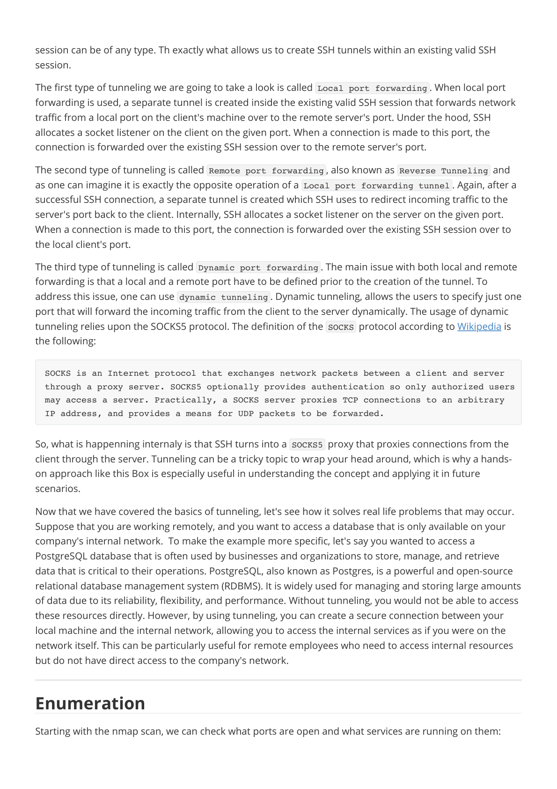

### Page 3

```
We find two open ports, namely port 21 , running a service called vsftpd 3.0.3 , and port 22 , running 
OpenSSH . The former is a service for the File Transfer Protocol - FTP , which is designed to upload, 
download, and transfer files from one location to another between computer systems.
Users could connect to the FTP server anonymously if the server is configured to allow it, meaning that we 
could use it even if we had no valid credentials. If we look back at our nmap scan result, the FTP server is 
indeed configured to allow anonymous login:
If you need a refresher, the ftp -h  command will help you figure out the available commands for the FTP 
service on your local host.
-sC: Performs a script scan using the default set of scripts. It is equivalent to --
script=default. Some of the scripts in this category are considered intrusive and should 
not be run against a target network without permission.
-sV: Enables version detection, which will detect what versions are running on what port. 
ftp-anon: Anonymous FTP login allowed (FTP code 230)
```

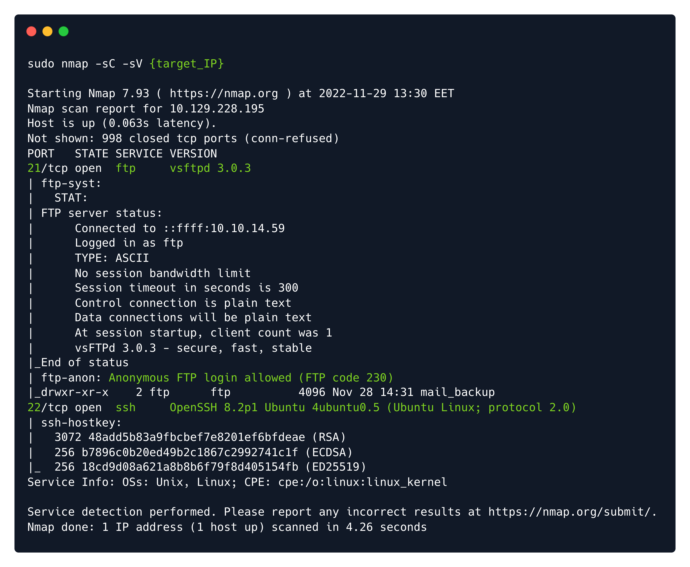

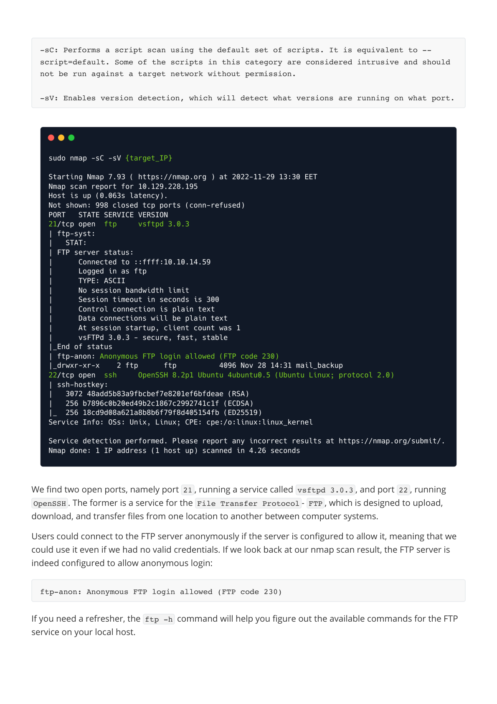

### Page 4

```
To connect to the remote FTP server, you need to specify the target's IP address (or hostname), as displayed 
on the Starting Point lab page. The prompt will then ask us for our login credentials, which is where we can 
fill in the anonymous  username. In our case, the FTP server does not request a password, and inputting the 
anonymous  username proves enough for us to receive the 230 code, Login successful .
Once logged in, you can type the help  command to check the available commands.
```

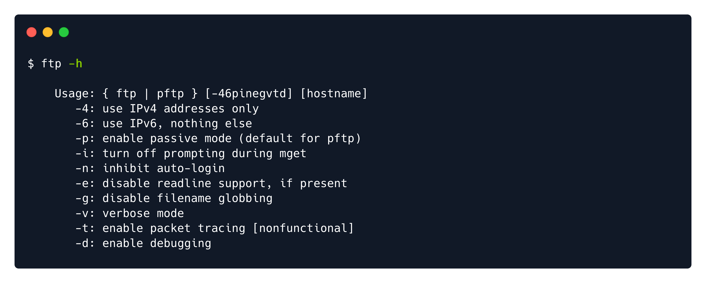


### Page 5

```
We will use dir  and get  to list the directories and download the files stored on the FTP server. With the 
dir  command, we can check the contents of our current directory on the remote host, and find a directory 
called mail_backup .
We can use cd  to navigate inside that directory, and dir  once more to list its contents.
```


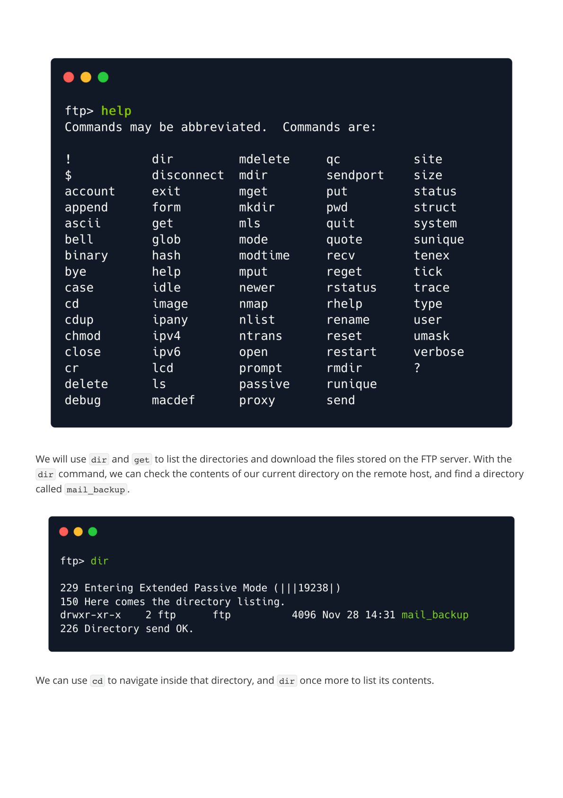

### Page 6

```
The directory listing shows that two files exist inside this folder. Both files can easily be downloaded using 
the get  command. The FTP service will report the download status completion back to you during this 
phase. It should not take long to have them both sitting snuggly on your attacking VM.
Termination of the FTP connection can be done by using the exit  command. This will return the current 
terminal tab to its' previous state.
Immediately after exiting the FTP service shell, we can type in the ls  command to check if our files are 
present in the directory we were last positioned in. We can use the cat  command, followed by the 
filename, to read one of the files.
```


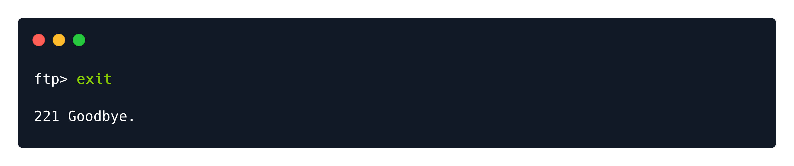


### Page 7

```
The welcome_28112022  file appears to be an email, sent to various employees of the Funnel company, 
instructing them to read the attached document, presumably the other file we downloaded, and go through 
the steps mentioned there to gain access to their internal infrastructure. Crucially, we can see all the emails 
that this message is addressed to, giving us an idea of what usernames we might encounter on the target 
machine.
Since the other file we downloaded, namely password_policy.pdf , is a PDF  file, we cannot use cat  to 
display it, but will rather view it using the conventional way and open it with whichever document viewer is 
installed by default on our system.  To open the current working directory in a file manager window, we can 
use the open  command, followed by the path to the target directory. The current working directory can be 
referred to as a single period . , meaning we don't have to actually write the full path.
The above command will graphically display the folder, meaning we can now just double-click the PDF  file 
and view its contents.
open .
```

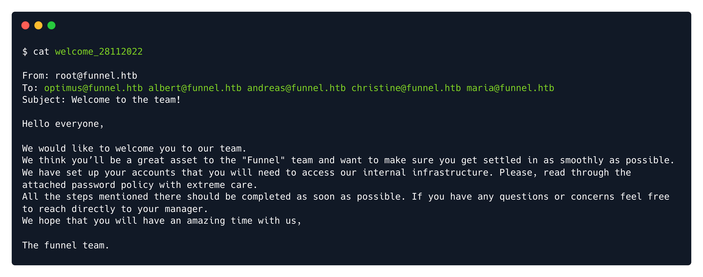


### Page 8

```
The document appears to be a memo, prompting employees to create a secure and complex password for 
their user accounts. At the end of the document, we can also find a default password, namely 
funnel123#!# . 
Foothold

Overall, our enumeration yielded a handful of potential usernames, as well as a default password. We also 
know that SSH  is running on the target machine, meaning we could attempt to bruteforce a username-
password combination, using the credentials we gathered. This type of attack is also referred to as password 
spraying, and can be automated using a tool such as Hydra . 
The password spraying technique involves circumventing common countermeasures against brute-force 
attacks, such as the locking of the account due to too many attempts, as the same password is sprayed 
across many users before another password is attempted. Hydra  is preinstalled on most penetration-
testing distributions, such as ParrotOS  and Kali Linux , but can also be manually installed using the 
following command.
In order to conduct our attack, we need to create a list of usernames to try the password against. To do so, 
we can refer to the email we read earlier, extracting the usernames of all the addresses into a list called 
usernames.txt , making sure to only include the part before @funnel.htb . 
sudo apt-get install hydra
```


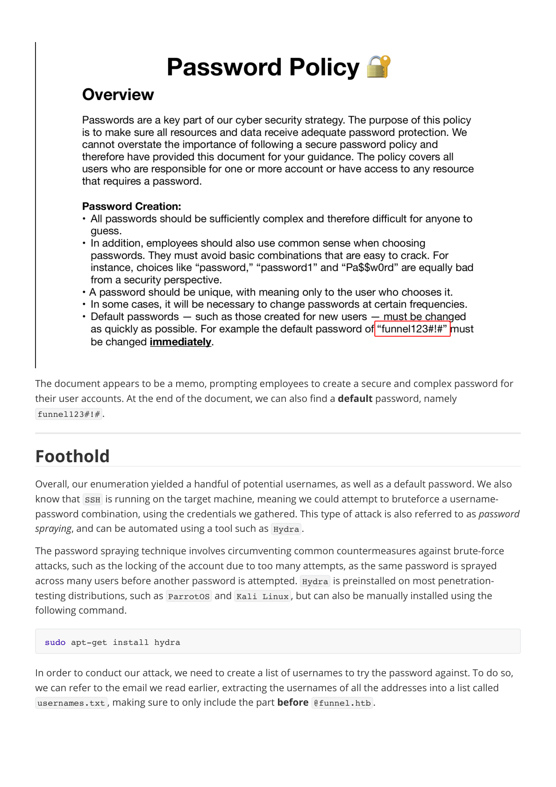

### Page 9

```
Finally, we can now task Hydra  with executing the attack on the target machine. Using the -L  option, we 
specify which file contains the list of usernames we will use for the attack. The -p  option specifies that we 
only want to use one password, instead of a password list. After the target IP address, we specify the 
protocol for the attack, which in this case is SSH . 
After just a few seconds hydra gets a valid hit on the combination christine:funnel123#!# . We can now 
use these credentials to gain remote access to the machine, as the user christine . 
hydra -L usernames.txt -p 'funnel123#!#' {target_IP} ssh
```


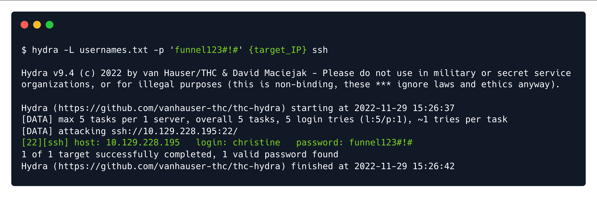


### Page 10

```
Enumeration

From this point on, we have complete access as the christine  user on the target machine, and can start 
enumerating it for potential files or services that we can explore further. A crucial command at this point in 
time is the ss  command, which stands for socket statistics , and can be used to check which ports are 
listening locally on a given machine.
```


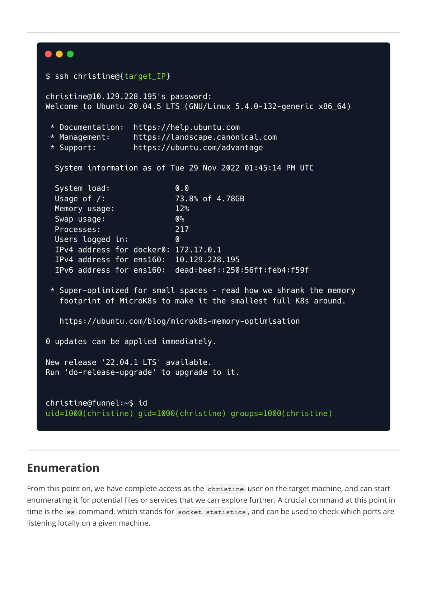

### Page 11

```
The output reveals a handful of information; we will analyse it bit-by-bit. The first column indicates the state 
that the socket is in; since we specified the -l  flag, we will only see sockets that are actively listening for a 
connection. Moving along horizontally, the Recv-Q  column is not of much concern at this point, it simply 
displays the number of queued received packets for that given port; Send-Q  does the same but for the 
amount of sent packets. The crucial column is the fourth, which displays the local address on which a service 
listens, as well as its port. 127.0.0.1  is synonymous with localhost , and essentially means that the 
specified port is only listening locally on the machine and cannot be accessed externally. This also explains 
why we did not discover such ports in our initial Nmap  scan. On the other hand, the addresses 0.0.0.0 , * , 
and [::]  indicate that a port is listening on all intefaces, meaning that it is accessible externally, as well as 
locally, which is why we were able to detect both the FTP  service on port 21 , as well as the SSH  service on 
port 22 . 
Among these open ports, one particularly sticks out, namely port 5432 . Running ss  again without the -n  
flag will show the default service that is presumably running on the respective port.
In this case, the default service that runs on TCP  port 5432  is PostgreSQL , which is a database 
management system: creating, modifying, and updating databases, changing and adding data, and more. 
PostgreSQL  can typically be interacted with using a command-line tool called psql , however, attempting 
to run this command on the target machine shows that the tool is not installed. 
-l: Display only listening sockets.
-t: Display TCP sockets.
-n: Do not try to resolve service names.
ss -tln
```

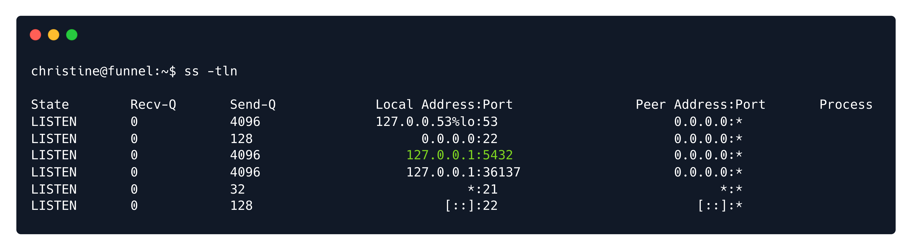


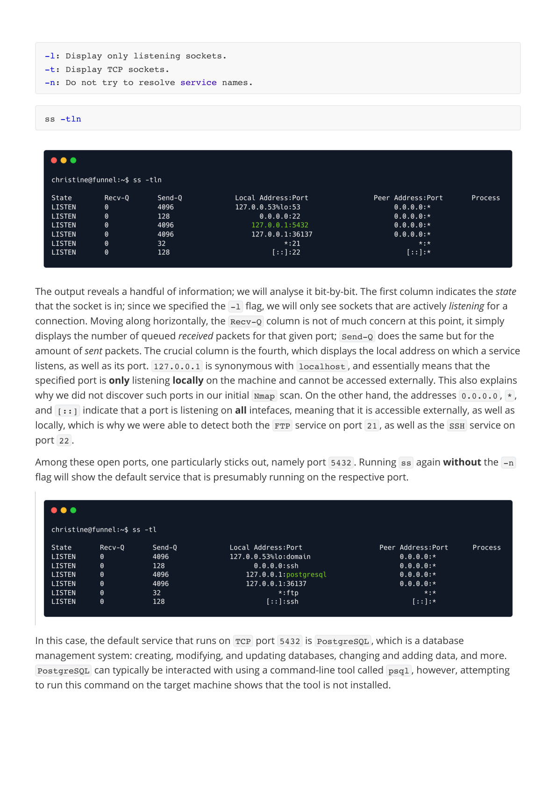

### Page 12

```
Seeing as we do not have administrative privileges, we now find ourselves at a bit of a crossroad. The 
service which most likely has the flag is hidden locally on the target machine, and the tool to access that 
service is not installed. While there are some potential workarounds involving uploading static binaries onto 
the target machine, an easier way to bypass this roadblock is by a practice called port-forwarding, or 
tunneling, using SSH . 
Tunneling

While the theory surrounding tunneling has been broadly covered in the introduction of this document, we 
will now dive into the praxis; it is now time to get our hands dirty and start digging. 
As stated, there are multiple options to take at this point when it comes to the actual port forwarding, but 
we will opt for local port forwarding (you can find the dynamic  version in this document's appendix.)
To use local port forwarding with SSH , you can use the ssh  command with the -L  option, followed by the 
local port, remote host and port, and the remote SSH  server. For example, the following command will 
forward traffic from the local port 1234  to the remote server remote.example.com 's localhost  interface 
on port 22 :
When you run this command, the SSH  client will establish a secure connection to the remote SSH  server, 
and it will listen for incoming connections on the local port 1234 . When a client connects to the local port, 
the SSH  client will forward the connection to the remote server on port 22 . This allows the local client to 
access services on the remote server as if they were running on the local machine.
In the scenario we are currently facing, we want to forward traffic from any given local port, for instance 
1234 , to the port on which PostgreSQL  is listening, namely 5432 , on the remote server. We therefore 
specify port 1234  to the left of localhost , and 5432  to the right, indicating the target port. 
ssh -L 1234:localhost:22 user@remote.example.com
```

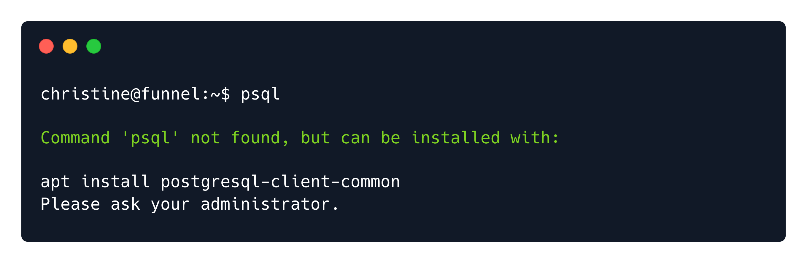

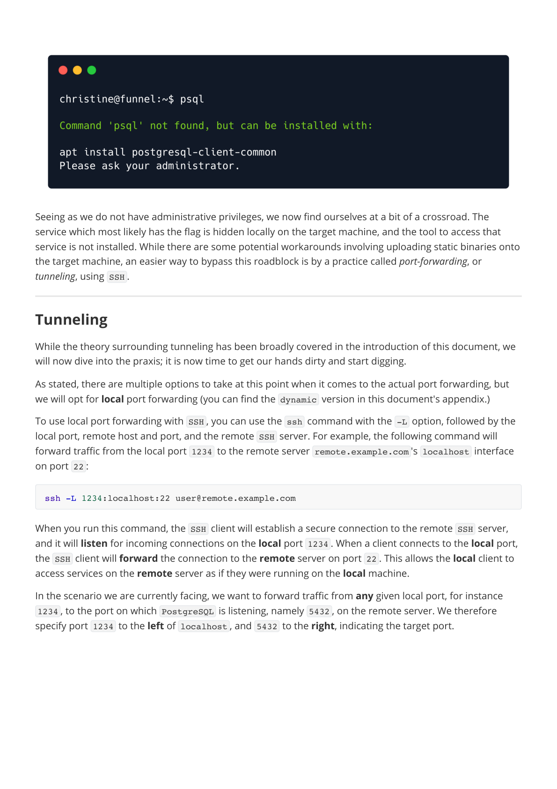

### Page 13

```
ssh -L 1234:localhost:5432 christine@{target_IP}
```


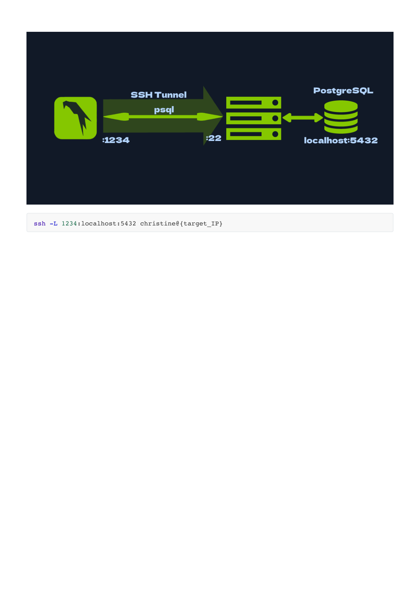

### Page 14

```
As a side-note, we may elect to just establish a tunnel to the target, without actually opening a full-on 
shell on the target system. To do so, we can use the -f  and -N  flags, which a) send the command to 
the shell's background right before executing it remotely, and b)  tells SSH  not to execute any 
commands remotely. 
After entering christine 's password, we can see that we have a shell on the target system once more, 
however, under its hood, SSH  has opened up a socket on our local machine on port 1234 , to which we can 
now direct traffic that we want forwarded to port 5432  on the target machine. We can see this new socket 
by running ss  again, but this time on our local machine, using a different shell than the one we used to 
establish the tunnel.
ss -tlpn
```

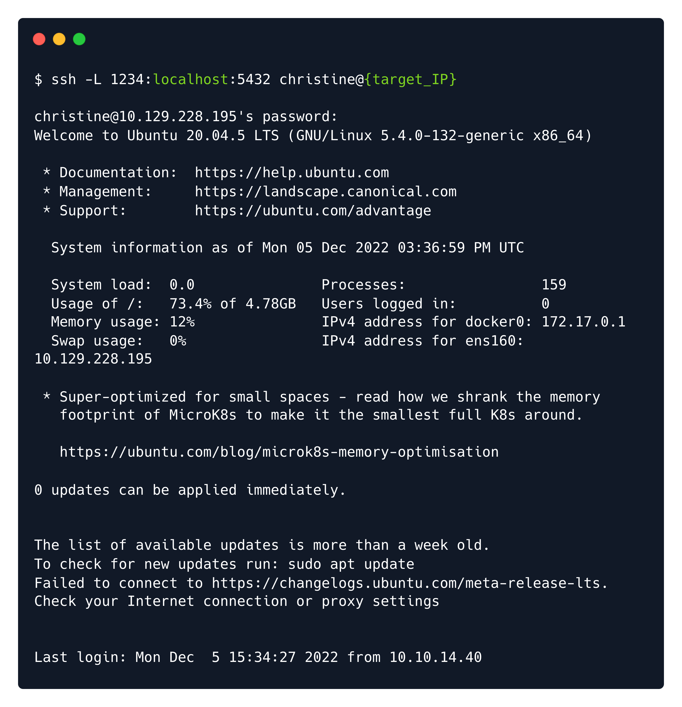

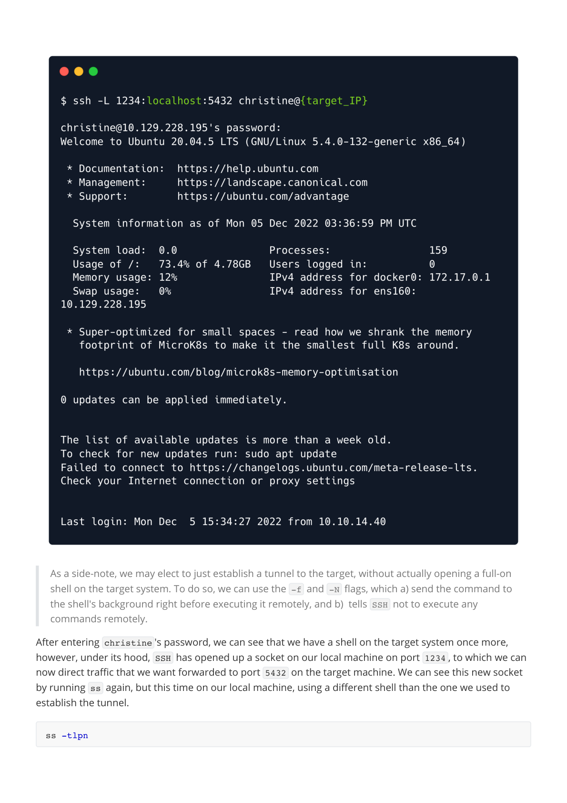

### Page 15

```
In order to interact with the remote service, we must first install psql  locally on our system. This can be 
done easily using the default package manager (on most pentesting distros), apt . 
Using our installation of psql , we can now interact with the PostgreSQL  service running locally on the 
target machine. We make sure to specify localhost  using the -h  option, as we are targeting the tunnel we 
created earlier with SSH , as well as port 1234  with the -p  option, which is the port the tunnel is listening 
on. 
Once again, we are prompted for a password, which turns out to be the default password funnel123#!# . 
We have successfully tunnelled ourselves through to the remote PostgreSQL  service, and can now interact 
with the various databases and tables on the system.
In order to list the existing databases, we can execute the \l  command, short for \list . 
sudo apt update && sudo apt install psql
psql -U christine -h localhost -p 1234 
\l
```


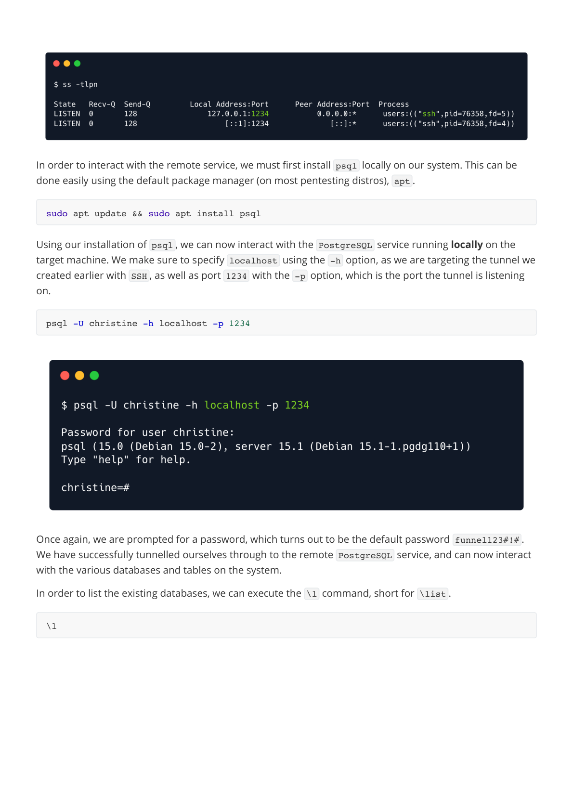

### Page 16

```
Five rows are returned, including a database with the ominous name secrets . Using the \c  command, 
short for \connect , we can select a database and proceed to interact with its tables.
Finally, we can list the database's tables using the \dt  command, and dump its contents using the 
conventional SQL SELECT  query.
\c secrets
\dt
SELECT * FROM flag;
```


### Page 17

```
With the collection of the sought flag, this target can be wrapped up. 
Congratulations!
Appendix

Dynamic Port Forwarding

Instead of local port forwarding, we could have also opted for dynamic port forwarding, again using SSH . 
Unlike local port forwarding and remote port forwarding, which use a specific local and remote port (earlier 
we used 1234  and 5432 , for instance), dynamic port forwarding uses a single local port and dynamically 
assigns remote ports for each connection.
To use dynamic port forwarding with SSH, you can use the ssh  command with the -D  option, followed by 
the local port, the remote host and port, and the remote SSH server. For example, the following command 
will forward traffic from the local port 1234 to the remote server on port 5432, where the PostgreSQL server 
is running:
Again, we can use the -f  and -N  flags so we don't actually SSH  into the box, and can instead 
continue using that shell locally.
As you can see, this time around we specify a single local port to which we will direct all the traffic needing 
forwarding. If we now try running the same psql  command as before, we will get an error.
That is because this time around we did not specify a target port for our traffic to be directed to, meaning 
psql  is just sending traffic into the established local socket on port 1234 , but never reaches the 
PostgreSQL  service on the target machine. 
ssh -D 1234 christine@{target_IP}
```


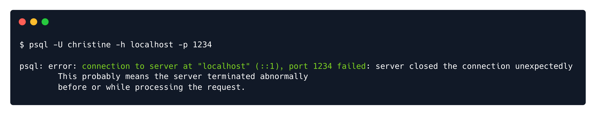

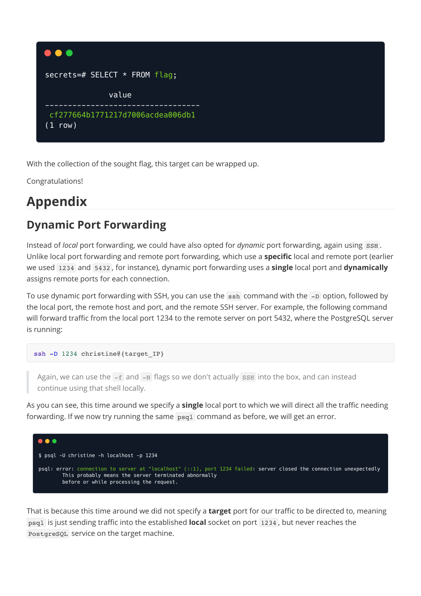

### Page 18

```
To make use of dynamic  port forwarding, a tool such as proxychains  is especially useful. In summary and 
as the name implies, proxychains  can be used to tunnel a connection through multiple proxies; a use case 
for this could be increasing anonymity, as the origin of a connection would be significantly more difficult to 
trace. In our case, we would only tunnel through one such "proxy"; the target machine.
The tool is pre-installed on most pentesting distributions (such as ParrotOS  and Kali Linux ) and is highly 
customisable, featuring an array of strategies for tunneling, which can be tampered with in its configuration 
file  /etc/proxychains4.conf .
The minimal changes that we have to make to the file for proxychains  to work in our current use case is 
to:
1. Ensure that strict_chain  is not commented out; ( dynamic_chain  and random_chain   should be 
commented out)
2. At the very bottom of the file, under [ProxyList] , we specify the socks5  (or socks4 ) host and port 
that we used for our tunnel
In our case, it would look something like this, as our tunnel is listening at localhost:1234 .
Having configured proxychains  correctly, we can now connect to the PostgreSQL  service on the target, as 
if we were on the target machine ourselves! This is done by prefixing whatever command we want to run 
with proxychains , like so:
<SNIP>
[ProxyList]
# add proxy here ...
# meanwile
# defaults set to "tor"
#socks4         127.0.0.1 9050
socks5  127.0.0.1 1234
proxychains psql -U christine -h localhost -p 5432
```


### Page 19

```
Proxychains can produce an unusual amount of output, but don't be intimidated by it, it is just 
verbose in showing you whether a certain connection to a proxy worked or not.  
This should hopefully demonstrate the beauty of dynamic port forwarding, as we can specify the target port 
freely and in accord with each command we want to run. If we wanted to cURL  a webserver on port 80 , for 
instance, during local port forwarding we would have to run the tunneling command all over again and 
change up the target port. Here, we can simply prefix our cURL  command with proxychains , and access 
the webserver as if we were on the target machine ourselves; no need for any extra specification- hence, 
dynamic.
```


---

Generated by tools/convert_pdf_to_md.py — review & redact sensitive info before publishing.
