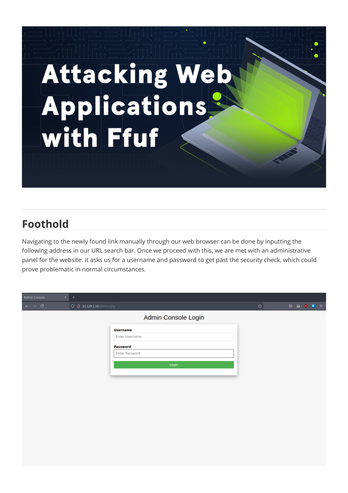
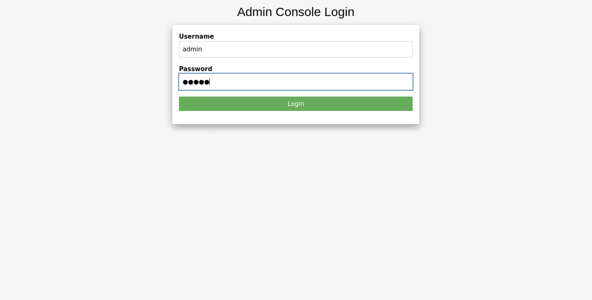

# Writeups

**Source PDF:** `raw-logs/document.pdf`

## TL;DR

Preignition Write-up Prepared by: 0ne-nine9 Introduction

## Extracted walkthrough

### Page 1

```
Preignition Write-up

Prepared by: 0ne-nine9
Introduction

In most environments, web servers play a big part in the infrastructure and in the daily processes of many 
departments. Web servers can sometimes be used strictly internally by employees, but most of the time can 
be found to be public-facing, meaning anyone from the Internet can access them to retrieve information 
and files from their hosted web pages. For the most part, the web pages hosted on the web servers are 
managed through their administrative panels, locked behind a log-in page. Let us think of an example:
You have decided to start your own blog and use WordPress to achieve this. If you are unfamiliar with 
WordPress, you can read more about it here, but it is essentially a popular web application that allows you 
to easily manage the content you want to post for the rest of the world to read. Once installed, your 
WordPress website will have a public-facing side and a private-facing one, the latter being your 
administrative panel hosted at www.yourwebsite.com/wp-admin . This page is locked behind a log-in screen.
A quick note: you can learn more about hacking WordPress websites by checking out the Hacking 
WordPress module on HTB Academy!
 
 
Once you, as an administrator of the WordPress site, log into its' admin panel, you will have access to a 
myriad of controls, ranging from content uploading mechanisms, to theme selection, custom script editing 
for specific pages, and more. The more you learn about WordPress, the more you will see how this is a vital 
part of a successful pentest, as some of these mechanisms could be outdated and come with critical flaws
```


### Page 2

```
that would allow an attacker to gain a foothold and subsequently pivot through the network with ease.
Thus, we conclude that Web enumeration, specifically directory busting (dir busting), is one of the most 
essential skills any Penetration Tester must possess. While manually navigating websites and clicking all the 
available links may reveal some data, most of the links and pages may not be published to the public and, 
hence, are less secure. Suppose we did not know the wp-admin  page is the administrative section of the 
WordPress site we exemplified above. How else would we have found it out if not for web enumeration and 
directory busting?
 
Enumeration

As previously, we start by verifying connectivity to the target. We can take the IP address of the target 
machine from the Starting Point lab page and paste it into the terminal and fire-up the ping command as a 
first step. After two successful replies, we can interrupt the ping command, as we are satisfied with the 
connection quality. We do not always need to run commands for a long time. Sometimes, getting a snippet 
of the result or an overview instead of a detailed report is more beneficial to our time efficiency than the 
alternative.
 
 
Immediately after, we can follow up with a preliminary scan of the target. Using nmap and the appropriate 
service version detection switch, we scan the IP address for any open ports and services.
 
 
-sV : Probe open ports to determine service/version info
```


### Page 3

```
From the scan result, a single entry is shown and catches our attention. It is an http service running on port 
80, signaling that this target might be hosting some explorable web content. To look at the contents 
ourselves, we can open a web browser of our choice and navigate to the target's IP address in the URL bar 
at the top of the window. This will automatically address the target's port 80 for the client-server 
communication and load the web page's contents.
 
 
At the top of the page, we observe the mention of the nginx service. After researching basic information 
about nginx and its purpose, we conclude that our target is a web server. Web servers are hosts on the 
target network which have the sole purpose of serving web content internal or external users, such as web 
pages, images, videos, audio files, and other types. Typically, a web server is accessible from the Internet to 
allow for the stored content to be explored by the online public for many reasons: shopping, providing and
```


### Page 4

```
requesting services, banking, reading the news, and more.
What we are looking at on our browser screen is the default post-installation page for the nginx service, 
meaning that there is the possibility that this web application might not be adequately configured yet, or 
that default credentials are used to facilitate faster configuration up to the point of live deployment. This, 
however, also means that there are no buttons or links on the web page to assist us with navigation 
between web directories or other content. 
When browsing a regular web page, we use these elements to move around on the website. However, these 
elements are only links to other directories containing other web pages, which get loaded in our browser as 
if we manually navigated to them using the URL search bar at the top of the browser screen. Knowing this, 
could we attempt to find any "hidden" content hosted on this webserver?
The short answer is yes, but to avoid guessing URLs manually through the browser's search bar, we can find 
a better solution. This method is called dir busting, short for directory busting. For this purpose, we will be 
using the tool called gobuster , which is written in Go. If you do not have gobuster installed on your 
machine yet, you can follow the instructions below to install it successfully. Pwnbox already comes pre-
equipped with gobuster and all the necessary tools to finish any lab on Hack The Box.
 
Installing gobuster

First, you need to make sure you have Go installed on your Linux distribution, which is the programming 
language used to write the gobuster tool. Once all the dependencies are satisfied for Go, you can proceed 
to download and install gobuster. In order to install Go, you need to input the following command in your 
terminal window:
 
 
Once that installation is complete, you can proceed with installing gobuster. If you have a Go environment 
ready to go (at least Go version 1.19), you can use the apt  package manager to install gobuster using the 
following command.
 
 
Alternatively, you can also compile the tool from its source code by running the following commands:
 
sudo apt install golang-go
sudo apt install gobuster
```


### Page 5

```
If these installation instructions are unclear, please follow the gobuster creator's readme file on everything 
related to the tool by following this link.
 
Using gobuster

In order to start our dir busting, we will need to discover what capabilities gobuster has and which ones can 
assist us. By looking at the tool's help page, by typing in the gobuster --help  command in our terminal, 
we receive a list of all possible switches for the tool and their description.
 
sudo git clone https://github.com/OJ/gobuster.git
cd gobuster
go get && go build
go install
Usage:
  gobuster [command]
Available Commands:
  completion  Generate the autocompletion script for the specified shell
  dir         Uses directory/file enumeration mode
  dns         Uses DNS subdomain enumeration mode
  fuzz        Uses fuzzing mode. Replaces the keyword FUZZ in the URL, Headers and the 
request body
  gcs         Uses gcs bucket enumeration mode
  help        Help about any command
  s3          Uses aws bucket enumeration mode
  tftp        Uses TFTP enumeration mode
  version     shows the current version
  vhost       Uses VHOST enumeration mode (you most probably want to use the IP address as 
the URL parameter)
Flags:
      --debug                 Enable debug output
      --delay duration        Time each thread waits between requests (e.g. 1500ms)
  -h, --help                  help for gobuster
      --no-color              Disable color output
      --no-error              Don't display errors
  -z, --no-progress           Don't display progress
  -o, --output string         Output file to write results to (defaults to stdout)
  -p, --pattern string        File containing replacement patterns
  -q, --quiet                 Don't print the banner and other noise
  -t, --threads int           Number of concurrent threads (default 10)
  -v, --verbose               Verbose output (errors)
  -w, --wordlist string       Path to the wordlist. Set to - to use STDIN.
```


### Page 6

```
In our case, we will only need to use the following:
 
 
We can use the common.txt  wordlist which can be downloaded from here.
 
 
In the wordlist we used, the entry admin.php  was present, and from our results above, we can see that 
there is indeed a page with the same name present on the target. What gobuster did here was make several 
connection attempts to the target using the HTTP GET method (requesting web pages from the webserver) 
with different URL variations, such as:
 
      --wordlist-offset int   Resume from a given position in the wordlist (defaults to 0)
dir : specify we are using the directory busting mode of the tool
-w : specify a wordlist, a collection of common directory names that are typically used 
for sites
-u : specify the target's IP address
wget https://github.com/danielmiessler/SecLists/raw/master/Discovery/Web-
Content/common.txt -O /usr/share/wordlists/common.txt
```


### Page 7

```
Out of all the variations found in the wordlist we specified, admin.php  existed and was returned to us in the 
output as seen below, signaling that the webpage exists and we can navigate to it manually to check out its 
contents:
 
 
Now that we have received the result we needed from gobuster, we can put it away for now. If you want to 
delve even deeper into directory busting and web enumeration, you can follow up with our module on HTB 
Academy with Ffuf! Ffuf is just another tool like gobuster, around which we have developed a 
comprehensive module on HTB Academy. If you want to learn more about web directories and other web 
services, you can read up on our Attacking Web Applications with Ffuf module on HTB Academy.
 
GET http://{target_IP}/kittens
GET http://{target_IP}/hackers
GET http://{target_IP}/admin.php
GET http://{target_IP}/hackthebox
GET http://{target_IP}/yourespecial
```


### Page 8

```
Foothold

Navigating to the newly found link manually through our web browser can be done by inputting the 
following address in our URL search bar. Once we proceed with this, we are met with an administrative 
panel for the website. It asks us for a username and password to get past the security check, which could 
prove problematic in normal circumstances.
```




### Page 9

```
Usually, in situations such as this one, we would need to fire up some brute-forcing tools to attempt logging 
in with multiple credentials sets for an extended period of time until we hit a valid log-in since we do not 
have any underlying context about usernames and passwords that might have been registered on this web 
site as valid administrative accounts. But first, we can try our luck with some default credentials since this is 
a fresh nginx installation. We are betting that it might have been left unconfigured at the time of our 
assessment. Let us try logging in with the following credentials:
 
 
 
We seem to be successful! The log-in worked, and we were presented with our flag. This concludes Tier 0, 
the most elementary of targets. Do not forget to take a look at the suggested modules in HTB Academy to 
get a better understanding of the tactics and vectors used so far in the assessments, and follow up with Tier 
I, which will offer less detailed explanations and more technicality in the assessment process!
 
admin admin
```




### Page 10

```
Congratulations!
```


---

Generated by tools/convert_pdf_to_md.py — review & redact sensitive info before publishing.
