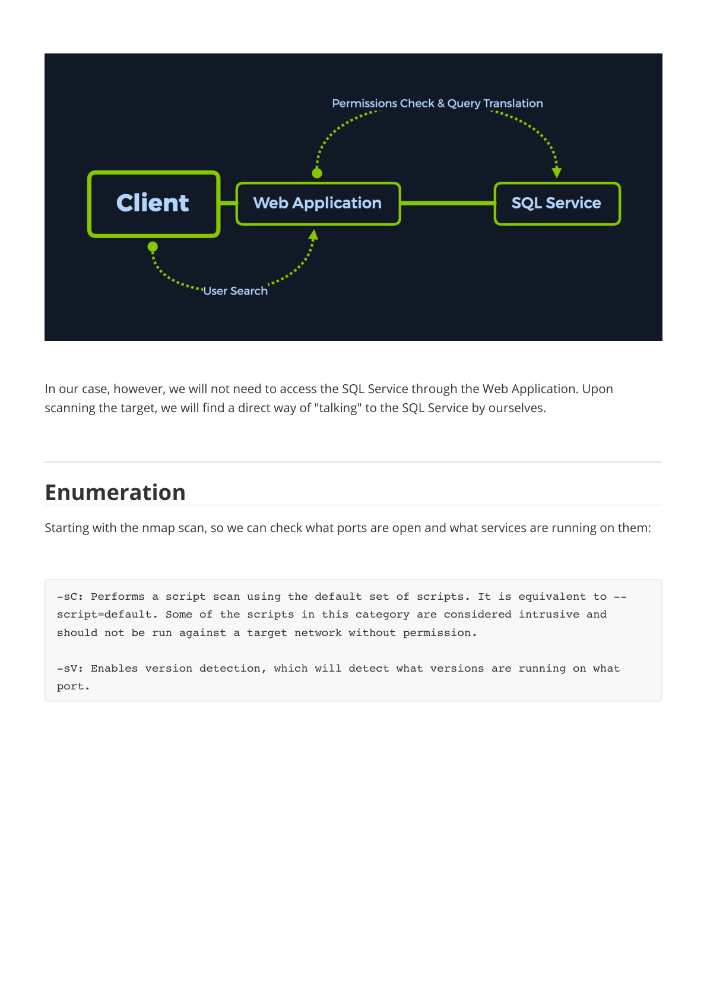
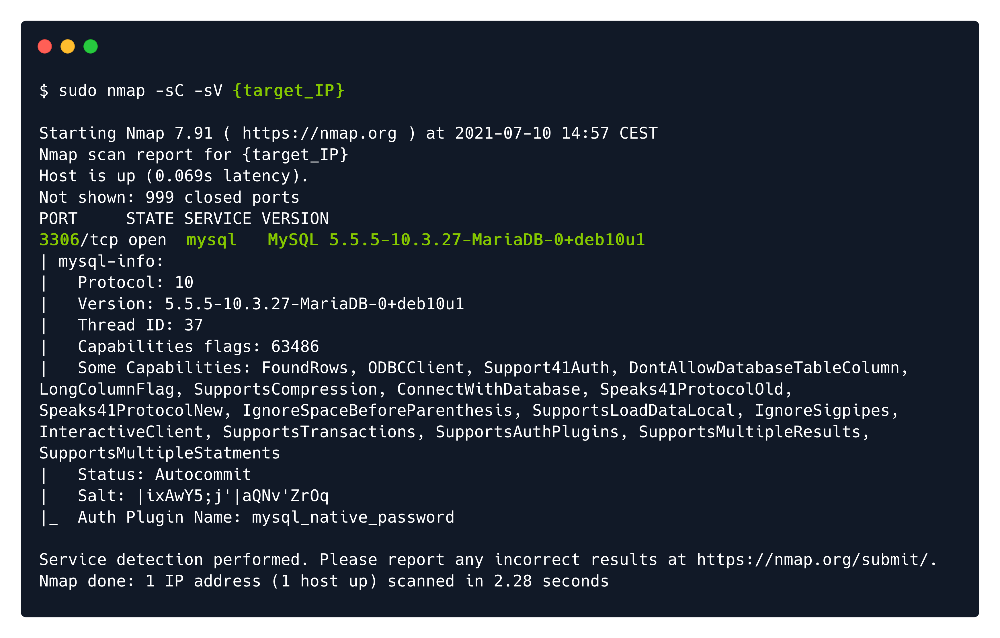
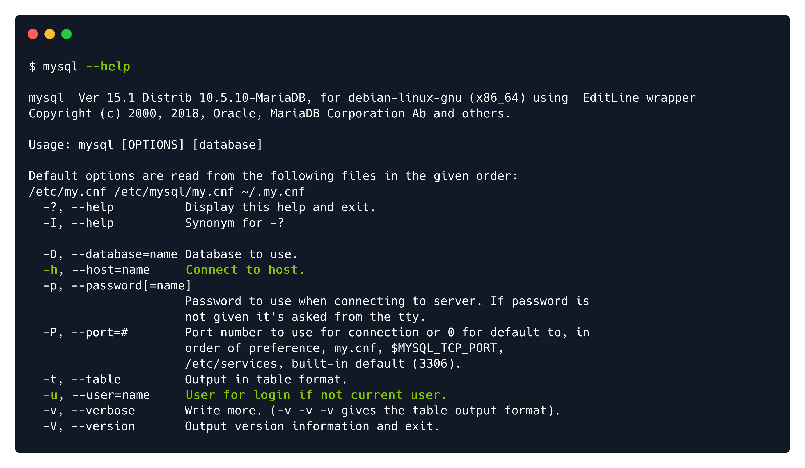
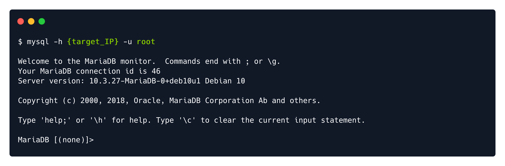
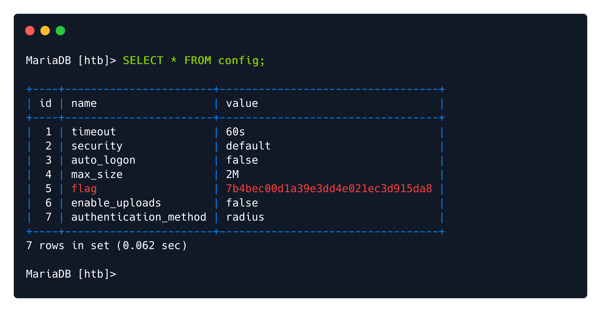
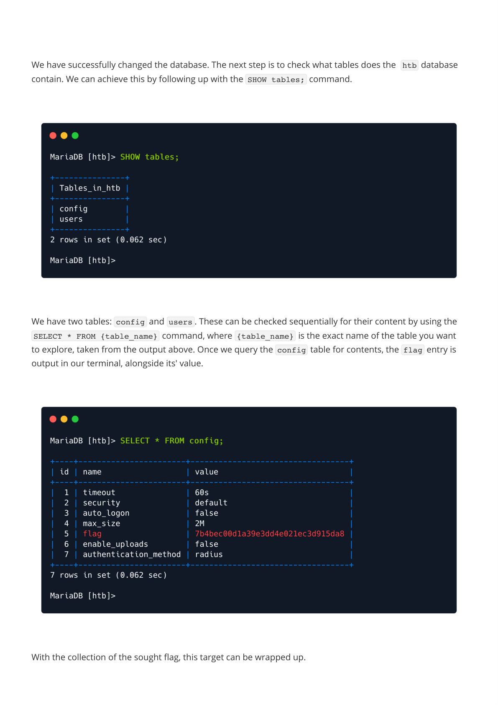

# Writeups

**Source PDF:** `raw-logs/document.pdf`

## TL;DR

Sequel Write-up Prepared by: 0ne-nine9, ilinor Introduction

## Extracted walkthrough

### Page 1

```
Sequel Write-up

Prepared by: 0ne-nine9, ilinor
Introduction

Learning how to navigate databases is of considerable importance because most of the critical data is 
stored in them, including usernames and passwords, which can potentially be used to gain the highest 
privileged access to the target system. We have already touched on the subject of databases in previous 
write-ups. However, in this one, we are going to learn how to navigate through them.
The reason web servers and other services use databases such as MySQL, MariaDB, or other technologies is 
to store the accumulated data somewhere easily accessible and well-organized. That data could represent 
usernames, passwords, posts, messages, the exact date when the users joined, and other information - 
depending on the website's purpose. Every database contains tables, which in turn contain rows and 
columns. For example, if there is a website that has a small social network and e-commerce section, there 
would be a need for several separate sections which should not be inter-accessible:
One containing users' private information, such as email addresses, geolocations, log-in history, and 
attached IP addresses, real names, credit card information, and more.
One containing publicly searchable information such as products, services, music, videos, and other 
types.
```


### Page 2

```
An excellent example of how an SQL Service typically operates is the log-in process utilized for any user. 
Each time the user wants to log in, the web application sends the log-in page input (username/password 
combination) to the SQL Service, comparing it with stored database entries for that specific user. Suppose 
the specified username and password match any entry in the database. In that case, the SQL Service will 
report it back to the web application, which will, in turn, log the user in, giving them access to the restricted 
parts of the website. Post-log-in, the web application will set the user a special permission in the form of a 
cookie or authentication token that associates his online presence with his authenticated presence on the 
website. This cookie is stored both locally, on the user's browser storage, and the webserver.
Afterward, if the user wants to search through the list items listed on the page for something in particular, 
he will input the object's name in a search bar, which will trigger the same SQL Service to run the SQL query 
on behalf of the user. Suppose an entry for the searched item exists in the database, typically under a 
different table. In that case, the associated information is retrieved and sent to the web application to be 
presented as images, text, links, and other types, such as comments and reviews.
```


### Page 3

```
In our case, however, we will not need to access the SQL Service through the Web Application. Upon 
scanning the target, we will find a direct way of "talking" to the SQL Service by ourselves.

Enumeration

Starting with the nmap scan, so we can check what ports are open and what services are running on them:


-sC: Performs a script scan using the default set of scripts. It is equivalent to --
script=default. Some of the scripts in this category are considered intrusive and 
should not be run against a target network without permission.
-sV: Enables version detection, which will detect what versions are running on what 
port.
```




### Page 4

```
We only found one open port - 3306, which runs a service named MySQL 5.5.5-10.3.27-MariaDB-
0+deb10u1 . MySQL is a service designed for database management: creating, modifying, and updating 
databases, changing and adding data, and more.

Foothold

In order to communicate with the database, we need to install either mysql  or mariadb  on our local 
machine. To do that, you need to run the following command. Make sure you include the *  symbol at the 
end of the command to include all the related MySQL packages available. This will cover all of your needs for 
now.


After the installation is complete, you can run the following command to see how the service commands are 
used.

sudo apt update && sudo apt install mysql*
```




### Page 5

```
Note that the MySQL clients usually authenticate with the service with a username/password combination. 
However, it is essential to test for passwordless authentication, as there might be an intentional 
misconfiguration in the service, which would allow personnel to easily log into the service during the 
deployment stage of the project to easily interact with it before making it available to other colleagues. In 
the present situation, an initial attempt can be to attempt a log-in as the root  user, naturally having the 
highest level of privileges on the system.


-h : Connect to host.
-u : User for log-in if not current user.
```






### Page 6

```
With an ounce of luck, our connection is accepted without a password requirement. We are placed in a 
MySQL service shell from where we can explore the tables and data therein that are available to us. If you 
need help with MySQL command syntax, you can refer to the cheatsheet provided by MySQLTutorial.
The commands we are going to use are essential for navigation:


Note that it is essential to end each command with the ;  symbol, as it declares the end of the command. 
Apart from that, SQL is a query-oriented language, which means that you supply it with one query at a time.


From the output, the htb  database seems to be of value to us. In order to see what rests inside it, we will 
need to "select" the htb  database as the active one - the database we want to actively interact with for our 
subsequent commands. To achieve this, the USE htb;  command can be used. 

SHOW databases;                : Prints out the databases we can access.
USE {database_name};           : Set to use the database named {database_name}.
SHOW tables;                   : Prints out the available tables inside the current 
database.
SELECT * FROM {table_name};    : Prints out all the data from the table {table_name}.
```


### Page 7

```
We have successfully changed the database. The next step is to check what tables does the  htb  database 
contain. We can achieve this by following up with the SHOW tables;  command.


We have two tables: config  and users . These can be checked sequentially for their content by using the 
SELECT * FROM {table_name}  command, where {table_name}  is the exact name of the table you want 
to explore, taken from the output above. Once we query the config  table for contents, the flag  entry is 
output in our terminal, alongside its' value.


With the collection of the sought flag, this target can be wrapped up.
```






### Page 8

```
Congratulations!
```


---

Generated by tools/convert_pdf_to_md.py — review & redact sensitive info before publishing.
