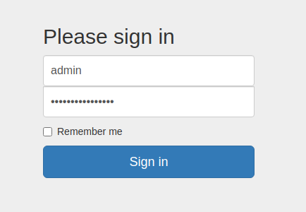

# Writeups

**Source PDF:** `raw-logs/document.pdf`

## TL;DR

Crocodile Write-up Prepared by: 0ne-nine9, ilinor Introduction

## Extracted walkthrough

### Page 1

```
Crocodile Write-up

Prepared by: 0ne-nine9, ilinor
Introduction

Tier I is all about exploitation vectors that chain together to offer you the possibility of gaining a foothold on 
the target from one service to another. Credentials could be lost somewhere in a publicly accessible folder 
which would let you login through a remote shell left untended and unmonitored. A misconfigured service 
could be leaking information that might allow you to impersonate the digital identity of a victim. Any 
number of possibilities exist in the real world. However, we will start with some simpler ones.
Tackling an example sewed together from two other previous targets, we will be looking at an insecure 
access configuration on FTP and an administrative login for a website. Let us proceed to deconstruct this 
vector and analyze its' components.

Enumeration

We will start by enumerating the target. Our first step is, as always, a thorough nmap scan. By using the 
following two switches for the scan, we ensure that our nmap script analyses the service being run on any 
port found in the open  state and returns a mostly exact service version value in the output and that all of 
the default analysis scripts are run against the target, as we are not constrained on how intrusive we can be 
with our scan. Running the scan as mentioned, we can receive results as seen below, with snippets of 
directories the scan has even found for us!


-sC: Performs a script scan using the default set of scripts. It is equivalent to --
script=default. Some of the scripts in this category are considered intrusive and 
should not be run against a target network without permission.
-sV: Enables version detection, which will detect what versions are running on what 
port.
```


### Page 2

```
We have two open ports: 21 and 80. Port 21 is the port dedicated to FTP (File Transfer Protocol), meaning 
that its' primary use is to transfer files between hosts on the same network.
According to Wikipedia, a quick reminder:


Users could connect to the FTP server anonymously if the server is configured to allow it, meaning that we 
could use it even if we had no valid credentials. If we look back at our nmap scan result, the FTP server is 
indeed configured to allow anonymous login:

The File Transfer Protocol (FTP) is a standard communication protocol used to transfer 
computer files from a server to a client on a computer network. FTP users may 
authenticate themselves with a clear-text sign-in protocol, generally using a username 
and password. However, they can connect anonymously if the server is configured to 
allow it.
```


### Page 3

```
If you need a refresher, the ftp -h  command will help you figure out the available commands for the FTP 
service on your local host.


To connect to the remote FTP server, you need to specify the target's IP address (or hostname), as displayed 
on the Starting Point lab page. The prompt will then ask us for our login credentials, which is where we can 
fill in the anonymous  username. In our case, the FTP server does not request a password, and inputting the 
anonymous  username proves enough for us to receive the 230 code, Login successful .


Once logged in, you can type the help  command to check the available commands.

ftp-anon: Anonymous FTP login allowed (FTP code 230)
```


### Page 4

```
We will use dir  and get  to list the directories and manipulate the files stored on the FTP server. With the 
dir  command, we can check the contents of our current directory on the remote host, where two 
interesting files catch out attention. They seem to be files left over from the configuration of another service 
on the host, most likely the HTTPD Web Server. Their names are descriptive, hinting towards a possible 
username list and associated passwords.
```


### Page 5

```
Both files can easily be downloaded using the get  command. The FTP service will report the download 
status completion back to you during this phase. It should not take long to have them both sitting snuggly 
on your attacking VM.


Termination of the FTP connection can be done by using the exit  command. This will return the current 
terminal tab to its' previous state.


Immediately after exiting the FTP service shell, we can type in the ls  command to check if our files are 
present in the directory we were last positioned in. In order to read their contents and discover and 
usernames and passwords within, we can use the cat  command, followed by the name of the file we want 
to open.
```


### Page 6

```
Foothold

After the credentials have been obtained, the next step is to check if they are used on the FTP service for 
elevated access or the webserver running on port 80 discovered during the nmap scan. Attempting to log in 
with any of the credentials on the FTP server returns error code 530 This FTP server is anonymous 
only . No luck here, so we can exit the FTP service shell.


However, we have one option left. During the nmap scan, the service running on port 80 was reported as 
Apache httpd 2.4.41 , an Apache HTTP server. Typing in the IP address of the target into our browser's 
URL search bar results in this webpage. It seems to be a storefront for a server hosting company.
```


### Page 7

```
Reading about the target is helpful, but only at a surface level. In order to gain more insight into the 
technology they have used to create their website and possibly find any associated vulnerabilities, we can 
use a handy browser plug-in called Wappalyzer. This plug-in analyzes the web page's code and returns all 
the different technologies used to build it, such as the webserver type, JavaScript libraries, programming 
languages, and more. You can press the links below to add the plug-in to your browser of choice. 
Add me to Chrome!
Add me to Firefox!
Once installed, you can access Wappalyzer by pressing on its' icon at the top right of the browser window. 
Below are the results for our current target.
```


### Page 8

```
From the output of Wappalyzer, we can note some of the more interesting items, specifically the PHP 
programming language used to build the web page. However, nothing gives us a direct plan of attack for 
now. Meanwhile, navigating around the page using the tabs and buttons provided on it leads us nowhere. 
Referencing previous write-ups, there is mention of a different, more direct way of navigating any hidden or 
hardly accessible directories and pages, and that is through dir busting. Using gobuster as our tool of 
choice, we can use the following switches for the script to get the fastest, most accurate results.


For the -x  switch, we can specify php  and html  to filter out all the unnecessary clutter that does not 
interest us. PHP and HTML files will most commonly be pages. We might get lucky and find an 
administrative panel login page that could help us find leverage against the target in combination with the 
credentials we extracted from the FTP server.

dir : Uses directory/file enumeration mode.
--url : The target URL.
--wordlist : Path to the wordlist.
-x : File extension(s) to search for.
```


### Page 9

```
One of the most interesting files gobuster retrieved is the /login.php  page. Navigating manually to the 
URL, in the form of http://{target_IP}/login.php , we are met with a login page asking for a 
username/password combination.
```


### Page 10

```
If the lists of credentials we found had been longer, we could have used a Metasploit module or a login 
brute-force script to run through combinations from both lists faster than manual labor. In this case, 
however, the lists are relatively small, allowing us to attempt logging in manually.


After attempting several username/password combinations, we manage to log in and are met with a Server 
Manager admin panel. Once here, an attacker could manipulate the website in whichever way they desired, 
causing havoc for the userbase and owners or extract more information that would assist them with gaining 
a foothold on the servers hosting the web page.
```





### Page 11

```
We successfully got the flag! It is displayed for us at the top of the admin panel.
Well done!
```


---

Generated by tools/convert_pdf_to_md.py — review & redact sensitive info before publishing.
