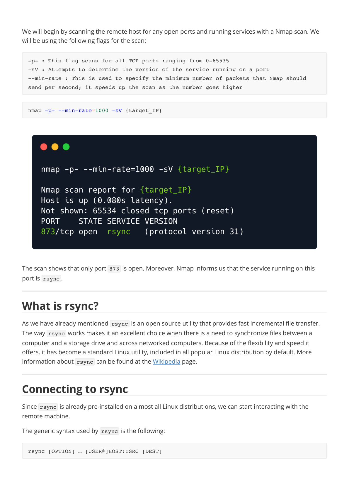

# Writeups

**Source PDF:** `raw-logs/document.pdf`

## TL;DR

Synced Write-up Prepared by: amra Introduction

## Extracted walkthrough

### Page 1

```
Synced Write-up

Prepared by: amra
Introduction

The best known file transfer service is the File Transfer Protocol  (FTP), which was covered thoroughly 
in the Fawn  machine. The main concern with FTP is that it is a very old and slow protocol. FTP is a protocol 
used for copying entire files over the network from a remote server. In many cases  there is a need to 
transfer only some changes made to a few files and not to transfer every file every single time. For these 
scenarios, the rsync  protocol is generally preferred. 
The changes that need to get transfered are called deltas. Using deltas  to update files is an extremely 
efficient way to reduce the required bandwidth for the transfer as well as the required time for the transfer 
to complete. 
The official definition of rsync  according to the Linux manual page is:
It follows directly from the definition of rsync  that it's a great tool for creating/maintaining backups and 
keeping remote machines in sync with each other. Both of these functionalities are commonly implemented 
in corporate environment. In these environments time is of of the most importance, so rsync  is preferred 
due to the speedup it offers for these tasks. 
The main stages of an rsync  transfer are the following: 
1. rsync  establishes a connection to the remote host and spawns another rsync  receiver process.
2. The sender and receiver processes compare what files have changed.
3. What has changed gets updated on the remote host.
It often happens that rsync  is misconfigured to permit anonymous login, which can be exploited by an 
attacker to get access to sensitive information stored on the remote machine. Synced is a Linux box that 
exposes a directory over rsync  with anonymous login. We are able to remotely access this directory using 
the command line tool rsync  and retrieve the flag.
Enumeration

Rsync is a fast and extraordinarily versatile file copying tool. It can copy locally, 
to/from another host over any remote shell, or to/from a remote rsync daemon. It offers 
a large number of options that control every aspect of its behavior and permit very 
flexible specification of the set of files to be copied. It is famous for its delta-
transfer algorithm, which reduces the amount of data sent over the network by sending 
only the differences between the source files and the existing files in the 
destination. Rsync is widely used for backups and mirroring and as an improved copy 
command for everyday use.
```


### Page 2

```
We will begin by scanning the remote host for any open ports and running services with a Nmap scan. We 
will be using the following flags for the scan:
The scan shows that only port 873  is open. Moreover, Nmap informs us that the service running on this 
port is rsync .
What is rsync?

As we have already mentioned rsync  is an open source utility that provides fast incremental file transfer. 
The way rsync  works makes it an excellent choice when there is a need to synchronize files between a 
computer and a storage drive and across networked computers. Because of the flexibility and speed it 
offers, it has become a standard Linux utility, included in all popular Linux distribution by default. More 
information about rsync  can be found at the Wikipedia page.
Connecting to rsync

Since rsync  is already pre-installed on almost all Linux distributions, we can start interacting with the 
remote machine. 
The generic syntax used by rsync  is the following:
-p- : This flag scans for all TCP ports ranging from 0-65535
-sV : Attempts to determine the version of the service running on a port
--min-rate : This is used to specify the minimum number of packets that Nmap should 
send per second; it speeds up the scan as the number goes higher
nmap -p- --min-rate=1000 -sV {target_IP}
rsync [OPTION] … [USER@]HOST::SRC [DEST]
```




### Page 3

```
where SRC is the file or directory (or a list of multiple files and  directories) to copy from, DEST is the file or 
directory to copy to, and square brackets indicate optional parameters.
The [OPTION]  portion of the syntax, refers to the available options in rsync . The list with all valid options 
is available over at the official manual page of rsync  under the section Options Summary . 
The [USER@]  optional parameter is used when we want to access the the remote machine in an 
authenticated way. In this case, we don't have any valid credentials at our disposal so we will omit this 
portion and try an anonymous authentication.
As our first attempt we will try to simply list all the available directories to an anonymous user. Reading 
through the manual page we can spot the option --list-only , which according to the definition is used to 
"list the files instead of copying them".
At this point, we have crafted our first command that we will use to interact with the remote machine.
Looking at the output, we can see that we can access a directory called public  with the description 
Anonymous Share . It is a common practice to call shared directories just shares . Let's go a step further 
and list the files inside the public  share.
rsync --list-only {target_IP}::
rsync --list-only {target_IP}::public
```


### Page 4

```
We notice a file called flag.txt  inside the public  share. Our last step is to copy/sync this file to our local 
machine. To do that, we simply follow the general syntax by specifying the SRC  as public/flag.txt  and 
the DEST  as flag.txt  to transfer the file to our local machine.
Executing this command returns no output. But, on our local directory we have a new file called flag.txt . 
Let's read its contents.
Congratulations! You have successfully retrieved the flag file from the remote machine using the rsync  
protocol.
rsync {target_IP}::public/flag.txt flag.txt
cat flag.txt
```


---

Generated by tools/convert_pdf_to_md.py — review & redact sensitive info before publishing.
