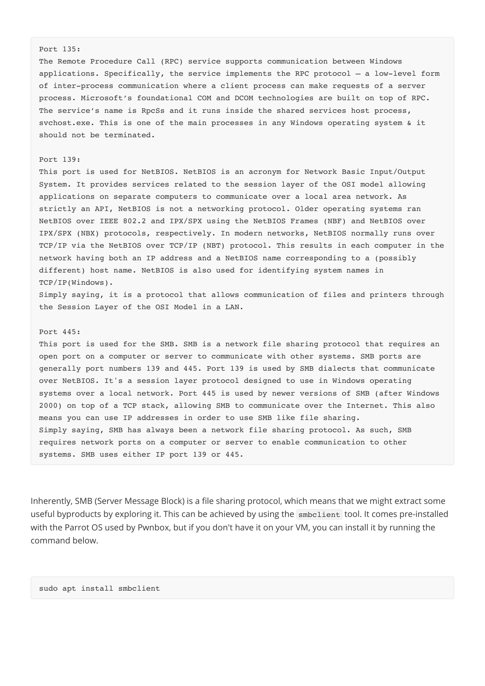
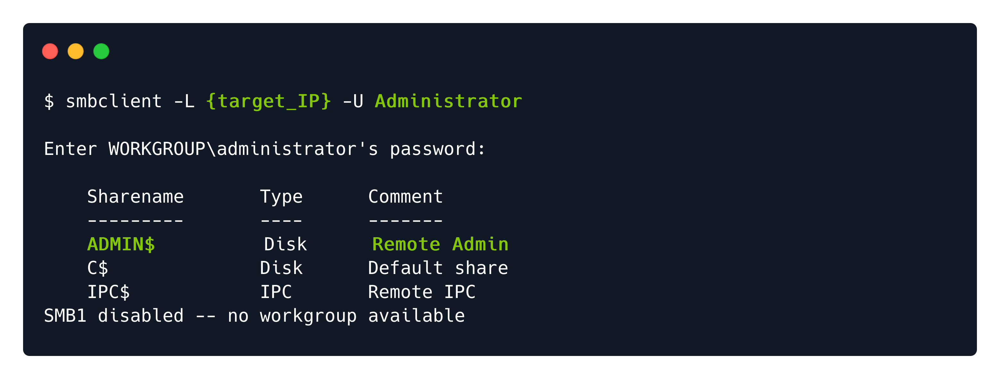
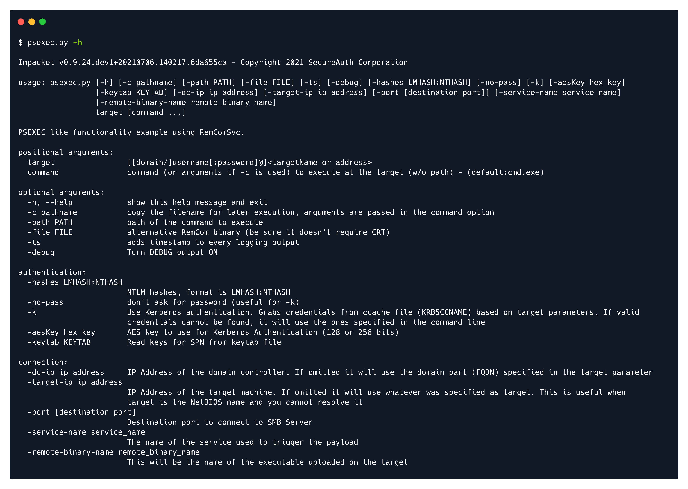

# Writeups

**Source PDF:** `raw-logs/document.pdf`

## TL;DR

Tactics Writeup Prepared by: 0ne-nine9, ilinor Introduction

## Extracted walkthrough

### Page 1

```
Tactics Writeup

Prepared by: 0ne-nine9, ilinor
Introduction

Windows is the most popular operating system today, not only used by individual users, but also in large 
corporations. Due to its' navigational simplicity and the heavy reliance on a graphical user interface to relay 
all media and controls to the most basic user, a substantial number of entities today have their corporate 
network filled with hosts and servers running Windows operating systems. Wether these machines are 
aimed towards the end-user, your typical employee, or the on-site technical team, it still stands as a reality 
that Windows operating systems could easily be misconfigured due to their simplicity in presentation. The 
disparity of controls positioning within the administrative cluster of mechanisms that Windows has to offer 
means that it will not always be an easy task to cover all of the hidden nooks and crannies of the operating 
system when undergoing security hardening procedures, especially for the more novice of teams. 
In this example, we will be taking a look at a misconfigured SMB share, which offers two types of attack 
vectors. One is discoverable and easy to employ. The other involves the installation and deployment of a 
popular exploitation framework, and while dearly effective, it comes with its own disadvantages in terms of 
discoverability. In the wild, you will always be met with such choices. Taking the right step, knowing the right 
path and perceiving the consequences of your attack vectors will prove vital to your career.

Enumeration

In order to get a general view of the target host, we will begin with an always-popular nmap scan. However, 
we will be using a new switch for the scan. Instead of the -sV  service detection switch, we will be using -
Pn . On a real world environment, you should expect Firewalls to be present, intercepting connections at 
every step and denying all nonstandard connection requests or scan attempts. During a typical nmap scan, 
the nmap script will perform a form of complex ping scan, which most Firewalls are set to deny 
automatically, without question. Repeated denials will raise suspicion, and during a typical scan, a lot of the 
same requests will get denied. The -Pn  flag will skip the host discovery phase and move on straight to 
other probe types, silencing your active scanning to a degree. However small, this degree might prove to be 
the lifeline you needed before you even considered actively attacking the host. 


-Pn : Treat all hosts as online -- skip host discovery
-sC : Equivalent to --script=default
```


### Page 2

```
According to the results of the nmap scan, the machine is running the Windows and the Server Message 
Block service on port 445. We have found our target. Below is a short summary of each port discovered and 
its' functionality, for some background information on the target. Documenting these ports and the target in 
general is vital before starting any kind of attack. It will help you avoiding a crashed target or a Firewall block 
and alert.
```


### Page 3

```
Inherently, SMB (Server Message Block) is a file sharing protocol, which means that we might extract some 
useful byproducts by exploring it. This can be achieved by using the smbclient  tool. It comes pre-installed 
with the Parrot OS used by Pwnbox, but if you don't have it on your VM, you can install it by running the 
command below.


Port 135: 
The Remote Procedure Call (RPC) service supports communication between Windows 
applications. Specifically, the service implements the RPC protocol — a low-level form 
of inter-process communication where a client process can make requests of a server 
process. Microsoft’s foundational COM and DCOM technologies are built on top of RPC. 
The service’s name is RpcSs and it runs inside the shared services host process, 
svchost.exe. This is one of the main processes in any Windows operating system & it 
should not be terminated.
Port 139:
This port is used for NetBIOS. NetBIOS is an acronym for Network Basic Input/Output 
System. It provides services related to the session layer of the OSI model allowing 
applications on separate computers to communicate over a local area network. As 
strictly an API, NetBIOS is not a networking protocol. Older operating systems ran 
NetBIOS over IEEE 802.2 and IPX/SPX using the NetBIOS Frames (NBF) and NetBIOS over 
IPX/SPX (NBX) protocols, respectively. In modern networks, NetBIOS normally runs over 
TCP/IP via the NetBIOS over TCP/IP (NBT) protocol. This results in each computer in the 
network having both an IP address and a NetBIOS name corresponding to a (possibly 
different) host name. NetBIOS is also used for identifying system names in 
TCP/IP(Windows). 
Simply saying, it is a protocol that allows communication of files and printers through 
the Session Layer of the OSI Model in a LAN. 
Port 445:
This port is used for the SMB. SMB is a network file sharing protocol that requires an 
open port on a computer or server to communicate with other systems. SMB ports are 
generally port numbers 139 and 445. Port 139 is used by SMB dialects that communicate 
over NetBIOS. It's a session layer protocol designed to use in Windows operating 
systems over a local network. Port 445 is used by newer versions of SMB (after Windows 
2000) on top of a TCP stack, allowing SMB to communicate over the Internet. This also 
means you can use IP addresses in order to use SMB like file sharing.
Simply saying, SMB has always been a network file sharing protocol. As such, SMB 
requires network ports on a computer or server to enable communication to other 
systems. SMB uses either IP port 139 or 445.
sudo apt install smbclient
```



### Page 4

```
In order to find the appropriate switches for this tool, we can use its' help menu, which is accessed by typing 
the smbclient -h  command. This is, however, short and not very descriptive, but it suits our needs for 
now. Based on the  knowledge obtained so far about the structure of commands and the switch naming 
convention for several popular tools that we've interacted with so far, we can take a guess at what the 
switches output from the help menu will accomplish for us. If, however, you want to learn more details 
about what each command accomplishes, you can access the complete manual for the smbclient tool by 
typing the man smbclient  command in your terminal window.


Upon exploring the choices, we will settle on the command below, in order to list the various available 
shares ( -L ) and to attempt a login as the Administrator  account, which is the high privilege standard 
account for Windows operating systems. Typically, the SMB server will request a password, but since we 
want to cover all aspects of possible misconfigurations, we can attempt a passwordless login. Simply hitting 
the Enter  key when prompted for the Administrator  password will send a blank input to the server. 
Wether it accepts it or not, we still need to discover.


-L : List available shares on the target.
-U : Login identity to use.
```


### Page 5

```
Foothold

From here we have two options of attack. One is loud, one is not.
Smbclient simple navigation to C$ share with Administrator authorization
PSexec.py from Impacket, involving Impacket installation and common attack surface, big 
fingerprinting.

Option A: SMB Unprotected C$ Share

smbclient \\\\10.10.10.131\\ADMIN$ -U Administrator
```




### Page 6

```
Instead of accessing the ADMIN$  share, we can access the C$  share, which is the file system of the Windows 
machine:
```


### Page 7

```
We have access to the file system. From here, we will directly navigate to the standard root flag location on 
any Hack The Box Windows vulnerable machine: C:\Users\Administrator\Desktop . Using the dir  
command, we discover the flag file present snuggly on our system.
```


### Page 8

```
In order to retrieve the flag.txt  file from the server, we can use the get flag.txt  command. This will 
initialize a download with the output location being our last visited directory on our attacker VM at the point 
of running the smbclient  tool.


We can now exit the smbclient  command line and read the file we just downloaded using the cat  
command.


You have successfully retrieved the flag, congratulations!
Option B: Impacket

We managed to get the SMB command-line interactive interface. However, since we can access this ADMIN$  
share, we will try to use a tool called psexec.py  to exploit this misconfiguration & get the interactive 
system shell. The psexec.py  is part of the Impacket framework.
Impacket is a framework written in Python for working with network protocols. It is focused on providing 
low-level programmatic access to the packets and for some protocols (e.g. SMB and MSRPC) the protocol 
implementation itself. In short, Impacket contains dozens of amazing tools for interacting with windows 
systems and applications, many of which are ideal for attacking Windows and Active Directory.
One of the most commonly used tools in impacket is psexec.py . It is named after the utility, PsExec from 
Microsoft’s Sysinternals suite since it performs the same function of enabling us to execute a fully 
interactive shell on remote Windows machines.
```


### Page 9

```
PsExec is a portable tool from Microsoft that lets you run processes remotely using any user's 
credentials. It’s a bit like a remote access program but instead of controlling the computer with a mouse, 
commands are sent via Command Prompt, without having to manually install client software.
Like any tool, it’s important to understand how the Impacket's psexec works. 
Impacket creates a remote service by uploading a randomly-named executable on the ADMIN$  share on the 
remote system and then register it as a Windows service.This will result in having an interactive shell 
available on the remote Windows system via TCP port 445 .
Psexec requires credentials for a user with local administrator privileges or higher since reading/writing to 
the ADMIN$  share is required. Once you successfully authenticate, it will drop you into a NT 
AUTHORITY\SYSTEM  shell.
We can Download Impacket from this link.
Installation guide:
Note: In case you don't have pip3 (pip for Python3) installed, or Python3, install it with the following commands:
sudo apt install python3 python3-pip
The pkexec  utility can be found at /impacket/examples/pkexec.py . Run the following command to see 
the help information for psexec.py :
psexec.py -h

git clone https://github.com/SecureAuthCorp/impacket.git
cd impacket
pip3 install .
# OR:
sudo python3 setup.py  install
# In case you are missing some modules:
pip3 install -r requirements.txt
```


### Page 10

```
The syntax for simply getting an interactive shell from a target :
 python psexec.py username:password@hostIP
From the previous method in which we used smbclient , so we know that there is no password for the 
'Administrator' user. So, the command we are going to run is:
psexec.py administrator@10.10.10.131
When it prompts for entering a password, simply press enter (as there is no password).
```




### Page 11

```
We got the shell with the highest privileges, i.e. as user NT Authority/System . 
Awesome! Now, you can browse the file system and retrieve the flag.
However, using the pkexec  utility is often preferred in simulated testing environments, but it can be easily 
detected by the Windows Defender in real-world assessments.
```


---

Generated by tools/convert_pdf_to_md.py — review & redact sensitive info before publishing.
