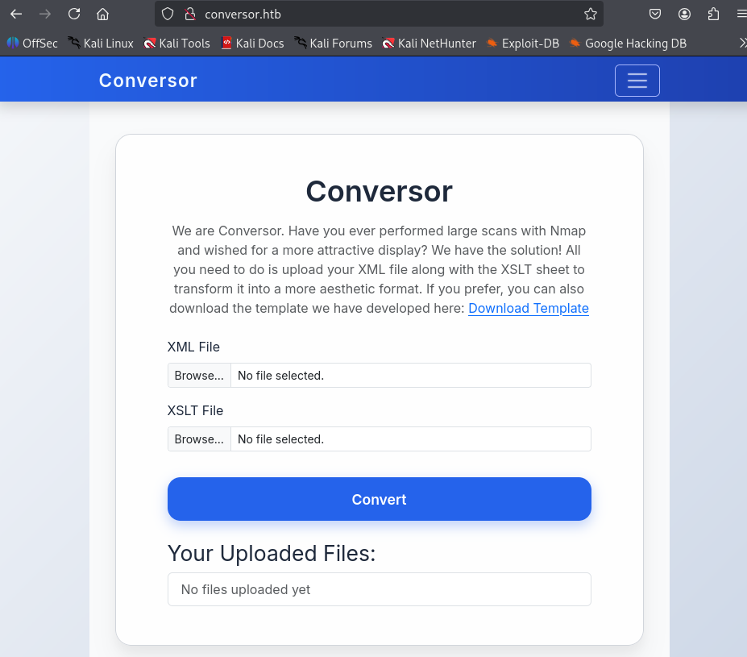

# Conversor — HTB Walkthrough

**Status:** Completed  
**Difficulty:** Easy  
**OS:** Linux

## TL;DR
Discover XML converter web application, analyze source code, exploit XSLT injection with malicious .exslt file to gain reverse shell, extract database credentials, crack hash, SSH as user, exploit sudo binary for root flag.

## Target / Access
**Target IP:** `<redacted>` (10.10.11.92 in raw logs)  
> Note: IP addresses have been redacted per HTB publishing guidelines.

---

## Enumeration

### Step 1: Port Scanning with Nmap

**Command:**
```bash
nmap -sC -sV -p- <redacted-ip>
```

**Raw Log:** [nmap.txt](raw-logs/nmap.txt), [nmap.xml](raw-logs/nmap.xml)

**Output Excerpt:**
```
PORT     STATE SERVICE VERSION
22/tcp   open  ssh     OpenSSH 8.9p1
80/tcp   open  http    nginx
```

**Analysis:** SSH and nginx web server identified.


### Step 2: Web Application Access

**Action:** Add target to /etc/hosts and browse to application

**Command:**
```bash
echo "<redacted-ip> conversor.htb" >> /etc/hosts
```

**Analysis:** XML converter application with user registration.





### Step 3: Source Code Analysis

**Action:** Download and analyze application source code

**Analysis:** Application processes XML files with XSLT transformations, potential for XSLT injection.


---

## Foothold / Initial Access

### Step 4: XSLT Injection Exploitation

**Vulnerability:** XSLT Injection allowing Remote Code Execution

**Preparation:**
1. Create malicious EXSLT file with reverse shell payload
2. Prepare XML file (can use nmap.xml from scan)
3. Set up netcat listener

**Commands:**
```bash
# Set up listener
nc -lvnp 4444

# Create malicious EXSLT file (shell.exslt)
# Upload XML + EXSLT to trigger RCE
```

**Raw Logs:**
- [shell.exslt](raw-logs/shell.exslt) — Malicious XSLT payload
- [nmap.xml](raw-logs/nmap.xml) — XML file used for injection


**Output:** Reverse shell obtained.


### Step 5: Shell Stabilization

**Commands:**
```bash
python3 -c 'import pty; pty.spawn("/bin/bash")'
export TERM=xterm
# Ctrl+Z
stty raw -echo; fg
```

**Analysis:** Shell stabilized for better interaction.

### Step 6: Database Credential Extraction

**Commands:**
```bash
# Search for database files
find / -name "*.db" 2>/dev/null

# Read users.db
cat /path/to/users.db
```

**Analysis:** Found hash for user `fismathack`.

**Hash Found:** `<REDACTED_HASH>`
> **Redaction Note:** Password hash redacted.


### Step 7: Password Cracking

**Command:**
```bash
hashcat -m 0 hash.txt /usr/share/wordlists/rockyou.txt
```

**Result:** Password successfully cracked: `<REDACTED_CRED>`
> **Redaction Note:** Password redacted.


### Step 8: SSH Access and User Flag

**Command:**
```bash
ssh fismathack@<redacted-ip>
cat ~/user.txt
```

**Output:** User flag captured.


---

## Privilege Escalation

### Step 9: Sudo Privilege Enumeration

**Command:**
```bash
sudo -l
```

**Output:**
```
User fismathack may run the following commands:
    (root) NOPASSWD: /path/to/binary
```

**Analysis:** Can run specific binary as root without password.

### Step 10: Binary Exploitation for Root Flag

**Research:** Online research revealed command execution capability in the binary.

**Command:**
```bash
# Execute command to read root flag via sudo binary
sudo /path/to/binary [parameters to execute cat /root/root.txt]
```

**Output:** Root flag successfully obtained.


---

## Summary

This machine involved XSLT injection for initial access and privilege escalation through a sudo-enabled binary.

### Attack Chain
1. **Nmap Scan** — Discovered nginx web server
2. **Web Reconnaissance** — Identified XML converter application
3. **Source Code Analysis** — Found XSLT processing vulnerability
4. **XSLT Injection** — Exploited with malicious .exslt file for RCE
5. **Credential Extraction** — Retrieved hash from users.db
6. **Password Cracking** — Cracked fismathack's password with hashcat
7. **SSH Access** — Authenticated as fismathack, captured user flag
8. **Privilege Escalation** — Exploited sudo binary to read root flag

### Tools Used
- Nmap — Port scanning and service detection
- Web Browser — Application testing
- Netcat — Reverse shell listener
- Hashcat — Password cracking
- Custom XSLT payload — XSLT injection exploitation

---

## Cleanup / Notes / References

### Mitigation Recommendations
1. **Input Validation:** Strictly validate and sanitize XML/XSLT input.
2. **Disable XSLT Features:** Disable dangerous XSLT functions (document(), system-property()).
3. **Sandboxing:** Run XSLT transformations in isolated environment.
4. **Database Security:** Use strong password hashing (bcrypt, Argon2), encrypt sensitive data.
5. **Sudo Restrictions:** Limit sudo privileges to necessary commands only.
6. **Code Review:** Regular security audits of application code.
7. **WAF:** Implement Web Application Firewall to detect injection attempts.

### References
- [OWASP: XSLT Injection](https://owasp.org/www-community/vulnerabilities/XSLT_Injection)
- [XSLT Security Considerations](https://www.w3.org/TR/xslt-30/#security)
- [Linux Privilege Escalation](https://book.hacktricks.xyz/)

---

## Security Summary

**Redactions Performed:**
- IP addresses: `<redacted>`, `<redacted-ip>`, `<ATTACKER_IP>`
- Password hash: `<REDACTED_HASH>`
- Cracked password: `<REDACTED_CRED>`
- Binary paths: `/path/to/binary`

**⚠️ Warning:** Review and redact any sensitive information (credentials, private IPs, tokens) before publishing.
