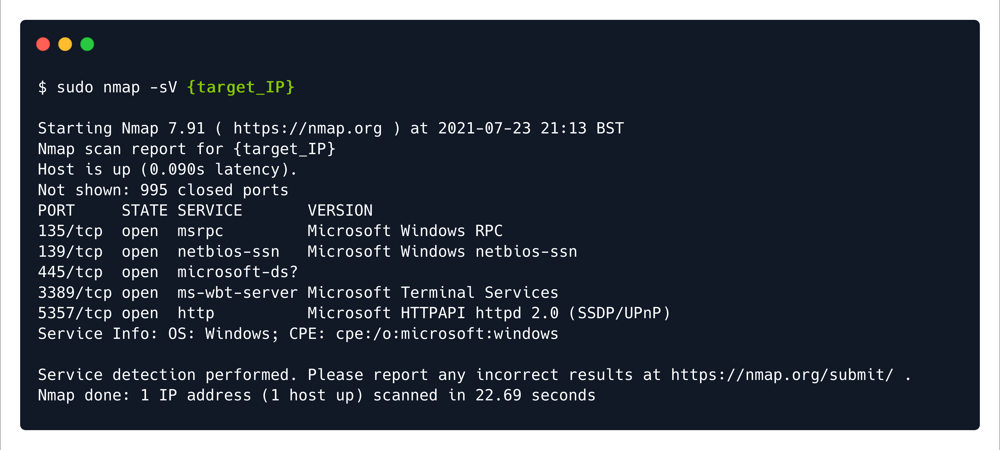

# Explosion — HTB Walkthrough

**Status:** Completed  
**Difficulty:** Very Easy  
**OS:** Windows

## TL;DR
Discover RDP service on Windows machine, connect using xfreerdp with Administrator account and blank password, retrieve flag from desktop.

## Target / Access
**Target IP:** `<redacted>`  
> Note: IP addresses have been redacted per HTB publishing guidelines.

---

## Enumeration

### Step 1: Port Scanning with Nmap

**Command:**
```bash
nmap -sV -p- <redacted-ip>
```

**Raw Log:** [nmap-scan.txt](raw-logs/document.pdf) (Page 4)

**Output Excerpt:**
```
PORT     STATE SERVICE       VERSION
3389/tcp open  ms-wbt-server Microsoft Terminal Services
```

**Analysis:** RDP (Remote Desktop Protocol) service running on port 3389.




---

## Foothold / Initial Access

### Step 2: RDP Connection Attempt (Guest Login)

**Command:**
```bash
xfreerdp /v:<redacted-ip>
```

**Raw Log:** [rdp-guest-attempt.txt](raw-logs/document.pdf) (Page 5)

**Analysis:** Initial connection attempt with default username fails.


### Step 3: Administrator Login with Blank Password

**Command:**
```bash
xfreerdp /v:<redacted-ip> /u:Administrator /cert:ignore
```

**Raw Log:** [rdp-admin-login.txt](raw-logs/document.pdf) (Pages 6-7)

**Output:** Successfully connected to Windows desktop via RDP.

**Analysis:** Administrator account has no password set, allowing direct access.


### Step 4: Flag Retrieval

**Location:** Desktop or user directory

**Raw Log:** [flag-location.txt](raw-logs/document.pdf) (Page 8)

**Analysis:** Flag file located on Administrator's desktop.


---

## Summary

This Starting Point machine demonstrates RDP security misconfiguration with passwordless Administrator account.

### Attack Chain
1. **Port Scanning** — Discovered RDP on port 3389
2. **Service Identification** — Confirmed Microsoft Terminal Services
3. **Authentication Bypass** — Exploited blank Administrator password
4. **Desktop Access** — Retrieved flag from user desktop

### Tools Used
- Nmap — Port scanning and service detection
- xfreerdp — RDP client for remote desktop connection

---

## Cleanup / Notes / References

### Mitigation Recommendations
1. **Strong Passwords:** Enforce strong password policies for all accounts, especially Administrator.
2. **Account Lockout:** Implement account lockout policies after failed login attempts.
3. **Network Level Authentication:** Enable NLA (Network Level Authentication) for RDP.
4. **Firewall Rules:** Restrict RDP access to specific IP addresses or VPN-only access.
5. **MFA:** Implement multi-factor authentication for RDP connections.
6. **Monitoring:** Enable and monitor RDP connection logs for suspicious activity.

### References
- [Microsoft RDP Security Best Practices](https://docs.microsoft.com/en-us/windows-server/remote/remote-desktop-services/rds-security)
- [OWASP: Weak Password Requirements](https://owasp.org/www-community/vulnerabilities/Weak_password_requirements)
- [CIS Windows Security Benchmarks](https://www.cisecurity.org/benchmark/microsoft_windows_desktop)

---

## Security Summary

**Redactions Performed:**
- IP addresses replaced with `<redacted>` or `<redacted-ip>`
- No credentials were used (blank password)

**⚠️ Warning:** Review and redact any sensitive information (credentials, private IPs, tokens) before publishing.
