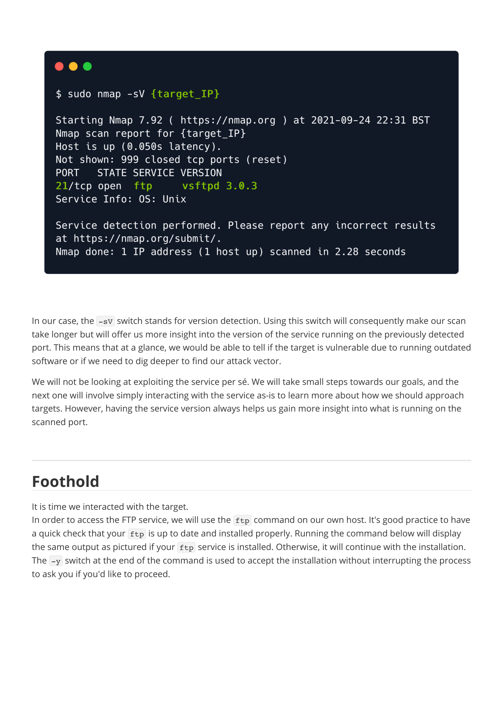
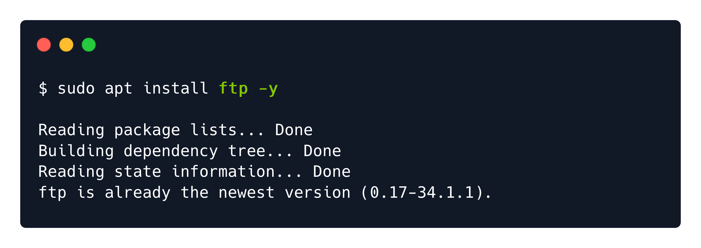
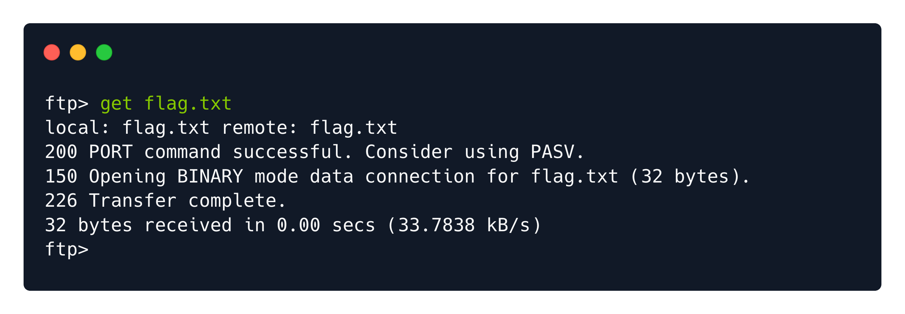

# Fawn — HTB Walkthrough

**Status:** Completed  
**Difficulty:** Very Easy  
**OS:** Linux

## TL;DR
Discover misconfigured FTP service allowing anonymous login, connect as anonymous user, retrieve flag from FTP directory.

## Target / Access
**Target IP:** `<redacted>`  
> Note: IP addresses have been redacted per HTB publishing guidelines.

---

## Enumeration

### Step 1: Connectivity Test with Ping

**Command:**
```bash
ping -c 4 <redacted-ip>
```

**Raw Log:** [ping-test.txt](raw-logs/document.pdf) (Page 5)

**Output Excerpt:**
```
PING <redacted-ip> 64 bytes from <redacted-ip>: icmp_seq=1 ttl=63 time=X ms
4 packets transmitted, 4 received, 0% packet loss
```

**Analysis:** Target is reachable via VPN connection.


### Step 2: Port Scanning with Nmap

**Command:**
```bash
nmap -sV -p- <redacted-ip>
```

**Raw Log:** [nmap-scan.txt](raw-logs/document.pdf) (Pages 6-7)

**Output Excerpt:**
```
PORT   STATE SERVICE VERSION
21/tcp open  ftp     vsftpd 3.0.3
```

**Analysis:** FTP service (vsftpd 3.0.3) running on port 21.




---

## Foothold / Initial Access

### Step 3: FTP Anonymous Login

**Command:**
```bash
ftp <redacted-ip>
# Username: anonymous
# Password: <any password or blank>
```

**Raw Log:** [ftp-connection.txt](raw-logs/document.pdf) (Pages 8-9)

**Output Excerpt:**
```
Connected to <redacted-ip>.
220 (vsFTPd 3.0.3)
Name: anonymous
331 Please specify the password.
Password:
230 Login successful.
ftp>
```

**Analysis:** FTP service misconfigured to allow anonymous access without valid credentials.




### Step 4: Directory Enumeration

**Commands:**
```bash
ftp> ls
ftp> dir
```

**Raw Log:** [ftp-directory-listing.txt](raw-logs/document.pdf) (Page 10)

**Output Excerpt:**
```
227 Entering Passive Mode
150 Here comes the directory listing.
-rw-r--r--    1 0        0              32 Jun 04  2021 flag.txt
226 Directory send OK.
```

**Analysis:** flag.txt file located in FTP root directory.


### Step 5: Flag Retrieval

**Commands:**
```bash
ftp> get flag.txt
ftp> exit
cat flag.txt
```

**Raw Log:** [flag-download.txt](raw-logs/document.pdf) (Pages 11-12)

**Output Excerpt:**
```
local: flag.txt remote: flag.txt
227 Entering Passive Mode
150 Opening BINARY mode data connection for flag.txt (32 bytes).
226 Transfer complete.
```

**Analysis:** Flag successfully downloaded via FTP GET command.




---

## Summary

This Starting Point machine demonstrates basic FTP enumeration and exploitation of anonymous login misconfiguration.

### Attack Chain
1. **Connectivity Check** — Verified VPN connection with ping
2. **Port Scanning** — Discovered FTP service on port 21
3. **Anonymous Login** — Exploited FTP misconfiguration allowing anonymous access
4. **File Retrieval** — Downloaded flag using FTP GET command

### Tools Used
- Ping — Connectivity testing
- Nmap — Port scanning and service detection
- FTP Client — File transfer protocol client for remote access

---

## Cleanup / Notes / References

### Mitigation Recommendations
1. **Disable Anonymous Access:** Configure FTP to require valid credentials for all users.
2. **Use Secure Alternatives:** Prefer SFTP (SSH File Transfer Protocol) or FTPS (FTP Secure) over plain FTP.
3. **Strong Authentication:** Implement strong password policies for FTP accounts.
4. **Access Controls:** Limit FTP access to specific IP addresses or networks.
5. **Monitoring:** Enable logging and monitor FTP connections for suspicious activity.

### References
- [vsftpd Security Configuration](https://security.appspot.com/vsftpd.html)
- [OWASP: Insufficient Authentication](https://owasp.org/www-community/Insufficient_Authentication)
- [FTP Security Best Practices](https://www.ietf.org/rfc/rfc2577.txt)

---

## Security Summary

**Redactions Performed:**
- IP addresses replaced with `<redacted>` or `<redacted-ip>`
- No credentials were required (anonymous access)
- Ping response times generalized

**⚠️ Warning:** Review and redact any sensitive information (credentials, private IPs, tokens) before publishing.
