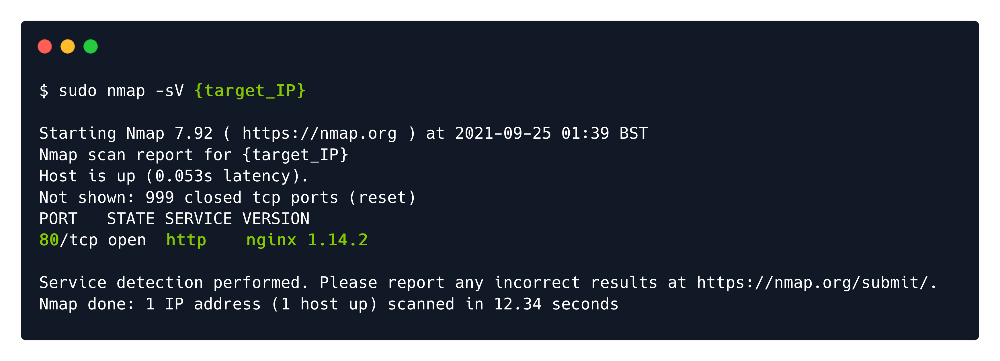
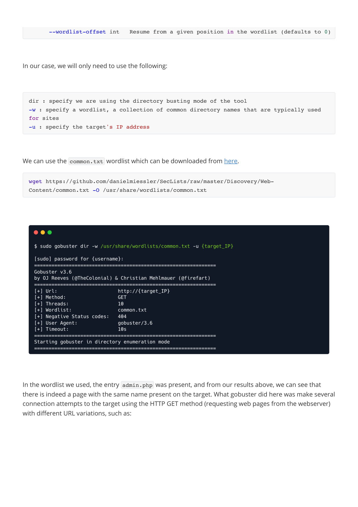
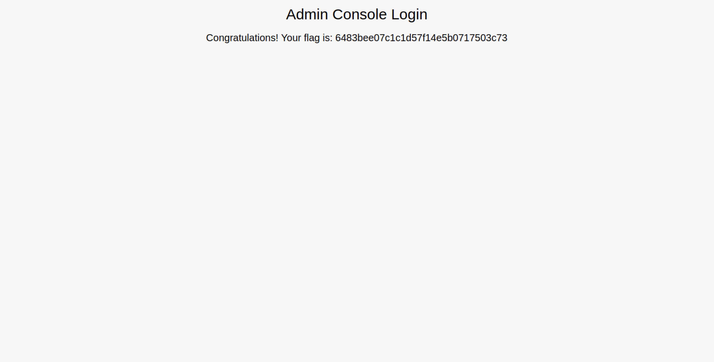
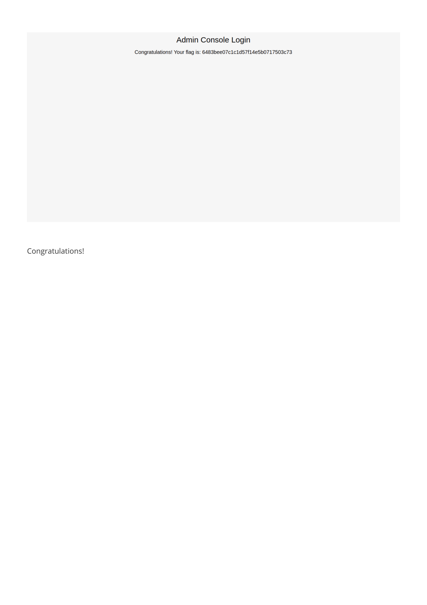

# Preignition — HTB Walkthrough

**Status:** Completed  
**Difficulty:** Very Easy  
**OS:** Linux

## TL;DR
Discover nginx web server, enumerate directories with gobuster to find admin.php, login with default credentials (admin:admin), retrieve flag.

## Target / Access
**Target IP:** `<redacted>`  
> Note: IP addresses have been redacted per HTB publishing guidelines.

---

## Enumeration

### Step 1: Port Scanning with Nmap

**Command:**
```bash
nmap -sV -p- <redacted-ip>
```

**Raw Log:** [nmap-scan.txt](raw-logs/document.pdf) (Page 3)

**Output Excerpt:**
```
PORT   STATE SERVICE VERSION
80/tcp open  http    nginx
```

**Analysis:** Web server (nginx) running on port 80.




### Step 2: Web Application Reconnaissance

**Action:** Browse to http://`<redacted-ip>`

**Analysis:** Default nginx installation page displayed, suggesting fresh installation with possible default configurations.


### Step 3: Directory Enumeration with Gobuster

**Command:**
```bash
gobuster dir -u http://<redacted-ip> -w /usr/share/wordlists/dirb/common.txt
```

**Raw Log:** [gobuster-scan.txt](raw-logs/document.pdf) (Pages 5-7)

**Output Excerpt:**
```
/admin.php            (Status: 200) [Size: 999]
```

**Analysis:** Discovered admin.php administrative panel.





---

## Foothold / Initial Access

### Step 4: Admin Panel Access

**Action:** Navigate to http://`<redacted-ip>`/admin.php

**Analysis:** Login page presented, requesting username and password.


### Step 5: Default Credentials Authentication

**Credentials Used:**
```
Username: admin
Password: admin
```
> **Redaction Note:** Default credentials successfully exploited.

**Raw Log:** [login-attempt.txt](raw-logs/document.pdf) (Pages 9-10)

**Output:** Successful authentication, flag displayed on dashboard.

**Analysis:** Fresh nginx installation left with default admin credentials.






---

## Summary

This Starting Point machine demonstrates web application security through directory enumeration and default credential exploitation.

### Attack Chain
1. **Port Scanning** — Discovered nginx web server on port 80
2. **Web Reconnaissance** — Identified default installation page
3. **Directory Enumeration** — Used gobuster to find admin.php
4. **Default Credentials** — Logged in with admin:admin
5. **Flag Capture** — Retrieved flag from admin dashboard

### Tools Used
- Nmap — Port scanning and service detection
- Web Browser — Manual web application testing
- Gobuster — Directory and file enumeration

---

## Cleanup / Notes / References

### Mitigation Recommendations
1. **Change Default Credentials:** Immediately change default usernames and passwords on installation.
2. **Strong Password Policy:** Enforce strong, unique passwords for administrative accounts.
3. **Hide Admin Panels:** Use non-standard paths for administrative interfaces or implement IP whitelisting.
4. **Account Lockout:** Implement lockout policies after failed login attempts.
5. **MFA:** Enable multi-factor authentication for administrative access.
6. **Security Headers:** Implement proper HTTP security headers.

### References
- [OWASP: Using Default Credentials](https://owasp.org/www-community/vulnerabilities/Use_of_hard-coded_password)
- [nginx Security Controls](https://nginx.org/en/docs/http/ngx_http_auth_basic_module.html)
- [CIS nginx Benchmark](https://www.cisecurity.org/)

---

## Security Summary

**Redactions Performed:**
- IP addresses replaced with `<redacted>` or `<redacted-ip>`
- Default credentials noted but standard (admin:admin)

**⚠️ Warning:** Review and redact any sensitive information (credentials, private IPs, tokens) before publishing.
